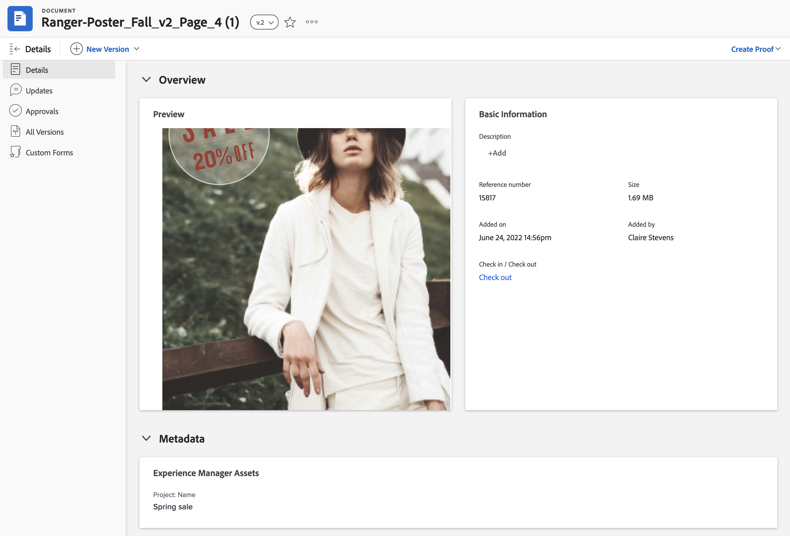

# Visualizzare i metadati mappati per Experience Manager Assets o Assets Essentials

Nel pannello Dettagli documento e Riepilogo per documenti è possibile visualizzare in tempo reale i metadati mappati. I campi metadati vengono mappati per la prima volta quando invii una risorsa da Workfront a Experience Manager Assets o ad Assets Essentials. Se l&#39;amministratore di Workfront ha attivato la sincronizzazione dei metadati dell&#39;oggetto, i campi rimangono aggiornati se vengono modificati in una delle applicazioni.

## Requisiti di accesso

Devi avere i seguenti:

<table>
  <tr>
   <td><strong>Piano Adobe Workfront*</strong>
   </td>
   <td>Qualsiasi
   </td>
  </tr>
  <tr>
   <td><strong>Licenze Adobe Workfront*</strong>
   </td>
   <td>Richiedi o superiore
   </td>
  </tr>
  <tr>
   <td><strong>Prodotto</strong>
   </td>
   <td>È necessario disporre di Assets Essentials di Experience Manager Assets as a Cloud Service e aggiungerli al prodotto come utente nell’Admin Console.
   </td>
  </tr>
  <tr>
   <td><strong>Configurazioni del livello di accesso*</strong>
   </td>
   <td>Modifica accesso ai documenti

<strong>Nota: </strong>Se non disponi ancora dell'accesso, chiedi all'amministratore di Workfront se ha impostato restrizioni aggiuntive nel tuo livello di accesso. Per informazioni su come un amministratore di Workfront può modificare il tuo livello di accesso, consulta <strong>Creare o modificare livelli di accesso personalizzati</strong>.
   </td>
  </tr>
  <tr>
   <td><strong>Autorizzazioni oggetto</strong>
   </td>
   <td>Accesso di visualizzazione o versione successiva

Per informazioni sulla richiesta di accesso aggiuntivo, vedere <strong>Richiedere l'accesso agli oggetti </strong>.
   </td>
  </tr>
</table>

*Per informazioni sulla pianificazione, il tipo di licenza o l&#39;accesso disponibili, contattare l&#39;amministratore Workfront.

## Prerequisiti

Prima di iniziare,

* L’amministratore di Workfront deve configurare un’integrazione Experience Manager. Per ulteriori informazioni, consulta [Configurare Experience Manager Assets as a Cloud Service Integration](/help/quicksilver/administration-and-setup/configure-integrations/configure-aacs-integration.md) o [Configurare l&#39;integrazione Experience Manager Assets Essentials](/help/quicksilver/documents/adobe-workfront-for-experience-manager-assets-essentials/setup-asset-essentials.md).

## Dettagli Documento

Per aprire il pannello Metadati in Dettagli documento:

1. Vai al progetto, all&#39;attività o al problema che contiene il documento, quindi seleziona **Documenti**.
1. Passa il puntatore del mouse sul documento necessario, quindi seleziona **Dettagli documento**.
1. Trova ed espandi la sezione **Metadati**.
   >[!NOTE]
   >
   >Impossibile modificare i campi in questa sezione. Sono di sola visualizzazione.

## Riepilogo documenti

Per aprire il pannello Metadati nel pannello Riepilogo:

1. Vai al progetto, all&#39;attività o al problema che contiene il documento, quindi seleziona **Documenti**.
1. Trovare il documento necessario.
1. Fai clic sull&#39;icona **Riepilogo** , quindi espandi la sezione **Metadati**.
   >[!NOTE]
   >
   >Impossibile modificare i campi in questa sezione. Sono di sola visualizzazione.

