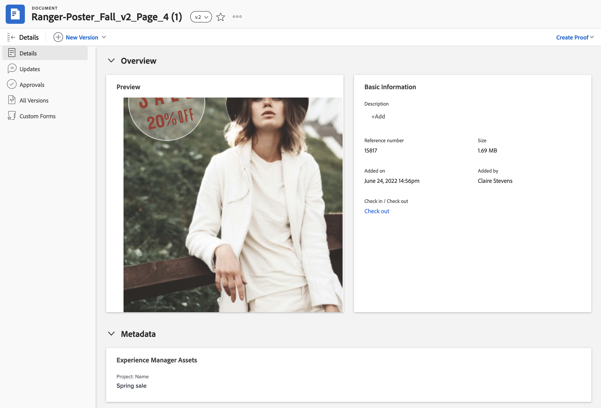
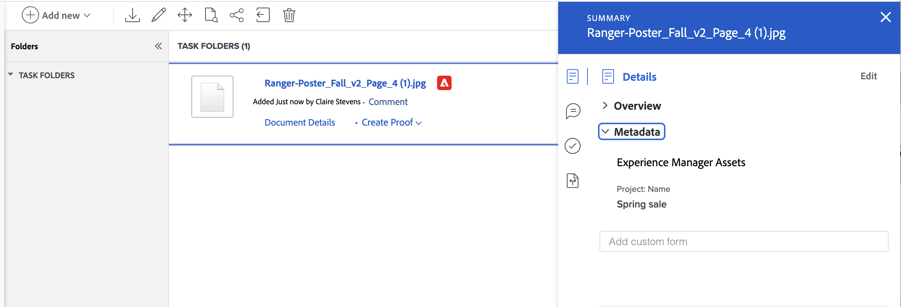

# Visualizzare i metadati mappati per Experience Manager Assets o Assets Essentials

Nel pannello Dettagli documento e Riepilogo per documenti è possibile visualizzare in tempo reale i metadati mappati. I campi metadati vengono mappati per la prima volta quando invii una risorsa da Workfront a Experience Manager Assets o Assets Essentials. Se l&#39;amministratore di Workfront ha attivato la sincronizzazione dei metadati dell&#39;oggetto, i campi rimangono aggiornati se vengono modificati in una delle applicazioni.

## Requisiti di accesso

+++ Espandi per visualizzare i requisiti di accesso per la funzionalità descritta in questo articolo.

<table>
  <tr>
   <td><strong>Pacchetto Adobe Workfront</strong>
   </td>
   <td>Qualsiasi
   </td>
  </tr>
  <tr>
   <td><strong>Licenze Adobe Workfront</strong>
   </td>
   <td>
   
Collaboratore o successiva

   
Richiedente o successiva

   </td>
  </tr>
  <tr>
   <td><strong>Prodotti aggiuntivi</strong>
   </td>
   <td>Devi disporre di Experience Manager Assets as a Cloud Service o Assets Essentials e devi essere aggiunto al prodotto come utente in Admin Console.
   </td>
  </tr>
  <tr>
   <td><strong>Configurazioni del livello di accesso</strong>
   </td>
   <td>
Accesso in modifica ai documenti

   </td>
  </tr>
  <tr>
   <td><strong>Autorizzazioni oggetto</strong>
   </td>
   <td>Accesso di visualizzazione o versione successiva
   </td>
  </tr>
</table>

Per ulteriori dettagli sulle informazioni contenute in questa tabella, consulta [Requisiti di accesso nella documentazione Workfront](/help/quicksilver/administration-and-setup/add-users/access-levels-and-object-permissions/access-level-requirements-in-documentation.md).

+++

## Prerequisiti

Prima di iniziare,

* L’amministratore di Workfront deve configurare un’integrazione Experience Manager. Per ulteriori informazioni, consulta [Configurare l&#39;integrazione Experience Manager Assets as a Cloud Service](/help/quicksilver/administration-and-setup/configure-integrations/configure-aacs-integration.md) o [Configurare l&#39;integrazione Experience Manager Assets Essentials](/help/quicksilver/documents/adobe-workfront-for-experience-manager-assets-essentials/setup-asset-essentials.md).

## Dettagli Documento

Per aprire il pannello Metadati in Dettagli documento:

1. Vai al progetto, all&#39;attività o al problema che contiene il documento, quindi seleziona **Documenti**.
1. Passa il puntatore del mouse sul documento necessario, quindi seleziona **Dettagli documento**.
1. Trova ed espandi la sezione **Metadati**.

   >[!NOTE]
   >
   >Impossibile modificare i campi in questa sezione. Sono di sola visualizzazione.

## Riepilogo documenti

Per aprire il pannello Metadati nel pannello Riepilogo:

1. Vai al progetto, all&#39;attività o al problema che contiene il documento, quindi seleziona **Documenti**.
1. Trovare il documento necessario.
1. Fai clic sull&#39;icona **Riepilogo** , quindi espandi la sezione **Metadati**.

   >[!NOTE]
   >
   >Impossibile modificare i campi in questa sezione. Sono di sola visualizzazione.

