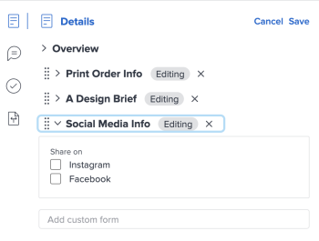

# Aggiungere o modificare un modulo personalizzato a un documento

È possibile aggiungere un modulo personalizzato a un documento o a una versione di un documento per acquisire informazioni aggiuntive o metadati specifici per le risorse.

## Requisiti di accesso

+++ Espandi per visualizzare i requisiti di accesso per la funzionalità in questo articolo.

<table style="table-layout:auto"> 
 <col> 
 <col> 
 <tbody> 
  <tr> 
   <td role="rowheader">Pacchetto Adobe Workfront</td> 
   <td> 
 Qualsiasi
 </td> 
  </tr> 
  <tr> 
   <td role="rowheader">Licenze Adobe Workfront</td> 
   <td> 
   
Collaboratore o versione successiva

   
Richiedi o superiore
 </td> 
  </tr> 
  <tr> 
   <td role="rowheader">Configurazioni del livello di accesso</td> 
   <td> 
Modifica accesso ai documenti
 </td> 
  </tr> 
  <tr> 
   <td role="rowheader">Autorizzazioni oggetto</td> 
   <td> 
Gestire l’accesso al documento
 </td> 
  </tr> 
 </tbody> 
</table>

Per ulteriori dettagli sulle informazioni contenute in questa tabella, vedere [Requisiti di accesso nella documentazione di Workfront](/help/quicksilver/administration-and-setup/add-users/access-levels-and-object-permissions/access-level-requirements-in-documentation.md).

+++

## Prerequisiti

* Il modulo personalizzato deve essere condiviso con te

## Aggiungere un modulo personalizzato

Per aggiungere un modulo personalizzato a un documento:

1. Vai al progetto, all&#39;attività o al problema che contiene il documento, quindi seleziona **Documenti**.
1. Trovare il documento necessario.

1. Fai clic sull&#39;icona **Riepilogo** , quindi individua la sezione **Dettagli**.
1. Nella casella **Aggiungi modulo personalizzato** iniziare a digitare e selezionare un modulo personalizzato. Il modulo viene salvato automaticamente nel documento.

   >[!NOTE]
   >
   >Nel menu a discesa vengono visualizzati solo i moduli personalizzati attivi. È possibile aggiungere fino a 10 moduli personalizzati per documento. Se devi creare un modulo personalizzato, vedi [Creare un modulo personalizzato](/help/quicksilver/administration-and-setup/customize-workfront/create-manage-custom-forms/form-designer/design-a-form/design-a-form.md).

## Modificare un modulo personalizzato

1. Vai al progetto, all&#39;attività o al problema che contiene il documento, quindi seleziona **Documenti**.
1. Trovare il documento necessario.

1. Fai clic sull&#39;icona **Riepilogo** , quindi individua la sezione **Dettagli** nella parte superiore.
1. Fai clic su **Modifica** nell&#39;angolo superiore destro, quindi espandi il modulo desiderato.
1. Apporta le modifiche necessarie, quindi fai clic su **Salva**.

   
