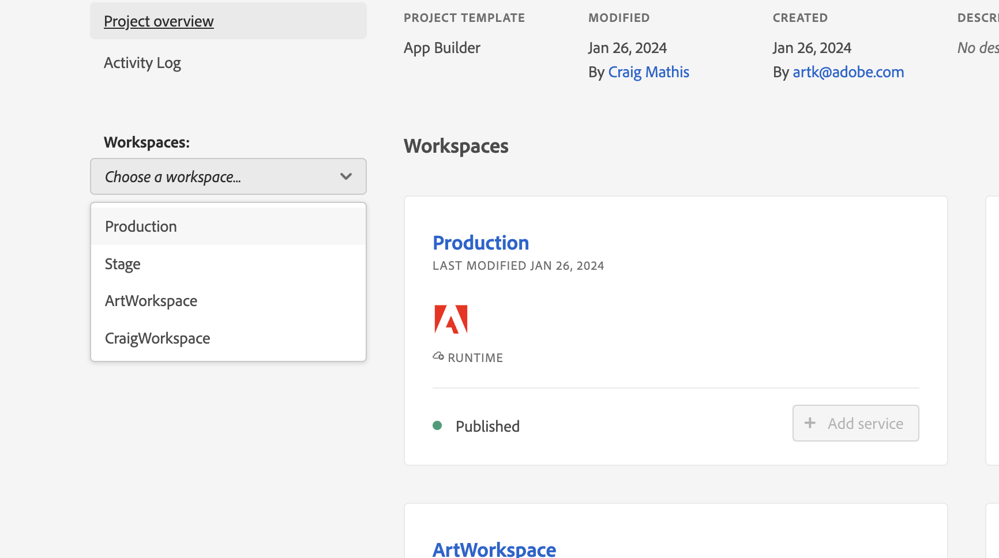

# Dettagli del documento AppBuilder all&#39;interno di Workfront

È possibile installare AppBuilder in Dettagli documento.

## Prerequisiti

Devi avere i seguenti:

* Un account Workfront abilitato per IMS
* Una macchina di sviluppo con nodi v18 e npm

## Aggiungere sviluppatori ad Admin Console

>[!IMPORTANT]
>
>Accertati di aver selezionato l’organizzazione IMS corretta per tutti i passaggi seguenti. Se appartieni a più organizzazioni, puoi selezionare quella sbagliata. Assicurati di agire nell’organizzazione corretta, che in genere è elencata nell’angolo in alto a destra.


1. Passare a una delle seguenti opzioni:

* Fase: [https://stage.adminconsole.adobe.com/](https://stage.adminconsole.adobe.com/)
* Prod: [https://adminconsole.adobe.com/](https://adminconsole.adobe.com/)

1. Nella sezione Utenti, fai clic su **Sviluppatori** > **Aggiungi sviluppatori**.

   

   >[!NOTE]
   >
   >Se non trovi un’opzione per la gestione degli sviluppatori, non disponi di un prodotto che consenta l’accesso allo sviluppo. Workfront non fornisce l’accesso per sviluppatori, ma AEM sì. Se non lo vedi, dovremo capire come includere Workfront nell’elenco delle app che consentono agli sviluppatori.

1. Aggiungi l’e-mail dell’utente. Deve cercare gli utenti esistenti che sono già stati aggiunti dall’Admin Console.

1. Aggiungi i prodotti necessari al profilo sviluppatore e fai clic su **Salva**.


## Accedere ad AppBuilder

Per acquistare AppBuilder, le organizzazioni devono collaborare con i rispettivi account manager. Il processo esatto per questo non è stato compreso perché non era necessario farlo per il POC.

Se desideri testare l’integrazione di AppBuilder, puoi richiedere una versione di prova gratuita per la tua organizzazione IMS qui:
[https://developer.adobe.com/app-builder/trial/#](https://developer.adobe.com/app-builder/trial/#)

Ho l&#39;impressione che, anche se si tratta di una prova gratuita di 30 giorni, non disattiveranno effettivamente la prova dopo quel momento.

Se AppBuilder è configurato correttamente, dovresti vedere &quot;Crea progetto da modello&quot; come parte della creazione di un nuovo progetto (illustrato nella sezione successiva).

## Creare un nuovo progetto nella Console per sviluppatori

1. Fai clic su **Crea progetto da modello**.

   >[!IMPORTANT]
   >
   >Se non trovi questa opzione, significa che in Admin Console non sei configurato correttamente e non hai accesso al catalogo di App Builder. Questa opzione è visibile solo quando si ha accesso ad AppBuilder.

   

1. Seleziona **App Builder**.

1. Immetti un **Titolo progetto** e un **Nome app**. Entrambi dispongono di valori predefiniti, ma se personalizzi il valore in un secondo momento sarà più semplice identificare il progetto desiderato.

   >[!NOTE]
   >
   >È disponibile un’opzione per aggiungere altre aree di lavoro in questo passaggio. Ci è stato suggerito di creare un&#39;area di lavoro per ogni sviluppatore. In questo modo i segreti e le distribuzioni sono separati l’uno dall’altro mentre i dispositivi funzionano. È necessario denominare l’area di lavoro con il nome dello sviluppatore che la utilizza. Il file CLI AIO dispone di opzioni per il passaggio all&#39;area di lavoro, che verranno illustrate in seguito.


1. Lascia selezionata **Includi runtime**.

1. Fai clic su **Salva**.

## CLI Adobe IO (aio)

Adobe fornisce una CLI open source che può essere utilizzata per facilitare la creazione delle applicazioni App Builder. La documentazione è disponibile qui: [https://github.com/adobe/aio-cli](https://github.com/adobe/aio-cli) e le istruzioni di Adobe App Builder [https://developer.adobe.com/app-builder/docs/getting_started/first_app/](https://developer.adobe.com/app-builder/docs/getting_started/first_app/).

1. Installazione
   1. Per installare lo strumento (verificare di essere al primo posto sul nodo v18) eseguire: `npm install -g @adobe/aio-cli `.

1. Autentica nel terminale
   1. Avviare il terminale e accedere all&#39;AIO con il comando: `aio login`.

1. Inizializzare l’applicazione
   1. Iniziare la configurazione dell&#39;app eseguendo: `aio app init example-app`.

1. Selezione configurazione
   1. Procedi selezionando l’organizzazione e il progetto tra le opzioni fornite.\
      
      

1. Selezione e configurazione dei modelli
   1. Sfoglia tutti i modelli disponibili e scegli il modello **@adobe/aem-cf-editor-ui-ext-tpl** per il tuo progetto.
      
      

1. Definire L’Estensione
   1. Denomina l’estensione.
   1. Fornisci un riepilogo descrittivo delle funzionalità dell&#39;estensione.
   1. Seleziona un numero di versione iniziale con cui iniziare.
   1. Conferma il completamento selezionando **Fine**.
      

1. Passa alla cartella del progetto
   1. Accedere alla cartella src
   1. Rinominare la cartella `aem-cf-editor-1` in `workfront-doc-details-1`.

1. Modifica file di configurazione
   1. Apri app.config.yaml
   1. Aggiorna la riga da `aem/cf-editor/1` a `workfront/doc-details/1`.
   1. Regola il percorso di inclusione da `src/aem-cf-editor-1/ext.config.yaml` a `src/workfront-doc-details-1/ext.config.yaml`.

1. Modificare il componente Registrazione estensione
   1. Apri `src/workfront-doc-details-1/web-src/src/components/ExtensionRegistration.js`.
   1. Nella sezione metodi aggiungere una funzione `secondaryNav` contenente una funzione asincrona `getButtons`.
   1. `getButtons` deve ricevere un oggetto con la seguente struttura:

      ```
          {
          docId: "String",  // Document ID
          docvId: "String", // Document version ID
          sharedContext: {
              hostname: "String",
              protocol: "String",
              auth: {
              imsOrgID: "String",    // Customer's IMS Org ID
              imsToken: "String",    // User's IMS token
              imsClientId: "String"
              }
          }
          }
      ```

1. Questa funzione restituisce un array di oggetti button che verranno visualizzati nella navigazione:

   ```
       methods: {
       secondaryNav: {
           async getButtons({docId, docvId, sharedContext}) {
           return [
               { label: 'Registration', url: '/index.html' },
               { label: 'Review', url: '/index.html#review' }
           ];
           }
       }
       }
   ```

1. Configurare il routing dell&#39;applicazione
   1. Apri il file App.js e configura i percorsi per includere le funzionalità appena sviluppate. Sarà necessario impostare i percorsi per la visualizzazione predefinita ed eventuali visualizzazioni aggiuntive, ad esempio la pagina di revisione. Di seguito viene illustrato come definire questi percorsi:

      ```
          <Route index element={<ExtensionRegistration />} />
          <Route exact path="index.html" element={<ExtensionRegistration />} />
          <Route exact path="review" element={<Review />} />
      ```

1. Accedi a dettagli documento
   1. Implementare la funzione `document.getDocumentDetails` specificata nell&#39;applicazione per recuperare le specifiche essenziali dei documenti. Questa funzione recupera un oggetto contenente `docId` e `docvId`, insieme a un oggetto `sharedContext` con `hostname`, `protocol` e dettagli di autenticazione. Assicurati che l’applicazione gestisca correttamente questi dati.

1. Integrare il recupero dati nei componenti
   1. Aggiungi un nuovo componente alla cartella dei componenti dell’applicazione. All&#39;interno di questo componente, stabilire una connessione a Workfront per recuperare le informazioni del documento e i dati di autenticazione utilizzando la connessione stabilita con l&#39;applicazione host. Di seguito è riportato un esempio di come strutturare il componente in modo da gestirlo:

      ```
          import { useEffect, useState } from 'react';
          import { attach } from "@adobe/uix-guest";
          import { extensionId } from "./Constants";
      
          function Review() {
              const [conn, setConn] = useState();
      
              useEffect(() => {
              const iife = async () => {
                  // "attach" the guest application to the host. This creates a "tunnel" from the host app that allows data to be passed to the iframe running this app.
                  const connection = await attach({
                  id: extensionId,
                  });
                  setConn(connection);
              };
      
              iife();
              }, []);
      
              useEffect(() => {
                  if (conn) {
                      // Using the connection created above, grab the document details from the host tunnel.
                      conn?.host?.document?.getDocumentDetails().then(setDocDetails);
                      // Pull the auth tokens from the sharedContext (see host app for details)
                      setAuth(conn?.sharedContext?.get("auth"));
                      setHostname(conn?.sharedContext?.get("hostname"));
                      setProtocol(conn?.sharedContext?.get("protocol"));
                  }
              }, [conn]);
      
          return (<>Text</>);
          }
      
          export default Review;
      ```

## Configurazione per progetti AIO esistenti

1. Aggiorna file di configurazione
   1. Apri `app.config.yaml`.
   1. Modificare la configurazione aggiornando il riferimento da `aem/cf-editor/1` a `workfront/doc-details/1`. Questa regolazione allinea i percorsi dei file alla struttura del progetto corrente.

1. Rivedere il componente Registrazione estensione
   1. Individuare e aprire il file denominato `ExtensionRegistration.js`.
   1. Nella sezione metodi aggiungere una funzione `secondaryNav` contenente una funzione asincrona `getButtons`.
   1. `getButtons` deve ricevere un oggetto con la seguente struttura:

      ```
          {
          docId: "String",  // Document ID
          docvId: "String", // Document version ID
          sharedContext: {
              hostname: "String",
              protocol: "String",
              auth: {
              imsOrgID: "String",    // Customer's IMS Org ID
              imsToken: "String",    // User's IMS token
              imsClientId: "String"
              }
          }
          }
      ```

1. Questa funzione restituisce un array di oggetti button che verranno visualizzati nella navigazione:

   ```
       methods: {
       secondaryNav: {
           async getButtons({docId, docvId, sharedContext}) {
           return [
               { label: 'Registration', url: '/index.html' },
               { label: 'Review', url: '/index.html#review' }
           ];
           }
       }
       }
   ```

1. Configurare il routing dell&#39;applicazione
   1. Apri il file `App.js` e configura le route per includere le funzionalità appena sviluppate. Sarà necessario impostare i percorsi per la visualizzazione predefinita ed eventuali visualizzazioni aggiuntive, ad esempio la pagina di revisione. Di seguito viene illustrato come definire questi percorsi:

      ```
          <Route index element={<ExtensionRegistration />} />
          <Route exact path="index.html" element={<ExtensionRegistration />} />
          <Route exact path="review" element={<Review />} />
      ```

1. Accedi a dettagli documento
   1. Implementare la funzione `document.getDocumentDetails` specificata nell&#39;applicazione per recuperare le specifiche essenziali dei documenti. Questa funzione recupera un oggetto contenente `docId` e `docvId`, insieme a un oggetto `sharedContext` con `hostname`, `protocol` e dettagli di autenticazione. Assicurati che l’applicazione gestisca correttamente questi dati.

1. Integrare il recupero dati nei componenti
   1. Aggiungi un nuovo componente alla cartella dei componenti dell’applicazione. All&#39;interno di questo componente, stabilire una connessione a Workfront per recuperare le informazioni del documento e i dati di autenticazione utilizzando la connessione stabilita con l&#39;applicazione host. Di seguito è riportato un esempio di come strutturare il componente in modo da gestirlo:

      ```
          import { useEffect, useState } from 'react';
          import { attach } from "@adobe/uix-guest";
          import { extensionId } from "./Constants";
      
          function Review() {
              const [conn, setConn] = useState();
      
              useEffect(() => {
              const iife = async () => {
                  // "attach" the guest application to the host. This creates a "tunnel" from the host app that allows data to be passed to the iframe running this app.
                  const connection = await attach({
                  id: extensionId,
                  });
                  setConn(connection);
              };
      
              iife();
              }, []);
      
              useEffect(() => {
                  if (conn) {
                      // Using the connection created above, grab the document details from the host tunnel.
                      conn?.host?.document?.getDocumentDetails().then(setDocDetails);
                      // Pull the auth tokens from the sharedContext (see host app for details)
                      setAuth(conn?.sharedContext?.get("auth"));
                      setHostname(conn?.sharedContext?.get("hostname"));
                      setProtocol(conn?.sharedContext?.get("protocol"));
                  }
              }, [conn]);
      
          return (<>Text</>);
          }
      
          export default Review;
      ```

## Pubblicare le applicazioni

>[!IMPORTANT]
>
>Assicurati di aver selezionato la giusta organizzazione IMS per ciascuno dei passaggi seguenti.

Per caricare un’applicazione guest in Workfront, è necessario inviarla all’area di lavoro di produzione e inviarla per l’approvazione.

1. Distribuire l’applicazione nell’area di lavoro di produzione
   1. `aio app use -w Production `
   1. `aio app deploy `

1. Passa a [https://developer-stage.adobe.com/](https://developer-stage.adobe.com/) o [https://developer.adobe.com/](https://developer.adobe.com/).
   1. Fai clic su **Console** nell&#39;angolo superiore destro.

1. Trova il progetto utilizzato per creare l’applicazione AppBuilder.

1. Seleziona il Workspace di produzione.
   

1. Invia l’applicazione per una revisione privata (riceverai avvisi che non stiamo pubblicando nell’app exchange marketplace, il che va bene).

1. Compila il modulo (titolo, descrizione, icona e nota per il revisore).
   

>[!IMPORTANT]
>
>Una volta inviato, l’invio dovrà essere approvato da un amministratore di sistema dell’organizzazione.

## Approva l’invio

1. Come amministratore di sistema, passa a [https://stage.exchange.adobe.com/](https://stage.exchange.adobe.com/) o [https://exchange.adobe.com/](https://exchange.adobe.com/).

1. Fai clic su **Gestisci** > **Applicazioni Experience Cloud**. Dovresti vedere le app inviate con opzioni di approvazione/rifiuto.
Una volta approvate, le estensioni dell’applicazione pubblicate devono essere caricate automaticamente nell’ambiente Workfront.

   

## Aiuto aggiuntivo

Adobe dispone di un’ottima documentazione su come iniziare a creare e distribuire app per AppBuilder.

Di seguito sono riportati alcuni collegamenti utili:

* [https://developer.adobe.com/app-builder/docs/getting_started/first_app/#4-bootstrapping-new-app-using-the-cli](https://developer.adobe.com/app-builder/docs/getting_started/first_app/#4-bootstrapping-new-app-using-the-cli)

* [https://developer.adobe.com/uix/docs/guides/publication/](https://developer.adobe.com/uix/docs/guides/publication/)

* [https://developer.adobe.com/uix/docs/services/aem-cf-console-admin/extension-development/](https://developer.adobe.com/uix/docs/services/aem-cf-console-admin/extension-development/)

## Sviluppo locale

Durante lo sviluppo dell’applicazione App Builder per Workfront, potrebbe essere necessario testare l’app all’interno di Workfront senza pubblicarla. Fortunatamente, abbiamo una soluzione per questo.

Nell&#39;app App Builder puoi avviare `aio app run` per lo sviluppo locale. Questo ti fornirà un URL, in genere qualcosa come `https://localhost:9080`. In alternativa, è possibile eseguire `aio app deploy` per ottenere un dominio Adobe statico. Assicurati di prendere nota di questi URL per utilizzi futuri.

Quindi, passa alla pagina dei dettagli del documento che desideri sviluppare nel browser. Apri gli strumenti per sviluppatori e accedi all’archiviazione locale per workfront.com o workfront.adobe.com. In questo caso, è necessario aggiungere una voce. Utilizza `appBuilderDocDetailsOverride` come chiave e l&#39;URL del generatore di app indicato in precedenza come valore.

Una volta ricaricata la pagina, vengono visualizzati i pulsanti dell’applicazione App Builder. Facendo clic su questi pulsanti potrai visualizzare l’app in azione.