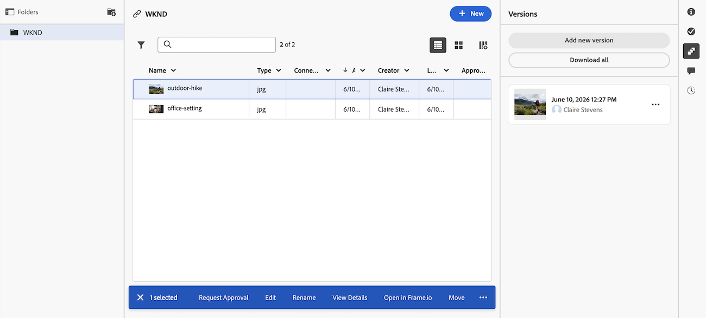

# L’area Documenti

Nell’area Documenti puoi organizzare, gestire e visualizzare i metadati dei documenti caricati in Adobe Workfront. Puoi anche vedere la decisione relativa alla bozza.

In Workfront sono attualmente disponibili due versioni dell&#39;area Documenti: l&#39;area documenti legacy e l&#39;area nuovi documenti. La versione utilizzata dalla tua organizzazione dipende dal fatto che la tua organizzazione utilizzi sistemi di archiviazione legacy Workfront o Adobe Cloud Storage. Per ulteriori informazioni su questi tipi di archiviazione, vedere [Panoramica sull&#39;archiviazione cloud Adobe](/help/quicksilver/review-and-approve-work/esm-overview.md).

## Area documenti legacy

Sono disponibili due tipi di aree Documenti. Funzionalità e funzionalità identiche per:

* **Area Documenti in un programma, portfolio, modello, progetto, attività o problema:** Elenca tutti i documenti a cui si ha accesso per un particolare progetto, attività o problema. Per accedere a questa area, fai clic su **Documenti**  nel pannello a sinistra durante la visualizzazione di un progetto, un&#39;attività o un problema.

* **Area documenti globali:** Elenca tutti i documenti a cui si ha accesso in Workfront. Per accedere a quest&#39;area, fare clic su **Documenti**  nel menu principale .

Per informazioni sul caricamento di documenti in Workfront, consulta [Aggiungere documenti ad Adobe Workfront dal file system](../../documents/adding-documents-to-workfront/add-documents-from-file-system.md).

Nell&#39;area documenti viene registrato il conteggio dei seguenti elementi:

* Cartelle di Workfront
* File caricati dal file system
* File aggiunti a Workfront da integrazioni
* Experience Manager Assets collegato

### Pannello di Riepilogo

Quando si seleziona un documento nell&#39;area documenti, è possibile utilizzare il Riepilogo a destra per visualizzare i dettagli del documento, gestire gli aggiornamenti e le approvazioni del documento, visualizzare le versioni del documento e aggiungere e modificare il Forms personalizzato per il documento.

Se per il documento è impostata la verifica, la sezione Dettagli include informazioni quali la data di scadenza della verifica e l&#39;avanzamento corrente della verifica.

È possibile fare clic sull&#39;intestazione Dettagli per passare all&#39;area Dettagli documento completa quando sono necessarie tutte le informazioni relative a un documento.

Per informazioni sul Riepilogo, vedere [Riepilogo per la panoramica dei documenti](../../documents/managing-documents/summary-for-documents.md).

### Decisione bozza

Una volta presa la decisione relativa alla bozza, questa viene visualizzata nell&#39;elenco Documento.

### Cartelle

È possibile impostare le cartelle per organizzare i documenti. Per ulteriori informazioni, vedere [Creare cartelle di documenti](../../documents/organizing-documents/create-documents-folder.md).

Nell&#39;area Documenti globale è possibile impostare due tipi di cartelle per organizzare i documenti a cui si ha accesso:

* **Cartelle avanzate:** visualizza solo i documenti che si desidera visualizzare. Per ulteriori informazioni, vedere [Creare e gestire cartelle avanzate](../../documents/organizing-documents/create-manage-smart-folders.md).

* **Cartelle personali:** Organizzare i documenti nel modo desiderato. Per ulteriori informazioni, vedere [Creare cartelle di documenti](../../documents/organizing-documents/create-documents-folder.md).

### Dettagli documento espanso

La pagina Dettagli documento fornisce una versione in scala più completa dei Dettagli documento nel Riepilogo a destra.

## Area Nuovi documenti

La nuova area Documenti è disponibile solo per se l’organizzazione si trova nell’archiviazione cloud di Adobe. Per ulteriori informazioni sull&#39;archiviazione cloud Adobe, consulta [Panoramica sull&#39;archiviazione cloud Adobe](/help/quicksilver/review-and-approve-work/esm-overview.md).

### Utilizzare il pannello di riepilogo

Quando si seleziona un documento nell&#39;area documenti, è possibile utilizzare il pannello Riepilogo a destra per visualizzare i dettagli sul documento, aggiungere e modificare moduli personalizzati allegati, creare e gestire flussi di lavoro di approvazione, visualizzare le versioni del documento e altro ancora.

#### Revisione e approvazione con Frame.io

È possibile esaminare e approvare i documenti nella nuova area Documenti utilizzando il visualizzatore Frame.io.

Per ulteriori informazioni, vedere [Introduzione alla revisione e all&#39;approvazione unificate](/help/quicksilver/review-and-approve-work/get-started-with-unified-approvals.md).

#### Gestione versioni

È possibile caricare nuove versioni di un documento nella nuova area Documenti. Quando carichi una nuova versione, questa viene mantenuta e vi si può accedere dal pannello Riepilogo. Le versioni vengono automaticamente denominate con la data e l’ora del caricamento, ma possono essere rinominate in base alle esigenze.

È inoltre possibile avviare un nuovo flusso di lavoro di approvazione per una versione specifica di un documento.

#### Visualizza cronologia documenti

È possibile visualizzare la cronologia di un documento nella nuova area Documenti. La cronologia include i seguenti tipi di informazioni:

* Quando il documento è stato caricato
* Quando sono state caricate nuove versioni
* Quando sono stati avviati i flussi di lavoro di approvazione per il documento
* E altro ancora

### Cartelle a livello di sistema per le autorizzazioni dei documenti

Workfront crea automaticamente una cartella a livello di sistema quando il primo documento viene caricato su un’attività o un problema. Queste cartelle ereditano le autorizzazioni dall’attività o dal problema e sono visibili nell’area documenti a livello di progetto. Tutti i documenti caricati su tale attività o problema sono memorizzati in tale cartella e da essa ereditano le autorizzazioni. Questa è la modalità principale di gestione delle autorizzazioni per i documenti nella nuova area Documenti. Per ulteriori informazioni, consulta [Autorizzazioni oggetto e panoramica del livello di accesso per il modello di archiviazione cloud Adobe](/help/quicksilver/review-and-approve-work/esm-access-permissions.md#how-document-permissions-work).

### Accedere ai documenti dal desktop

Se la tua organizzazione utilizza l’archiviazione cloud di Adobe, puoi anche accedere ai documenti dal desktop di Mac o Windows utilizzando Adobe Cloud Drive. Adobe Cloud Drive monta i progetti di archiviazione cloud Adobe come un&#39;unità nel computer, in modo da poter aprire e modificare i file in qualsiasi applicazione mantenendo le modifiche sincronizzate con Workfront. Per ulteriori informazioni, consulta [Panoramica di Adobe Cloud Drive](/help/quicksilver/documents/adobe-cloud-drive/adobe-cloud-drive-overview.md).

## Considerazioni

* La nuova area Documenti è ottimizzata per schermi larghi 1024 pixel o più. Se si dispone di una schermata più piccola, è possibile che si verifichino problemi di accesso al pannello Riepilogo.

* L’area Documenti globale non è disponibile nella nuova esperienza Area Documenti. È possibile accedere ai documenti solo da programmi, portafogli, progetti, attività o problemi.
