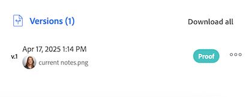
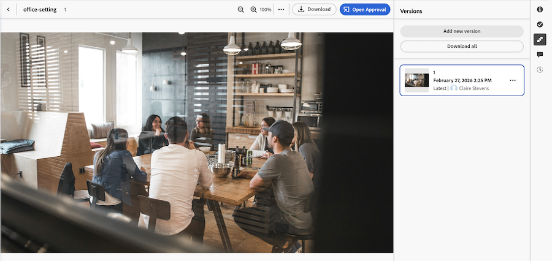

# Panoramica del riepilogo dei documenti

<!--Audited: April, 2024-->

You can use the Summary panel to access and update important information directly from the documents list.

+++ Espandi per visualizzare i requisiti di accesso per la funzionalità descritta in questo articolo.

## Requisiti di accesso

Per eseguire i passaggi descritti in questo articolo, devi disporre dei seguenti diritti di accesso:

<table style="table-layout:auto"> 
 <col> 
 </col> 
 <col> 
 </col> 
 <tbody> 
  <tr> 
   <td role="rowheader">Pacchetto Adobe Workfront</td> 
   <td> 
Qualsiasi pacchetto Workfront per gestire i documenti utilizzando lo storage Workfront legacy

Qualsiasi pacchetto di flusso di lavoro per gestire i documenti utilizzando lo storage aziendale Adobe
</td> 
  </tr> 
  <tr> 
   <td role="rowheader">Licenze Adobe Workfront</td> 
   <td> 
Collaboratore o successiva
 
   
Richiedente o successiva

   </td> 
  </tr> 
  <tr data-mc-conditions=""> 
   <td role="rowheader">Configurazioni del livello di accesso</td> 
   <td> 
Accesso in modifica ai documenti
  </td> 
  </tr> 
  <tr data-mc-conditions=""> 
   <td role="rowheader">Autorizzazioni sugli oggetti</td> 
   <td> 
Accesso di visualizzazione all'oggetto associato al documento
 </td> 
  </tr> 
 </tbody> 
</table>

Per ulteriori dettagli sulle informazioni contenute in questa tabella, consulta [Requisiti di accesso nella documentazione Workfront](/help/quicksilver/administration-and-setup/add-users/access-levels-and-object-permissions/access-level-requirements-in-documentation.md).

+++

## Summary for documents in the legacy documents experience

Se la tua organizzazione utilizza un sistema di archiviazione Workfront legacy, quando accedi ai documenti in Workfront visualizzerai l’area documenti legacy. Per ulteriori informazioni sull&#39;archiviazione Workfront legacy, vedere [Differenze tra l&#39;archiviazione Workfront legacy e l&#39;archiviazione aziendale Adobe](/help/quicksilver/review-and-approve-work/esm-overview.md).

### Open the Summary view in the legacy documents experience

{{step1-to-documents}}

1. Nella pagina **Documenti** selezionare un documento nell&#39;elenco.

1. Nell&#39;angolo superiore destro della pagina fare clic sull&#39;icona **Apri riepilogo** . Viene aperto il pannello laterale **Riepilogo documento**.

   

   After you open the Summary, it will remain open on this page (even if you click on other documents) until you manually close it.

### Dettagli

Use the Details section to view high-level overview information and interact with custom forms. Click Details at the top of the section to go to the full Document Details page.

* [Panoramica](#overview)
* [Moduli personalizzati](#custom-forms)

#### Panoramica {#overview}

Expand the Overview section to view or download an image thumbnail, open a proof, update the basic description, check the document out and more.

#### Moduli personalizzati {#custom-forms}

Use the Custom Forms section to add, edit, or view any custom forms associated with the document. Begin typing the name of the custom form to add it to the document. For more information, see [Add or edit a custom form to a document](../../documents/managing-documents/add-custom-form-documents.md).

### Aggiornamenti

Use the Updates section to view an update someone made on the document or proof. The summary shows the first 2 comments made. For more information on updates, see [Comment on a proof](../../review-and-approve-work/proofing/reviewing-proofs-within-workfront/comment-on-a-proof/comment-on-proof.md).

### Approvazioni

Use the Approvals section to ask for a document approval. You can also remind someone about an approval, resubmit the approval and cancel the previous decision, or delete the approval. Document approvers can use the Summary to make a decision.

Proof approvals must be added in the Proof Workflow. For more information on approvals, see

* [Approving work](../../review-and-approve-work/manage-approvals/approving-work.md)
* [Richiedere le approvazioni dei documenti](../../review-and-approve-work/manage-approvals/request-document-approvals.md)

### Versioni

Use the Versions section to view the number of versions created for a specific document. Click the More icon  to do the following:

* Open a proof.
* Download a proof or document.
* Preview a browser-supported document.
* Go to the Document Details.
* Delete a proof or document.

## Summary for documents in the new documents experience

Se l&#39;organizzazione utilizza l&#39;archiviazione aziendale, quando si accede ai documenti in Workfront verrà visualizzata la nuova area documenti. Per ulteriori informazioni sull&#39;archiviazione aziendale, vedere [Panoramica sull&#39;archiviazione aziendale di Adobe](/help/quicksilver/review-and-approve-work/esm-overview.md).

### Dettagli

Use the Details section to view high-level overview information and interact with custom forms.

### Approvazioni

Use the Approvals section to create an approval workflow. You can also remind participants about an approval or delete the approval. Document approvers can access the Frame.io viewer or use the Summary to make a decision.

For more information about approvals and Frame.io, see

* [Introduzione a revisione e approvazione unificate](/help/quicksilver/review-and-approve-work/get-started-with-unified-approvals.md)
* [Crea una richiesta di revisione o approvazione del documento](/help/quicksilver/review-and-approve-work/document-reviews-and-approvals/manage-document-approvals/create-a-document-approval.md).

<!-- resubmit the approval and cancel the previous decision, or delete the approval. Document approvers can use the Summary to make a decision.-->

### Versioni

Utilizzare la sezione Versioni per visualizzare il numero di versioni create per un documento specifico. Fare clic sull&#39;icona Altro per effettuare le seguenti operazioni:

* Rinominare una versione
* Visualizza dettagli documento
* Richiedi approvazione per una versione specifica
* Apri in Frame.io
* Scarica la versione
* Condividere la versione
* Elimina la versione

### Cronologia

Utilizzare la sezione Cronologia per visualizzare un elenco di tutte le attività correlate al documento.

