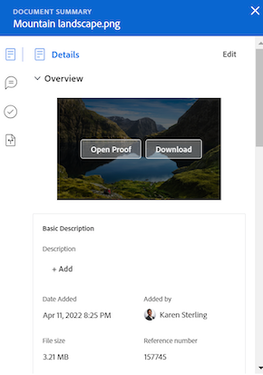

# Panoramica del riepilogo dei documenti

<!--Audited: April, 2024-->

È possibile utilizzare il pannello Riepilogo per accedere e aggiornare informazioni importanti direttamente dall&#39;elenco dei documenti.

+++ Espandi per visualizzare i requisiti di accesso per la funzionalità in questo articolo.

## Requisiti di accesso

Per eseguire i passaggi descritti in questo articolo, è necessario disporre dei seguenti diritti di accesso:

<table style="table-layout:auto"> 
 <col> 
 </col> 
 <col> 
 </col> 
 <tbody> 
  <tr> 
   <td role="rowheader">Pacchetto Adobe Workfront</td> 
   <td> 
 Qualsiasi
 </td> 
  </tr> 
  <tr> 
   <td role="rowheader">Licenze Adobe Workfront</td> 
   <td> 
Collaboratore o versione successiva
 
   
Richiedi o superiore

   </td> 
  </tr> 
  <tr data-mc-conditions=""> 
   <td role="rowheader">Configurazioni del livello di accesso</td> 
   <td> 
Modifica accesso ai documenti
  </td> 
  </tr> 
  <tr data-mc-conditions=""> 
   <td role="rowheader">Autorizzazioni oggetto</td> 
   <td> 
Accesso di visualizzazione all'oggetto associato al documento
 </td> 
  </tr> 
 </tbody> 
</table>

Per ulteriori dettagli sulle informazioni contenute in questa tabella, vedere [Requisiti di accesso nella documentazione di Workfront](/help/quicksilver/administration-and-setup/add-users/access-levels-and-object-permissions/access-level-requirements-in-documentation.md).

+++

## Aprire la visualizzazione Riepilogo

{{step1-to-documents}}

1. Nella pagina **Documenti** selezionare un documento nell&#39;elenco.

1. Nell&#39;angolo superiore destro della pagina fare clic sull&#39;icona **Apri riepilogo** . Viene aperto il pannello laterale **Riepilogo documento**.

   

   Dopo aver aperto il Riepilogo, questo rimarrà aperto in questa pagina (anche se si fa clic su altri documenti) fino a quando non viene chiuso manualmente.

## Dettagli

Utilizza la sezione Dettagli per visualizzare informazioni generali di alto livello e interagire con i moduli personalizzati. Fare clic su Dettagli nella parte superiore della sezione per passare alla pagina Dettagli documento completa.

* [Panoramica](#overview)
* [Moduli personalizzati](#custom-forms)

### Panoramica {#overview}

Espandi la sezione Panoramica per visualizzare o scaricare una miniatura di immagine, aprire una bozza, aggiornare la descrizione di base, estrarre il documento e altro ancora.

### Moduli personalizzati {#custom-forms}

Utilizza la sezione Forms personalizzato per aggiungere, modificare o visualizzare i moduli personalizzati associati al documento. Iniziare a digitare il nome del modulo personalizzato per aggiungerlo al documento. Per ulteriori informazioni, vedere [Aggiungere o modificare un modulo personalizzato in un documento](../../documents/managing-documents/add-custom-form-documents.md).

## Aggiornamenti

Utilizzare la sezione Aggiornamenti per visualizzare un aggiornamento eseguito da un utente sul documento o sulla bozza. Il riepilogo mostra i primi 2 commenti. Per ulteriori informazioni sugli aggiornamenti, vedi [Commento su una bozza](../../review-and-approve-work/proofing/reviewing-proofs-within-workfront/comment-on-a-proof/comment-on-proof.md).

## Approvazioni

Utilizzare la sezione Approvazioni per richiedere l&#39;approvazione di un documento. Puoi anche inviare un promemoria a qualcuno riguardo a un’approvazione, inviare nuovamente l’approvazione e annullare la decisione precedente oppure eliminare l’approvazione. Gli approvatori di documenti possono utilizzare il Riepilogo per prendere una decisione.

È necessario aggiungere le approvazioni della bozza nel flusso di lavoro della bozza. Per ulteriori informazioni sulle approvazioni, consulta

* [Approvazione del lavoro](../../review-and-approve-work/manage-approvals/approving-work.md)
* [Richiedere le approvazioni dei documenti](../../review-and-approve-work/manage-approvals/request-document-approvals.md)

## Versioni

Utilizzare la sezione Versioni per visualizzare il numero di versioni create per un documento specifico. Fai clic sull&#39;icona Altro  per effettuare le seguenti operazioni:

* Apri una bozza.
* Scarica una bozza o un documento.
* Visualizzare in anteprima un documento supportato dal browser.
* Vai a Dettagli documento.
* Eliminare una bozza o un documento.

