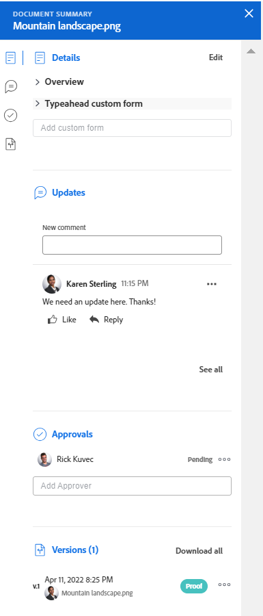

# Panoramica del riepilogo dei documenti

Le informazioni evidenziate in questa pagina sono disponibili solo nell’ambiente di anteprima. <!--and in the Production environment for customers who have opted for the fast release process. For information about fast releases, see [Enable or disable fast releases for your organization](/help/quicksilver/administration-and-setup/set-up-workfront/configure-system-defaults/enable-fast-release-process.md). For information about the current release schedule, see [First Quarter 2024 release overview](/help/quicksilver/product-announcements/product-releases/24-q2-release-activity/24-q2-release-overview.md).-->

Il Riepilogo consente di interagire con informazioni importanti direttamente dall&#39;elenco dei documenti.

## Requisiti di accesso

Devi avere i seguenti:

<table style="table-layout:auto"> 
 <col> 
 </col> 
 <col> 
 </col> 
 <tbody> 
  <tr> 
   <td role="rowheader">Piano Adobe Workfront*</td> 
   <td> 
 Qualsiasi
 </td> 
  </tr> 
  <tr> 
   <td role="rowheader">Licenze Adobe Workfront*</td> 
   <td> 
Richiedi o superiore
 </td> 
  </tr> 
  <tr data-mc-conditions=""> 
   <td role="rowheader">Configurazioni del livello di accesso*</td> 
   <td> 
Modifica accesso ai documenti
 
Nota: se non disponi ancora dell’accesso, chiedi all’amministratore di Workfront se ha impostato restrizioni aggiuntive nel tuo livello di accesso. Per informazioni su come un amministratore di Workfront può modificare il tuo livello di accesso, consulta <a href="../../administration-and-setup/add-users/configure-and-grant-access/create-modify-access-levels.md" class="MCXref xref">Creare o modificare livelli di accesso personalizzati</a>.
 </td> 
  </tr> 
  <tr data-mc-conditions=""> 
   <td role="rowheader">Autorizzazioni oggetto</td> 
   <td> 
Accesso di visualizzazione all'oggetto associato al documento
 
Per informazioni sulla richiesta di accesso aggiuntivo, consulta <a href="../../workfront-basics/grant-and-request-access-to-objects/request-access.md" class="MCXref xref">Richiedi accesso agli oggetti </a>.
 </td> 
  </tr> 
 </tbody> 
</table>

&#42;Per conoscere il piano, il tipo di licenza o l&#39;accesso di cui si dispone, contattare l&#39;amministratore Workfront.

## Aprire la visualizzazione Riepilogo

1. Vai a **Documenti** e selezionare un elemento nell&#39;elenco.
1. Fai clic su **Icona Apri riepilogo** .

   Dopo aver aperto il riepilogo, rimane aperto mentre si fa clic su altri documenti e rimane aperto fino a quando non viene chiuso manualmente.

   

## Dettagli

Utilizza la sezione Dettagli per visualizzare informazioni generali di alto livello e interagire con i moduli personalizzati. Clic **Dettagli** nella parte superiore della sezione per passare alla pagina Dettagli documento completa.

* [Panoramica](#overview)
* [Moduli personalizzati](#custom-forms)

### Panoramica {#overview}

Espandi la sezione Panoramica per visualizzare o scaricare una miniatura di immagine, aprire una bozza, aggiornare la descrizione di base, estrarre il documento e altro ancora.

### Moduli personalizzati {#custom-forms}

Utilizza la sezione Forms personalizzato per aggiungere, modificare o visualizzare i moduli personalizzati associati al documento. Iniziare a digitare il nome del modulo personalizzato per aggiungerlo al documento. Per ulteriori informazioni, consulta [Aggiungere o modificare un modulo personalizzato a un documento](../../documents/managing-documents/add-custom-form-documents.md).

## Aggiornamenti

Utilizzare la sezione Aggiornamenti per leggere un aggiornamento eseguito da un utente sul documento o sulla bozza. Il riepilogo mostra i primi 2 commenti. Per ulteriori informazioni sugli aggiornamenti, consulta [Commento su una bozza](../../review-and-approve-work/proofing/reviewing-proofs-within-workfront/comment-on-a-proof/comment-on-proof.md).

## Approvazioni

Utilizzare la sezione Approvazioni per richiedere l&#39;approvazione di un documento. Puoi anche inviare un promemoria a qualcuno riguardo a un’approvazione, inviare nuovamente l’approvazione e annullare la decisione precedente oppure eliminare l’approvazione. Gli approvatori di documenti possono utilizzare il Riepilogo per prendere una decisione.

È necessario aggiungere le approvazioni della bozza nel flusso di lavoro della bozza. Per ulteriori informazioni sulle approvazioni, consulta

* [Approvazione del lavoro](../../review-and-approve-work/manage-approvals/approving-work.md)
* [Richiedere le approvazioni dei documenti](../../review-and-approve-work/manage-approvals/request-document-approvals.md)

## Versioni

Utilizzare la sezione Versioni per visualizzare il numero di versioni create per un documento specifico. Fai clic su **Menu Altro** a

* Apri una bozza
* Scaricare una bozza o un documento
* Visualizzare in anteprima un documento supportato dal browser
* Vai a Dettagli documento
* Eliminare una bozza o un documento

