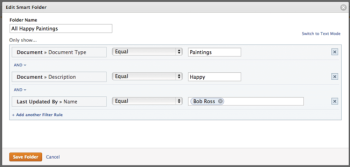

# Creare e gestire cartelle avanzate

Le cartelle avanzate vengono utilizzate per gestire i documenti al di fuori di un progetto, di un&#39;attività o di un problema e si trovano nell&#39;area Documenti principale nel menu principale . Puoi impostare una cartella avanzata per filtrare le risorse e visualizzarle solo quelle importanti, anziché cercare tutte le risorse.

Per impostazione predefinita sono disponibili due cartelle avanzate al primo accesso all’area Documenti: Tutti i documenti e Recenti. È possibile modificare, rinominare o copiare le cartelle avanzate predefinite, ma non eliminarle. Puoi creare cartelle avanzate aggiuntive per soddisfare altre esigenze di gestione delle risorse.

## Requisiti di accesso

Per eseguire i passaggi descritti in questo articolo, è necessario disporre dei seguenti diritti di accesso:

<table style="table-layout:auto"> 
 <col> 
 <col> 
 <tbody> 
  <tr> 
   <td role="rowheader">piano Adobe Workfront*</td> 
   <td> 
Qualsiasi
 </td> 
  </tr> 
  <tr> 
   <td role="rowheader">Licenza Adobe Workfront*</td> 
   <td> 
Revisione o superiore
 </td> 
  </tr> 
  <tr> 
   <td role="rowheader">Configurazioni a livello di accesso*</td> 
   <td> 
Modifica accesso ai documenti
 
Nota: Se non disponi ancora dell’accesso, chiedi all’amministratore Workfront se ha impostato ulteriori restrizioni nel livello di accesso. Per informazioni su come un amministratore Workfront può modificare il livello di accesso, consulta <a href="../../administration-and-setup/add-users/configure-and-grant-access/create-modify-access-levels.md" class="MCXref xref">Creare o modificare livelli di accesso personalizzati</a>.
 </td> 
  </tr> 
 </tbody> 
</table>

&#42;Per informazioni sul piano, il tipo di licenza o l&#39;accesso, contattare l&#39;amministratore Workfront.

## Visualizza cartelle avanzate 

È possibile visualizzare le cartelle nella visualizzazione miniatura, standard o elenco. Per modificare la visualizzazione, utilizzare le opzioni di visualizzazione nell’angolo in alto a destra.

## Creare una cartella avanzata 

1. Vai a **Documenti** area in cui si desidera creare la cartella avanzata.
1. Fai clic su **Aggiungi nuovo**.
1. Fai clic su **Cartella avanzata**.
1. Specifica un nome per la cartella avanzata nel **Nome cartella** campo .
1. Fai clic su **Aggiungere una regola filtro**.
1. Identifica le informazioni da compilare nel rapporto selezionando il tipo di dati appropriato.
1. Seleziona il qualificatore di filtro desiderato. 
1. Completa la regola del filtro, quindi fai clic su **Salva cartella**.

## Modificare una cartella avanzata 

1. Vai a **Documenti** area contenente la cartella avanzata da modificare.
1. In **Cartelle** fai clic sulla colonna **Altro** icona  accanto alla cartella avanzata da modificare.
1. Fai clic su **Modifica**.

   La **Modifica cartella avanzata** viene visualizzata la finestra di dialogo.\
   

1. Apporta le modifiche desiderate, quindi fai clic su **Salva cartella**.

## Rinominare una cartella avanzata 

1. Vai a **Documenti** area contenente la cartella avanzata che si desidera rinominare.
1. In **Cartelle** fare clic sulla freccia a discesa accanto alla cartella avanzata che si desidera rinominare.
1. Specificare un nuovo nome per la cartella, quindi premere **Invio**.

## Copiare una cartella avanzata

1. Vai a **Documenti** area contenente la cartella avanzata da copiare.
1. In **Cartelle** fare clic sulla freccia a discesa accanto alla cartella avanzata che si desidera copiare.
1. Fai clic su **Copia**.

   La **Modifica cartella avanzata** viene visualizzata la finestra di dialogo. La **Nome cartella** il campo contiene il nome originale della cartella, con la parola Copia tra parentesi.

1. Apporta le modifiche desiderate, quindi fai clic su **Salva cartella**.

## Eliminare una cartella avanzata 

1. Vai a **Documenti** area contenente la cartella avanzata da eliminare.
1. In **Cartelle** fare clic sulla freccia a discesa accanto alla cartella avanzata che si desidera eliminare.
1. Fai clic su **Elimina**.
1. Fai clic su **Sì, Elimina**.
