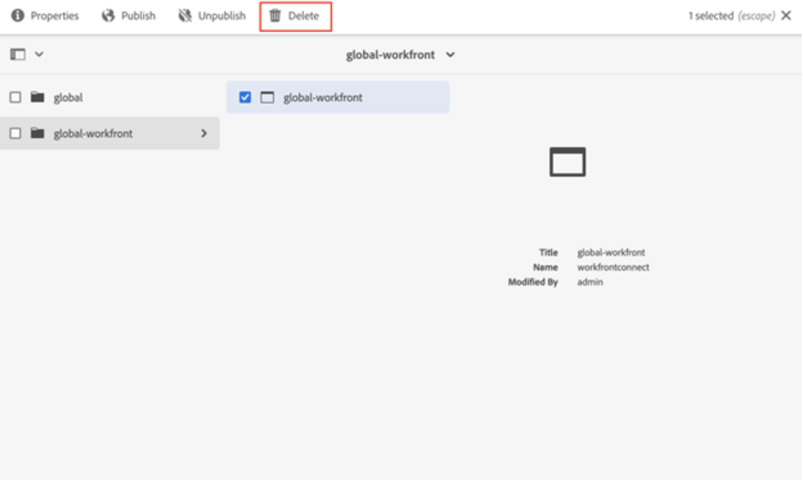

# Disinstallare Workfront con il connettore legacy di Adobe Experience Manager

È necessario disinstallare il connettore legacy di Workfront con Adobe Experience Manager all’integrazione nativa più recente che collega Workfront e Adobe Experience Manager Assets as a Cloud Service.

## Annulla iscrizione a Workfront

1. Apri Adobe Experience Manager.
1. Ad Experience Manager, vai a **Strumenti** > **Cloud Service** > **Configurazione integrazione Workfront**.
1. Seleziona la configurazione (global-workfront per impostazione predefinita) e fai clic su **Proprietà**.
   
1. Disattiva sincronizzazione documenti, commenti e metadati. L’etichetta deve essere disabilitata.
In questo modo, gli abbonamenti verranno rimossi in Workfront e l’utente potrà creare un nuovo abbonamento utilizzando lo stesso URL definito in Day CQ Link Externalizer.

## Eliminare la configurazione dell’integrazione di Workfront

Dopo aver rimosso la sottoscrizione, ora è possibile eliminare la configurazione dell’integrazione di Workfront.

1. Apri la configurazione e seleziona **Elimina**.
   

## Rimuovi mappatura

Successivamente, devi eliminare la mappatura proprietà Workfront.

1. Ad Experience Manager, vai a **Strumenti** > **Assets** > **Mappatura proprietà Workfront**.

1. Selezionare tutte le mappature e fare clic su **Elimina**.

## Autorizzazioni utente

A tutti gli utenti che accedono a AEM Dam da Workfront sono state assegnate autorizzazioni di lettura per `/content/dam`. Se un utente non ne ha più bisogno, puoi rimuovere le autorizzazioni concesse a tali utenti.

Il connettore funziona utilizzando l’utente di sistema workfront-service. Questo viene disinstallato durante la disinstallazione del connettore.

>[!NOTE]
>
>Se utilizzi il connettore versione 2.0.3 e hai aggiunto il gruppo `workfront-aem-connector-group`, devi rimuovere anche questo andando in **Strumenti** > **Sicurezza** > **Gruppi**.

## Day CQ Link Externalizer

Se non è necessario Day CQ Link Externalizer, è possibile ripristinare `localhost:4502` da `/system/console/configMgr` e cercare &#39;Day CQ Link Externalizer&#39;.

>[!NOTE]
>
>Se utilizzi Adobe Experience Manager as a Cloud Service, puoi modificare questa impostazione esaminando il progetto e individuando il file _com.day.cq.commons.impl.ExternalizerImpl.xml_ all&#39;interno di _ui.apps/src/main/content/jcr_root/apps/mysite/config_.

## Disinstalla pacchetto connettore

I passaggi necessari per disinstallare il pacchetto del connettore variano a seconda della versione di Adobe Experience Manager in uso.

### Adobe Experience Manager On-Premise

Se utilizzi Adobe Experience Manager on-premise, passa a _crx/packmgr/index.jsp_ e cerca `workfront-aem-connector.all-<version>.zip`, fai clic su **Altro** e quindi su **Disinstalla**.

Controllare in `/conf` per assicurarsi che tutti i file creati da Workfront siano stati rimossi.

### Adobe Experience Manager as a Cloud Service

In Adobe Experience Manager as a Cloud Service, puoi rimuovere le dipendenze del connettore dal file pom.files del progetto.

## Firewall e Dispatcher

Se la comunicazione non è più necessaria, non dimenticare di rimuovere gli URL Workfront inseriti nella whitelist. Inoltre, il connettore utilizza le intestazioni apiKey e username che erano impostate sul dispatcher. Possono essere rimossi anche.
