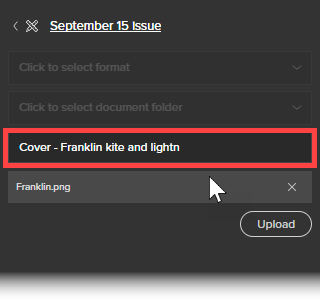

# Utilizzare l’estensione Workfront per Illustrator e InDesign

<!--Audited: 01/2024-->

>[!IMPORTANT]
>
>Stiamo sostituendo l&#39;estensione Workfront per Illustrator e InDesign con [plug-in Creative Cloud aggiornati](/help/quicksilver/workfront-integrations-and-apps/adobe-workfront-for-creative-cloud/wf-cc-install-toc.md). A partire dalla fine del 2022, questa estensione non sarà più supportata ed è disponibile così com’è.

Puoi utilizzare l’estensione Workfront per esportare in Workfront i contenuti digitali salvati e creati in Adobe Illustrator e Adobe InDesign. In questo modo si velocizza il processo di revisione e approvazione dei documenti.

L’estensione Workfront è supportata per Adobe Creative Cloud 2017 e versioni successive nelle seguenti applicazioni:

* InDesign
* Illustrator
* Photoshop

  >[!NOTE]
  >
  >È consigliabile utilizzare il nuovo plug-in [Adobe Workfront for Photoshop](/help/quicksilver/workfront-integrations-and-apps/adobe-workfront-for-creative-cloud/wf-cc-install-ps.md).

## Requisiti di accesso

+++ Espandi per visualizzare i requisiti di accesso per la funzionalità in questo articolo.

Per eseguire i passaggi descritti in questo articolo, è necessario disporre dei seguenti diritti di accesso:

<table style="table-layout:auto"> 
 <col> 
 <col> 
 <tbody> 
  <tr> 
   <td role="rowheader">Piano Adobe Workfront*</td> 
   <td> 
Corrente: Pro o superiore

   Oppure
   
Nuovo: Qualsiasi piano
 </td> 
  </tr> 
  <tr data-mc-conditions=""> 
   <td role="rowheader">Licenza Adobe Workfront*</td> 
   <td> 
Corrente: Lavoro o versione successiva

   Oppure
   
Nuovo: Standard
 </td> 
  </tr> 
  <tr> 
   <td role="rowheader">Prodotto</td> 
   <td>Oltre alla licenza di Workfront, è necessario disporre di una licenza Adobe Creative Cloud.</td> 
  </tr> 
  <tr> 
   <td role="rowheader">Autorizzazioni oggetto</td> 
   <td> 
Modifica l’accesso all’oggetto con cui desideri interagire.
  </td> 
  </tr> 
 </tbody> 
</table>

&#42;Per conoscere il piano, il tipo di licenza o l&#39;accesso di cui si dispone, contattare l&#39;amministratore di Workfront. Per ulteriori informazioni, consulta [Requisiti di accesso nella documentazione di Workfront](/help/quicksilver/administration-and-setup/add-users/access-levels-and-object-permissions/access-level-requirements-in-documentation.md).

+++

## Accedi all’estensione Workfront da Illustrator o InDesign {#log-in-to-workfront-extension-from-illustrator-or-indesign}

Quando accedi a Workfront da una delle applicazioni Adobe supportate, accedi a tutte le applicazioni Adobe supportate.

1. Vai all’applicazione Adobe in cui desideri utilizzare l’estensione Workfront.

   Per un elenco dei formati supportati per ciascuna applicazione supportata, vedere [Formati di file esportati supportati](#supported-exported-file-formats) in questo articolo.

1. Fai clic su **Finestra** > **Estensioni** > Workfront.

1. (Facoltativo) Trascina il pannello Workfront nella posizione in cui vuoi che venga visualizzato nell’applicazione Adobe.
1. Segui le istruzioni per accedere a Workfront.

   >[!NOTE]
   >
   >* Workfront si connette a Adobe Creative Cloud utilizzando OAuth 2.0, uno standard sicuro utilizzato dalla maggior parte delle integrazioni basate sul web per l’autenticazione e l’autorizzazione degli utenti.
   >* Quando viene richiesto di immettere il [dominio o host] dell&#39;account Workfront, digitarlo nel seguente formato:`yourCompany'sDomain.my.workfront.com`. Il dominio della tua azienda è in genere il nome della tua azienda.

   Se il progetto è nello stato corrente, viene visualizzato un elenco di elementi di lavoro assegnati all&#39;utente. Se non viene visualizzato alcun elenco, accedi a Workfront.

   Le attività personali sono elencate in **Nessun progetto**.

## Caricare un file in un progetto, attività o problema di Workfront {#upload-a-file-to-a-workfront-project-task-or-issue}

È possibile caricare un file dal file system del computer o esportare un file aperto in un&#39;applicazione Adobe Creative Cloud in un progetto, un&#39;attività o un problema di Workfront. 

Quando si carica o si esporta un file da Adobe Creative Cloud, tenere presente quanto segue:

* Il livello di accesso deve consentire il caricamento di documenti in Workfront. Per ulteriori informazioni, vedere [Concedere l&#39;accesso ai documenti](../../administration-and-setup/add-users/configure-and-grant-access/grant-access-documents.md).
* È necessario disporre delle autorizzazioni per caricare i documenti nell&#39;elemento in cui si desidera. Per ulteriori informazioni, vedere [Panoramica delle autorizzazioni di condivisione sugli oggetti](../../workfront-basics/grant-and-request-access-to-objects/sharing-permissions-on-objects-overview.md).
* Il file viene caricato nell&#39;area Documenti dell&#39;oggetto Workfront selezionato.
* Impossibile esportare un documento nell&#39;area Documenti del menu principale  da un&#39;applicazione Adobe Creative Cloud.

Le sezioni seguenti spiegano quanto segue:

* [Carica un file](#upload-a-file)
* [Esporta un file attualmente aperto in Illustrator o InDesign](#export-a-file-currently-open-in-illustrator-or-indesign)
* [Caricare una nuova versione di un file da Illustrator o InDesign](#upload-a-new-version-of-a-file-from-illustrator-or-indesign)

### Carica un file {#upload-a-file}

Puoi caricare i file in un progetto, attività o problema senza uscire dall’applicazione Adobe Creative Cloud.

1. Se all&#39;apertura dell&#39;applicazione Adobe Creative Cloud non viene visualizzata l&#39;estensione Workfront, fare clic su **Finestra** > **Estensioni** > **Workfront**.

   Se il progetto si trova nello stato corrente, viene visualizzato un elenco di elementi di lavoro assegnati. Se non viene visualizzato alcun elenco, accedi a Workfront.

   Le attività personali sono elencate in **Nessun progetto**.

1. Fare clic sul nome del progetto, dell&#39;attività o del problema in cui si desidera caricare il file.

   Per cercare questo elemento, digita il nome nella casella **Cerca** e seleziona **Progetto**, **Attività** o **Problema** dal menu a discesa a destra della casella **Cerca**. Se il nome dell&#39;elemento di lavoro non viene visualizzato nell&#39;elenco, premere **Invio** per cercare tutti gli elementi di Workfront a cui si ha accesso.

1. Fai clic su **Seleziona** nell&#39;angolo inferiore destro dell&#39;estensione Workfront.
1. Nel menu a discesa **Fare clic per selezionare il formato**, fare clic sul formato in cui si desidera salvare il file in Workfront.

   Per un elenco dei formati supportati per ciascuna applicazione supportata, vedere [Formati di file esportati supportati](#supported-exported-file-formats) in questo articolo.

1. (Condizionale) Se l&#39;elemento di lavoro in cui si desidera caricare il file contiene cartelle di documenti, selezionare una cartella di documenti nel campo **Fare clic per selezionare una cartella di documenti**, quindi fare clic su **Seleziona**.

1. Fare clic su **Carica un file locale**.
1. Nella casella **Apri file**, individua il file nel file system, quindi fai clic su **Apri**.

1. (Facoltativo) Immettete un nuovo nome per il file.

   

1. Fai clic su **Carica**.

   In Workfront, il documento è ora elencato nell’area Documenti per il progetto, l’attività o il problema selezionato.

1. (Facoltativo) Fare clic sul nome del documento per aprire la relativa pagina Dettagli documento in Workfront.

   Workfront si apre in una nuova scheda del browser.

### Esportare un file attualmente aperto in Illustrator o InDesign {#export-a-file-currently-open-in-illustrator-or-indesign}

1. In un’applicazione Adobe Creative Cloud supportata, apri un file da esportare in Workfront.
1. Se l&#39;estensione Workfront non è visualizzata, fare clic su **Finestra** > **Estensioni** > **Workfront**.

   Se il progetto si trova nello stato corrente, viene visualizzato un elenco di elementi di lavoro assegnati. Se non viene visualizzato alcun elenco, accedi a Workfront.

   Le attività personali sono elencate in **Nessun progetto**.

1. Fare clic sul nome del progetto, dell&#39;attività o del problema in cui si desidera esportare il file.

   Per cercare questo elemento, digita il nome nella casella **Cerca** e seleziona **Progetto**, **Attività** o **Problema** dal menu a discesa a destra della casella **Cerca**. Se il nome dell&#39;elemento di lavoro non viene visualizzato nell&#39;elenco, premere **Invio** per cercare tutti gli elementi di Workfront a cui si ha accesso.

1. Nel menu a discesa **Fare clic per selezionare il formato**, fare clic sul formato in cui si desidera salvare il file in Workfront.

   Per un elenco dei formati supportati per ciascuna applicazione supportata, vedere [Formati di file esportati supportati](#supported-exported-file-formats) in questo articolo.

1. (Condizionale) Se l&#39;elemento di lavoro in cui si desidera caricare il file contiene cartelle di documenti, selezionare una cartella di documenti nel campo **Fare clic per selezionare una cartella di documenti**, quindi fare clic su **Seleziona**.
1. (Facoltativo) Per rinominare il documento, fare clic sul nome del documento e digitare un nuovo nome.

   

1. Fai clic su **Esporta**.

   Viene visualizzato un messaggio per confermare che il documento è stato esportato correttamente in Workfront.

   In Workfront, il documento è elencato nell&#39;area Documenti dell&#39;oggetto specificato in Workfront.

1. (Facoltativo) Fare clic sul nome del documento per accedervi in Workfront.

   

   Workfront si apre in una nuova scheda del browser.

### Caricare una nuova versione di un file da Illustrator o InDesign {#upload-a-new-version-of-a-file-from-illustrator-or-indesign}

1. Se desideri esportare un file su cui stai lavorando in un’applicazione Adobe supportata come nuova versione di un file in Workfront, apri il file nell’applicazione Adobe.
1. Se l&#39;estensione Workfront non è visualizzata, fare clic su **Finestra** > **Estensioni** > **Workfront**.

   Se il progetto è nello stato corrente, viene visualizzato un elenco di elementi di lavoro assegnati all&#39;utente. Se non viene visualizzato alcun elenco, accedi a Workfront.

   Le attività personali sono elencate in **Nessun progetto**.

1. Fare clic sul nome del progetto, attività o problema in cui è elencato il documento esistente.

   Per cercare questo elemento, digita il nome nella casella **Cerca** e seleziona **Progetto**, **Attività** o **Problema** dal menu a discesa a destra della casella **Cerca**. Se il nome dell&#39;elemento di lavoro non viene visualizzato nell&#39;elenco, premere **Invio** per cercare tutti gli elementi di Workfront a cui si ha accesso.

   Tutti i documenti caricati su progetti, attività o problemi vengono visualizzati in un elenco, indipendentemente dal fatto che siano stati caricati dall’applicazione Adobe.

1. Nel menu a discesa **Fare clic per selezionare il formato**, fare clic sul formato in cui si desidera salvare il file in Workfront.

   Questa opzione è necessaria se si esporta un file aperto nell’applicazione Adobe. Per un elenco dei formati supportati per ciascuna applicazione supportata, vedere [Formati di file esportati supportati](#supported-exported-file-formats) in questo articolo.

1. Se si esporta un file aperto nell&#39;applicazione Adobe come nuova versione del documento Workfront selezionato, fare clic su **Esporta**.

   Oppure

   Se si desidera caricare un file dal file system del computer come nuova versione del documento di Workfront selezionato, fare clic su **Carica un file locale**, trovare il file nella casella visualizzata, fare clic su **Apri**, quindi su **Carica**.

1. (Facoltativo) Fare clic sul nome del documento per visualizzarne la nuova versione in Workfront.

   >[!NOTE]
   >
   >Il nome del documento in Workfront è popolato per impostazione predefinita e non può essere modificato. Né cambia al nome del file caricato o esportato come nuova versione.
   >
   >
   >

## Commento su un documento Workfront da Illustrator o InDesign {#comment-on-a-workfront-document-from-illustrator-or-indesign}

È possibile aggiungere commenti direttamente a un documento Workfront all’interno di un’applicazione Adobe. In Workfront, i commenti vengono visualizzati nell&#39;area Aggiornamenti del documento e nell&#39;area Aggiornamenti per l&#39;elemento di Workfront in cui viene salvato il documento.

1. Apri una delle applicazioni Adobe supportate.
1. Se l&#39;estensione Workfront non è visualizzata, fare clic su **Finestra** > **Estensioni** > **Workfront**.

   Se il progetto è nello stato corrente, viene visualizzato un elenco di elementi di lavoro assegnati all&#39;utente. Se non viene visualizzato alcun elenco, accedi a Workfront.

   Le attività personali sono elencate in **Nessun progetto**.

1. Fare clic sul progetto, sull&#39;attività o sul problema in cui è elencato il documento esistente.

   Per cercare questo elemento, digita il nome nella casella **Cerca** e seleziona **Progetto**, **Attività** o **Problema** dal menu a discesa a destra della casella **Cerca**. Se il nome dell&#39;elemento di lavoro non viene visualizzato nell&#39;elenco, premere **Invio** per cercare tutti gli elementi di Workfront a cui si ha accesso.

1. Fai clic sul nome del documento esistente, quindi fai clic su **Seleziona** nell&#39;angolo inferiore destro dell&#39;estensione Workfront.
1. Fai clic sulla scheda **Commento**, quindi digita il tuo aggiornamento nella casella.

1. (Facoltativo) Per includere altri utenti o team di Workfront nel commento, inizia a digitare il nome di un utente o di un team nella casella **Notifica persone o team**, quindi fai clic sul nome quando viene visualizzato nell&#39;elenco a discesa.
1. (Facoltativo) Per richiedere l&#39;approvazione del documento, selezionare **Invia una richiesta di approvazione**.
1. Fai clic su **Aggiorna**.

   Un aggiornamento viene pubblicato nella scheda Aggiornamenti del documento. Gli utenti di Workfront che includi nel commento ricevono una notifica in-app e, a seconda della configurazione di Workfront, potrebbero ricevere anche una notifica e-mail.

   Per ulteriori informazioni sulle notifiche in Workfront, vedere [Visualizzare e gestire le notifiche in-app](../../workfront-basics/using-notifications/view-and-manage-in-app-notifications.md).

   Per ulteriori informazioni sulla ricezione di notifiche e-mail, vedere [Notifiche Adobe Workfront](../../workfront-basics/using-notifications/wf-notifications.md).

## Richiedere l’approvazione di un documento da Illustrator o InDesign

Puoi richiedere l’approvazione di un documento Workfront direttamente da un’applicazione Adobe.

È possibile richiedere l&#39;approvazione di un documento alle seguenti entità:

* Un utente Workfront
* Un utente esterno senza un account Workfront

Puoi richiedere un’approvazione su un documento da un’applicazione Adobe nei seguenti modi:

* Associando un approvatore al documento.
* Inserendo un commento in un documento, avvisando l&#39;utente quando viene inserito un commento e allegandolo come approvatore al documento.

  Per informazioni sulla richiesta di un&#39;approvazione quando si commenta un documento, vedere la sezione [Commento su un documento di Workfront da Illustrator o InDesign](#comment-on-a-workfront-document-from-illustrator-or-indesign) in questo articolo.

Per richiedere l’approvazione di un documento da un’applicazione Adobe:

1. Apri una delle applicazioni Adobe supportate.
1. Se l&#39;estensione Workfront non è visualizzata, fare clic su **Finestra** > **Estensioni** > **Workfront**.

   Se il progetto è nello stato corrente, viene visualizzato un elenco di elementi di lavoro assegnati all&#39;utente. Se non viene visualizzato alcun elenco, accedi a Workfront.

   Le attività personali sono elencate in **Nessun progetto**.

1. Fare clic sul progetto, sull&#39;attività o sul problema in cui è elencato il documento esistente, quindi fare clic sul nome del documento esistente.

   Per cercare questo elemento, digita il nome nella casella **Cerca** e seleziona **Progetto**, **Attività** o **Problema** dal menu a discesa a destra della casella **Cerca**. Se il nome dell&#39;elemento di lavoro non viene visualizzato nell&#39;elenco, premere **Invio** per cercare tutti gli elementi di Workfront a cui si ha accesso.

1. Fai clic sul nome del documento esistente, quindi fai clic su **Seleziona** nell&#39;angolo inferiore destro dell&#39;estensione Workfront.
1. Fare clic sulla scheda **Approvazione**.
1. Per aggiungere un approvatore, in **Inizia a digitare un nome nella casella** eseguire una delle operazioni seguenti:

   * Digitare il nome di un approvatore, quindi selezionarlo quando viene visualizzato nell&#39;elenco.

     

   * Digita l’indirizzo e-mail di un utente esterno.

1. Fai clic su **Richiedi approvazione**.

   Gli utenti di Workfront che includi nel commento o aggiungi come approvatore ricevono una notifica in-app e, a seconda di come è configurato Workfront, possono ricevere anche una notifica e-mail.\
   Gli utenti esterni ricevono una notifica e-mail da dove possono prendere una decisione sull’approvazione.

   Per informazioni sulle notifiche in Workfront, vedere [Visualizzare e gestire le notifiche in-app](../../workfront-basics/using-notifications/view-and-manage-in-app-notifications.md). Per informazioni sulla ricezione di notifiche e-mail, vedere [Notifiche Adobe Workfront](../../workfront-basics/using-notifications/wf-notifications.md).

## Generare una bozza da Illustrator o InDesign {#generate-a-proof-from-illustrator-or-indesign}

Se la tua organizzazione utilizza i modelli di Flusso di lavoro automatizzato, puoi generare una bozza per un documento creato in un’applicazione Adobe senza uscire dall’applicazione. Per informazioni sulla creazione di bozze, vedere [Creare bozze](../../review-and-approve-work/proofing/creating-proofs-within-workfront/create-proofs-in-wf.md). Per informazioni sui modelli di flussi di lavoro automatizzati, vedere [Modelli di flussi di lavoro automatizzati](../../review-and-approve-work/proofing/proofing-overview/automated-workflow.md#automate) in [Panoramica sui flussi di lavoro automatizzati](../../review-and-approve-work/proofing/proofing-overview/automated-workflow.md).

1. Apri una delle applicazioni Adobe supportate.
1. Se l&#39;estensione Workfront non è visualizzata, fare clic su **Finestra** > **Estensioni** > Workfront.

   Se il progetto è nello stato corrente, viene visualizzato un elenco di elementi di lavoro assegnati all&#39;utente. Se non viene visualizzato alcun elenco, accedi a Workfront.

   Le attività personali sono elencate in **Nessun progetto**.

1. Se il documento è già stato caricato in Workfront, seleziona il progetto, l’attività o il problema nell’estensione Workfront in cui è elencato il documento, quindi fai clic sul nome del documento.

   Oppure

   Carica un documento Adobe in un oggetto Workfront, come descritto nella sezione [Carica un file in un progetto, attività o problema di Workfront](#upload-a-file-to-a-workfront-project-task-or-issue) in questo articolo, quindi fai clic sul nome del documento.

1. Nel menu a discesa **Fare clic per selezionare il formato**, fare clic sul formato in cui si desidera salvare il file in Workfront.

   Alcuni formati non sono disponibili dopo l’attivazione della funzionalità di correzione nel passaggio successivo a questo. Per ulteriori informazioni, vedere [Formati di file esportati supportati](#supported-exported-file-formats) in questo articolo.

1. Fai clic su **Carica come nuova bozza** per abilitarla.
1. Selezionare il **Modello flusso di lavoro** che si desidera venga utilizzato dagli utenti durante la revisione del documento.

   L&#39;amministratore di Workfront configura modelli di flussi di lavoro automatizzati come descritto in [Creare e gestire modelli di flussi di lavoro automatizzati](/help/quicksilver/administration-and-setup/manage-workfront/configure-proofing/create-manage-automated-workflow-templates.md). Se hai domande, rivolgiti all’amministratore.

   1. Aggiungi almeno un **nuovo destinatario** a ogni fase del modello di flusso di lavoro.

      È possibile iniziare a digitare un nome e selezionarlo quando viene visualizzato nell&#39;elenco a discesa visualizzato.

   1. Specifica il **Ruolo bozza** e la frequenza di **Avvisi e-mail** per ogni destinatario aggiunto.

   1. (Facoltativo) Nella sezione **Notifica e-mail**, seleziona se inviare una notifica e-mail con un messaggio personalizzato facoltativo sulla bozza a tutti i destinatari della bozza aggiunti.

1. Fai clic su **Crea bozza**.

   Puoi visualizzare l’avanzamento del processo di creazione della bozza. Al termine della generazione, viene visualizzato un avviso. È possibile aprire l&#39;attività in cui è stata creata la bozza ed è elencata.

## Carica una nuova versione di una bozza senza uscire da Illustrator o InDesign

1. Fai clic su un documento esistente con una bozza, quindi fai clic su **Seleziona** nell&#39;angolo in basso a destra.
1. Fai clic su **Carica come nuova versione della bozza** per abilitarla.
1. (Facoltativo) Selezionare il **modello di flusso di lavoro** che si desidera venga utilizzato dagli utenti durante la revisione della nuova versione.

   Se non si seleziona un modello diverso, il modello selezionato per la versione precedente rimane attivo. Inoltre, se hai modificato il modello per la versione precedente, le modifiche sono attive per la nuova versione.

   L&#39;amministratore di Workfront configura modelli di flussi di lavoro automatizzati come descritto in [Creare e gestire modelli di flussi di lavoro automatizzati](/help/quicksilver/administration-and-setup/manage-workfront/configure-proofing/create-manage-automated-workflow-templates.md). Se hai domande, rivolgiti all’amministratore.

   1. Aggiungi almeno un **nuovo destinatario** a ogni fase del modello di flusso di lavoro.

      È possibile iniziare a digitare un nome e selezionarlo quando viene visualizzato nell&#39;elenco a discesa visualizzato.

   1. Specifica il **Ruolo bozza** e la frequenza di **Avvisi e-mail** per ogni destinatario aggiunto.
   1. (Facoltativo) Nella sezione **Notifica e-mail**, seleziona se inviare una notifica e-mail con un messaggio personalizzato facoltativo sulla bozza a tutti i destinatari della bozza aggiunti.

1. Fai clic su **Crea nuova versione bozza**.

   Puoi visualizzare l’avanzamento del processo di creazione della bozza. Al termine della generazione, viene visualizzato un avviso. È possibile aprire l&#39;attività in cui è stata creata la bozza ed è elencata.

## Esci dall’estensione Workfront

1. Dall&#39;applicazione Adobe, fare clic su **Finestra** > **Estensioni** > **Workfront**.

1. Fai clic sul menu **Altro**  nell&#39;angolo superiore destro del pannello.

1. (Facoltativo) Fai clic su **Feedback** per aprire un breve sondaggio e inviare a Workfront il tuo feedback su Workfront for Adobe Creative Cloud.
1. Fare clic su **Disconnetti**.\
   Viene visualizzata la schermata Login (Accesso). Per informazioni sull&#39;accesso, vedere [Accedere all&#39;estensione Workfront da Illustrator o InDesign](#log-in-to-workfront-extension-from-illustrator-or-indesign) in questo articolo.

## Formati di file esportati supportati {#supported-exported-file-formats}

* [Formati di file esportati supportati per Adobe InDesign](#supported-exported-file-formats-for-adobe-indesign)
* [Formati di file esportati supportati per Adobe Illustrator](#supported-exported-file-formats-for-adobe-illustrator)

### Formati di file esportati supportati per Adobe InDesign  {#supported-exported-file-formats-for-adobe-indesign}

Workfront supporta i seguenti formati di file per l’esportazione di un file da InDesign a Workfront:

* EPS - PostScript incapsulato
* EPUB - Pubblicazione elettronica a layout fisso
* EPUB - Pubblicazione elettronica riutilizzabile &#42;
* HTML - Linguaggio markup HyperText
* IDML - Lingua markup InDesign &#42;
* JPG, JPEG - Gruppo congiunto di esperti fotografici
* PDF - File di documento portatile Adobe
* PNG - Scheda grafica di rete portatile
* SWF - Flash Player &#42;
* XML - Extensible Markup Language &#42;

&#42; Questo formato di file non è disponibile quando **È abilitato il caricamento di una nuova bozza** (per informazioni su questa opzione, vedere [Generare una bozza da Illustrator o InDesign](#generate-a-proof-from-illustrator-or-indesign) in questo articolo). Se questo formato di file è già selezionato prima di abilitare **Carica una nuova bozza**, il formato del file verrà modificato in PDF. È possibile selezionare un formato diverso dall&#39;elenco.

### Formati di file esportati supportati per Adobe Illustrator  {#supported-exported-file-formats-for-adobe-illustrator}

Workfront supporta i seguenti formati di file per l’esportazione di un file da Illustrator a Workfront:

* DWG - Disegno AutoCAD, file di interscambio AutoCAD &#42;
* JPG, JPEG - Gruppo congiunto di esperti fotografici
* PNG - Scheda grafica di rete portatile
* PSD - Documento Photoshop
* SWF - Flash Player &#42;
* TIFF - Formato file immagine con tag

&#42; Questo formato di file non è disponibile quando **È abilitato il caricamento di una nuova bozza** (per informazioni su questa opzione, vedere [Generare una bozza da Illustrator o InDesign](#generate-a-proof-from-illustrator-or-indesign) in questo articolo). Se questo formato di file è già selezionato prima di abilitare **Carica una nuova bozza**, il sistema modifica il formato del file in PNG. È possibile selezionare un formato diverso dall&#39;elenco.
