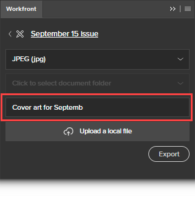
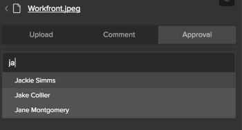

# Utilizzare l’estensione Workfront per Illustrator e InDesign

<!--Audited: 01/2024-->

>[!IMPORTANT]
>
>Stiamo sostituendo l’estensione Workfront per Illustrator e InDesign con [plug-in Creative Cloud aggiornati](/help/quicksilver/workfront-integrations-and-apps/adobe-workfront-for-creative-cloud/wf-cc-install-toc.md). A partire dalla fine del 2022, questa estensione non sarà più supportata ed è disponibile così com’è.

Puoi utilizzare l’estensione Workfront per esportare in Workfront i contenuti digitali salvati e creati in Adobe Illustrator e Adobe InDesign. In questo modo velocizzi il processo di revisione e approvazione dei documenti.

L’estensione Workfront è supportata per Adobe Creative Cloud 2017 e versioni successive nelle seguenti applicazioni:

* InDesign
* Illustrator
* Photoshop

  >[!NOTE]
  >
  >È consigliabile utilizzare il nuovo plug-[Adobe Workfront for Photoshop](/help/quicksilver/workfront-integrations-and-apps/adobe-workfront-for-creative-cloud/wf-cc-install-ps.md).

## Requisiti di accesso

+++ Espandi per visualizzare i requisiti di accesso per la funzionalità descritta in questo articolo.

<table style="table-layout:auto"> 
 <col> 
 <col> 
 <tbody> 
  <tr> 
   <td role="rowheader">Pacchetto Adobe Workfront</td> 
   <td> 
Qualsiasi

 </td> 
  </tr> 
  <tr data-mc-conditions=""> 
   <td role="rowheader">Licenza di Adobe Workfront</td> 
   <td> 
      
Standard
 
   
Work o successiva

</td> 
  </tr> 
  <tr> 
   <td role="rowheader">Prodotti aggiuntivi</td> 
   <td>Oltre alla licenza di Workfront, devi disporre di una licenza Adobe Creative Cloud.</td> 
  </tr> 
  <tr> 
   <td role="rowheader">Autorizzazioni sugli oggetti</td> 
   <td> 
Modifica l’accesso all’oggetto con cui desideri interagire.
  </td> 
  </tr> 
 </tbody> 
</table>

Per informazioni, consulta [Requisiti di accesso nella documentazione di Workfront](/help/quicksilver/administration-and-setup/add-users/access-levels-and-object-permissions/access-level-requirements-in-documentation.md).

+++

## Accedi all’estensione Workfront da Illustrator o InDesign {#log-in-to-workfront-extension-from-illustrator-or-indesign}

Quando effettui l’accesso a Workfront da una delle applicazioni Adobe supportate, effettui l’accesso a tutte le applicazioni Adobe supportate.

1. Pasaa all’applicazione Adobe in cui desideri utilizzare l’estensione Workfront.

   Per un elenco dei formati supportati per ciascuna applicazione supportata, consulta [Formati di file esportati supportati](#supported-exported-file-formats) in questo articolo.

1. Fai clic su **Finestra** > **Estensioni** > Workfront.

1. (Facoltativo) Trascina il pannello Workfront nella posizione in cui vuoi che venga visualizzato nell’applicazione Adobe.
1. Segui i prompt per accedere a Workfront.

   >[!NOTE]
   >
   >* Workfront si collega a Adobe Creative Cloud utilizzando OAuth 2.0, uno standard sicuro utilizzato dalla maggior parte delle integrazioni basate sul web per l’autenticazione e l’autorizzazione degli utenti.
   >* Quando ti viene richiesto di inserire il [dominio o l’host] dell’account Workfront, digitalo nel seguente formato:`yourCompany'sDomain.my.workfront.com`. Il dominio della tua azienda di solito corrisponde al nome.

   Se il progetto è nello stato corrente, viene visualizzato un elenco di elementi di lavoro che ti sono stati assegnati. Se non viene visualizzato alcun elenco, effettua l’accesso a Workfront.

   Le attività personali sono elencate in **Nessun progetto**.

## Caricare un file in un progetto, attività o problema di Workfront {#upload-a-file-to-a-workfront-project-task-or-issue}

Puoi caricare un file dal file di sistema del computer o esportare un file attualmente aperto in un’applicazione Adobe Creative Cloud in un progetto, un’attività o un problema di Workfront. 

Quando carichi o esporti un file da Adobe Creative Cloud, considera quanto segue:

* Il tuo livello di accesso deve consentire il caricamento di documenti in Workfront. Per ulteriori informazioni, consulta [Concedere l’accesso ai documenti](../../administration-and-setup/add-users/configure-and-grant-access/grant-access-documents.md).
* Devi disporre delle autorizzazioni per caricare i documenti nell’elemento in cui desideri. Per ulteriori informazioni, consulta [Panoramica delle autorizzazioni di condivisione sugli oggetti](../../workfront-basics/grant-and-request-access-to-objects/sharing-permissions-on-objects-overview.md).
* Il file viene caricato nell’area Documenti per l’oggetto Workfront selezionato.
* Non puoi esportare un documento nell’area Documenti del menu principale  da un’applicazione Adobe Creative Cloud.

Le sezioni seguenti spiegano quanto segue:

* [Caricare un file](#upload-a-file)
* [Esportare un file attualmente aperto in Illustrator o InDesign](#export-a-file-currently-open-in-illustrator-or-indesign)
* [Caricare una nuova versione di un file da Illustrator o InDesign](#upload-a-new-version-of-a-file-from-illustrator-or-indesign)

### Caricare un file {#upload-a-file}

Puoi caricare i file in un progetto, attività o problema senza uscire dall’applicazione Adobe Creative Cloud.

1. Se all’apertura dell’applicazione Adobe Creative Cloud non visualizzi l’estensione Workfront, fai clic su **Finestra** > **Estensioni** > **Workfront**.

   Se il progetto si trova nello stato corrente, visualizzi un elenco di elementi di lavoro che ti sono stati assegnati. Se non viene visualizzato alcun elenco, effettua l’accesso a Workfront.

   Le attività personali sono elencate in **Nessun progetto**.

1. Fai clic sul nome del progetto, attività o problema in cui vuoi caricare il file.

   Puoi cercare questo elemento, digitando il nome nella casella **Cerca** e selezionando **Progetto**, **Attività** o **Problema** dal menu a discesa a destra della casella **Cerca**. Se il nome dell’elemento di lavoro non viene mostrato nell’elenco, premi **Invio** per cercare tutti gli elementi di Workfront a cui hai accesso per la visualizzazione.

1. Fai clic su **Seleziona** nell’angolo inferiore destro dell’estensione Workfront.
1. Nel menu a discesa **Fai clic per selezionare il formato**, quindi sul formato in cui vuoi salvare il file in Workfront.

   Per un elenco dei formati supportati per ciascuna applicazione supportata, consulta [Formati di file esportati supportati](#supported-exported-file-formats) in questo articolo.

1. (Condizionale) Se l’elemento di lavoro in cui desideri caricare il file contiene cartelle di documenti, selezionane una nel campo **Fai clic per selezionare una cartella di documenti**, quindi fai clic su **Seleziona**.

1. Fai clic su **Carica un file locale**.
1. Nella casella **Apri file**, individua il file nel file di sistema, quindi fai clic su **Apri**.

1. (Facoltativo) Digita un nome descrittivo per il file.

   

1. Fai clic su **Carica**.

   In Workfront, il documento è ora elencato nell’area Documenti per il progetto, l’attività o il problema selezionato.

1. (Facoltativo) Fai clic sul nome del documento per aprire la relativa pagina Dettagli documento in Workfront.

   Workfront si apre in una nuova scheda del browser.

### Esportare un file attualmente aperto in Illustrator o InDesign {#export-a-file-currently-open-in-illustrator-or-indesign}

1. In un’applicazione Adobe Creative Cloud supportata, apri un file da esportare in Workfront.
1. Se l’estensione Workfront non è visualizzata, fai clic su **Finestra** > **Estensioni** > **Workfront**.

   Se il progetto si trova nello stato corrente, visualizzi un elenco di elementi di lavoro che ti sono stati assegnati. Se non viene visualizzato alcun elenco, effettua l’accesso a Workfront.

   Le attività personali sono elencate in **Nessun progetto**.

1. Fai clic sul progetto, attività o problema in cui desideri esportare il file.

   Puoi cercare questo elemento, digitando il nome nella casella **Cerca** e selezionando **Progetto**, **Attività** o **Problema** dal menu a discesa a destra della casella **Cerca**. Se il nome dell’elemento di lavoro non viene mostrato nell’elenco, premi **Invio** per cercare tutti gli elementi di Workfront a cui hai accesso per la visualizzazione.

1. Nel menu a discesa **Fai clic per selezionare formato**, fai clic sul formato in cui desideri salvare il file in Workfront.

   Per un elenco dei formati supportati per ciascuna applicazione supportata, consulta [Formati di file esportati supportati](#supported-exported-file-formats) in questo articolo.

1. (Condizionale) Se l’elemento di lavoro in cui desideri caricare il file contiene cartelle di documenti, selezionane una nel campo **Fai clic per selezionare una cartella di documenti**, quindi fai clic su **Seleziona**.
1. (Facoltativo) Fai clic sul nome del documento e digita un nuovo nome per rinominarlo.

   

1. Fai clic su **Esporta**.

   Viene mostrato un messaggio per confermare che il documento è stato esportato correttamente in Workfront.

   In Workfront, il documento è elencato nell’area Documenti dell’oggetto specificato in Workfront.

1. (Facoltativo) Fai clic sul nome del documento per accedervi in Workfront.

   

   Workfront si apre in una nuova scheda del browser.

### Caricare una nuova versione di un file da Illustrator o InDesign {#upload-a-new-version-of-a-file-from-illustrator-or-indesign}

1. Se desideri esportare un file su cui stai lavorando in un’applicazione Adobe supportata come nuova versione di un file in Workfront, apri il file nell’applicazione Adobe.
1. Se l’estensione Workfront non è mostrata, fai clic su **Finestra** > **Estensioni** > **Workfront**.

   Se il progetto è nello stato corrente, visualizzi un elenco di elementi di lavoro che ti sono stati assegnati. Se non viene visualizzato alcun elenco, effettua l’accesso a Workfront.

   Le attività personali sono elencate in **Nessun progetto**.

1. Fai clic sul nome del progetto, attività o problema in cui è elencato il documento esistente.

   Per cercare questo elemento, digita il nome nella casella **Cerca** e seleziona **Progetto**, **Attività** o **Problema** dal menu a discesa a destra della casella **Cerca**. Se il nome dell’elemento di lavoro non viene mostrato nell’elenco, premi **Invio** per cercare tutti gli elementi di Workfront a cui hai accesso per la visualizzazione.

   Tutti i documenti caricati su progetti, attività o problemi vengono mostrati in un elenco, indipendentemente dal fatto che siano stati caricati dall’applicazione Adobe.

1. Nel menu a discesa **Fai clic per selezionare il formato**, fai clic sul formato in cui desideri salvare il file in Workfront.

   Questa opzione è necessaria se esporti un file aperto nell’applicazione Adobe. Per un elenco dei formati supportati per ciascuna applicazione supportata, consulta [Formati di file esportati supportati](#supported-exported-file-formats) in questo articolo.

1. Se stai esportando un file che hai aperto nell’applicazione Adobe come nuova versione del documento Workfront selezionato, fai clic su **Esporta**.

   Oppure

   Se desideri caricare un file dal file di sistema del computer come nuova versione del documento di Workfront selezionato, fai clic su **Carica un file locale**, trova il file nella casella mostrata, fai clic su **Apri**, quindi su **Carica**.

1. (Facoltativo) Fai clic sul nome del documento per visualizzarne la nuova versione in Workfront.

   >[!NOTE]
   >
   >Il nome del documento in Workfront è popolato per impostazione predefinita e non può essere modificato. Né cambia il nome del file che carichi o esporti come nuova versione.
   >
   >
   >

## Commentare su un documento Workfront da Illustrator o InDesign {#comment-on-a-workfront-document-from-illustrator-or-indesign}

Puoi aggiungere commenti direttamente a un documento Workfront all’interno di un’applicazione Adobe. In Workfront, i tuoi commenti vengono mostrati nell’area Aggiornamenti del documento e in quella Aggiornamenti per l’elemento di Workfront in cui viene salvato il documento.

1. Apri una delle applicazioni Adobe supportate.
1. Se l’estensione Workfront non è mostrata, fai clic su **Finestra** > **Estensioni** > **Workfront**.

   Se il progetto è nello stato corrente, visualizzi un elenco di elementi di lavoro che ti sono stati assegnati. Se non viene visualizzato alcun elenco, effettua l’accesso a Workfront.

   Le attività personali sono elencate in **Nessun progetto**.

1. Fai clic sul progetto, attività o problema in cui è elencato il documento esistente.

   Puoi cercare questo elemento, digitando il nome nella casella **Cerca** e selezionando **Progetto**, **Attività** o **Problema** dal menu a discesa a destra della casella **Cerca**. Se il nome dell’elemento di lavoro non viene mostrato nell’elenco, premi **Invio** per cercare tutti gli elementi di Workfront a cui hai accesso per la visualizzazione.

1. Fai clic sul nome del documento esistente, quindi su **Seleziona** nell’angolo inferiore destro dell’estensione Workfront.
1. Fai clic sulla scheda **Commento**, quindi digita il tuo aggiornamento nella casella.

1. (Facoltativo) Per includere altri utenti o team di Workfront nel commento, inizia a digitare il nome di un utente o di un team nella casella **Notifica persone o team**, quindi fai clic sul nome quando viene mostrato nell’elenco a discesa.
1. (Facoltativo) Per richiedere l’approvazione del documento, seleziona **Fai una richiesta di approvazione**.
1. Fai clic su **Aggiorna**.

   Un aggiornamento viene pubblicato nella scheda Aggiornamenti del documento. Gli utenti di Workfront che includi nel commento ricevono una notifica in-app e, in base alla configurazione di Workfront, potrebbero ricevere anche una notifica e-mail.

   Per ulteriori informazioni sulle notifiche in Workfront, consulta [Visualizzare e gestire le notifiche in-app](../../workfront-basics/using-notifications/view-and-manage-in-app-notifications.md).

   Per ulteriori informazioni sulla ricezione di notifiche e-mail, consulta [Notifiche di Adobe Workfront](../../workfront-basics/using-notifications/wf-notifications.md).

## Richiedere l’approvazione di un documento da Illustrator o InDesign

Puoi richiedere l’approvazione di un documento Workfront direttamente da un’applicazione Adobe.

Puoi richiedere l’approvazione di un documento alle seguenti entità:

* Un utente Workfront
* Un utente esterno senza un account Workfront

Puoi richiedere un’approvazione su un documento da un’applicazione Adobe nei seguenti modi:

* Allegando un approvatore al documento.
* Commentando un documento, avvisando la persona quando fai un commento e allegandola come approvatore al documento.

  Per informazioni sulla richiesta di un’approvazione quando commenti un documento, consulta la sezione [Commentare un documento di Workfront da Illustrator o InDesign](#comment-on-a-workfront-document-from-illustrator-or-indesign) in questo articolo.

Per richiedere l’approvazione di un documento da un’applicazione Adobe:

1. Apri una delle applicazioni Adobe supportate.
1. Se l’estensione Workfront non è mostrata, fai clic su **Finestra** > **Estensioni** > **Workfront**.

   Se il progetto è nello stato corrente, visualizzi un elenco di elementi di lavoro che ti sono stati assegnati. Se non viene visualizzato alcun elenco, effettua l’accesso a Workfront.

   Le attività personali sono elencate in **Nessun progetto**.

1. Fai clic sul progetto, attività o problema in cui è elencato il documento esistente, quindi sul nome del documento esistente.

   Puoi cercare questo elemento, digitando il nome nella casella **Cerca** e selezionando **Progetto**, **Attività** o **Problema** dal menu a discesa a destra della casella **Cerca**. Se il nome dell’elemento di lavoro non viene mostrato nell’elenco, premi **Invio** per cercare tutti gli elementi di Workfront a cui hai accesso per la visualizzazione.

1. Fai clic sul nome del documento esistente, quindi su **Seleziona** nell’angolo inferiore destro dell’estensione Workfront.
1. Fai clic sulla scheda **Approvazione**.
1. Per aggiungere un approvatore, in **Inizia a digitare un nome nella casella** esegui una delle operazioni seguenti:

   * Digitare il nome di un approvatore, quindi selezionarlo quando viene mostrato nell’elenco.

     

   * Digitare l’indirizzo e-mail di un utente esterno.

1. Fai clic su **Richiedi approvazione**.

   Gli utenti di Workfront che includi nel commento o aggiungi come approvatore ricevono una notifica in-app e, in base a come è configurato Workfront, possono ricevere anche una notifica e-mail.\
   Gli utenti esterni ricevono una notifica e-mail da dove possono prendere una decisione sull’approvazione.

   Per informazioni sulle notifiche in Workfront, consulta [Visualizzare e gestire le notifiche in-app](../../workfront-basics/using-notifications/view-and-manage-in-app-notifications.md). Per informazioni sulla ricezione di notifiche e-mail, consulta [Notifiche Adobe Workfront](../../workfront-basics/using-notifications/wf-notifications.md).

## Generare una bozza da Illustrator o InDesign {#generate-a-proof-from-illustrator-or-indesign}

Se la tua organizzazione utilizza i modelli di flusso di lavoro automatizzato, puoi generare una bozza per un documento creato in un’applicazione Adobe senza uscire da questa. Per informazioni sulla creazione di bozze, consulta [Creare bozze](../../review-and-approve-work/proofing/creating-proofs-within-workfront/create-proofs-in-wf.md). Per informazioni sui modelli di flussi di lavoro automatizzati, consulta [Modelli di flussi di lavoro automatizzati](../../review-and-approve-work/proofing/proofing-overview/automated-workflow.md#automate) in [Panoramica sui flussi di lavoro automatizzati](../../review-and-approve-work/proofing/proofing-overview/automated-workflow.md).

1. Apri una delle applicazioni Adobe supportate.
1. Se l’estensione Workfront non è mostrata, fai clic su **Finestra** > **Estensioni** > Workfront.

   Se il progetto è nello stato corrente, visualizzi un elenco di elementi di lavoro che ti sono stati assegnati. Se non viene visualizzato alcun elenco, effettua l’accesso a Workfront.

   Le attività personali sono elencate in **Nessun progetto**.

1. Se il documento è già stato caricato in Workfront, seleziona il progetto, attività o problema nell’estensione Workfront in cui è elencato il documento, quindi fai clic sul nome del documento.

   Oppure

   Carica un documento Adobe in un oggetto Workfront, come descritto nella sezione [Caricare un file in un progetto, attività o problema di Workfront](#upload-a-file-to-a-workfront-project-task-or-issue) in questo articolo, quindi fai clic sul nome del documento.

1. Nel menu a discesa **Fai clic per selezionare il formato**, quindi sul formato in cui desideri salvare il file in Workfront.

   Alcuni formati non sono disponibili dopo l’abilitazione della funzionalità di bozza nel passaggio successivo a questo. Per ulteriori informazioni, consulta [Formati di file esportati supportati](#supported-exported-file-formats) in questo articolo.

1. Fai clic su **Carica come nuova bozza** per abilitarla.
1. Seleziona il **Modello flusso di lavoro** che desideri venga utilizzato dagli utenti durante la revisione del documento.

   L’amministratore di Workfront configura modelli di flussi di lavoro automatizzati come descritto in [Creare e gestire modelli di flussi di lavoro automatizzati](/help/quicksilver/administration-and-setup/manage-workfront/configure-proofing/create-manage-automated-workflow-templates.md). Se hai domande, consulta l’amministratore.

   1. Aggiungi almeno un **Nuovo destinatario** a ogni fase del modello del flusso di lavoro.

      Puoi iniziare a digitare un nome e selezionarlo quando lo visualizzi nell’elenco a discesa mostrato.

   1. Specifica il **Ruolo bozza** e la frequenza di **Avvisi e-mail** per ogni destinatario aggiunto.

   1. (Facoltativo) Nella sezione **Notifica e-mail**, seleziona se inviare una notifica e-mail con un messaggio personalizzato facoltativo sulla bozza a tutti i destinatari della bozza aggiunti.

1. Fai clic su **Crea bozza**.

   Puoi visualizzare l’avanzamento del processo di creazione della bozza. Al termine della generazione, viene mostrato un avviso. Puoi aprire l’attività in cui hai creato la bozza e vi è elencata.

## Caricare una nuova versione di una bozza senza uscire da Illustrator o InDesign

1. Fai clic su un documento esistente che ha una bozza, quindi su **Seleziona** nell’angolo in basso a destra.
1. Fai clic su **Carica come nuova versione della bozza** per abilitarla.
1. (Facoltativo) Seleziona il **Modello di flusso di lavoro** che desideri venga utilizzato dagli utenti durante la revisione della nuova versione.

   Se non selezioni un modello diverso, quello selezionato per la versione precedente rimane attivo. Inoltre, se hai modificato il modello per la versione precedente, le modifiche sono attive per la nuova versione.

   L’amministratore di Workfront configura modelli di flussi di lavoro automatizzati come descritto in [Creare e gestire modelli di flussi di lavoro automatizzati](/help/quicksilver/administration-and-setup/manage-workfront/configure-proofing/create-manage-automated-workflow-templates.md). Se hai domande, consulta l’amministratore.

   1. Aggiungi almeno un **Nuovo destinatario** a ogni fase del modello del flusso di lavoro.

      Puoi iniziare a digitare un nome e selezionarlo quando lo visualizzi nell’elenco a discesa mostrato.

   1. Specifica il **Ruolo bozza** e la frequenza di **Avvisi e-mail** per ogni destinatario aggiunto.
   1. (Facoltativo) Nella sezione **Notifica e-mail**, seleziona se inviare una notifica e-mail con un messaggio personalizzato facoltativo sulla bozza a tutti i destinatari della bozza aggiunti.

1. Fai clic su **Crea nuova versione bozza**.

   Puoi visualizzare l’avanzamento del processo di creazione della bozza. Al termine della generazione, viene mostrato un avviso. Puoi aprire l’attività in cui hai creato la bozza e vi è elencata.

## Disconnettersi dall’estensione Workfront

1. Dall’applicazione Adobe, fai clic su **Finestra** > **Estensioni** > **Workfront**.

1. Fai clic sul menu **Altro**  nell’angolo superiore destro del pannello.

1. (Facoltativo) Fai clic su **Feedback** per aprire un breve sondaggio e inviare a Workfront il tuo feedback su Workfront per Adobe Creative Cloud.
1. Fai clic su **Disconnetti**.\
   Viene visualizzata la schermata Accesso. Per informazioni sull’accesso, consulta [Effettuare l’accesso all’estensione Workfront da Illustrator o InDesign](#log-in-to-workfront-extension-from-illustrator-or-indesign) in questo articolo.

## Formati file supportati esportati {#supported-exported-file-formats}

* [Formati di file esportati supportati per Adobe InDesign](#supported-exported-file-formats-for-adobe-indesign)
* [Formati di file esportati supportati per Adobe Illustrator](#supported-exported-file-formats-for-adobe-illustrator)

### Formati di file esportati supportati per Adobe InDesign  {#supported-exported-file-formats-for-adobe-indesign}

Workfront supporta i seguenti formati di file per l’esportazione di un file da InDesign a Workfront:

* EPS - Encapsulated PostScript
* EPUB - Pubblicazione elettronica a layout fisso
* EPUB - Pubblicazione elettronica adattabile &#42;
* HTML - HyperText Markup Language
* IDML - InDesign Markup Language &#42;
* JPG, JPEG - Joint Photographic Experts Group
* PDF - Adobe Portable Document File
* PNG - Portable Network Graphics
* SWF - Flash Player &#42;
* XML - Extensible Markup Language &#42;

&#42; Questo formato di file non è disponibile quando **Carica una nuova bozza** è abilitato (per informazioni su questa opzione, consulta [Generare una bozza da Illustrator o InDesign](#generate-a-proof-from-illustrator-or-indesign) in questo articolo). Se questo formato di file è già selezionato prima di abilitare **Carica una nuova bozza**, il sistema modifica il formato del file in PDF. Puoi selezionare un formato diverso dall’elenco.

### Formati di file esportati supportati per Adobe Illustrator  {#supported-exported-file-formats-for-adobe-illustrator}

Workfront supporta i seguenti formati di file per l’esportazione di un file da Illustrator a Workfront:

* DWG - AutoCAD Drawing, File di interscambio di AutoCAD &#42;
* JPG, JPEG - Joint Photographic Experts Group
* PNG - Portable Network Graphics
* PSD - Photoshop Document
* SWF - Flash Player &#42;
* TIFF - Tagged Image File Format

&#42; Questo formato di file non è disponibile quando **Carica una nuova bozza** è abilitato (per informazioni su questa opzione, consulta [Generare una bozza da Illustrator o InDesign](#generate-a-proof-from-illustrator-or-indesign) in questo articolo). Se questo formato di file è già selezionato prima di abilitare **Carica una nuova bozza**, il sistema modifica il formato del file in PDF. Puoi selezionare un formato diverso dall’elenco.
