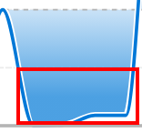

# Visualizzare la visualizzazione della capacità del team in Analisi avanzate

<!-- Audited: 01/2024 -->

La visualizzazione Capacità team mostra la quantità totale di capacità di un team principale, che sia sovrassegnato o sottoassegnato, e quanto dinamica sia la capacità nel tempo.

## Requisiti di accesso

Per eseguire i passaggi descritti in questo articolo, è necessario disporre dei seguenti diritti di accesso:

<table style="table-layout:auto"> 
 <col> 
 <col> 
 <tbody> 
  <tr> 
   <td role="rowheader">piano Adobe Workfront</td> 
   <td>
      
Nuovo: Qualsiasi

      
oppure

      
Corrente: Business o superiore
</td>
  </tr> 
  <tr> 
   <td role="rowheader">Licenza Adobe Workfront</td>
   <td>
      
Nuovo: Chiaro o superiore

      
oppure

      
Corrente: revisione o versione successiva

   </td>
  </tr> 
  <tr> 
   <td role="rowheader">Configurazioni del livello di accesso</td> 
   <td>Accesso ai progetti in visualizzazione</td> 
  </tr> 
  <tr> 
   <td role="rowheader">Autorizzazioni oggetto</td> 
   <td>Visualizza </td> 
  </tr> 
 </tbody> 
</table>

Per ulteriori dettagli sulle informazioni contenute in questa tabella, vedere [Requisiti di accesso nella documentazione di Workfront](/help/quicksilver/administration-and-setup/add-users/access-levels-and-object-permissions/access-level-requirements-in-documentation.md).

## Prerequisiti

Per i prerequisiti per utilizzare Enhanced Analytics, consulta la sezione &quot;Prerequisiti&quot; in [Panoramica di analisi avanzate](../enhanced-analytics/enhanced-analytics-overview.md).

## Comprendere la visualizzazione della capacità del team

La visualizzazione Capacità team mostra il volume di lavoro assegnato al team principale in un determinato giorno.

* **Burnout**: quando il colore di riempimento blu scuro è sopra la linea tratteggiata, al team principale vengono assegnate più ore lavorative di quante possano essere completate nel numero di ore lavorative disponibili per il team. Questo indica che il team è sovrassegnato e potrebbe essere prossimo al burnout.

  

* **Senza problemi**: quando il colore di riempimento blu più scuro è al di sotto della linea tratteggiata, il team predefinito ha a disposizione più ore di lavoro della quantità di lavoro assegnata. Questo indica che il team è sottoassegnato e potrebbe non avere problemi.

  

* **Saldo**: quando il colore di riempimento blu più chiaro o più trasparente è appena sopra, appena sotto o sulla linea tratteggiata, al team principale viene assegnata una quantità di ore lavorative che dovrebbe essere in grado di completare entro le ore lavorative disponibili. Ciò indica che il carico di lavoro del team è più bilanciato.

  

Passando il puntatore del mouse su un punto della visualizzazione vengono visualizzati i seguenti dettagli per un dato giorno:

* **Ore pianificate**: numero di ore di lavoro pianificate che il team deve completare.
* **Ore disponibili**: numero di ore lavorative che il team è disponibile a lavorare.
* **Capacità**: oltre a una percentuale di capacità, vengono visualizzate anche le designazioni A capacità, Sotto capacità o Sovraccapacità.

La visualizzazione di queste informazioni consente di determinare:

* Quando la squadra di casa è stata sovrassegnata o sottoassegnata.
* Se il team interno è sovrassegnato o sottoassegnato su base giornaliera.
* La coerenza del carico di lavoro quotidiano di un team interno.
* Se si creano problemi di capacità con nuovi lavori.

Per scoprire come ottenere i dati migliori per questa visualizzazione, consulta [Panoramica di analisi avanzate](../enhanced-analytics/enhanced-analytics-overview.md).

## Visualizza la visualizzazione della capacità del team

{{step1-to-analytics}}

1. Nel pannello a sinistra, seleziona **Persone**.

   

1. (Facoltativo) Per utilizzare un intervallo di date diverso, seleziona nuove date di inizio e fine dal filtro dell’intervallo di date.

   

   Per informazioni sull’utilizzo del filtro per intervalli di date, consulta [Applicare i filtri nelle analisi avanzate](../enhanced-analytics/use-enhanced-analytics-filters.md).

1. (Condizionale) Se non hai impostato il filtro Team, aggiungi il filtro Team e seleziona ogni team per il quale desideri visualizzare i dati.

   Per ulteriori informazioni sull’aggiunta di filtri in Analisi avanzate, consulta [Applicare i filtri nelle analisi avanzate](../enhanced-analytics/use-enhanced-analytics-filters.md).

   Dopo aver aggiunto i filtri, vengono visualizzati i dati per un massimo di 50 progetti e i filtri rimangono attivi anche dopo che hai lasciato la pagina o disconnesso da Workfront.

1. Nella visualizzazione Capacità risorse, fai clic su un team per visualizzare ulteriori informazioni.

   Viene visualizzata la visualizzazione Capacità team.

   Per ulteriori informazioni sulla visualizzazione Capacità risorse, consulta [Visualizzare la visualizzazione Capacità risorse in Analisi avanzate](../enhanced-analytics/resource-capacity-overview.md).

1. (Facoltativo) Per ingrandire un intervallo di date, seleziona un punto nella visualizzazione per l’inizio dell’intervallo di date e trascina fino alla fine dell’intervallo di date.

   Tutte le altre visualizzazioni vengono aggiornate allo stesso intervallo di date e viene creato un filtro per l’intervallo di tempo.

   

1. Passa il cursore del mouse su un punto della riga del grafico per visualizzare le ore pianificate e le ore pianificate per la data specificata, nonché la percentuale di capacità e se il team della casa era al momento al di sopra, al di sotto o alla capacità.

   

1. (Facoltativo) Per esportare i dati di visualizzazione, fai clic sul pulsante **Esporta** icona  nell’angolo in alto a destra della visualizzazione, seleziona il formato di esportazione:

   * Grafico (PNG)
   * Tabella dati (XSLX)

