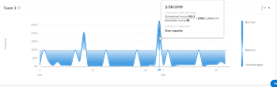

# Visualizzazione della visualizzazione della capacità del team in Analisi avanzata

La visualizzazione della capacità del team mostra la quantità totale di capacità di un team principale, sia che siano sovrassegnate o sottoassegnate, sia che la capacità sia dinamica nel tempo.

## Requisiti di accesso

Devi disporre dei seguenti elementi:

<table style="table-layout:auto"> 
 <col> 
 <col> 
 <tbody> 
  <tr> 
   <td role="rowheader"><a href="https://www.workfront.com/plans" target="_blank">piano Adobe Workfront</a>*</td> 
   <td> 
Aziende o superiore
 </td> 
  </tr> 
  <tr> 
   <td role="rowheader"><a href="../administration-and-setup/add-users/access-levels-and-object-permissions/wf-licenses.md" class="MCXref xref">Panoramica sulle licenze di Adobe Workfront</a>*</td> 
   <td> 
Revisione o superiore
 </td> 
  </tr> 
  <tr> 
   <td role="rowheader">Configurazioni a livello di accesso*</td> 
   <td> 
Visualizza accesso a progetti
 
Nota: Se non disponi ancora dell’accesso, chiedi all’amministratore Workfront se ha impostato ulteriori restrizioni nel livello di accesso. Per informazioni su come un amministratore Workfront può modificare il livello di accesso, consulta <a href="../administration-and-setup/add-users/configure-and-grant-access/create-modify-access-levels.md" class="MCXref xref">Creare o modificare livelli di accesso personalizzati</a>.
 </td> 
  </tr> 
  <tr> 
   <td role="rowheader">Autorizzazioni oggetto</td> 
   <td> 
Visualizza
 
Per informazioni sulla richiesta di accesso aggiuntivo, vedi <a href="../workfront-basics/grant-and-request-access-to-objects/request-access.md" class="MCXref xref">Richiedere l’accesso agli oggetti </a>.
 </td> 
  </tr> 
 </tbody> 
</table>

&#42;Per informazioni sul piano, il tipo di licenza o l&#39;accesso, contattare l&#39;amministratore Workfront.

## Prerequisiti

Per i prerequisiti per l’utilizzo di Analytics avanzato, consulta la sezione &quot;Prerequisiti&quot; in [Panoramica dell’analisi migliorata](../enhanced-analytics/enhanced-analytics-overview.md).

## Comprendere la visualizzazione della capacità del team

La visualizzazione della capacità del team visualizza il volume di lavoro assegnato al team principale in un dato giorno.

* **Burnout**: Quando il colore di riempimento blu scuro è al di sopra della linea tratteggiata, il team di casa dispone di più ore lavorative assegnate a loro di quante possono completare nel numero di ore disponibili per il lavoro del team. Questo indica che il team è sovrassegnato e potrebbe essere in fase di esaurimento.

   

* **Non sfidato**: Quando il colore di riempimento blu scuro è al di sotto della linea tratteggiata, il team di casa dispone di più ore di lavoro rispetto alla quantità di lavoro assegnata loro. Questo indica che il team è sottoallocato e potrebbe non essere contestato.

   

* **Saldo**: Quando il colore di riempimento blu più chiaro o più trasparente è appena sopra, appena sotto, o alla linea tratteggiata, il team di casa ha una quantità di ore di lavoro assegnate loro che dovrebbero essere in grado di completare entro le ore di lavoro disponibili. Ciò indica che il carico di lavoro del team è più bilanciato.

   

Passando il mouse su un punto della visualizzazione, vengono visualizzati i seguenti dettagli per un dato giorno:

* **Orari programmati**: Numero di ore di lavoro pianificate che il team deve completare.
* **Ore disponibili**: Numero di ore lavorative disponibili per il lavoro del team.
* **Capacità**: Oltre a una percentuale di capacità, vengono visualizzate anche le designazioni A capacità, Sotto capacità o Sovracapacità.

La visualizzazione di queste informazioni consente di determinare:

* Quando la squadra principale è stata sovrassegnata o sottoassegnata.
* Se la squadra principale è sovrassegnata o sottoassegnata su base giornaliera.
* Quanto è coerente il carico di lavoro di un team domestico di giorno in giorno.
* Se si creano problemi di capacità con il nuovo lavoro.

Per scoprire come ottenere i dati migliori per questa visualizzazione, consulta [Panoramica dell’analisi migliorata](../enhanced-analytics/enhanced-analytics-overview.md).

## Visualizzazione della visualizzazione della capacità del team

1. Fai clic sull’icona Menu principale , quindi seleziona **Analytics**.
1. Nel pannello a sinistra, seleziona **Persone**.

   

1. (Facoltativo) Per utilizzare un intervallo di date diverso, seleziona nuove date di inizio e di fine dal filtro dell’intervallo di date.

   

   Per informazioni sull’utilizzo del filtro dell’intervallo di date, consulta [Applicazione di filtri in Analisi avanzata](../enhanced-analytics/use-enhanced-analytics-filters.md).

1. (Condizionale) Se non hai impostato il filtro Team, aggiungi il filtro Team e seleziona ogni team per il quale desideri visualizzare i dati.

   Per ulteriori informazioni sull’aggiunta di filtri nell’analisi avanzata, consulta [Applicazione di filtri in Analisi avanzata](../enhanced-analytics/use-enhanced-analytics-filters.md).

   Dopo aver aggiunto i filtri, vengono visualizzati i dati per un massimo di 50 progetti e i filtri rimangono attivi anche dopo aver lasciato la pagina o disconnesso da Workfront.

1. Nella visualizzazione della capacità delle risorse, fai clic su un team per visualizzare ulteriori informazioni.

   Viene visualizzata la visualizzazione della capacità del team.

   Per ulteriori informazioni sulla visualizzazione della capacità delle risorse, consulta [Visualizzazione della visualizzazione della capacità delle risorse in Analisi avanzata](../enhanced-analytics/resource-capacity-overview.md).

1. (Facoltativo) Per ingrandire un intervallo di date, seleziona un punto sulla visualizzazione per l’inizio dell’intervallo di date e trascina fino alla fine dell’intervallo di date.

   Tutte le altre visualizzazioni vengono aggiornate con lo stesso intervallo di date e viene creato un filtro per l’intervallo di tempo.

   

1. Passa il puntatore del mouse su un punto della linea grafica per visualizzare le ore pianificate e le ore pianificate per la data specificata, nonché la percentuale di capacità e se il team di origine era al di sopra, al di sotto o alla capacità in quel momento.

   

1. (Facoltativo) Per esportare i dati di visualizzazione, fai clic sul pulsante **Icona Esporta**  nell’angolo in alto a destra della visualizzazione, quindi seleziona il formato di esportazione:

   * **Grafico (PNG)**
   * **Tabella dati (XSLX)**

