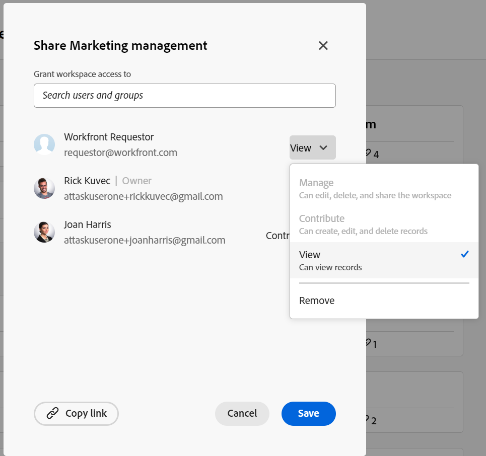

<!--update the metadata with real things when making this public; also update the description with something like this: Not all users in the organization have the same access and permissions to use Adobe Workfront plannint. This article describes the levels of access that users could have to Adobe Workfront Planning. -->
<!--update the title and the metadata title if Workfront Planning is NOT its own product - because the title is too generic for it being a Workfront capability-->

# Panoramica del tipo di licenza quando si utilizza Adobe Workfront Planning

{{planning-important-intro}}

Il tipo di licenza di Adobe Workfront funziona in combinazione con le autorizzazioni di Adobe Workfront Planning per consentire l’accesso alla visualizzazione, al contributo o alla gestione delle aree di lavoro. <!--add more objects here when we can grant other object-specific permissions-->

Gli utenti con tutti i tipi di licenza possono visualizzare, creare, modificare o gestire le visualizzazioni di Workfront Planning.

In questo articolo vengono descritti i tipi di licenze necessari in Workfront e le autorizzazioni concesse alle aree di lavoro in Workfront Planning in base a ogni tipo di licenza.

Un utente con un tipo di licenza di livello inferiore dispone di autorizzazioni limitate per le aree di lavoro quando utilizza le funzionalità di Workfront Planning.

>[!INFO]
>
>**ESEMPIO:**
>
>I richiedenti (o i collaboratori, in base al nuovo modello di licenza) non possono contribuire o gestire le aree di lavoro e i relativi oggetti.
>
>Nella casella Condivisione è indicato che non è possibile concedere agli utenti le autorizzazioni per contribuire a o gestire un’area di lavoro se dispongono di una licenza di livello inferiore.
>
>

Per informazioni sulle autorizzazioni per gli oggetti in Workfront Planning, vedere [Panoramica delle autorizzazioni di condivisione in Adobe Workfront Planning](/help/quicksilver/maestro/access/sharing-permissions-overview.md).

## Relazione tra i tipi di licenza di Workfront e le autorizzazioni di Workfront Planning

La tabella seguente descrive la relazione tra il tipo di licenza di un utente in Adobe Workfront e il livello di autorizzazioni che è possibile concedere agli oggetti di Adobe Workfront Planning in base a tale licenza.

La concessione di autorizzazioni utente a un&#39;area di lavoro consente inoltre di concedere autorizzazioni ai tipi di record, ai record e ai campi.

| Tipo di licenza Adobe Workfront* | Autorizzazioni consentite in Adobe Workfront Planning |
|------------------------------------------------|-------------------------------------------------------------------------------------------------------------------------------------------------------------------------------|
| Nuovo: Standard   o  Corrente: Piano | Gli utenti possono creare e gestire aree di lavoro, tipi di record e record.  Gli amministratori di sistema dispongono delle autorizzazioni di gestione per tutte le aree di lavoro, incluse quelle che non hanno creato. |
| Nuovo: Chiaro   o  Corrente: Lavoro | Gli utenti possono contribuire e visualizzare un&#39;area di lavoro condivisa con loro, nonché i tipi di record e i record da tale area di lavoro.   Gli utenti possono creare, modificare ed eliminare i record nelle aree di lavoro in cui dispongono delle autorizzazioni Contribute. |
| Nuovo: Collaboratore   o  Corrente: revisore o richiedente | Gli utenti possono visualizzare le aree di lavoro condivise, nonché i tipi di record e i record di tali aree di lavoro.   Gli utenti non possono creare, modificare o eliminare tipi di record o record. |

*Per ulteriori informazioni, vedere [Requisiti di accesso nella documentazione di Workfront](/help/quicksilver/administration-and-setup/add-users/access-levels-and-object-permissions/access-level-requirements-in-documentation.md).