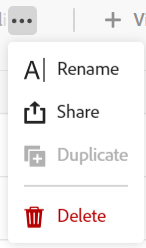

<!--*****************ADD TO TOC AND MINITOC WHEN RELEASING*********************-->

<!--update the metadata and description when we turn this article live; also, update title after Bob adds Maestro as a product-->

# Condividere una visualizzazione

Puoi condividere una visione con altri per garantire la collaborazione quando lavori in Adobe Workfront Maestro.

La concessione di autorizzazioni a un&#39;area di lavoro non consente ad altri utenti di concedere autorizzazioni per le visualizzazioni nelle pagine dei tipi di record. È necessario concedere autorizzazioni alle singole visualizzazioni in una pagina di tipo record per condividerle con altri utenti.

## Requisiti di accesso

Per eseguire i passaggi descritti in questo articolo, è necessario disporre dei seguenti diritti di accesso:

<table style="table-layout:auto">
 <col>
 </col>
 <col>
 </col>
 <tbody>
    <tr>
<tr>
<td>
   
 Prodotto
 </td>
   <td>
   
 Adobe Workfront
 </td>
  </tr>  
 <td role="rowheader">
Contratto Adobe Workfront
</td>
   <td>

La tua organizzazione deve essere iscritta al programma beta chiuso Adobe Maestro. Per informazioni su questa nuova offerta, contatta il rappresentante del tuo account. 

   </td>
  </tr>
  <tr>
   <td role="rowheader">
piano Adobe Workfront
</td>
   <td>

Qualsiasi

   </td>
  </tr>
  <tr>
   <td role="rowheader">
Licenza Adobe Workfront
</td>
   <td>
   
Qualsiasi
 
  </td>
  </tr>

<tr>
   <td role="rowheader">
Configurazioni del livello di accesso
</td>
   <td> Non ci sono controlli di accesso per Adobe Maestro
  
</td>
  </tr>

<tr>
   <td role="rowheader">
Autorizzazioni oggetto
</td>
   <td> 
Gestire le autorizzazioni per una visualizzazione
  
</td>
  </tr>

<tr>
   <td role="rowheader">
Modello di layout
</td>
   <td> 
L’amministratore del Workfront o del gruppo deve aggiungere l’area Maestro al modello di layout. 
  
</td>
  </tr>
 </tbody>
</table>

## Condivisione delle autorizzazioni per una visualizzazione

Puoi condividere le viste create o le viste per le quali disponi delle autorizzazioni di gestione.

>[!NOTE]
>
>Gli amministratori di sistema non possono visualizzare o condividere viste che non hanno creato personalmente. Possono solo visualizzare o condividere le visualizzazioni condivise con loro.

Per condividere una visualizzazione con altri utenti:

{{step1-to-maestro}}

1. Aprire l&#39;area di lavoro di cui si desidera condividere la visualizzazione, quindi fare clic su una scheda Tipo di record.

   Verrà aperta la pagina del tipo di record.

1. Dal menu a discesa della vista, passa il puntatore sulla vista da condividere e fai clic sul pulsante **Altro** menu  a destra del nome della visualizzazione, quindi fai clic su **Condividi**.

   

1. In **Concedi l’accesso in visualizzazione a** , inizia a digitare il nome di un utente o di un gruppo, quindi fai clic su di esso quando viene visualizzato nell’elenco.

   

1. Seleziona uno dei seguenti livelli di autorizzazione dal menu a discesa:
   * Visualizza
   * Gestisci

     Per informazioni sui livelli di autorizzazione e sulle azioni che gli utenti possono eseguire per ciascun livello, consulta [Panoramica delle autorizzazioni di condivisione in Adobe Maestro](../access/sharing-permissions-overview.md).
1. Fai clic su **Salva**.

## Rimuovere le autorizzazioni per una visualizzazione

{{step1-to-maestro}}

1. Aprire l&#39;area di lavoro di cui si desidera condividere la visualizzazione, quindi fare clic su una scheda Tipo di record.

   Verrà aperta la pagina del tipo di record.

1. Dal menu a discesa della vista, passa il puntatore sulla vista da condividere e fai clic sul pulsante **Altro** menu  a destra del nome della visualizzazione, quindi fai clic su **Condividi**.

1. Individuare l&#39;utente o il gruppo da rimuovere, quindi fare clic su **Rimuovi** nel menu a discesa autorizzazioni a destra del nome dell’utente o del gruppo.

1. Fai clic su **Salva**.

   L&#39;utente o gli utenti che appartengono al gruppo rimosso non hanno più accesso alla visualizzazione.