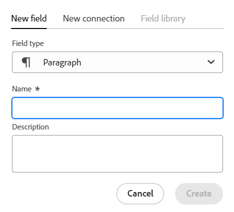
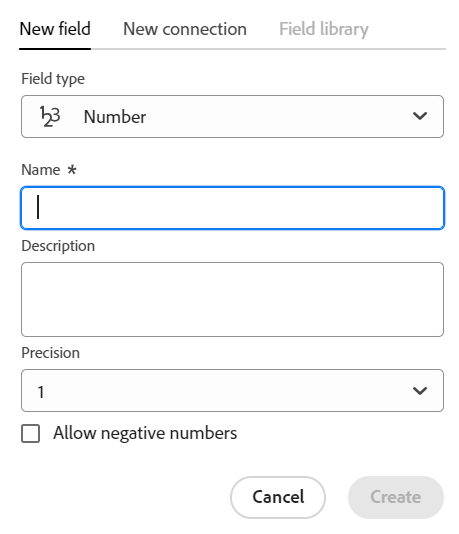

<!--udpate the metadata with real information when making this avilable in TOC and in the left nav-->

<!--Should the structure of this article be like this one: https://experienceleague.adobe.com/docs/workfront/using/administration-and-setup/customize/custom-forms/custom-form-builder/use-the-custom-form-builder/add-a-custom-field-to-a-custom-form.html?lang=en ??-->

<!--will they add a way to create fields elsewhere than in a table?! - how will that change the structure of this article? -->

# Crea campi

>[!IMPORTANT]
>
>Attualmente, Adobe Maestro fa parte di un programma beta chiuso aperto a un numero limitato di clienti.
>
>Contatta il rappresentante del tuo account per ulteriori informazioni su come partecipare al programma beta per Maestro.
>
>Per informazioni, consulta [Panoramica di Adobe Maestro](../maestro-overview.md).

Ad Adobe, Maestro può creare campi personalizzati per tipi di record operativi o tassonomie. È quindi possibile associare i campi ai record Maestro per migliorare le informazioni sui record.

È necessario creare tipi di record prima di poter creare campi da associare. Per informazioni, consulta [Crea tipi di record](../architecture-and-fields/create-record-types.md).

## Requisiti di accesso

Per eseguire i passaggi descritti in questo articolo, è necessario disporre dei seguenti diritti di accesso:

<table style="table-layout:auto">
 <col>
 <tbody>
<td>
   
 prodotto Adobe
 </td>
   <td>
   
 Adobe Workfront
 </td>
  </tr>  
 <td role="rowheader">
Contratto Adobe Workfront
</td>
   <td>

La tua organizzazione deve essere iscritta al programma beta chiuso Adobe Maestro. Per informazioni su questa nuova offerta, contatta il rappresentante del tuo account. 

   </td>
  </tr>
  <tr>
   <td role="rowheader">
piano Adobe Workfront
</td>
   <td>

Qualsiasi

   </td>
  </tr>
  <tr>
   <td role="rowheader">
Licenza Adobe Workfront
</td>
   <td>
   
Qualsiasi
 
  </td>
  </tr>

<tr>
   <td role="rowheader">Livello di accesso</td>
   <td> 
Qualsiasi
  
</td>
  </tr>
<tr>
   <td role="rowheader">Modello di layout</td>
   <td> 
L’amministratore di sistema deve aggiungere l’area Maestro nel modello di layout. Per informazioni, consulta <a href="../access/grant-access.md">Concedere l’accesso a Adobe Maestro</a>. 
  
</td>
  </tr>
 </tbody>
</table>

<!--Maybe enable this at GA - but Maestro is not supposed to have Access controls in the Workfront Access Level: 
>[!NOTE]
>
>If you don't have access, ask your Workfront administrator if they set additional restrictions in your access level. For information on how a Workfront administrator can change your access level, see [Create or modify custom access levels](../administration-and-setup/add-users/configure-and-grant-access/create-modify-access-levels.md). -->

<!-- Notes to add for the table: for the "Workfront plans" row: the above is only for closed beta; when going to GA - activate the following plans:    

Current plan: Prime and Ultimate

Legacy plan: Enterprise
-->

<!-- Notes for the table: for the "Workfront access" row: 
For more information, see <a href="../../administration-and-setup/add-users/access-levels-and-object-permissions/wf-licenses.md" class="MCXref xref">Adobe Workfront licenses overview</a>.
-->

## Considerazioni sui campi Maestro

* È possibile creare campi solo dalla vista tabella di una pagina del tipo di record. I campi vengono visualizzati come colonne nella vista tabella.

  Per informazioni sulla gestione delle colonne di tabella (o dei campi record), vedere [Gestire la vista tabella](../views/manage-the-table-view.md).

  Per informazioni sulla gestione dei campi, vedi anche i seguenti articoli:

   * [Modifica campi](../architecture-and-fields/edit-fields.md)
   * [Elimina campi](./delete-fields.md)

* I campi associati a un tipo di record sono disponibili per essere associati a tutti i record di quel tipo. <!--will this change and will the fields be available for other record types, too?! Also, the next bullet might need to change too if this one changes -->

* Impossibile aggiungere campi associati a un tipo di record a un altro tipo di record. <!-- this will change when they open the Field library tab when creating a field-->

* Puoi creare i campi manualmente o automaticamente nei seguenti modi:

   * Manualmente:

      * Aggiungendo colonne nella visualizzazione Tabella di una pagina di tipo record. Le colonne della tabella sono i campi associati al tipo di record. Sono gli stessi campi visualizzati nella pagina Dettagli di un record.

        Impossibile creare campi dalla pagina Dettagli di un record.

        Questo articolo descrive come creare manualmente i campi.

      * Collegando i tipi di record. È possibile creare campi record collegati quando si aggiunge una nuova connessione tra due tipi di record Maestro o un tipo di record e un tipo di oggetto di altre applicazioni.

        <!--* Importing record types with fields using a CSV or an Excel file. - this is not available yet-->

        Per ulteriori informazioni sulla connessione dei tipi di record Maestro, vedere [Connetti tipi di record](../architecture-and-fields/connect-record-types.md).

      * Importando i tipi di record utilizzando un file Excel o CSV. Per ulteriori informazioni, consulta [Crea tipi di record](../architecture-and-fields/create-record-types.md).

   * Automaticamente:

      * Per impostazione predefinita, ogni volta che si crea un tipo di record.

        Di seguito sono riportati i campi standard creati per impostazione predefinita per ogni nuovo tipo di record operativo:

         * Nome
         * Descrizione
         * Data di inizio
         * Data di fine
         * Stato. I valori predefiniti per gli stati dei record sono:
            * Sviluppo
            * Pianificato
            * Attiva
            * Completato
            * In sospeso

           Puoi aggiungere altri valori o rinominare quelli esistenti.

        Di seguito sono riportati i campi standard creati per impostazione predefinita per ogni nuovo tipo di record tassonomia:

         * Nome <!--will more be added? If not, consider rephrasing this bullet-->

      * Quando crei un’area di lavoro da un modello. Maestro crea campi per tipi di record operativi e tassonomie quando crei un’area di lavoro da un modello. Per informazioni, consulta [Creare aree di lavoro](../architecture-and-fields/create-workspaces.md).

* È possibile visualizzare e aggiornare le impostazioni per i campi creati dall&#39;utente corrente o da qualsiasi altro utente. <!--this will change with access/ permissions-->

* È possibile avere fino a 500 campi per un tipo di record.

* I nomi dei campi possono contenere fino a 250 caratteri.

* Durante l’eliminazione di un tipo di record operativo, di una tassonomia o di un’area di lavoro, vengono eliminati anche tutti i campi ad essi associati e i relativi valori e non è possibile recuperarli. <!-- this might change with a possible recycle bin solution?!-->

## Crea campi da zero {#create-fields-from-scratch}

<!--in a table (not sure if this can be done elsewhere?!-->

1. Fai clic su **Menu principale** icona  nell’angolo superiore destro di Workfront, <!---or the **Main menu** icon   in the upper-left corner, if available--> quindi fai clic su **Maestro** .

   Per impostazione predefinita, viene aperta l’ultima area di lavoro a cui si è effettuato l’accesso.

1. (Facoltativo) Espandere la freccia rivolta verso il basso a destra del nome di un&#39;area di lavoro esistente e selezionare l&#39;area di lavoro per la quale si desidera creare i tipi di record, quindi fare clic sul tipo di record.

   Tutti i record esistenti associati al tipo di record vengono visualizzati nelle righe della vista tabella.

   >[!TIP]
   >
   >    Se non viene visualizzato alcun record, è possibile che non siano ancora presenti record oppure che sia stato applicato un filtro che limita la visualizzazione sullo schermo.

   Tutti i campi esistenti associati al tipo di record vengono visualizzati nelle colonne della vista tabella. <!--caveat this for when we can hide the fields; mention that they can be hidden if they are not visible by default-->

1. Fai clic su **+** nell&#39;angolo superiore destro della vista tabella per aggiungere nuovi campi.
1. In **Nuovo campo** , selezionare uno dei seguenti tipi di campi:

   * [Testo a riga singola](#single-line-text)
   * [Paragrafo](#paragraph)
   * [Selezione multipla](#multi-select)
   * [Selezione singola](#single-select)
   * [Data](#date)
   * [Numero](#number)
   * [Percentuale](#percentage)
   * [Valuta](#currency)
   * [Casella di controllo](#checkbox)

   >[!IMPORTANT]
   >
   >    Non è possibile modificare il tipo di campo dopo averlo salvato.

1. Continua ad aggiungere ogni campo, come descritto nelle sezioni seguenti.

### Testo a riga singola {#single-line-text}

I campi di testo a riga singola acquisiscono informazioni alfanumeriche limitate. Ad esempio, puoi acquisire le informazioni relative al Proprietario, alle parti interessate, al team o all’unità organizzativa in un campo di testo a riga singola. Il contenuto di un campo di testo a riga singola può contenere un massimo di 250 caratteri. <!-- asked Lilit if we can change this to "Single-line" since this can have numbers and text.-->

1. Inizia a creare un campo come descritto nella sezione [Crea campi da zero](#create-fields-from-scratch) in questo articolo, seleziona la **Testo su riga singola** tipo di campo.

   

1. Aggiungi le seguenti informazioni:
   * **Nome**: nome del tipo di campo che verrà visualizzato in una tabella o nella pagina Dettagli del record. <!--ensure they updated this; and update the screen shot: it used to be "Label"-->
   * **Descrizione**: informazioni aggiuntive sul campo. La descrizione di un campo viene visualizzata quando si passa il cursore sull&#39;intestazione di colonna del campo in una tabella.
1. Fai clic su **Crea**.

   Il nuovo campo a riga singola viene aggiunto come colonna al tipo di record e i relativi valori possono essere associati ai record. Il campo viene visualizzato anche nella pagina Dettagli di un record.

### Paragrafo {#paragraph}

I campi Paragrafo acquisiscono informazioni alfanumeriche aggiuntive su un record, simili al campo Descrizione. Il contenuto di un campo paragrafo può contenere fino a 1.000 caratteri.

1. Inizia a creare un campo come descritto nella sezione [Crea campi da zero](#create-fields-from-scratch) in questo articolo, seleziona la **Paragrafo** tipo di campo.

   

1. Aggiungi le seguenti informazioni:
   * **Nome**: nome del tipo di campo che verrà visualizzato in una tabella o nella pagina Dettagli del record. <!--ensure they updated this; and update the screen shot: it used to be "Label"-->
   * **Descrizione**: informazioni aggiuntive sul campo. La descrizione di un campo viene visualizzata quando si passa il cursore sulla colonna del campo in una tabella.
1. Fai clic su **Crea**.

   Il nuovo campo paragrafo viene aggiunto come colonna al tipo di record e i relativi valori possono essere associati ai record. Il campo viene visualizzato anche nella pagina Dettagli di un record.

### Selezione multipla {#multi-select}

È possibile utilizzare un campo a selezione multipla per acquisire informazioni aggiuntive in qualsiasi formato selezionando più opzioni da un menu a discesa.

1. Inizia a creare un campo come descritto nella sezione [Crea campi da zero](#create-fields-from-scratch) in questo articolo, seleziona la **Selezione multipla** tipo di campo.

   

1. Aggiungi le seguenti informazioni:
   * **Nome**: nome del tipo di campo che verrà visualizzato in una tabella o nella pagina Dettagli del record. <!--ensure they updated this; and update the screen shot: it used to be "Label"-->
   * **Descrizione**: informazioni aggiuntive sul campo. La descrizione di un campo viene visualizzata quando si passa il cursore sulla colonna del campo in una tabella.
   * **Scelte**: le opzioni disponibili per la selezione dal menu a discesa dopo il salvataggio del campo. È possibile utilizzare sia numeri che lettere per il nome di ciascuna scelta.
1. Clic **Aggiungi scelta** per aggiungere tutte le scelte necessarie. Non esiste alcun limite al numero di scelte che è possibile aggiungere a un campo a selezione multipla.
1. (Facoltativo) Trascina e rilascia manualmente ciascuna scelta nell’ordine desiderato, oppure seleziona la
   **Ordina le scelte dalla A alla Z** opzione se si desidera che le scelte vengano elencate automaticamente in ordine alfabetico. <!--Add this if they added this functionality: You cannot edit this option after you save the field.-->
1. Fai clic su **x** a destra di una scelta per rimuoverlo.
1. Fate clic sul campione di colore a sinistra di una scelta per espandere il selettore di colore e personalizzare il colore di ciascuna opzione.
1. Fai clic su **Crea**.

   Il nuovo campo a selezione multipla viene aggiunto come colonna al tipo di record e i relativi valori possono essere associati ai record. Il campo viene visualizzato anche nella pagina Dettagli di un record.

### Selezione singola {#single-select}

I campi a selezione singola acquisiscono informazioni aggiuntive in qualsiasi formato selezionando un’opzione da un menu a discesa.

1. Inizia a creare un campo come descritto nella sezione [Crea campi da zero](#create-fields-from-scratch) in questo articolo, seleziona la **Selezione singola** tipo di campo.

   

1. Aggiungi le seguenti informazioni:
   * **Nome**: nome del tipo di campo che verrà visualizzato in una tabella o nella pagina Dettagli del record. <!--ensure they updated this; and update the screen shot: it used to be "Label"-->
   * **Descrizione**: informazioni aggiuntive sul campo. La descrizione di un campo viene visualizzata quando si passa il cursore sulla colonna del campo in una tabella.
   * **Scelte**: le opzioni disponibili per la selezione dal menu a discesa dopo il salvataggio del campo. È possibile utilizzare sia numeri che lettere per il nome di ciascuna scelta.

1. Clic **Aggiungi scelta** per aggiungere tutte le scelte necessarie. Non esiste alcun limite al numero di scelte che è possibile aggiungere a un campo a selezione singola.
1. (Facoltativo) Trascina e rilascia manualmente ciascuna scelta nell’ordine desiderato, oppure seleziona la **Ordina le scelte dalla A alla Z** opzione se si desidera che le scelte vengano elencate automaticamente in ordine alfabetico. <!--Add this if they added this functionality: You cannot edit this option after you save the field.-->
1. Fai clic su **x** a destra di una scelta per rimuoverlo.
1. Fate clic sul campione di colore a sinistra di una scelta per espandere il selettore di colore e personalizzare il colore di ciascuna opzione.
1. Fai clic su **Crea**.

   Il nuovo campo a selezione singola viene aggiunto come colonna al tipo di record e i relativi valori possono essere associati ai record. Il campo viene visualizzato anche nella pagina Dettagli di un record.

### Data {#date}

È possibile utilizzare un campo data per acquisire informazioni aggiuntive in formato data e ora.

1. Inizia a creare un campo come descritto nella sezione [Crea campi da zero](#create-fields-from-scratch) in questo articolo, seleziona la **Data** tipo di campo.

   

1. Aggiungi le seguenti informazioni:
   * **Nome**: nome del tipo di campo che verrà visualizzato in una tabella o nella pagina Dettagli del record. <!--ensure they updated this; and update the screen shot: it used to be "Label"-->
   * **Descrizione**: informazioni aggiuntive sul campo. La descrizione di un campo viene visualizzata quando si passa il cursore sulla colonna del campo in una tabella.
   * **Formato data**: tipo di formato della data che desideri visualizzare in questo campo.

     Selezionare uno dei formati seguenti:
      * **Lingua**: corrisponde alle impostazioni locali del browser.
      * **Standard**: 05/16/2023
      * **Lungo**: 16 maggio 2023
      * **Europeo**: 16/05/2023
      * **ISO**: 2023-05-16
   * **Includi un campo ora**: seleziona questa opzione se desideri includere un timestamp. Questa opzione è deselezionata per impostazione predefinita.

     Selezionare una delle opzioni seguenti:

      * **24 ore**: ad esempio: 18:00
      * **12 ore**: ad esempio: 18:00

1. Fai clic su **Crea**.

   Il nuovo campo data viene aggiunto come colonna al tipo di record e i relativi valori possono essere associati ai record. Il campo viene visualizzato anche nella pagina Dettagli di un record.

### Numero {#number}

I tipi di campo numerico acquisiscono informazioni in formato numerico.

1. Inizia a creare un campo come descritto nella sezione [Crea campi da zero](#create-fields-from-scratch) in questo articolo, seleziona la **Numero** tipo di campo.

   
1. Aggiungi le seguenti informazioni:

   * **Nome**: nome del tipo di campo che verrà visualizzato in una tabella o nella pagina Dettagli del record.
   * **Descrizione**: informazioni aggiuntive sul campo. La descrizione di un campo viene visualizzata quando si passa il cursore sulla colonna del campo in una tabella.
   * **Precisione**: numero di decimali da registrare per il campo. Puoi visualizzare fino a 6 decimali.
   * **Consenti numeri negativi**: seleziona questa opzione se desideri consentire l’utilizzo di numeri negativi in questo campo. Questa opzione è deselezionata per impostazione predefinita.

   >[!NOTE]
   >
   >    Se si seleziona Consenti numeri negativi e i valori negativi vengono memorizzati nei record a cui è associato il campo, non sarà più possibile deselezionare l&#39;impostazione in futuro.

1. Fai clic su **Crea**.

   Il nuovo campo numerico viene aggiunto come colonna al tipo di record e i relativi valori possono essere associati ai record. Il campo viene visualizzato anche nella pagina Dettagli di un record.

### Percentuale {#percentage}

I tipi di campo Percentuale acquisiscono le informazioni in un formato numerico seguito da un segno di percentuale.

1. Inizia a creare un campo come descritto nella sezione [Crea campi da zero](#create-fields-from-scratch) in questo articolo, seleziona la **Percento** tipo di campo.

   

1. Aggiungi le seguenti informazioni:
   * **Nome**: nome del tipo di campo che verrà visualizzato in una tabella o nella pagina Dettagli del record.
   * **Descrizione**: informazioni aggiuntive sul campo. La descrizione di un campo viene visualizzata quando si passa il cursore sulla colonna del campo in una tabella.
   * **Precisione**: numero di decimali da registrare per il campo. Puoi visualizzare fino a 6 decimali.
   * **Consenti numeri negativi**: seleziona questa opzione se desideri consentire valori percentuali negativi in questo campo. Questa opzione è deselezionata per impostazione predefinita.

   >[!NOTE]
   >
   >    Se si seleziona Consenti numeri negativi e i valori negativi vengono memorizzati nei record a cui è associato il campo, non sarà più possibile deselezionare l&#39;impostazione in futuro.

1. Fai clic su **Crea**.

   Il nuovo campo percentuale viene aggiunto come colonna al tipo di record e i relativi valori possono essere associati ai record. Il campo viene visualizzato anche nella pagina Dettagli di un record.

### Valuta {#currency}

I tipi di campo Valuta acquisiscono le informazioni in un formato numerico preceduto da un simbolo di valuta.

1. Inizia a creare un campo come descritto nella sezione [Crea campi da zero](#create-fields-from-scratch) in questo articolo, seleziona la **Valuta** tipo di campo.

   

1. Aggiungi le seguenti informazioni:
   * **Nome**: nome del tipo di campo che verrà visualizzato in una tabella o nella pagina Dettagli del record. <!--ensure they updated this; and update the screen shot: it used to be "Label"-->
   * **Descrizione**: informazioni aggiuntive sul campo. La descrizione di un campo viene visualizzata quando si passa il cursore sulla colonna del campo in una tabella.
   * **Valuta**: tipo di valuta da visualizzare in questo campo. Questa è una lista di valute secondo l&#39;Organizzazione Internazionale di Standardizzazione (ISO).
   * **Precisione**: numero di decimali da registrare per il campo. Puoi visualizzare fino a 6 decimali.
   * **Consenti numeri negativi**: seleziona questa opzione se desideri consentire valori di valuta negativi in questo campo. Questa opzione è deselezionata per impostazione predefinita.

   >[!NOTE]
   >
   >    Se si seleziona Consenti numeri negativi e i valori negativi vengono memorizzati nei record a cui è associato il campo, non sarà più possibile deselezionare l&#39;impostazione in futuro.

1. Fai clic su **Crea**.

   Il nuovo campo valuta viene aggiunto come colonna al tipo di record e i relativi valori possono essere associati ai record. Il campo viene visualizzato anche nella pagina Dettagli di un record.

### Casella di controllo

È possibile utilizzare il tipo di campo Casella di controllo per aggiungere una singola opzione a un record. È possibile utilizzare questo campo per indicare un attributo o uno stato specifico per quel record specifico. È ad esempio possibile utilizzarlo come flag per tenere traccia di completamento, approvazione o qualsiasi altro attributo binario per ogni record.

1. Inizia a creare un campo come descritto nella sezione [Crea campi da zero](#create-fields-from-scratch) in questo articolo, seleziona la **Casella di controllo** tipo di campo.

   

1. Aggiungi le seguenti informazioni:
   * **Nome**: nome del tipo di campo che verrà visualizzato in una tabella o nella pagina Dettagli del record. <!--ensure they updated this; and update the screen shot: it used to be "Label"-->
   * **Descrizione**: informazioni aggiuntive sul campo. La descrizione di un campo viene visualizzata quando si passa il cursore sulla colonna del campo in una tabella.
1. Fai clic su **Crea**.

   Il nuovo campo casella di controllo viene aggiunto come colonna al tipo di record e i relativi valori possono essere associati ai record. Il campo viene visualizzato anche nella pagina Dettagli di un record.

## Creare i campi collegando i tipi di record

È possibile creare campi record collegati quando si aggiunge una nuova connessione tra due tipi di record Maestro o un tipo di record e un tipo di oggetto di altre applicazioni.

Per informazioni sulla connessione dei tipi di record Maestro, vedere [Connetti tipi di record](../architecture-and-fields/connect-record-types.md).

## Creare campi importando tipi di record tramite un file Excel e CSV

Per ulteriori informazioni, consulta [Crea tipi di record](../architecture-and-fields/create-record-types.md).

## Creare campi creando un tipo di record

Quando si crea un tipo di record, per impostazione predefinita vengono creati anche diversi campi associati al nuovo tipo di record. Per ulteriori informazioni, consulta [Crea tipi di record](../architecture-and-fields/create-record-types.md).

## Creare campi creando un’area di lavoro da un modello

Maestro crea campi per tipi di record operativi e tassonomie quando crei un’area di lavoro da un modello.

Per informazioni, consulta [Creare aree di lavoro](../architecture-and-fields/create-workspaces.md).

