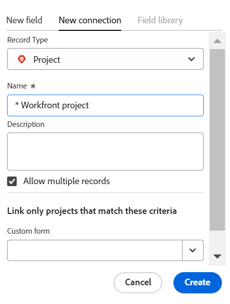

<!-----
title: Connect record types
description: A way to indicate how individual record types relate to one another is to connect them. Also, you can connect Maestro record types with object types from other applications to enhance your users' experience and keep their focus in one application.
hidefromtoc: yes
hide: yes
feature: Work management
role: User
author: Alina
--->

<!--update the metadata with real information when making this avilable in TOC and in the left nav-->
<!--************ THIS MIGHT NO LONGER BE A 'RELATIONSHIP' TYPE FIELD, BECAUSE THEY WILL SHOW IT IN THE CONNECTION TAB*****************************-->

# Connetti tipi di record

>[!IMPORTANT]
>
>Le informazioni contenute in questo articolo si riferiscono a Adobe Maestro, una nuova offerta di Adobe Workfront.
>
>Attualmente, Adobe Maestro fa parte di un programma beta aperto a un numero limitato di clienti. Per utilizzare le funzionalità Maestro, devi essere un cliente Workfront.
>
>Contatta il rappresentante del tuo account per ulteriori informazioni su come partecipare al programma beta per Maestro.
>
>Per informazioni, consulta [Panoramica di Adobe Maestro](../maestro-overview.md).

È possibile utilizzare Adobe Maestro per progettare aree di lavoro completamente personalizzabili che contengano i tipi di record necessari nella propria organizzazione. Un modo per indicare la correlazione tra i singoli tipi di record consiste nel collegarli. Inoltre, è possibile collegare i tipi di record Maestro a tipi di oggetto di altre applicazioni per migliorare l&#39;esperienza degli utenti e mantenere l&#39;attenzione in un&#39;unica applicazione.

È possibile connettere i seguenti elementi:

* Mettere in relazione tra loro i tipi di record operativi
* Tassonomie dei maestri tra loro
* Mettere insieme tipi di record operativi e tassonomie
* Gestire i tipi di record operativi e le tassonomie con i tipi di oggetto di altre applicazioni.

In questo modo è possibile visualizzare i campi del record collegato o del tipo di oggetto su un altro record Maestro.

Questo articolo descrive come collegare due tipi di record Maestro o un tipo di record Maestro a un oggetto di un&#39;altra applicazione.

Una volta stabilita la connessione tra tipi di record o di oggetti, è possibile collegare tra loro singoli record.

Per informazioni sulla connessione di un record Maestro a un oggetto di un&#39;altra applicazione, vedere [Collega record](../records/connect-records.md).

Per un esempio di connessione dei tipi di record, vedere [Esempio di connessione di tipi di record e record](../architecture/example-connect-record-types-and-records.md).

<!--ensure this last linked article is right; the title and the link should have changed-->

## Requisiti di accesso

Per eseguire i passaggi descritti in questo articolo, è necessario disporre dei seguenti diritti di accesso:

<table style="table-layout:auto">
 <col>
 </col>
 <col>
 </col>
 <tbody>
    <tr>
<tr>
<td>
   
 Prodotto
 </td>
   <td>
   
 Adobe Workfront
 
Per collegare i tipi di record Maestro a Experience Manager Assets, devi disporre di una licenza Adobe Experience Manager Assets e l’istanza di Workfront della tua organizzazione deve essere integrata in Adobe Business Platform o Adobe Admin Console.
 </td>
  </tr>  
 <td role="rowheader">
Contratto Adobe Workfront
</td>
   <td>

La tua organizzazione deve essere iscritta al programma beta chiuso Adobe Maestro. Per informazioni su questa nuova offerta, contatta il rappresentante del tuo account. 

   </td>
  </tr>
  <tr>
   <td role="rowheader">
piano Adobe Workfront
</td>
   <td>

Qualsiasi

   </td>
  </tr>
  <tr>
   <td role="rowheader">
Licenza Adobe Workfront
</td>
   <td>
   
Qualsiasi
 
  </td>
  </tr>

<tr>
   <td role="rowheader">
Configurazioni del livello di accesso
</td>
   <td> 
Non ci sono controlli del livello di accesso per Maestro
  
</td>
  </tr>
<tr>
   <td role="rowheader">
Modello di layout
</td>
   <td> 
L’amministratore del Workfront o del gruppo deve aggiungere l’area Maestro nel modello di layout. Per informazioni, consulta <a href="../access/access-overview.md">Panoramica degli accessi</a>. 
  
</td>
  </tr>
<tr>
   <td role="rowheader">
Autorizzazioni
</td>
   <td> 
Gestire le autorizzazioni per un’area di lavoro</a> 
  
   
Gli amministratori di sistema dispongono delle autorizzazioni per tutte le aree di lavoro, incluse quelle non create
</td>
  </tr>
 </tbody>
</table>

<!--Maybe enable this at GA - but Maestro is not supposed to have Access controls in the Workfront Access Level: 
>[!NOTE]
>
>If you don't have access, ask your Workfront administrator if they set additional restrictions in your access level. For information on how a Workfront administrator can change your access level, see [Create or modify custom access levels](../administration-and-setup/add-users/configure-and-grant-access/create-modify-access-levels.md). -->

<!-- Notes to add for the table: for the "Workfront plans" row: the above is only for closed beta; when going to GA - activate the following plans:    

Current plan: Prime and Ultimate

Legacy plan: Enterprise
-->

<!-- Notes for the table: for the "Workfront access" row: 
For more information, see <a href="../../administration-and-setup/add-users/access-levels-and-object-permissions/wf-licenses.md" class="MCXref xref">Adobe Workfront licenses overview</a>.
-->

## Considerazioni sulla connessione dei tipi di record

Considera quanto segue:

* In Maestro è possibile collegare le seguenti entità:

   * Due tipi di record operativi
   * Due tassonomie
   * Tipo di record operativo e tassonomia
   * Tipo di record operativo o tassonomia e tipo di oggetto di un&#39;altra applicazione.

* Con i tipi di record Maestro è possibile collegare i seguenti oggetti dalle seguenti applicazioni:

   * Adobe Workfront:

      * Progetti
      * Portfolio
      * Programmi
      * Aziende
      * Gruppi

   * Adobe Experience Manager Assets:

      * Immagini
      * Cartelle

     >[!IMPORTANT]
     >
     >Devi disporre di una licenza Adobe Experience Manager Assets e l’istanza di Workfront della tua organizzazione deve essere integrata in Adobe Business Platform o Adobe Admin Console per collegare i record Maestro ad Adobe Experience Manager Assets.
     >
     >In caso di domande sull’onboarding per Adobe Admin Console, consulta [Domande frequenti sull’esperienza unificata di Adobe](/help/quicksilver/workfront-basics/navigate-workfront/workfront-navigation/unified-experience-faq.md).

* Dopo aver collegato un tipo di record a un altro tipo di record o a un tipo di oggetto di un&#39;altra applicazione, si verificano i seguenti scenari:

   * **Quando si collegano due tipi di record**: per il tipo di record da cui si sta effettuando la connessione viene creato un campo record Collegato. Un campo record Collegato simile viene creato nel tipo di record a cui ci si connette.

     Ad esempio, se si collega il tipo di record &quot;Campagna&quot; al tipo di record &quot;Prodotto&quot;, nel tipo di record Campagna viene creato un campo di record collegato denominato &quot;Prodotto collegato&quot; e nel tipo di record Prodotto viene creato automaticamente un tipo di record collegato denominato &quot;Campagna&quot;.

   * **Quando si collega un tipo di record a un tipo di oggetto di un&#39;altra applicazione**: viene creato un campo record collegato sul tipo di record da cui stai effettuando la connessione. Nessun campo record collegato viene creato automaticamente sull&#39;oggetto applicazione di terze parti.

     Viene creato un nuovo tipo di record Maestro per l&#39;oggetto applicazione di terze parti solo quando gli oggetti effettivi sono collegati ai record Maestro.

     Per ulteriori informazioni, consulta [Collega record](../records/connect-records.md).

   * **Quando si aggiungono campi di ricerca dal record o dall&#39;oggetto a cui ci si connette**: i campi collegati vengono aggiunti al record da cui si sta effettuando la connessione e visualizzano i campi di ricerca selezionati per il trasferimento dal record collegato ai record da cui si sta effettuando il collegamento. I campi record sono sempre di sola lettura e vengono compilati automaticamente con i valori dell&#39;oggetto di terze parti.

     Ad esempio, se si collega il tipo di record &quot;Campaign&quot; Maestro a un progetto Workfront e si seleziona di inserire il campo Data di completamento pianificata del progetto nel record Maestro, viene automaticamente creato un campo collegato denominato Data di completamento pianificata (da Progetto) per il record da cui si sta effettuando il collegamento.

* I campi record collegati sono preceduti da un&#39;icona di relazione .

  I campi collegati sono preceduti da un’icona che identifica il tipo di campo. Ad esempio, icone che indicano che un campo è un numero, un paragrafo o una data.

* Dopo aver creato singoli record per un tipo di record, è possibile selezionare i record a cui ci si connette dal campo del tipo di record collegato. Per informazioni, consulta [Collega record](../records/connect-records.md).

## Connetti tipi di record

<!--when changes here, also update the article for "Connect records"-->

{{step1-to-maestro}}

Per impostazione predefinita, viene aperta l’ultima area di lavoro a cui si è effettuato l’accesso.

1. (Facoltativo) Espandere la freccia rivolta verso il basso a destra del nome di un&#39;area di lavoro esistente e selezionare l&#39;area di lavoro da cui si desidera connettere i tipi di record.
1. Fare clic sulla scheda di un tipo di record per aprire la pagina del tipo di record.
1. Fai clic su **+** nell&#39;angolo superiore destro della vista tabella, quindi fare clic sul pulsante **Nuova connessione** scheda.

   

1. In **Tipo di record** , cercare un tipo di record o selezionare una delle opzioni seguenti: <!--is the field name spelled right? lowercase "t"?-->

   * Un altro tipo di record operativo o una tassonomia dall&#39;area di lavoro selezionata

     >[!TIP]
     >
     >Solo i tipi di record e le tassonomie dell&#39;area di lavoro selezionata sono disponibili per la connessione.
     > 
     >Se nell&#39;area di lavoro selezionata non sono presenti altri tipi di record, il nome dell&#39;area di lavoro non viene visualizzato.

   * A **Progetto, Portfolio, Programma, Società**, o **Gruppo** dal **Tipi di oggetto Workfront** sezione.
   * **Experience Manager Assets** dal **Applicazioni Adobe** sezione.

   

1. Aggiorna le seguenti informazioni:

   * **Nome**: nome del campo connesso che verrà visualizzato nella visualizzazione tabella o nella pagina Dettagli del tipo di record originale. In questo modo viene creata la colonna del record collegato nella vista a tabella del tipo di record originale o del campo del record collegato per i record originali. <!--ensure they updated this; and update the screen shot: it used to be "Label"-->

   >[!TIP]
   >
   >È consigliabile includere il nome del record a cui si desidera creare il collegamento nel nome del campo record connesso per acquisire il tipo di record da cui proviene il nuovo campo. Il nome del record collegato non è visibile nel nuovo campo record collegato o nei relativi campi collegati.

   * **Descrizione**: informazioni aggiuntive sul campo record connesso. La descrizione di un campo viene visualizzata quando si passa il cursore sulla colonna del campo in una tabella.
   * **Consenti più record**: seleziona questa opzione per indicare che gli utenti possono aggiungere più record quando il campo del tipo di record collegato viene visualizzato nei record originali. Questa opzione è selezionata per impostazione predefinita.
   * **Seleziona campi di ricerca**: seleziona questa opzione per aggiungere campi dal tipo di record selezionato. Questa opzione è selezionata per impostazione predefinita.

1. (Condizionale e facoltativo) Se si è selezionato di collegare un oggetto Workfront, selezionare un **Modulo personalizzato** dal **Collega solo i progetti che corrispondono a questi criteri** sezione. <!--this needs to be updated for each object when they fix this UI.--> Solo gli oggetti a cui sono allegati i moduli personalizzati selezionati possono essere collegati al tipo di record Maestro selezionato. È possibile selezionare più moduli.

   

1. (Condizionale) Se hai selezionato di connetterti a Experience Manager Assets, seleziona un archivio da **archivio Experienci Manager** menu a discesa nella **Collegare le risorse dal seguente archivio** sezione. Questo campo è obbligatorio. In questo campo vengono visualizzati solo gli archivi a cui hai accesso in Experience Manager Assets.

   

1. Clic **Crea**.

1. (Condizionale) Se hai selezionato il **Seleziona campo di ricerca** impostazione, **Aggiungi campi di ricerca** viene visualizzata la casella.

   Fai clic su **+** per aggiungere campi dalla **Campi non selezionati** area.

   Oppure

   Fai clic su **-** per rimuovere i campi dal **Campi selezionati** area

   

1. (Facoltativo) Fai clic su **Ignora** e non aggiungere campi dal record o dall&#39;oggetto collegato. Il **Nome** del record collegato è l&#39;unico campo visibile nella visualizzazione tabella del record originale.

1. (Facoltativo e condizionale) Se si seleziona di collegare un campo di tipo numero, valuta, percentuale o data, selezionare anche un valore aggregatore. Quando gli utenti selezionano più record collegati nel campo record collegato, i valori dei campi collegati vengono visualizzati separati da virgole o come valore aggregato in base all&#39;aggregatore scelto.

   

   >[!NOTE]
   >
   > Gli aggregatori non sono disponibili quando si collegano tipi di record a Experience Manager Assets.

   Selezionare una delle opzioni seguenti:

   * **Nessuno**: visualizza i valori provenienti da più record separati da virgole. Questa è la selezione predefinita.
   * **MAX**: visualizza il valore più alto tra tutti i valori provenienti da più record selezionati nel campo record collegato.
   * **MIN**: visualizza il valore più basso tra tutti i valori provenienti da più record selezionati nel campo record collegato.
   * **SOMMA**: visualizza il totale di tutti i valori provenienti da più record selezionati nel campo record collegato.
   * **MEDIA**: visualizza la media di tutti i valori provenienti da più record selezionati nel campo record collegato.

   >[!NOTE]
   >
   >Ad esempio, puoi collegare il record Prodotto (record collegato) dal record Campagna (record originale) e denominarlo &quot;Campo prodotto&quot;. Puoi anche scegliere di collegare il campo Budget del record Prodotto dal record Campagna e chiamarlo &quot;Budget prodotto&quot;. Se hai consentito di selezionare più record nel &quot;Campo prodotto&quot;, puoi selezionare il Prodotto 1 con un Budget di $ 120.000 e il Prodotto 2 con un Budget di $ 100.000. È possibile visualizzare le seguenti informazioni di Budget nel campo collegato dal record originale, a seconda dell&#39;aggregatore scelto:
   >
   >* **Nessuno**: $ 120.000, $ 100.000
   >* **MAX**: $ 120.000
   >* **MIN**: $ 100.000
   >* **SOMMA**: $ 220.000
   >* **MEDIA**: $ 110.000
   >

1. (Facoltativo) Utilizza il **ricerca** icona  per cercare un campo.

1. Clic **Aggiungi campi** per salvare le modifiche.

   Sono aggiunti i seguenti elementi:

   * Campo record collegato che visualizza i record del tipo di record collegato, dopo averli aggiunti manualmente. Il nome del campo record collegato è il nome selezionato al passaggio 5. <!--accurate-->

   * Il campo o i campi collegati che visualizzano le informazioni dei campi del tipo di record collegato dopo l&#39;aggiunta manuale dei record nel campo del record collegato. I campi collegati vengono creati solo quando **Seleziona campi di ricerca** durante la creazione della connessione. I campi collegati sono denominati in base a questo pattern:

     `<Name of the original field on the linked record> (from <Name of your linked field>)`

   * Quando si collegano tra loro tipi di record Maestro, viene aggiunto anche un campo record collegato al tipo di record al quale si sta effettuando il collegamento. Il nome del campo record collegato nel tipo di record collegato è il nome del tipo di record da cui si esegue il collegamento.

     Ad esempio, se colleghi il tipo di record &quot;Prodotto&quot; dal tipo di record &quot;Campagna&quot; e denomini il campo connesso della campagna &quot;Prodotto collegato&quot;, viene creato un campo di record collegato &quot;Campagna&quot; per il tipo di record Prodotto.

1. (Facoltativo) Nella visualizzazione per tabella del tipo di record originale o del tipo di record collegato fare clic sulla freccia rivolta verso il basso nell&#39;intestazione dei campi del record collegato, quindi scegliere una delle opzioni seguenti:

   * **Modifica campo**: puoi aggiornare solo il **Nome** e **Descrizione** informazioni sul campo.
   * **Modifica campi di ricerca**: aggiungi o rimuovi i campi del record collegato.

   

   Per aggiungere o rimuovere campi di ricerca, seguire le istruzioni nei passaggi 9-13 precedenti. <!--ensure these step numbers stay accurate-->

   >[!NOTE]
   >
   > Non è possibile aggiungere i campi di ricerca del record da cui si effettua il collegamento al tipo di record collegato che indica un oggetto in un&#39;applicazione di terze parti.
   >
   > Ad esempio, non è possibile aggiungere il campo di ricerca di un oggetto Maestro &quot;Campaign&quot; dal campo record collegato &quot;Campaign&quot; visualizzato nel tipo di record Progetto Maestro quando si collega a progetti Workfront.

1. (Facoltativo) Fare clic sulla freccia rivolta verso il basso nell&#39;intestazione del campo record collegato dal tipo di record da cui si sta eseguendo il collegamento, quindi fare clic su **Elimina**.

   Il campo record ed eventuali campi di ricerca collegati aggiuntivi vengono eliminati e non è possibile recuperare i campi e le relative informazioni.

   >[!TIP]
   >
   >    Il campo del record collegato nel tipo di record a cui si sta effettuando il collegamento non viene eliminato. <!-- is this still accurate?! -->
