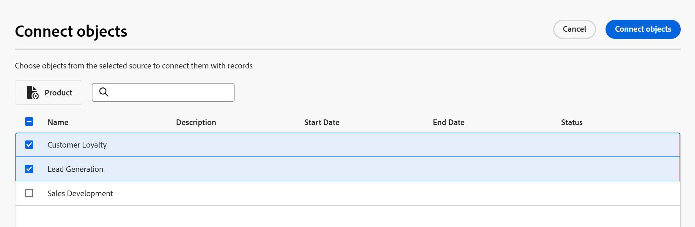

# Esempio di connessione di tipi di record e record

{{maestro-important-intro}}

Questo articolo descrive un esempio di quanto segue:

* Come creare una connessione tra due tipi di record Maestro e due record Maestro.

* Come creare una connessione tra un tipo di record Maestro Adobe e un tipo di oggetto progetto Workfront, nonché una connessione tra un record Maestro e un progetto.

Per ulteriori informazioni, consulta anche i seguenti articoli:

* [Connetti tipi di record](../architecture/connect-record-types.md)
* [Collega record](../records/connect-records.md)

## Collega due tipi di record e record Maestro (esempio)

Ad esempio, il tipo di record originale è Campaign.

È inoltre disponibile un altro tipo di record denominato Prodotto, che dispone di un campo valuta denominato Budget.

Si desidera creare un campo nel tipo di record Campaign in cui è possibile visualizzare i valori del campo Budget nel tipo di record Prodotto.

Per eseguire questa operazione:

1. Apri la vista a tabella per il tipo di record Campaign in un’area di lavoro.
1. Fai clic su **+** nell’angolo superiore destro della vista tabella per aggiungere un nuovo campo, quindi fai clic su **Nuova connessione**, quindi fai clic su **Prodotto** nella sezione workspace selezionata.
1. Aggiungi le seguenti informazioni, ad esempio:

   * **Tipo di record**: prodotto <!--did they change the casing here?-->
   * **Nome**: informazioni sul prodotto. Questo è il nome del campo record collegato.
   * **Descrizione**: questi sono i prodotti a cui voglio associare le mie campagne.
   * **Consenti più record**: se lasci selezionata questa opzione, gli utenti potranno selezionare più record quando il campo del tipo di record collegato (informazioni sul prodotto) viene visualizzato nei record originali (campagne). Nel nostro caso, saranno in grado di selezionare più Prodotti da collegare a una sola Campagna.
   * **Seleziona campi di ricerca**: se lasci selezionata questa opzione, il **Aggiungi campi di ricerca** Viene visualizzata la casella accanto, per consentire di collegare i campi Prodotto con il tipo di record Campaign. Puoi fare clic su **Ignora** per saltare questo passaggio e aggiungere i campi Prodotto in un secondo momento.

   

1. (Condizionale) Se hai selezionato il **Opzione Seleziona campi di ricerca** nel passaggio precedente, dall’elenco di campi associati al **Prodotto** tipo di record, fare clic sul pulsante **+** icona per **Budget** , quindi fai clic su **Aggiungi campi**. Questo crea un campo denominato **Budget (da informazioni prodotto)**, che è il nome del campo collegato. In questo campo verranno visualizzate tutte le informazioni relative al budget prodotti per i record della campagna.

   

   >[!TIP]
   >
   >    Se si desidera visualizzare il budget di tutti i prodotti selezionati come un unico numero totale, selezionare **SOMMA** nel menu a discesa a destra del nome del campo. Quando gli utenti selezionano più prodotti nella **Informazioni sul prodotto** campo record collegato, il **Budget (da informazioni prodotto)** aggiunge tutti i valori Budget e visualizza il totale. <!-- check the shot below - added a bug with a couple of UI changes here-->
   >
   > Se si seleziona **Nessuno**, invece di **SOMMA**, i singoli budget verranno visualizzati separati da virgole.

   Vengono generati i campi seguenti:

   * Nella vista Tabella record Campaign e nella pagina Dettagli di una campagna:

      * **Informazioni sul prodotto** (campo record collegato): questo comando visualizza il nome o i nomi dei prodotti.
      * **Budget (da informazioni prodotto)** (campo collegato): vengono visualizzati i budget dei prodotti selezionati nel campo Informazioni prodotto.

   * Nella visualizzazione della tabella Record prodotto e nella pagina Dettagli di un prodotto:

      * **Campagna**: indica che il tipo di record Prodotto è collegato dal tipo di record Campagna.

     

   >[!TIP]
   >
   >    I campi record collegati sono preceduti dall&#39;icona di relazione .

1. Dalla sezione **Campagna** nella vista tabella del tipo di record, crea una campagna aggiungendo una nuova riga nella tabella della pagina del tipo di record Campaign.
1. Fai clic su **+** all&#39;interno del  **Informazioni sul prodotto** della nuova campagna. Il **Connetti oggetti** viene visualizzata la casella. Il nome del tipo di record a cui si desidera collegare (Product) viene visualizzato nell&#39;angolo superiore sinistro della casella.

   

1. Seleziona i record Prodotto che desideri collegare ai record Campaign, quindi fai clic su **Connetti oggetti**.

   Nella tabella dei tipi di record di Campaign sono inserite le colonne seguenti:
   * Il **Informazioni sul prodotto** viene compilato il campo relativo al record Campagna con i Prodotti selezionati.
   * **Budget (da informazioni prodotto)** viene compilato con il valore Budget per ciascun prodotto selezionato o con un totale di tutti i budget dei prodotti selezionati (se è stato selezionato SOMMA per l&#39;aggregatore).

   

   >[!TIP]
   >
   >Se non si seleziona un aggregatore per i valori multipli, tutti i valori vengono visualizzati separati da virgole.

1. Per popolare il **Campagna** campo da **Prodotto** vista tabella, ripetere i passaggi 5-7 a partire dalla vista tabella Tipo di record prodotto e selezionando le informazioni sulla campagna. Verrà aggiornato anche il campo Informazioni prodotto nella tabella della pagina Tipo di record campagna. <!--ensure the step numbers remain correct-->

## Collegare un tipo di record Maestro a un tipo di oggetto progetto Workfront e collegare un record a singoli progetti

Ad esempio, il tipo di record originale è Campaign.

In Workfront sono presenti anche progetti con un campo denominato &quot;Reddito pianificato&quot;.

Desideri creare un campo di connessione sul tipo di record Campaign in cui visualizzare i valori del campo Planned Revenue (Entrate pianificate) dei progetti in Workfront connessi alle campagne in Maestro.

Per eseguire questa operazione:

1. Vai a un’area di lavoro in cui desideri collegare il tipo di record Campaign ai progetti Workfront.
1. Apri la vista a tabella per il tipo di record Campaign nell’area di lavoro selezionata.
1. Fai clic su **+** nell’angolo superiore destro della vista tabella per aggiungere un nuovo campo, quindi fai clic su **Nuova connessione**, quindi fai clic su **Progetto** nel **Tipi di oggetto Workfront** sezione.
1. Aggiungi le seguenti informazioni, ad esempio:

   * **Tipo di record**: progetto Workfront (dalla sottosezione Workfront)
   * **Nome**: informazioni sul progetto. Questo è un esempio di ciò che è possibile denominare il campo oggetto collegato.
   * **Descrizione**: questi sono i progetti a cui voglio associare le mie campagne. Questo è un esempio della descrizione del campo record collegato.
   * 
      * **Consenti più record**: se lasci selezionata questa opzione, gli utenti potranno selezionare più progetti quando il campo del tipo di progetto collegato (informazioni sul progetto) viene visualizzato nei record originali (Campagne).
   * **Seleziona campi di ricerca**: se lasci selezionata questa opzione, il **Aggiungi campi di ricerca** viene visualizzata la casella accanto, che consente di collegare i campi di Project con il tipo di record Campaign. Puoi fare clic su **Ignora** per saltare questo passaggio e aggiungere i campi Progetto in un secondo momento.

   

1. (Condizionale) Se hai selezionato il **Opzione Seleziona campi di ricerca** nel passaggio precedente, dall’elenco di campi associati al **Progetto** tipo di oggetto, fare clic sul pulsante **+** icona per **Reddito Pianificato** , quindi fai clic su **Aggiungi campi**. Questo crea un campo denominato **Retribuzione pianificata (da informazioni progetto)**, che è il nome del campo collegato. Tutte le informazioni contenute nel campo Retribuzione pianificata progetto verranno visualizzate automaticamente in questo campo per i record della campagna.

   >[!TIP]
   >
   >    Se desideri visualizzare la Retribuzione pianificata di tutti i progetti selezionati come un unico numero totale, seleziona **SOMMA** nel menu a discesa a destra del nome del campo. Quando gli utenti selezionano più progetti nel **Informazioni progetto** campo oggetto collegato, il **Reddito Pianificato (da informazioni prodotto)** Il campo aggiunge tutti i valori e visualizza il totale. <!-- check the shot below - added a bug with a couple of UI changes here-->
   >
   > Se si seleziona **Nessuno**, invece di **SOMMA**, i singoli Ricavi pianificati vengono visualizzati separati da virgole.

   

   Vengono generati i campi seguenti:

   * Nella vista Tabella record Campaign e nella pagina Dettagli di una campagna:

      * **Informazioni progetto** (campo oggetto collegato): verranno visualizzati il nome o i nomi dei progetti.
      * **Retribuzione pianificata (da informazioni progetto)** (campo collegato): visualizza le Retribuzioni pianificate dei progetti selezionati nel campo Informazioni progetto.

   >[!TIP]
   >
   >    I campi oggetto collegato sono preceduti dall&#39;icona di relazione .

1. Dalla sezione **Campagna** tipo di record vista tabella, crea una campagna aggiungendo una nuova riga nella tabella.
1. Fai clic su **+** all&#39;interno del  **Informazioni progetto** della nuova campagna. Il **Connetti oggetti** viene visualizzata la casella. Il nome del tipo di oggetto a cui si sta effettuando il collegamento (Workfront Project) viene visualizzato nell&#39;angolo superiore sinistro della casella.

   

1. Seleziona il progetto o i progetti a cui vuoi collegare i record di Campaign, quindi fai clic su **Connetti oggetti**.

   Nell&#39;area di lavoro selezionata vengono aggiunti gli elementi seguenti:

   * Nella tabella del tipo di record di Campaign:
      * Il **Informazioni progetto** Il campo viene compilato per il record Campaign con i progetti selezionati.
      * Il **Reddito Pianificato (da informazioni prodotto)** viene compilato con il valore Budget per ciascun Prodotto selezionato. Questo campo è di sola lettura.

   

   >[!TIP]
   >
   >Se non si seleziona un aggregatore per i valori multipli e si selezionano più oggetti nel campo collegato a oggetti, tutti i valori vengono visualizzati separati da virgole.

1. Fare clic sul nome di un progetto nel campo record connesso.

   Questo apre il progetto Maestro di sola lettura **Dettagli** pagina.
Rivedi le informazioni sul progetto. Nella pagina Dettagli vengono visualizzati solo i campi progetto selezionati.

1. Fai clic su Vai all’origine nell’angolo superiore destro della schermata per aprire il progetto in Workfront, se disponi almeno delle autorizzazioni di visualizzazione per il progetto.
1. (Facoltativo) Se disponi delle autorizzazioni necessarie, aggiorna le informazioni sul progetto in Workfront.

1. Dalla vista della tabella Campaign, passa il puntatore del mouse su **Informazioni progetto** e fare clic sulla freccia rivolta verso il basso, quindi su **Modificare i campi di ricerca.**
1. Fai clic su **+** per qualsiasi campo di progetto che desideri aggiungere al record Workfront Project Maestro in **Campi non selezionati** sezione.
1. Fai clic su **-** per i campi del progetto che si desidera rimuovere dal record Workfront Project Maestro in **Campi selezionati** sezione.
1. Fai clic su **Salva**.

   Campi collegati aggiuntivi vengono aggiunti al tipo di record Campaign.
