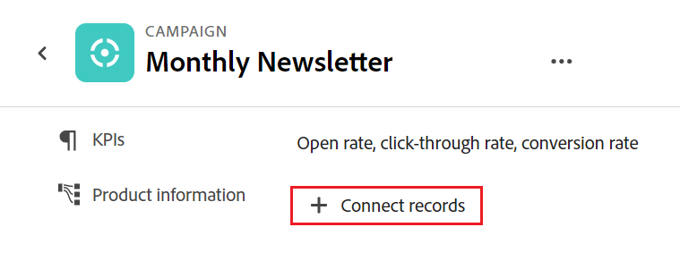

<!--when you make this live, update the metadata above to this: 
---
title: Connect records and objects
description: In addition to connecting Maestro records to one another, you can also connect Maestro records to objects from other applications.  
topic: Architecture
role: User
hidefromtoc: yes
hide: yes
---
-->
<!--update the metadata with real information when making this available in TOC and in the left nav-->

<!--if you change steps here, also update steps in the "Connect records" article-->

# Connetti record

{{planning-important-intro}}

È possibile collegare tra loro record di Adobe Workfront Planning o a oggetti di altre applicazioni.

È innanzitutto necessario collegare due tipi di record tra loro o un tipo di record a un tipo di oggetto di un&#39;altra applicazione. In questo modo vengono creati campi record collegati. È quindi possibile collegare record tra loro o record ad altri oggetti da altre applicazioni utilizzando i campi dei record collegati.

La connessione dei record è simile alla connessione dei record agli oggetti di un&#39;altra applicazione.

Per informazioni sulla connessione di tipi di record tra loro o a tipi di oggetto di altre applicazioni, vedere [Connetti tipi di record](../architecture/connect-record-types.md).

Per un esempio di connessione dei tipi di record, vedere [Esempio di connessione di tipi di record e record](../architecture/example-connect-record-types-and-records.md).

È possibile connettere i seguenti elementi:

* Record di Adobe Workfront Planning
* Adobe Workfront Planning registra gli oggetti di altre applicazioni.

  È possibile collegare record agli oggetti dei tipi elencati di seguito dalle applicazioni seguenti:

   * Adobe Workfront

      * Progetti
      * Portfolio
      * Programmi
      * Azienda
      * Gruppo

   * Adobe Experience Manager Assets

      * File immagine
      * Cartelle

  <!--when you add more objects, fix the Access Requirements below which right now refer only to projects-->

## Requisiti di accesso

Per eseguire i passaggi descritti in questo articolo, è necessario disporre dei seguenti diritti di accesso:

<table style="table-layout:auto">
 <col>
 </col>
 <col>
 </col>
 <tbody>
    <tr>
<tr>
<td>Prodotto
 </td>
   <td>
   
 Adobe Workfront
 
   
Per collegare i record di Adobe Workfront Planning a Experience Manager Assets, è necessario disporre di una licenza Adobe Experience Manager Assets e l’istanza di Workfront della tua organizzazione deve essere integrata in Adobe Unified Experience. Per informazioni, consulta <a href="/help/quicksilver/workfront-basics/navigate-workfront/workfront-navigation/adobe-unified-experience.md">Adobe di esperienza unificata per Workfront</a>.

   </td>
  </tr>  
 <td role="rowheader">
Contratto Adobe Workfront
</td>
   <td>

La tua organizzazione deve essere iscritta al programma beta chiuso di Adobe Workfront Planning. Per informazioni su questa nuova offerta, contatta il rappresentante del tuo account. 

   </td>
  </tr>
  <tr>
   <td role="rowheader">
piano Adobe Workfront
</td>
   <td>

Qualsiasi

   </td>
  </tr>
  <tr>
   <td role="rowheader">
Licenza Adobe Workfront
</td>
   <td>
   
Qualsiasi
 
  </td>
  </tr>

<tr>
   <td role="rowheader">
Configurazione del livello di accesso
</td>
   <td> 
Nessun controllo del livello di accesso per Workfront Planning
  
</td>
  </tr>
<tr>
   <td role="rowheader">
Autorizzazioni
</td>
   <td> 
Gestire le autorizzazioni per un'area di lavoro per connettere i record 
  
   
Consente di visualizzare o autorizzazioni superiori per un'area di lavoro per visualizzare tutte le connessioni a oggetti e campi da altre applicazioni, indipendentemente dall'accesso in altre applicazioni. 

   
Gli amministratori di sistema dispongono delle autorizzazioni per tutte le aree di lavoro, incluse quelle che non hanno creato.

</td>
  </tr>

<tr>
   <td role="rowheader">
Modello di layout
</td>
   <td> 
L'amministratore del Workfront o del gruppo deve aggiungere l'area Planning nel modello di layout. Per informazioni, consulta <a href="../access/access-overview.md">Panoramica degli accessi</a>. 
  
</td>
  </tr>

</tbody>
</table>

<!--Maybe enable this at GA - but Maestro is not supposed to have Access controls in the Workfront Access Level: 
>[!NOTE]
>
>If you don't have access, ask your Workfront administrator if they set additional restrictions in your access level. For information on how a Workfront administrator can change your access level, see [Create or modify custom access levels](../administration-and-setup/add-users/configure-and-grant-access/create-modify-access-levels.md). -->

## Considerazioni sulla connessione dei record

* Dopo aver connesso i tipi di record, i tipi di record collegati vengono visualizzati come campi di record collegati nella tabella dei tipi di record da cui sono collegati e nelle pagine dei record.
* È possibile sfogliare e aggiungere record e oggetti dei tipi di record e oggetti collegati dai campi dei record collegati.
* È possibile aggiungere campi dei tipi di record collegati alla tabella del tipo di record da cui si sta effettuando il collegamento.
* Non è possibile aggiornare manualmente i valori dei campi collegati nei record da cui si sta effettuando il collegamento.

  I valori dei campi collegati dei record collegati popolano il record di Workfront Planning da cui si sta effettuando il collegamento automatico dal record o dall&#39;oggetto originale.

* Tutti coloro che dispongono dell&#39;accesso a Workfront Planning and View o delle autorizzazioni di livello superiore per l&#39;area di lavoro possono visualizzare le connessioni tra record o tra record e oggetti di altre applicazioni. Possono visualizzare i record e gli oggetti connessi indipendentemente dalle autorizzazioni di cui dispongono nelle applicazioni a cui ci si connette.
* Se si dispone delle autorizzazioni di gestione per l&#39;area di lavoro in cui si trovano i record connessi, è possibile visualizzare e modificare le connessioni di tutti gli altri utenti.
* È possibile connettere un record a uno o più oggetti di un&#39;altra applicazione.
* Per collegare record ad altri record o oggetti, è necessario disporre dei seguenti elementi:

   * Almeno un&#39;area di lavoro, tipo di record e record.

     Per ulteriori informazioni, consulta i seguenti articoli:

      * [Creare aree di lavoro](../architecture/create-workspaces.md)
      * [Crea tipi di record](../architecture/create-record-types.md)
      * [Crea record](../records/create-records.md)

   * Connessioni tra tipi di record o tra tipi di record e oggetti di altre applicazioni. Per informazioni, consulta [Connetti tipi di record](../architecture/connect-record-types.md)
* È possibile connettere oggetti da Workfront a record di Workfront Planning nelle seguenti aree:
   * Da un record Planning in Workfront Planning.
   * Dalla sezione Planning di un oggetto Workfront.

## Connetti record da Workfront Planning

### Collegare i record di Adobe Workfront Planning

{{step1-to-maestro}}

Per impostazione predefinita, viene aperta l’ultima area di lavoro a cui si è effettuato l’accesso.

1. (Facoltativo) Espandere la freccia rivolta verso il basso a destra del nome di un workspace esistente e selezionare il workspace da cui si desidera connettere i record.
1. Fare clic sulla scheda di un tipo di record per aprire la pagina del tipo di record.
1. Seleziona un **Tabella** vista da **Visualizza** nell&#39;angolo superiore destro della pagina del tipo di record.
1. (Facoltativo) Aggiungere record al tipo di record selezionato aggiungendo una nuova riga alla tabella. Per informazioni, consulta [Crea record](../../maestro/records/create-records.md).
1. (Condizionale) Dopo aver collegato il tipo di record selezionato con un altro tipo di record, passare alla colonna del record collegato e fare doppio clic sulla cella corrispondente al record che si desidera collegare con altri record.

   

1. Esegui una delle operazioni seguenti:

   * Fare clic sul nome di un record connesso nell&#39;elenco per aggiungerlo al record selezionato. Il record viene aggiunto automaticamente.
   * Iniziare a digitare il nome di un record e fare clic su di esso quando viene visualizzato nell&#39;elenco. Il record viene aggiunto automaticamente.
   * Clic **Vedi tutto** per visualizzare tutti i record.

1. (Condizionale) Se hai fatto clic **Seleziona tutto** nel passaggio precedente, il **Connetti oggetti** viene visualizzata la casella.

   

1. Iniziare a digitare il nome di un record nella casella di ricerca, quindi selezionarlo quando viene visualizzato nell&#39;elenco

   Oppure

   Selezionare il nome di uno o più record nella casella, quindi fare clic su **Connetti oggetti** nell&#39;angolo superiore destro della casella Connetti oggetti.

   >[!TIP]
   >
   >    È possibile aprire la pagina di un record, trovare il campo record collegato e fare clic su **Collega record** nel campo per aggiungere record dal record o dal tipo di oggetto connesso.
   >
   >

   Sono aggiunti i seguenti elementi:

   * I record collegati vengono visualizzati nel campo record collegato del record selezionato al passaggio 6. <!--accurate?-->
   * I campi collegati vengono compilati con le informazioni dei record collegati, se sono stati aggiunti campi di ricerca collegati al momento della connessione dei tipi di record.

   L&#39;aggiornamento dei record collegati aggiorna automaticamente i campi collegati per i record da cui si sta effettuando il collegamento. Non è possibile modificare manualmente i campi collegati.

   >[!TIP]
   >
   >* Utilizziamo &quot;campi collegati&quot; e &quot;campi di ricerca&quot; in modo intercambiabile.
   >
   >* Se hai attivato **Consenti più record** impostazione quando si collegano i tipi di record, i valori dei campi per i più oggetti selezionati vengono visualizzati separati da virgole o aggregati in base all&#39;aggregatore scelto.

1. (Facoltativo) Chiudere la pagina del tipo di record e passare all&#39;area di lavoro selezionata.
1. Fare clic sulla scheda del tipo di record a cui si è collegati.

   Ad esempio, se hai connesso **Campagna** con il record Prodotto, fare clic sul pulsante **Prodotto** Card.

   La scheda del tipo di record deve aprirsi nella vista Tabella. In caso contrario, selezionare una vista tabella.

   Tieni presente che **Campagna** nel campo record collegato vengono visualizzati i nomi delle campagne collegate ai prodotti nella pagina Tipo di record prodotto. L’aggiornamento delle informazioni della campagna aggiorna automaticamente il campo del record collegato della campagna per il tipo di record Prodotto.

### Collegare i record di Adobe Workfront Planning agli oggetti Workfront

<!--when we will have more applications to link to from Maestro, change the title to something like: Connect Maestro records to objects from other applications-->

Dopo aver creato una connessione tra un tipo di record e un tipo di oggetto Workfront, è possibile collegare singoli record agli oggetti in Workfront. I campi Workfront connessi vengono automaticamente compilati nei record da cui si collegano gli oggetti.

>[!NOTE]
>
>Non è possibile connettere tipi di oggetto Workfront con tipi di record di Workfront Planning da Workfront.

{{step1-to-maestro}}

Per impostazione predefinita, viene aperta l’ultima area di lavoro a cui si è effettuato l’accesso.

1. (Facoltativo) Espandere la freccia rivolta verso il basso a destra del nome di un workspace esistente e selezionare il workspace da cui si desidera connettere i record.
1. Fare clic sulla scheda di un tipo di record per aprire la pagina del tipo di record.
1. Seleziona un **Tabella** vista da **Visualizza** menu a discesa.

1. Clic **Nuovo record**  per aggiungere singoli record al tipo di record selezionato. Per informazioni, consulta [Crea record](../../maestro/records/create-records.md).
1. (Condizionale) Dopo aver collegato il tipo di record selezionato a un tipo di oggetto Workfront, passare alla colonna oggetto collegato e fare doppio clic sulla cella corrispondente al record che si desidera collegare agli oggetti da Workfront.

   

1. Esegui una delle operazioni seguenti:

   * Fare clic su un oggetto dall&#39;elenco per aggiungerlo al record selezionato. Gli oggetti sono elencati in ordine alfabetico. L&#39;oggetto viene aggiunto automaticamente.
   * Iniziare a digitare il nome di un oggetto e fare clic su di esso quando viene visualizzato nell&#39;elenco. L&#39;oggetto viene aggiunto automaticamente.
   * Clic **Vedi tutto** per visualizzare tutti gli oggetti che si dispone almeno delle autorizzazioni di visualizzazione.

1. (Condizionale) Se hai fatto clic **Vedi tutto** nel passaggio precedente, il **Connetti oggetti** viene visualizzata la casella.

   

1. Inizia a digitare il nome di un oggetto Workfront nella casella di ricerca, quindi selezionalo quando viene visualizzato nell’elenco

   Oppure

   Seleziona il nome di uno o più oggetti nella casella, quindi fai clic su **Connetti oggetti** nell&#39;angolo superiore destro della casella Connetti oggetti.

   >[!IMPORTANT]
   >
   >* È possibile aggiungere solo oggetti Workfront a cui si ha accesso per la visualizzazione.
   >
   >* Dopo aver aggiunto gli oggetti Workfront, tutti gli utenti con autorizzazioni di visualizzazione o superiori all&#39;area di lavoro possono visualizzare gli oggetti Workfront e le relative informazioni di campo, indipendentemente dalle autorizzazioni o dall&#39;accesso in Workfront.

   Sono aggiunti i seguenti elementi:

   * Gli oggetti Workfront selezionati vengono aggiunti al campo record collegato.
   * Se sono stati aggiunti quando il tipo di record è stato connesso a Workfront, i campi collegati (o i campi di ricerca) degli oggetti Workfront vengono automaticamente compilati con le informazioni di Workfront.

   >[!TIP]
   >
   >È possibile aprire la pagina di un record, trovare il campo record collegato e fare clic sul pulsante **+** nel campo per aggiungere oggetti dal tipo di oggetto connesso.

   Per ulteriori informazioni sulla connessione di tipi di record con oggetti di un&#39;altra applicazione, vedere [Connetti tipi di record](../architecture/connect-record-types.md).

1. (Facoltativo) Fare clic sul nome di un oggetto Workfront connesso a un record di Workfront Planning nel campo collegato di una vista tabella o nel campo collegato della pagina del record.

   Verrà visualizzata la pagina di sola lettura del record di Workfront Planning per l&#39;oggetto Workfront collegato. I campi selezionati come campi di ricerca quando si è collegato il tipo di record con l&#39;oggetto Workfront vengono visualizzati nella pagina dei record di Workfront Planning.

   >[!TIP]
   >
   >* Quando si abilita l&#39;impostazione Consenti più record, i valori dei campi di ricerca vengono visualizzati separati da virgole o aggregati in base all&#39;aggregatore scelto.
   >
   >* Non viene creato un campo record collegato per gli oggetti Workfront collegati in Workfront.

1. (Facoltativo) Per aprire l&#39;oggetto Workfront collegato in Workfront, fare clic su **Vai all&#39;origine** nell&#39;angolo superiore destro della pagina record dell&#39;oggetto Workfront.

   

   Se si dispone almeno delle autorizzazioni di visualizzazione per visualizzare l&#39;oggetto, verrà aperta la pagina degli oggetti di Workfront. Se si dispone delle autorizzazioni necessarie, è possibile modificare le informazioni sull&#39;oggetto Workfront.

1. (Facoltativo) Nella vista a tabella del tipo di record, posiziona il puntatore del mouse sull&#39;intestazione di colonna dell&#39;oggetto Workfront collegato e fai clic sul menu a discesa, quindi fai clic su **Modifica campi di ricerca**.

1. Aggiungere campi oggetto Workfront dalla **Campi non selezionati** area

   Oppure

   Rimuovi i campi oggetto di Workfront dal **Campi selezionati** area.

   Questa operazione consente di aggiungere o rimuovere campi collegati dai record di Workfront Planning. Le informazioni associate ai campi rimossi rimangono in Workfront.

### Collegare i record di Workfront Planning agli oggetti di Adobe Experience Manager

<!--when we will have more applications to link to from Maestro, change the title to something like: Connect Maestro records to objects from other applications-->

>[!IMPORTANT]
>
>È necessario disporre di una licenza Adobe Experience Manager Assets e l’istanza di Workfront della tua organizzazione deve essere integrata in Adobe Business Platform o Adobe Admin Console per poter collegare i record di Workfront Planning ad Adobe Experience Manager Assets.
>
>In caso di domande sull’onboarding per Adobe Admin Console, consulta [Domande frequenti sull’esperienza unificata di Adobe](/help/quicksilver/workfront-basics/navigate-workfront/workfront-navigation/unified-experience-faq.md).

Dopo aver creato una connessione tra un tipo di record e Adobe Experience Manager Assets, puoi collegare singoli record alle risorse di Experience Manager. I campi della risorsa connessi da Experience Manager Assets al momento della creazione della connessione vengono compilati automaticamente sul tipo di record da cui è stato effettuato il collegamento.

{{step1-to-maestro}}

Per impostazione predefinita, viene aperta l’ultima area di lavoro a cui si è effettuato l’accesso.

1. (Facoltativo) Espandere la freccia rivolta verso il basso a destra del nome di un workspace esistente e selezionare il workspace da cui si desidera connettere i record.
1. Fare clic sulla scheda di un tipo di record per aprire la pagina del tipo di record.
1. Seleziona un **Tabella** vista da **Visualizza** nell&#39;angolo superiore destro della pagina del tipo di record.

1. (Facoltativo) Fai clic su **Nuovo record** per aggiungere nuovi record al tipo di record selezionato. Per informazioni, consulta [Crea record](../../maestro/records/create-records.md).
1. (Condizionale) Dopo aver collegato il tipo di record selezionato a Experience Manager Assets, passa alla colonna dell’oggetto collegato e passa il puntatore del mouse sulla cella corrispondente al record da collegare ad altri oggetti da Experience Manager, quindi fai clic sul pulsante **+** icona.

   >[!TIP]
   >
   >  Puoi aggiungere e fare clic su **+** nel campo oggetto collegato della pagina del record per collegare le risorse al record.

   Il **Seleziona risorse** viene visualizzata la casella. <!--we might change this to Connect assets-->

   

1. Fai clic su per selezionare alcuni dei seguenti tipi di risorse:

   * Immagini
   * Cartelle

   Puoi selezionare più risorse.

   >[!IMPORTANT]
   >
   > Puoi collegare solo le risorse a cui hai accesso per visualizzare in Experience Manager. Una volta connessi, tutti gli utenti di Workfront Planning possono visualizzare le risorse in Workfront Planning, indipendentemente dal loro accesso in Experience Manager Assets.

1. Clic **Seleziona**. <!-- we might change this to Connect-->

   Sono aggiunti i seguenti elementi:

   * Le risorse Experienci Manager selezionate vengono aggiunte al campo record collegato.
   * I campi collegati (o campi di ricerca) si compilano con le informazioni provenienti dall’Experience Manager risorse collegate.

     Eventuali informazioni esistenti provenienti dai campi delle risorse Experience Manager vengono visualizzate automaticamente nei campi collegati o di ricerca.

     >[!TIP]
     >
     >* Se è stata abilitata l&#39;impostazione Consenti più record, i valori dei diversi oggetti vengono visualizzati separati da virgole o aggregati in base all&#39;aggregatore scelto.
     >
     >* Non viene creato un campo record collegato ai record collegati di Workfront Planning per le risorse Experienci Manager collegate nell&#39;applicazione Experience Manager Assets.

1. (Facoltativo) Vai al tipo di record da cui hai collegato Experience Manager Assets e fai clic sul nome di una risorsa nel campo del record collegato. I dettagli di Experience Manager della risorsa vengono visualizzati in una finestra a comparsa. <!--update screen shot with hi-rez picture-->

   

   Per un file di immagine vengono visualizzati i seguenti campi:

   * Miniatura dell&#39;immagine
   * Nome del file di immagine
   * Dimensioni
   * Dimensione
   * Descrizione
   * Percorso del file nell’Experience Manager
   * Tipo di risorsa
   * Data di creazione
   * Data modificata

1. (Facoltativo) Per aprire la pagina di record Experience Manager assets in Experience Manager, vai alla pagina del tipo di record da cui stai effettuando il collegamento, fai clic sul nome di una risorsa nel campo del record collegato per aprire la finestra a comparsa, quindi fai clic su **Apri** icona  per aprire la risorsa.

   Verrà aperta la risorsa Experience Manager in Adobe Experience Manager Assets.

1. (Facoltativo) Nella vista a tabella del tipo di record, passa il cursore del mouse sull’intestazione di colonna della risorsa di Experience Manager collegata e fai clic sul menu a discesa, quindi fai clic su **Modifica campi di ricerca**.

1. Aggiungere campi oggetto Experience Manager Assets dalla **Campi non selezionati** area

   Oppure

   Rimuovi i campi oggetto di Workfront dal **Campi selezionati** area.

   Questa operazione consente di aggiungere o rimuovere campi collegati dai record. Le informazioni associate ai campi rimossi rimangono in Adobe Experience Assets.

## Connetti record da oggetti Workfront

Per connettere i record di Workfront Planning dagli oggetti di Workfront, è necessario disporre delle seguenti informazioni:

* Connessioni tra tipi di record e tipi di oggetti Workfront.
* Almeno una connessione tra un record e un oggetto Workfront.
* L&#39;amministratore del Workfront o del gruppo deve aggiungere la sezione Planning ai tipi di oggetto di Workfront che possono connettersi ai tipi di record di Planning.

Per ulteriori informazioni, consulta [Gestire i record nella sezione Pianificazione degli oggetti di Adobe Workfront](/help/quicksilver/maestro/records/manage-records-in-planning-section.md).
