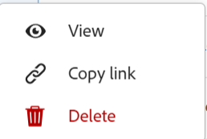

<!--update the metadata with real information when making this available in TOC and in the left nav-->

# Elimina record

{{maestro-important-intro}}

È possibile eliminare record non più rilevanti in Adobe Workfront Planning.

## Requisiti di accesso

Per eseguire i passaggi descritti in questo articolo, è necessario disporre dei seguenti diritti di accesso:

<table style="table-layout:auto">
 <col>
 </col>
 <col>
 </col>
 <tbody>
    <tr>
<tr>
<td>
   
 Prodotto
 </td>
   <td>
   
 Adobe Workfront
 </td>
  </tr>  
 <td role="rowheader">
Contratto Adobe Workfront
</td>
   <td>

La tua organizzazione deve essere iscritta al programma beta di Adobe Workfront Planning. Per informazioni su questa nuova offerta, contatta il rappresentante del tuo account. 

   </td>
  </tr>
  <tr>
   <td role="rowheader">
piano Adobe Workfront
</td>
   <td>

Qualsiasi

   </td>
  </tr>
  <tr>
   <td role="rowheader">
Licenza Adobe Workfront

   </td>
   <td>
   
Qualsiasi
 
  </td>
  </tr>

<tr>
   <td role="rowheader">
Configurazioni del livello di accesso
</td>
   <td> 
Nessun controllo del livello di accesso per Adobe Workfront Planning 
  
</td>
  </tr>

<tr>
   <td role="rowheader">
Autorizzazioni
</td>
   <td> 
Contribuire o concedere autorizzazioni superiori a un’area di lavoro</a> 
  
   
Gli amministratori di sistema dispongono delle autorizzazioni per tutte le aree di lavoro, incluse quelle non create

</td>
  </tr>
<tr>
   <td role="rowheader">
Modello di layout
</td>
   <td> 
L'amministratore del Workfront o del gruppo deve aggiungere l'area Planning nel modello di layout. Per informazioni, consulta <a href="../access/access-overview.md">Panoramica degli accessi</a>. 
  
</td>
  </tr>

</tbody>
</table>

<!--Maybe enable this at GA - but Maestro is not supposed to have Access controls in the Workfront Access Level: 
>[!NOTE]
>
>If you don't have access, ask your Workfront administrator if they set additional restrictions in your access level. For information on how a Workfront administrator can change your access level, see [Create or modify custom access levels](../administration-and-setup/add-users/configure-and-grant-access/create-modify-access-levels.md). -->

## Considerazioni sull&#39;eliminazione di record

* È possibile eliminare i record creati dall&#39;utente corrente o da un altro utente.
* Non è possibile recuperare i record eliminati. <!--the above statements (and in the metadata description) will change with access levels and recycle bin??-->
* Se i record eliminati sono collegati ad altri record, i record collegati non vengono eliminati, ma vengono eliminate anche le informazioni del record eliminato.
* Non è possibile eliminare i record in blocco. <!--this will probably change-->
* Non è possibile eliminare record dalla visualizzazione timeline.

## Elimina record

È possibile eliminare un record dalle seguenti aree:

* [Dalla pagina del record](#delete-a-record-from-the-records-page)
* [Dalla vista tabella di un tipo di record](#delete-a-record-from-the-record-type-table-view)

### Eliminare un record dalla pagina del record

{{step1-to-maestro}}

Viene aperto l&#39;ultimo workspace a cui si è autorizzati ad accedere.

1. Selezionare un tipo di record.

   Viene visualizzata la pagina del tipo di record.
1. Esegui una delle operazioni seguenti:

   * In una visualizzazione Tabella fare clic sul nome di un record.
   * Nella visualizzazione Tabella, posizionare il puntatore del mouse sul nome di un record, quindi fare clic su **Altro** menu , quindi fai clic su **Visualizza**

     
   * In una visualizzazione Sequenza temporale, fare clic su una barra dei record.

   Viene visualizzata la pagina del record.

1. Fai clic su **Altro** menu  a destra del nome del record, quindi fare clic su **Elimina**, quindi **Elimina** di nuovo per confermare.

    <!--ensure the options have not changed or been renamed-->
Il record viene eliminato e non può essere recuperato.

### Eliminare un record dalla vista tabella del tipo di record

{{step1-to-maestro}}

Viene aperto l&#39;ultimo workspace a cui si è effettuato l&#39;accesso.

1. Selezionare un tipo di record.

   Viene visualizzata la pagina del tipo di record.
1. (Condizionale) Da **Visualizza** selezionare una vista Tabella dall&#39;angolo superiore sinistro della tabella. Questa dovrebbe essere la vista predefinita, a meno che il tipo di record non sia stato visualizzato nella vista timeline al momento dell&#39;ultimo accesso.

   I record associati al tipo di record selezionato vengono visualizzati nella vista tabella.
1. Esegui una delle operazioni seguenti:

   * Fare clic con il pulsante destro del mouse su una riga di record, quindi scegliere **Elimina**.
   * Fai clic su **Altro** menu  a destra del nome del record, quindi fare clic su **Elimina**

     

   * Fai clic su **Apri dettagli** icona  per aprire la casella con le informazioni dettagliate del record e fare clic su **Altro**  a destra del nome del record, quindi **Elimina**.

   Il record viene eliminato e non può essere recuperato.

1. (Facoltativo) Utilizzare le seguenti scelte rapide da tastiera per annullare o ripristinare l&#39;eliminazione di un record:

   * CTRL + Z (⌘ + Z per Mac) per annullare una modifica
   * CTRL + MAIUSC + Z (⌘ + MAIUSC + Z per Mac) per ripetere una modifica
