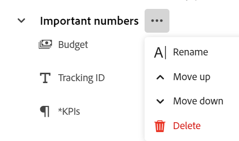

<!--update the metadata with real information when making this avilable in TOC and in the left nav-->

# Gestire la pagina record

{{maestro-important-intro}}

È possibile modificare il layout dell&#39;anteprima record e della pagina in Adobe Workfront Planning.

L&#39;anteprima del record è una visualizzazione ridotta della pagina del record visualizzata nella visualizzazione di un tipo di record.

Quando si modifica il layout di un&#39;anteprima record e di una pagina, le modifiche hanno effetto sulle caselle e sulle pagine di tutti i record dello stesso tipo.

È necessario creare tipi di record e record prima di iniziare a modificare le pagine dei record.

Per informazioni, vedere i seguenti articoli:

* [Crea tipi di record](../architecture/create-record-types.md)

* [Crea record](/help/quicksilver/maestro/records/create-records.md)

## Requisiti di accesso

Per eseguire i passaggi descritti in questo articolo, è necessario disporre dei seguenti diritti di accesso:

<table style="table-layout:auto">
 <col>
 </col>
 <col>
 </col>
 <tbody>
    <tr>
<tr>
<td>
   
 Prodotto
 </td>
   <td>
   
 Adobe Workfront
 </td>
  </tr>  
 <td role="rowheader">
Contratto Adobe Workfront
</td>
   <td>

La tua organizzazione deve essere iscritta al programma beta di Adobe Workfront Planning. Per informazioni su questa nuova offerta, contatta il rappresentante del tuo account. 

   </td>
  </tr>
  <tr>
   <td role="rowheader">
piano Adobe Workfront
</td>
   <td>

Qualsiasi

   </td>
  </tr>
  <tr>
   <td role="rowheader">
Licenza Adobe Workfront*
</td>
   <td>
   
Nuovo: Chiaro o superiore

   Oppure
   
Corrente: Lavoro o versione successiva
 
  </td>
  </tr>

<tr>
   <td role="rowheader">
Configurazioni del livello di accesso
</td>
   <td> 
Nessun controllo di accesso per Adobe Workfront Planning
  
</td>
  </tr>
<tr>
   <td role="rowheader">
Autorizzazioni
</td>
   <td> 
Gestione o autorizzazioni superiori per un’area di lavoro</a> 
  
   
Gli amministratori di sistema dispongono delle autorizzazioni per tutte le aree di lavoro, incluse quelle non create

</td>
  </tr>
<tr>
   <td role="rowheader">
Modello di layout
</td>
   <td> 
L'amministratore del Workfront o del gruppo deve aggiungere l'area Planning nel modello di layout. Per informazioni, consulta <a href="../access/access-overview.md">Panoramica degli accessi</a>. 
  
</td>
  </tr>

</tbody>
</table>

*Per ulteriori informazioni, vedere [Requisiti di accesso nella documentazione di Workfront](/help/quicksilver/administration-and-setup/add-users/access-levels-and-object-permissions/access-level-requirements-in-documentation.md).

## Considerazioni sulla modifica delle pagine record

* La ridisposizione dei campi nell&#39;anteprima record o nella pagina consente di ridisporre i campi per tutti i record di quel tipo e per tutti gli utenti che accedono a tali record.

* Le modifiche apportate all&#39;anteprima del record sono immediatamente visibili nella pagina dei dettagli del record. Le modifiche apportate nella pagina record sono visibili anche nella casella di anteprima del record.

<!--Replace the first bullet with this when we add sections:

* The following changes affect all the records of the same type and are visible to all users accessing those records: 

   * Rearranging fields
   * Adding or removing sections
-->

* L&#39;aggiunta di un&#39;immagine di copertina a un record non fa parte del layout generale dell&#39;anteprima del record o della pagina. È possibile aggiungere immagini di copertina univoche a ogni record. Per informazioni, consulta [Aggiungere una copertina a un record](/help/quicksilver/maestro/records/add-a-cover-image-to-a-record.md).

<!--

## Add sections to a record preview or page

You can add sections to a record preview or page, to organize the information by common criteria and make it easier to find. 

Consider the following when adding sections to a record page:

* There is no limit to how many sections you can have on a page (***************IS THIS TRUE???***********)
* You cannot have an empty section. You must have at least one field in a section. 
* You can drag and drop fields from one section to another. 
* When you remove all the fields from a section, the section is automatically deleted and cannot be recovered. 

To add a section to a record preview or page: 

{{step1-to-maestro}}

The workspace that you access last opens. 

1. (Optional) Click the downward-pointing arrow to the right of the workspace name to select the workspace whose records you want to update. 
1. Click a record type card. 

    The record type page opens. 

1. From a view of any type, click the name of a record 

    Or 
    
    From the table table view, click the **Open details** icon  to the left of a record name. 
    
    The record's preview opens in the view.

     

    >[!TIP]
    >
    >You can view the **Open details** icon to the left of the Name field of a record in a table view only when the Name field is a primary field. 

1. (Optional) Click the **Open in new tab** icon  (****************check the icon; they are changing it**********)  in the upper-right corner of the record preview  to open the record's page in a new tab. 

    The record page opens. 

    

1. In the record preview or page, hover over the white space to the left of the fields, then click the **Add section** icon  to add a section. 
1. Click inside the section's name and replace **Untitled** with a name, then click Enter. (************has this changed to Untitled section???**********)
1. Start dragging and dropping fields to the new section, as described in the section [Rearrange fields in the record preview or page](#rearrange-fields-in-the-record-preview-or-page) in this article. 

1. (Optional) Hover over the name of a section and click the **More** menu . 

   
1. (Optional) Do one of the following to edit the section: 

   * Click **Rename** to rename the section

      >[!TIP]
      >
      > You can rename a section inline, by clicking the name.
   
   * Click **Move up** to move the section up one position 

      Or 
      
      Click **Move down** to move the section down one position.
      All fields in the section move with the section. 

   * Click **Delete** to delete the section. The section is deleted and it cannot be recovered. All users accessing the records of this type will no longer view the deleted section. 

1. Click the downward-pointing arrow to the left of a section name to collapse it, or the right-pointing arrow  to expand it. 
   All sections are expanded by default. 

1. (Optional) Click the **grab** icon  to the left of a section name, then drag and drop it in a desired spot. 

    The new position of the section updates in both the preview and the page of all records of the same type for all users viewing the records. 

    All changes to sections and field order are saved automatically. 

-->

## Ridisposizione dei campi nell&#39;anteprima record o nella pagina

{{step1-to-maestro}}

Viene aperto l&#39;ultimo workspace a cui si è autorizzati ad accedere.

1. (Facoltativo) Fare clic sulla freccia rivolta verso il basso a destra del nome del workspace per selezionare il workspace di cui si desidera aggiornare i record.
1. Fare clic su una scheda del tipo di record.

   Viene visualizzata la pagina del tipo di record.

1. In una visualizzazione di qualsiasi tipo fare clic sul nome di un record

   Oppure

   Nella vista tabella, fare clic sul pulsante **Apri dettagli** icona  a sinistra del nome di un record.

   L&#39;anteprima del record viene visualizzata nella vista.

   

   >[!TIP]
   >
   >È possibile visualizzare **Apri dettagli** a sinistra del campo Nome di un record in una visualizzazione tabella solo quando il campo Nome è un campo primario.

1. (Facoltativo) Fai clic su **Apri in una nuova scheda** icona  <!--check the icon; they are changing it--> nell&#39;angolo superiore destro dell&#39;anteprima del record per aprire la pagina del record in una nuova scheda.

   Viene visualizzata la pagina del record.

   

1. Nell&#39;anteprima del record o nella pagina, fare clic su **afferrare** icona  a sinistra del nome di un campo, quindi trascinarlo e rilasciarlo nella posizione desiderata. <!--You can drag and drop fields to another section. You must have at least one field in a section.-->

   La nuova posizione del campo viene aggiornata sia nell&#39;anteprima che nella pagina di tutti i record dello stesso tipo per tutti gli utenti che visualizzano i record.

   Tutte le modifiche apportate al layout dell&#39;anteprima record o del salvataggio automatico della pagina.

