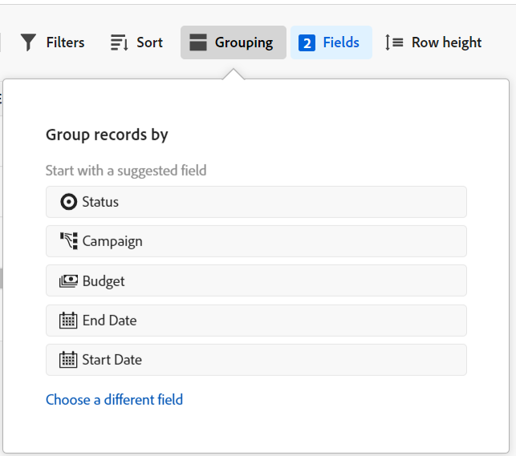
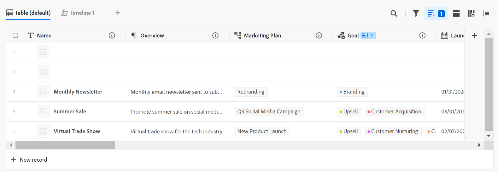

# Gestire la vista tabella

<!--
title: Manage the table view
description: You can display records in a table view when using Adobe Maestro. 
hidefromtoc: yes
author: Alina
feature: Work Management
role: User
hide: yes
-->

<!--update the metadata with real information when making this available in TOC and in the left nav-->

>[!IMPORTANT]
>
>Le informazioni contenute in questo articolo si riferiscono a Adobe Maestro, una nuova offerta di Adobe Workfront.
>
>Attualmente, Adobe Maestro fa parte di un programma beta aperto a un numero limitato di clienti. Per utilizzare le funzionalità Maestro, devi essere un cliente Workfront.
>
>Contatta il rappresentante del tuo account per ulteriori informazioni su come partecipare al programma beta per Maestro.
>
>Per informazioni, consulta [Panoramica di Adobe Maestro](../maestro-overview.md).

È possibile visualizzare i record e i relativi campi in una vista tabella quando si accede alla pagina del tipo di record in Adobe Maestro.

Per informazioni sulle visualizzazioni Maestro e su come gestirle, consulta [Gestire le visualizzazioni record](../views/manage-record-views.md).

## Requisiti di accesso

Per eseguire i passaggi descritti in questo articolo, è necessario disporre dei seguenti diritti di accesso:

<table style="table-layout:auto">
 <col>
 <tbody>
<td>
   
 prodotto Adobe
 </td>
   <td>
   
 Adobe Workfront
 </td>
  </tr>  
 <td role="rowheader">
Contratto Adobe Workfront
</td>
   <td>

La tua organizzazione deve essere iscritta al programma beta chiuso Adobe Maestro. Per informazioni su questa nuova offerta, contatta il rappresentante del tuo account. 

   </td>
  </tr>
  <tr>
   <td role="rowheader">
piano Adobe Workfront
</td>
   <td>

Qualsiasi

   </td>
  </tr>
  <tr>
   <td role="rowheader">
Licenza Adobe Workfront
</td>
   <td>
   
Qualsiasi
 
  </td>
  </tr>

<tr>
   <td role="rowheader">Livello di accesso</td>
   <td> 
Qualsiasi
  
</td>
  </tr>
<tr>
   <td role="rowheader">Modello di layout</td>
   <td> 
L’amministratore di sistema deve aggiungere l’area Maestro nel modello di layout. Per informazioni, consulta <a href="../access/grant-access.md">Concedere l’accesso a Adobe Maestro</a>. 
  
</td>
  </tr>
 </tbody>
</table>

<!--Maybe enable this at GA - but Maestro is not supposed to have Access controls in the Workfront Access Level: 
>[!NOTE]
>
>If you don't have access, ask your Workfront administrator if they set additional restrictions in your access level. For information on how a Workfront administrator can change your access level, see [Create or modify custom access levels](../administration-and-setup/add-users/configure-and-grant-access/create-modify-access-levels.md). -->

<!-- Notes to add for the table: for the "Workfront plans" row: the above is only for closed beta; when going to GA - activate the following plans:    

Current plan: Prime and Ultimate

Legacy plan: Enterprise
-->

<!-- Notes for the table: for the "Workfront access" row: 
For more information, see <a href="../../administration-and-setup/add-users/access-levels-and-object-permissions/wf-licenses.md" class="MCXref xref">Adobe Workfront licenses overview</a>.
-->

## Gestire una vista tabella {#manage-a-table-view}

<!--insert screen shot of table view-->

Durante la creazione di una vista tabella, tutti i record del tipo selezionato vengono visualizzati in una tabella. Ogni riga è un record univoco e ogni colonna è un campo record. Tutti i campi e tutti i record vengono visualizzati per impostazione predefinita.

Per gestire una vista tabella:

1. Creare una vista tabella come descritto nell&#39;articolo [Gestire le visualizzazioni record](../views/manage-record-views.md).

   

1. Aggiornate i seguenti elementi della vista come descritto nelle sottosezioni seguenti:
   * [Colonne (o campi)](#add-columns-or-fields)
   * [Righe (o record)](#add-rows-or-records)
   * [Filtri](#add-filters)
   * [Raggruppamento](#add-groupings)
   * [Ordina](#sort-information)

### Aggiungi colonne (o campi) {#add-columns}

Le intestazioni di colonna di una vista tabella Maestro visualizzano i campi associati ai record nella vista. Gli stessi campi visualizzati nella vista tabella vengono visualizzati anche nella sezione Dettagli di un record Maestro. Per ulteriori informazioni, consulta [Modifica record](../records/edit-records.md).

<!--this is not available yet:You can display record fields (or columns) in both a table and a timeline view. However, the number of columns displayed in the table of the timeline view is limited and you cannot add columns in addition to those selected by default.-->

L&#39;aggiunta di colonne a una visualizzazione è identica all&#39;aggiunta di campi a un tipo di record.

È possibile aggiungere fino a 500 campi (o colonne) in una visualizzazione tabella.

1. Passare a una pagina del tipo di record e selezionare un **Tabella** dal menu a discesa vista.
1. Inizia ad aggiungere campi (o colonne), come descritto nell’articolo [Crea campi](../fields/create-fields.md).

   Le colonne aggiunte sono visibili a tutti gli utenti che accedono al tipo di record e vengono aggiunte come nuovi campi nella pagina Dettagli dei record del tipo di record selezionato.

1. Per riordinare le colonne della tabella, effettuare una delle seguenti operazioni:

   * Prendi l’intestazione della colonna e trascinala nella posizione desiderata. La colonna spostata viene visualizzata brevemente con uno sfondo blu finché non vengono apportate altre modifiche alla tabella.

   * Clic **Campi** nella barra degli strumenti della tabella, trascinare i campi nell&#39;ordine desiderato, quindi fare clic all&#39;esterno del **Visibilità dei campi e ordine** per chiuderlo.

     

   >[!TIP]
   >
   >* Il campo Nome è sempre il primo campo della visualizzazione tabella.
   >
   >* Impossibile spostare il campo Nome in un&#39;altra posizione.
   >
   >* Non è possibile nascondere il campo Nome.
   >
   >* Il campo Nome è bloccato e non fa parte dello scorrimento orizzontale.

   <!--* Replace the field in the first column with another field by changing the primary field. For more information, continue to step 4. (******ensure this is accurate****)-->

   <!--1. (Optional) Hover over a field name in the column header of any field that does not display in the first field of the table, click the downward-pointing arrow to the right of the field name, then click **Set as primary field**. 
    (******add screen shot*****)

    1. Click **Set field** to confirm. 
    The field becomes a primary field which means it displays as the first column of the table view. The previous primary field moves in the second column.
    >[!NOTE]
    >
    >   * Only fields of the following types can be primary fields: 
    >
    >       * Single-line text
    >       * Number
    >       * Formula (********HIDE THIS FOR NOW???********)
    >
    >   * The primary field is always frozen.
    >
    >   * Changing the primary field in your table view affects the view for all other users who choose it.
    
    ************ALSO UPDATE THE TIP BELOW ABOUT THE PRIMARY FIELD******-->

1. Fate clic sulle linee di separazione delle colonne e trascinatele nel punto desiderato per aumentare la larghezza delle colonne.

   >[!TIP]
   >
   >Le modifiche apportate alla larghezza e all&#39;ordine delle colonne sono permanenti e visibili a tutti gli utenti che accedono al tipo di record.

1. Passa il puntatore del mouse sull’intestazione della colonna, fai clic sulla freccia rivolta verso il basso, quindi fai clic su **Nascondi campo**

   Oppure

   Clic **Campi** nella barra degli strumenti della tabella e disattivare l&#39;interruttore associato ai campi (o alle colonne) che si desidera nascondere. Il **Visibilità dei campi e ordine** viene visualizzata la casella.

   >[!TIP]
   >
   >Il numero di campi nascosti viene visualizzato a sinistra dell’icona Campi nella barra degli strumenti.

1. Fai clic su **Campi** e attiva l’interruttore associato ai campi che desideri visualizzare nelle colonne della tabella. Tutti i campi vengono visualizzati per impostazione predefinita.

1. Per trovare rapidamente i record che corrispondono a una parola chiave, eseguire le operazioni seguenti:

   1. Fai clic su **ricerca** icona  e iniziare a digitare una parola chiave associata a qualsiasi campo di un record visualizzato sullo schermo. Il numero di corrispondenze corrette viene visualizzato accanto all’elemento di ricerca e il campo con la corrispondenza corretta viene evidenziato in blu.

      È possibile utilizzare qualsiasi parola o carattere speciale visibile sullo schermo.

      Non è possibile utilizzare parole chiave associate a campi nascosti nella visualizzazione Tabella.

      

   1. (Facoltativo) Se sono presenti più corrispondenze, fare clic sulle frecce su e giù a destra della parola chiave di ricerca per trovare tutte le corrispondenze nella tabella.

   1. Fai clic su **X** nella casella di ricerca per deselezionare la parola chiave di ricerca.

### Aggiungi righe (o record) {#add-rows}

Le righe di una vista tabella Maestro visualizzano singoli record del tipo di record selezionato.

Puoi avere fino a 10.000 record (o righe) per un tipo di record in Maestro.

1. Passare a una pagina del tipo di record e selezionare un **Tabella** dal menu a discesa vista.
1. Inizia ad aggiungere record (o righe), come descritto nell’articolo [Crea record](../records/create-records.md).

   I record aggiunti nella vista tabella vengono salvati immediatamente e sono visibili a tutti gli utenti che accedono a Maestro. <!--this will change with permissions-->

1. (Facoltativo) Seleziona uno o più record in una riga, quindi trascina e rilascia la **maniglia** icona  a sinistra del nome del record per riordinare le righe.

   >[!NOTE]
   >
   >Non è possibile riordinare le righe se si applica almeno un ordinamento alla vista tabella.

   <!-- this is not possible right now:

    1. To reorder the rows, click the row header, drag and drop it in the desired location. 

        The changes you make to the row order are permanent and visible to all users who access the record type
    -->

### Aggiungere filtri {#add-filters}

<!-- this section links from the timeline view; consider splitting them if they become different-->

I filtri consentono di ridurre la quantità di informazioni visualizzate sullo schermo.

Quando si lavora con i filtri nella vista a tabella, considera quanto segue:
<!-- this list is almost identical to the one for the table view - update both-->

* I filtri creati per la vista tabella funzionano in modo indipendente dai filtri nella vista timeline se applicati allo stesso tipo di record.

* I filtri sono univoci per la vista selezionata. A due visualizzazioni tabella dello stesso tipo di record possono essere applicati filtri diversi. Due utenti che osservano la stessa vista tabella visualizzano lo stesso filtro attualmente applicato.

* Non è possibile denominare i filtri generati e applicati a una vista tabella.

* La rimozione dei filtri li rimuove da chiunque acceda allo stesso tipo di record utilizzato e utilizza la stessa visualizzazione utilizzata.

* L’aggiunta di filtri alla vista tabella è identica all’aggiunta di filtri alla vista timeline.

Per aggiungere un filtro a una vista tabella:

1. Creare una visualizzazione tabella per una pagina del tipo di record, come descritto nell&#39;articolo [Gestire le visualizzazioni record](../views/manage-record-views.md).
1. Seleziona una vista a tabella, quindi fai clic su **Filtri** nell’angolo superiore destro della tabella.
1. Clic **Aggiungi condizione** e aggiungi le seguenti informazioni:

   * Seleziona un campo in base al quale filtrare <!-- the tip below might change-->

   * Seleziona un’opzione (o un modificatore di filtro) per definire il tipo di condizione che il campo deve soddisfare

     Nella tabella seguente vengono visualizzati i modificatori disponibili per ogni tipo di campo.

     >[!TIP]
     >
     > Non è possibile selezionare campi collegati. Per informazioni, consulta [Crea campi](../fields/create-fields.md).

     <table>
        <thead>
        <tr>
            <th><b>Tipo di campo</b></th>
            <th><b>Modificatori</b></th>
        </tr>
        </thead>
        <tbody>
        <tr>
            <td>Riga singola, paragrafo </td>
            <td>
Contiene

            
Non contiene

            
È

            
Non è

            
È vuoto

            
Non è vuoto
</td>
        </tr>
        <tr><td>Selezione singola</td>
            <td>
È

            
Non è

            
È uno qualsiasi di

            
È nessuno di

            
È vuoto

            
Non è vuoto
</td>
        </tr>
        <tr>
            <td>Selezione multipla</td>
            <td>
Ha uno qualsiasi di

            
Ha tutti

            
È esattamente

            
Non ha nessuno di

            
È vuoto

            
Non è vuoto
</td>
        </tr>
        <tr>
            <td>Numerico, percentuale, valuta</td>
            <td>
=

            
≠

            
 &lt; 

            
&gt;

            
≤

            
≥

            
È vuoto

            
Non è vuoto
</td>
        </tr>
        <tr>
            <td>Data</td>
            <td>
È

            
Non è

            
È dopo il

            
È prima del

            
È compreso tra

Non è compreso tra

            
È vuoto

Non è vuoto
</td>
        </tr>

     <tr>
            <td>Casella di controllo</td>
            <td>
È

        </tr>
        </tbody>
        </table>

   * Selezionare un valore per il campo selezionato.

   

   Non esiste alcun limite al numero di condizioni di filtro che è possibile aggiungere.

1. (Facoltativo) Fai clic su **Aggiungi condizione** per aggiungere un’altra opzione di filtro e ripetere i passaggi precedenti. Il numero di filtri applicati viene visualizzato a sinistra dell’icona Filtri.
1. Fai clic sugli operatori seguenti per indicare come vengono unite e devono essere applicate le condizioni del filtro:

   * **E**: devono essere soddisfatte tutte le condizioni specificate.
   * **Oppure**: deve essere soddisfatta una qualsiasi delle condizioni specificate. Questa è l&#39;opzione predefinita.

   L’elenco dei record viene filtrato automaticamente.  <!--at this time, you can't name and save the filter - but will this change?!-->
   <!-- asked on the task for the simple filters whether there is a limitation for how many statements a filter can have?!-->

1. (Facoltativo) Fai clic su **Filtri**, quindi fare clic su **x** per rimuovere un filtro. <!--right now you cannot "clear all" for filters, but this might come later-->

### Aggiungi raggruppamenti {#add-groupings}

<!--this section exists in the timeline view too, but the display is slightly different, so I kept both steps; consider updating both sections if any updates to groupings are introduced-->

È possibile raggruppare i record in base a informazioni simili quando si applica un raggruppamento a una visualizzazione.

L’aggiunta di raggruppamenti nella vista tabella è simile all’aggiunta di raggruppamenti nella vista timeline.

Considera quanto segue:

* Potete applicare i raggruppamenti sia nella vista tabella che nella vista timeline. I raggruppamenti della vista tabella sono indipendenti da quelli della vista timeline dello stesso tipo di record.
* Potete applicare 3 livelli di raggruppamento in una vista Maestro. I record vengono raggruppati in base all&#39;ordine dei raggruppamenti selezionati.
&lt;!—* È possibile applicare fino a 4 livelli di raggruppamento quando si utilizza l’API. —controllare questo per il momento—>
* I raggruppamenti sono univoci per la vista selezionata. A due visualizzazioni tabella dello stesso tipo di record possono essere applicati raggruppamenti diversi. Due utenti che visualizzano la stessa vista tabella visualizzano lo stesso raggruppamento attualmente applicato.
* Non è possibile denominare i raggruppamenti creati per una vista tabella.
* Se si rimuovono i raggruppamenti, questi verranno rimossi da tutti coloro che accedono allo stesso tipo di record e che visualizzano la stessa visualizzazione.
* È possibile modificare i record elencati in un raggruppamento.
<!--checking into this: * You can apply up to 4 levels of grouping when using the API. -->
<!-- checking also into this: * You cannot group by a Paragraph-type field.-->

Per aggiungere un raggruppamento:

1. Creare una visualizzazione timeline per un tipo di record, come descritto nell’articolo [Gestire le visualizzazioni record](../views/manage-record-views.md).
1. Clic **Raggruppamento** nell&#39;angolo superiore destro della vista timeline.

   

1. Fai clic su uno dei campi suggeriti oppure fai clic su **Scegli un campo diverso**, cerca un campo diverso, quindi fai clic su di esso quando viene visualizzato nell’elenco.

   >[!TIP]
   >
   >Non è possibile selezionare campi collegati.

   Il raggruppamento viene applicato automaticamente alla tabella e i record vengono visualizzati sotto la linea di separazione di raggruppamento

1. (Facoltativo) Ripeti i passaggi precedenti per aggiungere fino a 3 raggruppamenti.

   Il numero di campi selezionati per il raggruppamento viene visualizzato accanto all’icona Raggruppamento.

   

1. (Facoltativo) All&#39;interno del **Raggruppa record per** , fare clic sul pulsante **x** a destra di un campo selezionato per il raggruppamento per rimuovere il raggruppamento

   Oppure

   Clic **Cancella tutto** per rimuovere tutti i campi.

1. Fai clic all’esterno del **Raggruppa record per** per chiuderlo.
1. (Facoltativo) Fai clic su **+ Nuovo &lt; Nome tipo di record >** al termine di qualsiasi raggruppamento per aggiungere nuovi record, quindi aggiorna la pagina per aggiungere il nuovo record al raggruppamento appropriato. <!--this might need to be changed when they add the Refresh button on the toolbar of the table view-->

### Aggiungi un ordinamento {#sort-information}

Applicando un ordinamento, è possibile organizzare le informazioni in un determinato ordine.

Puoi ordinare le seguenti informazioni:

* Tutti i record in una vista tabella. <!--or timeline view. ***********verify this is the case for the timeline view*********************-->
  <!--* All groupings. - this is not available yet-->

Quando si ordinano i record nella vista tabella, tenere presente quanto segue:

<!-- if this is available for the timeline view, update both when you update one-->

* L&#39;ordinamento è univoco per la visualizzazione selezionata. A due viste tabella dello stesso tipo di record possono essere applicati criteri di ordinamento diversi. Due utenti che visualizzano la stessa vista tabella visualizzano lo stesso ordinamento attualmente applicato.

* Non è possibile denominare le ordinazioni create e applicate a una vista tabella.

* L’ordinamento creato viene mantenuto anche quando ci si sposta.

* È possibile ordinare in base al numero di campi visualizzato nella visualizzazione per tabella di un tipo di record.

* Se si rimuovono i criteri di ordinamento, questi verranno rimossi da chiunque acceda allo stesso tipo di record utilizzato e utilizzerà la stessa visualizzazione utilizzata.

Per ordinare <!--ungrouped (add this when sorting for groupings will be available--> eseguire le operazioni seguenti:

1. Creare una vista tabella come descritto nell&#39;articolo [Gestire le visualizzazioni record](../views/manage-record-views.md).
1. Fai clic su **Ordina** icona  nell&#39;angolo superiore destro della tabella

   Oppure

   Passa il puntatore del mouse sul nome di una colonna nella vista tabella, fai clic sulla freccia rivolta verso il basso a destra del nome dell’intestazione della colonna, quindi fai clic su **Ordina per questo campo**. Il campo viene aggiunto come selezione di ordinamento nell’icona Ordina nell’angolo superiore destro della vista tabella.
1. In **Ordina record per** , fare clic su uno dei campi suggeriti oppure fare clic su **Scegli un campo diverso** e cerca un campo diverso, quindi fai clic su di esso quando viene visualizzato nell’elenco.

   L&#39;ordinamento viene applicato automaticamente alla vista tabella e i record vengono visualizzati in base ai criteri selezionati.

   <!-- add a step that you can rearrange the sorting fields here, when this will be possible-->

1. (Facoltativo) Ripeti i passaggi precedenti per ordinare per campi aggiuntivi.

   Il numero di campi in base ai quali si esegue l’ordinamento viene visualizzato a sinistra dell’icona Ordina nell’angolo superiore destro della barra degli strumenti. È possibile scegliere solo i campi che vengono visualizzati nelle colonne della vista tabella.

   >[!TIP]
   >
   > Non è possibile selezionare campi collegati. Per informazioni, consulta [Crea campi](../fields/create-fields.md).

1. (Facoltativo) In **Ordina record per** , fare clic sul pulsante **x** a destra di un campo di ordinamento per rimuovere l’ordinamento

   Oppure

   Clic **Cancella tutto** per rimuovere tutti i campi dall&#39;ordinamento.

1. Fai clic all’esterno del **Ordina record per** per chiuderlo.

   

   Le informazioni visualizzate nella tabella vengono ordinate in base ai criteri selezionati.

   I campi selezionati per l’ordinamento visualizzano un’icona di ordinamento seguita da un numero che indica l’ordine in cui viene applicato l’ordinamento.

<!-- this is not available yet: 

To sort grouped records: 

1. Create a view, as described in [Create or edit record views](#create-or-edit-record-views). 
1. ************************* add steps here for sorting grouped records****************

-->
