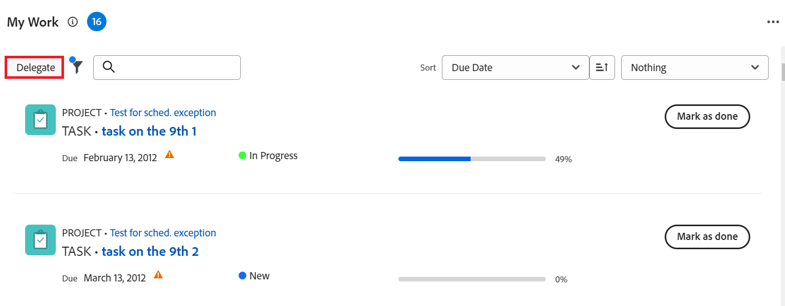

# Delega attività e problemi

<!-- Audited: 10/2024 -->

<!--
<NOTE: 
<you might need to change the tile to Delegate PTI, etc, when that functionality is added. Named it this so it will not conflict with the TOC article for Delegate section which was also "Delegate work"
I wrote this as a "Manage..." article and I did not add three separate articles, to match what we have for delegating approval requests)
-->

Puoi delegare temporaneamente il lavoro che ti è stato assegnato mentre sei fuori sede.

Puoi delegare le assegnazioni di attività e problemi, oppure puoi delegare le approvazioni. Questo articolo descrive come delegare le assegnazioni di attività e problemi.

Per informazioni generali sulla delega del lavoro, vedere [Panoramica sul lavoro delegato](../../manage-work/delegate-work/delegate-work-overview.md).

## Requisiti di accesso

+++ Espandi per visualizzare i requisiti di accesso per la funzionalità in questo articolo.

>[!IMPORTANT]
>
>* Gli utenti che selezioni come delegati ricevono le stesse autorizzazioni delle tue autorizzazioni per le attività e i problemi che deleghi loro.
>* Le autorizzazioni devono funzionare all’interno dei loro livelli di accesso e a volte i loro livelli di accesso potrebbero essere inferiori ai tuoi.
>
>   
>   Ad esempio, se un utente dispone solo dell&#39;accesso Visualizzazione alle attività nel proprio livello di accesso e si dispone delle autorizzazioni Gestione per le attività delegate, riceverà le autorizzazioni Gestione per le attività delegate. Tuttavia, non potranno eseguire le stesse azioni che esegui sulle attività delegate. Per poter aggiornare le attività in assenza dell&#39;utente, è necessario richiedere all&#39;amministratore di sistema l&#39;accesso Modifica attività.
>
>   
>   Per informazioni su come un amministratore di sistema può modificare il tuo livello di accesso, vedi [Creare o modificare livelli di accesso personalizzati](../../administration-and-setup/add-users/configure-and-grant-access/create-modify-access-levels.md).
>
>* Per gli elementi che vengono assegnati dopo l&#39;avvio della delega, può essere necessaria un&#39;ora dopo l&#39;assegnazione dell&#39;elemento per [!DNL Workfront] per condividere gli elementi appena assegnati con il delegato.

Per eseguire i passaggi descritti in questo articolo, è necessario disporre dei seguenti diritti di accesso:

<table style="table-layout:auto"> 
 <col> 
 <col> 
 <tbody> 
  <tr> 
   <td role="rowheader">Pacchetto Adobe Workfront</td> 
   <td> 
Qualsiasi
 </td> 
  </tr> 
  <tr> 
   <td role="rowheader">Licenza Adobe Workfront</td> 
   <td> 
Collaboratore o versione successiva

Revisione o successiva

>[!NOTE]
>
>Anche se è possibile essere assegnati a lavorare quando si dispone di una licenza Request, non è possibile delegare il lavoro ad altri. [!DNL Workfront] sconsiglia di assegnare il lavoro agli utenti Revisione, Richiesta o Collaboratore.

</tr> 
  <tr> 
   <td role="rowheader">Configurazioni del livello di accesso</td> 
   <td> 
Modifica l'accesso ad Attività e Issues 
     
 </td> 
  </tr> 
  <tr> 
   <td role="rowheader">Autorizzazioni oggetto</td> 
   <td> 
Visualizza o consente di accedere ad autorizzazioni superiori per le attività o i problemi assegnati
 
    </td> 
  </tr> 
 </tbody> 
</table>

Per informazioni, consulta [Requisiti di accesso nella documentazione di Workfront](/help/quicksilver/administration-and-setup/add-users/access-levels-and-object-permissions/access-level-requirements-in-documentation.md).

+++

<!--note from the table for Object permissions:
     
Contribute or higher permissions to the projects where you are designated as the Project&nbsp;Owner (NOTE:&nbsp;you cannot delegate projects yet)

    -->

## Prerequisiti

Prima di poter eseguire le attività descritte in questo articolo, è necessario verificare quanto segue:

* L&#39;amministratore di [!DNL Workfront] o del gruppo ha abilitato l&#39;impostazione [!UICONTROL **Consenti agli utenti di delegare le attività e i problemi**] nella sezione [!UICONTROL Preferenze attività e problemi] nell&#39;area [!UICONTROL Configurazione] dell&#39;istanza [!DNL Workfront].

  Per ulteriori informazioni, consulta [Configurare le preferenze per attività e problemi a livello di sistema](../../administration-and-setup/set-up-workfront/configure-system-defaults/set-task-issue-preferences.md).

## Delega attività e problemi a un altro utente

Prima di delegare il lavoro ad altri, ti consigliamo di contattarli e informarli che saranno designati come delegati per i tuoi elementi di lavoro. Chiedere la loro approvazione verbale prima di delegare il lavoro per assicurarsi che abbiano il tempo necessario per completare il lavoro mentre si è fuori sede.

Per informazioni generali sulla delega di attività e problemi, vedere [Panoramica sui problemi e le attività di delega](/help/quicksilver/manage-work/delegate-work/delegate-work-overview.md).

Per delegare le tue attività e i tuoi problemi ad altri:

1. Vai alla [!UICONTROL **Home**].
1. Verifica che i widget [!UICONTROL **Il mio lavoro**], [!UICONTROL **Le mie attività**] o [!UICONTROL **I miei problemi**] siano stati aggiunti alla [!UICONTROL **Home**].

   Per informazioni, vedere [Aggiungere, modificare o rimuovere widget nella Home](/help/quicksilver/workfront-basics/using-home/using-the-home-area/add-edit-remove-widgets-in-new-home.md)

1. Fai clic su [!UICONTROL **Delega**] nell&#39;angolo superiore sinistro dei widget [!UICONTROL **Il mio lavoro**], [!UICONTROL **Le mie attività**] o [!UICONTROL **I miei problemi**].

   

1. Aggiorna quanto segue:

   * [!UICONTROL **Delega le attività e i problemi a**]: inizia a digitare il nome di un utente a cui desideri delegare le attività e i problemi, quindi selezionalo quando viene visualizzato nell&#39;elenco. Puoi selezionare un solo utente.

     L&#39;utente che si seleziona come delegato riceve le stesse autorizzazioni delle autorizzazioni relative alle attività e ai problemi che si delegano loro.

   * [!UICONTROL **Data inizio**]: seleziona una data dal calendario da cui deve iniziare la delega degli elementi di lavoro.

     >[!TIP]
     >
     >La data di inizio non può essere nel passato.

   * [!UICONTROL **Nessuna data di fine**]: selezionare questa opzione se non si desidera specificare la data di fine per la delega.

   * [!UICONTROL **Data di fine**]: selezionare una data dal calendario in cui interrompere la delega.

     >[!TIP]
     >
     >Se si lascia vuoto il campo Data di fine e l&#39;opzione Nessuna data di fine non è selezionata, la delega viene impostata solo per il giorno corrente.

     
     <!--check screen shot - submitted bug for casing-->

1. Fai clic su [!UICONTROL **Salva**].

   Si verificano le seguenti situazioni:

   * Il lavoro è delegato all&#39;utente specificato. Eventuali attività o problemi incompleti con date comprese nell’intervallo di tempo selezionato (compresi quelli appena assegnati, dopo l’abilitazione della delega) vengono delegati.

     >[!TIP]
     >
     >   Gli elementi di lavoro completati con date comprese nell’intervallo di tempo della delega non vengono delegati.

   * Viene visualizzato un messaggio nella parte inferiore della schermata che conferma di aver abilitato la delega del lavoro a un altro utente. Il nome dell’utente delegato viene visualizzato nel messaggio di conferma.

   * Un&#39;indicazione che le attività e i problemi sono delegati ad altri utenti viene visualizzata nella maggior parte delle aree in cui è possibile visualizzare le assegnazioni in [!DNL Workfront]. Per ulteriori informazioni sulle aree che non includono i nomi dei delegati, vedere [Panoramica sul lavoro dei delegati](delegate-work-overview.md).

   * Il pulsante [!UICONTROL **Delega**] nell&#39;area [!UICONTROL **Home**] diventa [!UICONTROL **Modifica delega**] per indicare che è attiva una delega.
     <!--
      <MadCap:conditionalText data-mc-conditions="QuicksilverOrClassic.Draft mode">
      (NOTE: is this shot correct?&nbsp;See UI - this is a mock)
      </MadCap:conditionalText>
      -->

     

   * Se le notifiche degli eventi e le notifiche personali sono abilitate, riceverai anche una conferma via e-mail della tua delega.

   * L’utente selezionato come delegato riceve un’e-mail sulla delega, se le relative notifiche degli eventi sono abilitate.

     Per informazioni sull&#39;attivazione delle notifiche e-mail personali, vedere [Modificare le proprie notifiche e-mail](../../workfront-basics/using-notifications/activate-or-deactivate-your-own-event-notifications.md).

## Modificare o interrompere la delega

Puoi lasciare scadere una delega se hai selezionato una Data di fine oppure puoi interromperla manualmente. Puoi anche modificare l’intervallo di tempo per la delega, se le date per la delega sono cambiate.

1. Vai alla [!UICONTROL **Home**] e fai clic su [!UICONTROL **Modifica delega**] in uno dei seguenti widget: **Il mio lavoro**, **Le mie attività** o **I miei problemi**.
1. Nella casella [!UICONTROL Interrompi la delega di attività e problemi] eseguire una delle operazioni seguenti:
   * Modifica [!UICONTROL **Data inizio**] o [!UICONTROL **Data fine**]
   * Fai clic su [!UICONTROL **Interrompi delega**]

   >[!TIP]
   >
   >    Se la delega è già stata avviata, è possibile modificare solo la data di fine della delega.

   

1. (Condizionale) fai clic su [!UICONTROL **Salva**] per salvare le nuove date di delega

   Oppure

   Fai clic su [!UICONTROL **Interrompi delega**] nella casella di conferma per confermare l&#39;interruzione della delega.

   La delega ha aggiornato le date o è stata interrotta e gli utenti delegati sono stati rimossi dalle attività e dai problemi. Le loro autorizzazioni per le attività e i problemi rimangono in vigore.

## Individua le informazioni sul lavoro delegato e sui delegati

<!--(if this was released, make sure that viewing delegated approvals has not changed, as documented here: /Content/Review and approve work/Manage Approvals/delegate-approval-requests.html) 
-->

Quando si delegano attività e problemi, in [!DNL Workfront] sono presenti diverse aree in cui è possibile visualizzare il lavoro delegato o chi sono i delegati.

* [Individuare i delegati nella casella Assegnazioni](#locate-delegates-in-the-assignments-box)
* [Individua lavoro delegato in [!UICONTROL Home]](#locate-delegated-work-in-home)

### Individua i delegati nella casella [!UICONTROL Assegnazioni]

Quando l&#39;amministratore di sistema o di gruppo abilita la delega del lavoro nel sistema, la casella [!UICONTROL Assegnazioni] visualizza le seguenti schede ovunque sia possibile accedervi:

* [!UICONTROL **Assegnazioni**]: gli utenti assegnati all&#39;attività o al problema vengono visualizzati qui.
* [!UICONTROL **Deleghe**]: qui vengono visualizzati gli utenti designati come delegati dagli assegnatari dell&#39;attività o del problema.

Puoi accedere alla casella [!UICONTROL Assegnazioni] nelle seguenti aree:

* Intestazione dell’attività o del problema

  Il campo [!UICONTROL Assegnazioni] nell&#39;intestazione dell&#39;attività o del problema diventa [!UICONTROL Assegnazioni e deleghe].

  

* Il [!UICONTROL Bilanciatore dei carichi di lavoro] quando si assegnano manualmente attività o problemi

  

>[!NOTE]
>
> Impossibile visualizzare i delegati nella sezione [!UICONTROL Assegnazioni] di un&#39;attività o nella casella Modifica problema.

Se un&#39;attività o un problema è delegato e la scheda secondaria [!UICONTROL Deleghe] è vuota, potrebbe esistere uno dei seguenti scenari:

* Non sei assegnato all’attività o al problema.
* Le date dell’attività o del problema non rientrano nell’intervallo di delega.

>[!TIP]
>
>Le ore pianificate o effettive per le attività e i problemi delegati non vengono prese in considerazione negli strumenti di gestione delle risorse, come il [!UICONTROL Bilanciatore dei carichi di lavoro] o il [!DNL Resource Planner] per gli utenti delegati. Le ore rimangono associate solo all’utente assegnato.

### Individua lavoro delegato in [!UICONTROL Home]

1. Vai alla [!UICONTROL **Home**] nel widget [!UICONTROL **Il mio lavoro**].
1. Fai clic sul menu a discesa del filtro e seleziona una o più delle seguenti opzioni:
   * [!UICONTROL **Delegato**]: per visualizzare le attività e i problemi delegati a te o da te.
   * [!UICONTROL **Delegata a me**]: per visualizzare le attività e i problemi delegati a te da un altro utente.
   * [!UICONTROL **Delegato da me**]: per visualizzare le attività e i problemi da te delegati ad altri utenti.

     

1. (Facoltativo) Fai clic sul menu a discesa [!UICONTROL **Ordina**] per ordinare l&#39;elenco in base ai seguenti criteri:
   * [!UICONTROL Data di scadenza]. Questa è l’opzione di ordinamento predefinita.
   * [!UICONTROL Nome]
   * [!UICONTROL Percentuale completato]
   * [!UICONTROL Stato]
1. (Facoltativo) Espandi il menu a discesa dei raggruppamenti in alto a destra del widget [!UICONTROL **Il mio lavoro**] e raggruppa in base a uno dei seguenti criteri:
   * Niente. Questa è l’opzione di raggruppamento predefinita.
   * [!UICONTROL Progetto]
   * [!UICONTROL Stato]
   * [!UICONTROL Data di scadenza]

1. Per visualizzare gli elementi che hai delegato o che ti sono stati delegati, puoi effettuare una delle seguenti operazioni:

   * Per gli elementi che hai delegato ad altri, trova il nome del delegato nello stato dell&#39;attività o del problema, dopo [!UICONTROL **Delegato a**].

   * Per gli elementi delegati a te, trova il nome dell&#39;assegnatario nello stato dell&#39;attività o del problema, dopo [!UICONTROL **Delega da**].

     >[!TIP]
     >
     >    Se la delega è impostata per iniziare in una data successiva alla data odierna, la data di inizio della delega viene visualizzata anche in [!UICONTROL Elenco lavori]. Gli elementi delegati vengono visualizzati nel raggruppamento selezionato per l&#39;[!UICONTROL Elenco lavori], in base al tipo di raggruppamento. Ad esempio, se si raggruppa per [!UICONTROL Data di completamento pianificata], gli elementi delegati vengono visualizzati nel raggruppamento che corrisponde alle date di completamento pianificate.
