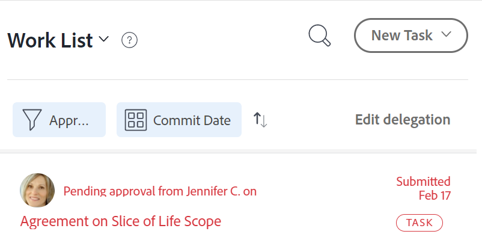

# Gestire la delega di attività e problemi

<!--
<NOTE: 
<you might need to change the tile to Delegate PTI, etc, when that functionality is added. Named it this so it will not conflict with the TOC article for Delegate section which was also "Delegate work"
I wrote thhis as a "Manage..." article and I did not add three separate articles, to match what we have for delegating approval requests)
-->

Puoi delegare temporaneamente il lavoro che ti è stato assegnato mentre sei fuori sede.

Puoi delegare le assegnazioni di attività e problemi oppure le approvazioni. Questo articolo descrive come delegare le assegnazioni di attività e problemi.

Per informazioni generali sulla delega del lavoro, consulta [Panoramica sul lavoro dei delegati](../../manage-work/delegate-work/delegate-work-overview.md).

## Requisiti di accesso

>[!IMPORTANT]
>
>* Gli utenti che selezioni come delegati ricevono le stesse autorizzazioni delle tue autorizzazioni per le attività e i problemi che deleghi loro.
>* Le autorizzazioni devono funzionare all’interno dei loro livelli di accesso e a volte i loro livelli di accesso potrebbero essere inferiori ai tuoi.

   >
   >   
   >   Ad esempio, se un utente dispone solo dell&#39;accesso Visualizzazione alle attività nel proprio livello di accesso e si dispone delle autorizzazioni Gestione per le attività delegate, riceverà le autorizzazioni Gestione per le attività delegate. Tuttavia, non potranno eseguire le stesse azioni che esegui sulle attività delegate. Devono richiedere all&#39;amministratore di sistema l&#39;accesso di modifica alle attività per poter aggiornare le attività in assenza dell&#39;utente.
   >
   >   
   >   Per informazioni su come modificare il livello di accesso, consulta [Creare o modificare livelli di accesso personalizzati](../../administration-and-setup/add-users/configure-and-grant-access/create-modify-access-levels.md).
>
>* Per gli elementi assegnati dopo l&#39;avvio della delega, può essere necessaria un&#39;ora dopo l&#39;assegnazione dell&#39;elemento per [!DNL Workfront] condividere gli elementi appena assegnati con il delegato.

Per eseguire i passaggi descritti in questo articolo, è necessario disporre dei seguenti diritti di accesso:

<table style="table-layout:auto"> 
 <col> 
 <col> 
 <tbody> 
  <tr> 
   <td role="rowheader">[!DNL Adobe Workfront] piano*</td> 
   <td> 
Qualsiasi
 </td> 
  </tr> 
  <tr> 
   <td role="rowheader">[!DNL Adobe Workfront] licenza*</td> 
   <td> 
Revisione o successiva

>[!NOTE]
>
>Anche se è possibile essere assegnati a lavorare quando si dispone di una licenza Request, non è possibile delegare il lavoro ad altri. [!DNL Workfront] sconsiglia di assegnare il lavoro agli utenti di revisione o richiesta.

</tr> 
  <tr> 
   <td role="rowheader">Configurazioni del livello di accesso*</td> 
   <td> 
Modifica l'accesso ad attività e problemi Se non hai ancora accesso, chiedi al tuo [!DNL Workfront] amministratore se impostano restrizioni aggiuntive nel livello di accesso. Per informazioni su come [!DNL Workfront] l'amministratore può modificare il tuo livello di accesso, vedi <a href="../../administration-and-setup/add-users/configure-and-grant-access/create-modify-access-levels.md" class="MCXref xref"> Creare o modificare livelli di accesso personalizzati</a>.
 </td> 
  </tr> 
  <tr> 
   <td role="rowheader">Autorizzazioni oggetto</td> 
   <td> 
Visualizza o consente di accedere ad autorizzazioni superiori per le attività o i problemi assegnati
 
    
Per informazioni sulla richiesta di accesso aggiuntivo, consulta <a href="../../workfront-basics/grant-and-request-access-to-objects/request-access.md" class="MCXref xref">Richiedi accesso agli oggetti </a>.
 </td> 
  </tr> 
 </tbody> 
</table>

*Per conoscere il piano, il tipo di licenza o l&#39;accesso di cui si dispone, contattare [!DNL Workfront] amministratore.

<!--note from the table for Object permissions:
     
Contribute or higher permissions to the projects where you are designated as the Project&nbsp;Owner (NOTE:&nbsp;you cannot delegate projects yet)

    -->

## Prerequisiti

Prima di poter eseguire le attività descritte in questo articolo, è necessario verificare quanto segue:

* Il tuo [!DNL Workfront] o dall&#39;amministratore del gruppo abilitato [!UICONTROL Consenti agli utenti di eliminare attività e problemi con ore registrate] impostazione in [!UICONTROL Configurazione] dell&#39;area [!DNL Workfront] dell&#39;istanza.

   Per ulteriori informazioni, consulta [Configurare le preferenze per attività e problemi a livello di sistema](../../administration-and-setup/set-up-workfront/configure-system-defaults/set-task-issue-preferences.md).

## Delega attività e problemi a un altro utente

Prima di delegare il lavoro ad altri, ti consigliamo di contattarli e informarli che saranno designati come delegati per i tuoi elementi di lavoro. Chiedere la loro approvazione verbale prima di delegare il lavoro per assicurarsi che abbiano il tempo necessario per completare il lavoro mentre si è fuori sede.

Per informazioni generali sulla delega di attività e problemi, consulta [Panoramica su delega attività e problemi](delegate-work.md).

Per delegare le tue attività e i tuoi problemi ad altri:

1. Vai a [!UICONTROL **Home**] , quindi fai clic su [!UICONTROL **Delega**] nella parte superiore della [!UICONTROL **Elenco lavori**].

   

1. In [!UICONTROL **Delega attività e problemi**] , aggiorna quanto segue:

   * [!UICONTROL **Delega le tue attività e i tuoi problemi a**]: inizia a digitare il nome di un utente al quale desideri delegare le attività e i problemi, quindi selezionalo quando viene visualizzato nell’elenco. È possibile selezionare un solo utente.\

      L&#39;utente che si seleziona come delegato riceve le stesse autorizzazioni delle autorizzazioni relative alle attività e ai problemi che si delegano loro. Per ulteriori informazioni, consulta [Panoramica sulle attività e sui problemi dei delegati](delegate-work-overview.md).

   * [!UICONTROL **Data di inizio**]: seleziona una data dal calendario a partire dalla quale deve iniziare la delega degli elementi di lavoro.

      >[!TIP]
      >
      >La data di inizio non può essere nel passato.

   * [!UICONTROL **Nessuna data di fine**]: seleziona questa opzione se non desideri specificare la data di fine della delega.

   * [!UICONTROL **Data di fine**]: seleziona una data dal calendario in cui la delega deve terminare.

      >[!TIP]
      >
      >La mancata selezione di una data di fine abilita la delega solo per il giorno corrente.

      

1. Fai clic su [!UICONTROL **Salva**].

   Si verificano le seguenti situazioni:

   * Il lavoro è delegato all&#39;utente specificato. Eventuali attività o problemi incompleti con date comprese nell’intervallo di tempo selezionato (compresi quelli appena assegnati, dopo l’abilitazione della delega) vengono delegati.
   >[!TIP]
   >
   >   Gli elementi di lavoro completati con date comprese nell’intervallo di tempo della delega non vengono delegati.

   * Viene visualizzato un messaggio nell’angolo superiore destro della schermata per confermare che hai abilitato la delega del tuo lavoro a un altro utente. Il nome dell’utente delegato viene visualizzato nel messaggio di conferma.

   * Nella maggior parte delle aree in cui è possibile visualizzare le assegnazioni in, viene visualizzata un&#39;indicazione che indica che le attività e i problemi sono delegati ad altri utenti. [!DNL Workfront]. Per ulteriori informazioni sulle aree in cui non sono inclusi i nomi dei delegati, vedere [Panoramica sulle attività e sui problemi dei delegati](delegate-work-overview.md).

   * Il [!UICONTROL **Delega**] pulsante in [!UICONTROL Home] modifica area in [!UICONTROL **Modifica delega**] per indicare che esiste una delega.

   <!--
   <MadCap:conditionalText data-mc-conditions="QuicksilverOrClassic.Draft mode">
   (NOTE: is this shot correct?&nbsp;See UI - this is a mock)
   </MadCap:conditionalText>
   -->

   

   * Se le notifiche degli eventi e le notifiche personali sono abilitate, riceverai anche una conferma via e-mail della tua delega.

   * L’utente selezionato come delegato riceve un’e-mail sulla delega, se le relative notifiche degli eventi sono abilitate.

      Per informazioni sull’abilitazione delle notifiche e-mail personali, consulta [Attiva o disattiva le notifiche degli eventi](../../workfront-basics/using-notifications/activate-or-deactivate-your-own-event-notifications.md).

## Modificare o interrompere la delega

Puoi lasciare scadere una delega se hai selezionato una Data di fine oppure puoi interromperla manualmente. Puoi anche modificare l’intervallo di tempo per la delega, se le date per la delega sono cambiate.

1. Vai a [!UICONTROL Home] , quindi fai clic su [!UICONTROL Modifica delega] nell’angolo superiore destro dell’Elenco lavori.
1. In [!UICONTROL Delega attività e problemi] , eseguire una delle operazioni seguenti:
   * Modifica il [!UICONTROL **Data di inizio**] o [!UICONTROL **Data di fine**]
   * Clic [!UICONTROL **Revoca delega**]

   >[!TIP]
   >
   >    Se la delega è già stata avviata, è possibile modificare solo la data di fine della delega.

   

1. (Condizionale) clic [!UICONTROL **Salva**] per salvare le nuove date di delega

   Oppure

   Clic [!UICONTROL **Revoca delega**] nella casella di conferma per confermare l’interruzione della delega.

   La delega ha aggiornato le date o è stata interrotta e gli utenti delegati sono stati rimossi dalle attività e dai problemi. Le loro autorizzazioni per le attività e i problemi rimangono in vigore.

## Individua le informazioni sul lavoro delegato e sui delegati

<!--(if this was released, make sure that viewing delegated approvals has not changed, as documented here: /Content/Review and approve work/Manage Approvals/delegate-approval-requests.html) 
-->

Quando si delegano attività e problemi, sono disponibili diverse aree in [!DNL Workfront] dove puoi vedere il lavoro delegato o chi sono i delegati.

* [Individuare i delegati nella casella Assegnazioni](#locate-delegates-in-the-assignments-box)
* [Individua lavoro delegato in [!UICONTROL Home]](#locate-delegated-work-in-home)

### Individuare i delegati in [!UICONTROL Assegnazioni] casella

Quando l&#39;amministratore del sistema o del gruppo abilita la delega del lavoro nel sistema, [!UICONTROL Assegnazioni] Questa casella mostra le seguenti schede ovunque sia possibile accedervi:

* [!UICONTROL **Assegnazioni**]: gli utenti assegnati all’attività o al problema vengono visualizzati qui.
* [!UICONTROL **Deleghe**]: qui vengono visualizzati gli utenti designati come delegati dagli assegnatari dell’attività o del problema.

È possibile accedere a [!UICONTROL Assegnazioni] nelle seguenti aree:

* Intestazione dell’attività o del problema

   

   Il [!UICONTROL Assegnazioni] nell’intestazione dell’attività o del problema diventa [!UICONTROL Assegnazioni e deleghe].

* Il [!UICONTROL Bilanciatore dei carichi di lavoro] quando si assegnano manualmente attività o problemi

   

>[!NOTE]
>
> Non è possibile visualizzare i delegati in [!UICONTROL Assegnazioni] sezione di un’attività o di un problema Casella di modifica.

Se un’attività o un problema è delegato e il [!UICONTROL Deleghe] scheda secondaria vuota, potrebbe esistere uno dei seguenti scenari:

* Non sei assegnato all’attività o al problema.
* Le date dell’attività o del problema non rientrano nell’intervallo di delega.

>[!TIP]
>
>Le ore pianificate o effettive per le attività e i problemi delegati non vengono prese in considerazione negli strumenti di gestione delle risorse, come [!UICONTROL Bilanciatore dei carichi di lavoro] o [!DNL Resource Planner] per gli utenti delegati. Le ore rimangono associate solo all’utente assegnato.

### Individua lavoro delegato in [!UICONTROL Home]

1. Vai a [!UICONTROL **Home**] , quindi fai clic sul menu a discesa filtro e seleziona una o più delle seguenti opzioni:
   * [!UICONTROL **Delegato**]: per visualizzare le attività e i problemi che ti sono stati delegati o che ti sono stati delegati.
   * [!UICONTROL **Delegato a me**]: per visualizzare le attività e i problemi che ti sono stati delegati da un altro utente.
   * [!UICONTROL **Delegato da me**]: per visualizzare le attività e i problemi da te delegati ad altri utenti.

   

1. Fai clic su [!UICONTROL ordinamento] menu a discesa per ordinare l’elenco in base ai seguenti criteri:
   * [!UICONTROL Completamento pianificato]. Questa è l’opzione di ordinamento predefinita.
   * [!UICONTROL Inizio pianificato]
   * [!UICONTROL Conferma data]
   * [!UICONTROL Progetto]
   * [!UICONTROL La mia priorità]
1. Espandi i raggruppamenti in [!UICONTROL **Elenco lavori**] per visualizzare gli elementi di lavoro delegati. Esistono i seguenti scenari:
   * Per gli elementi che hai delegato ad altri, il nome del delegato viene visualizzato nel [!UICONTROL **Elenco lavori**] nonché [!UICONTROL **Assegnazioni e deleghe**] campo a destra.

   * Per gli elementi delegati, il nome dell&#39;assegnatario viene visualizzato nel [!UICONTROL **Elenco lavori**] nonché **[!UICONTROL Assegnazioni e deleghe]** campo a destra.
   >[!TIP]
   >
   >    Se la delega è impostata per iniziare in una data successiva alla data odierna, la data di inizio della delega viene visualizzata anche nel [!UICONTROL Elenco lavori]. Gli elementi delegati vengono visualizzati nel raggruppamento selezionato per [!UICONTROL Elenco lavori], in base al tipo di raggruppamento. Ad esempio, se si raggruppa per [!UICONTROL Data di completamento Pianificata], gli elementi delegati vengono visualizzati nel raggruppamento che corrisponde alle date di completamento pianificate.
