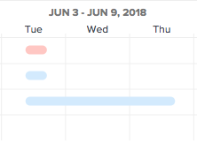

# Configurare la modalità di visualizzazione delle informazioni nel [!UICONTROL Diagramma di Gantt]

È possibile configurare le informazioni visualizzate in entrambi gli elenchi di attività [!UICONTROL Diagramma di Gantt] e l&#39;elenco dei progetti [!UICONTROL Diagramma di Gantt].

## Requisiti di accesso

Devi disporre dei seguenti elementi per seguire i passaggi descritti in questo articolo:

<table style="table-layout:auto"> 
 <col> 
 <col> 
 <tbody> 
  <tr> 
   <td role="rowheader">[!DNL Adobe Workfront] piano*</td> 
   <td> 
Qualsiasi 
 </td> 
  </tr> 
  <tr> 
   <td role="rowheader">[!DNL Adobe Workfront] licenza*</td> 
   <td> 
[!UICONTROL Review] o versione successiva
 </td> 
  </tr> 
  <tr> 
   <td role="rowheader">Configurazioni a livello di accesso*</td> 
   <td> 
Visualizzazione progetti e attività o accesso successivo
 
Nota: Se non hai ancora accesso, chiedi [!DNL Workfront] amministratore se imposta ulteriori restrizioni nel livello di accesso. Per informazioni su come [!DNL Workfront] l'amministratore può modificare il livello di accesso, vedi <a href="../../../administration-and-setup/add-users/configure-and-grant-access/create-modify-access-levels.md" class="MCXref xref">Creare o modificare livelli di accesso personalizzati</a>.
 </td> 
  </tr> 
  <tr> 
   <td role="rowheader">Autorizzazioni oggetto</td> 
   <td> 
[!UICONTROL View] o accesso successivo al progetto
 
Per informazioni sulla richiesta di accesso aggiuntivo, vedi <a href="../../../workfront-basics/grant-and-request-access-to-objects/request-access.md" class="MCXref xref">Richiedere l’accesso agli oggetti </a>.
 </td> 
  </tr> 
 </tbody> 
</table>

&#42;Per sapere quale piano, tipo di licenza o accesso hai, contatta il tuo [!DNL Workfront] amministratore.

## Comprendere le opzioni di visualizzazione

Nella tabella seguente sono illustrate le opzioni di visualizzazione per [!UICONTROL Diagramma di Gantt]:

<table style="table-layout:auto"> 
 <col> 
 <col> 
 <col> 
 <tbody> 
  <tr> 
   <td role="rowheader">[!UICONTROL Date effettive]</td> 
   <td>  </td> 
   <td> 
Vengono visualizzati i valori [!UICONTROL Data inizio effettiva] e [!UICONTROL Data completamento effettivo] con un'icona a forma di triangolo. Se la data di completamento effettivo è null, viene visualizzata solo la data di inizio effettivo.
 
Per ulteriori informazioni sulle date di inizio e di completamento, vedi <a href="../../../manage-work/projects/planning-a-project/project-actual-completion-date.md" class="MCXref xref">Panoramica del progetto [!UICONTROL Data effettiva di completamento] </a> e <a href="../../../manage-work/projects/planning-a-project/project-actual-start-date.md" class="MCXref xref">Panoramica del progetto [!UICONTROL Data di inizio effettiva] </a>.
 </td> 
  </tr> 
  <tr> 
   <td role="rowheader">[!UICONTROL Assegnazioni]</td> 
   <td>  </td> 
   <td> 
Mostra gli assegnatari delle attività. Passa il puntatore del mouse sopra <strong>[!UICONTROL Details]</strong> fare clic sul collegamento accanto al nome di un assegnatario per visualizzare informazioni più dettagliate su di esso, inclusa la percentuale di allocazione all'attività.
 
Gli assegnatari non vengono visualizzati nel diagramma di Gantt [!UICONTROL] quando il diagramma di Gantt [!UICONTROL] viene esportato in PDF. Quando il diagramma di Gantt [!UICONTROL] viene esportato in PDF, gli assegnatari vengono visualizzati solo nell’elenco delle attività.
 </td> 
  </tr> 
  <tr> 
   <td role="rowheader">[!UICONTROL Linea di base]</td> 
   <td>  </td> 
   <td> 
Snapshot di progetto che rappresenta parti chiave di dati relativi al progetto incluso nel piano di progetto iniziale. Le linee di base possono essere utilizzate per tutta la durata del progetto. Quando si abilita la visualizzazione delle linee di base nel diagramma di Gantt, selezionare la linea di base da visualizzare. È possibile visualizzare una sola linea di base al diagramma di Gantt [!UICONTROL Gantt] alla volta e verrà visualizzata sotto forma di barra grigia.
 
Per ulteriori informazioni sulle linee di base, consulta <a href="../../../manage-work/projects/create-projects/create-baselines.md" class="MCXref xref">Creare le linee di base dei progetti</a>.
 </td> 
  </tr> 
  <tr> 
   <td role="rowheader">[!UICONTROL Data del commit]</td> 
   <td>  </td> 
   <td> 
La data in cui un assegnatario si impegna a completare l'attività viene visualizzata con un marcatore nel diagramma di Gantt [!UICONTROL]. 
 
Per ulteriori informazioni sulle date di commit, vedi <a href="../../../manage-work/projects/updating-work-in-a-project/overview-of-commit-dates.md" class="MCXref xref">Panoramica di [!UICONTROL Commit Date]</a>.
 </td> 
  </tr> 
  <tr> 
   <td role="rowheader">[!UICONTROL % Completato]</td> 
   <td>  </td> 
   <td>  La percentuale di completamento dell'attività viene visualizzata nella riga dell'attività.  </td> 
  </tr> 
  <tr> 
   <td role="rowheader">[!UICONTROL Percorso critico]</td> 
   <td>  </td> 
   <td>Le attività che potrebbero influenzare la tempistica del progetto sono considerate parte del Percorso critico e sono chiaramente contrassegnate in rosso. </td> 
  </tr> 
  <tr> 
   <td role="rowheader">Quadri [!UICONTROL Milestone]</td> 
   <td>  </td> 
   <td> 
Dopo l’attività associata a un’attività cardine viene visualizzata un’icona a forma di rombo. Passa il puntatore del mouse su un'attività cardine per visualizzare il nome e la data dell'attività cardine. La [!DNL Workfront] l’amministratore determina il colore di ciascun diamante cardine.
 
Per ulteriori informazioni sulle milestone, vedi <a href="../../../administration-and-setup/customize-workfront/configure-approval-milestone-processes/create-milestone-path.md" class="MCXref xref">Creare un percorso cardine</a>.
 </td> 
  </tr> 
  <tr> 
   <td role="rowheader">Linee [!UICONTROL Milestone]</td> 
   <td>  </td> 
   <td> 
Viene visualizzata una riga dopo l'attività associata a un'attività cardine. Passa il puntatore del mouse su un'attività cardine per visualizzare il nome e la data dell'attività cardine. La [!DNL Workfront] l’amministratore determina il colore di ogni linea cardine.
 
 Per ulteriori informazioni sulle milestone, vedi  <a href="../../../administration-and-setup/customize-workfront/configure-approval-milestone-processes/create-milestone-path.md" class="MCXref xref">Creare un percorso cardine</a>
 </td> 
  </tr> 
  <tr> 
   <td role="rowheader">[!UICONTROL Predecessori]</td> 
   <td>  </td> 
   <td> 
Linea da un'attività all'altra che mostra la relazione predecessore tra le due attività. Per evidenziare una singola linea predecessore, passare il mouse sopra di essa. Fai clic su di esso per mantenerlo evidenziato. È possibile evidenziare una sola riga predecessore alla volta.
 
A <strong>[!UICONTROL Predecessore]</strong> viene visualizzata accanto a qualsiasi attività con una relazione predecessore che si estende su più pagine nel diagramma di Gantt o su qualsiasi attività con un predecessore tra progetti.
 
Fai clic sul pulsante <strong>[!UICONTROL Predecessore]</strong> icona per visualizzare tutte le attività predecessore e successore, nonché dettagli su ciascuna attività, ad esempio il nome dell'attività, il tipo di relazione predecessore e le date chiave.
 
Nota: Il diagramma di Gantt di [!UICONTROL] in un elenco di progetti visualizza informazioni sui predecessori tra progetti. Per ulteriori informazioni sulla creazione di relazioni predecessori tra progetti diversi, consulta <a href="../../../manage-work/tasks/use-prdcssrs/cross-project-predecessors.md" class="MCXref xref">Creare predecessori tra progetti</a>
 
Per ulteriori informazioni sui predecessori, consulta <a href="../../../manage-work/tasks/use-prdcssrs/enforced-predecessors.md" class="MCXref xref">Applica predecessori</a>.
 </td> 
  </tr> 
  <tr> 
   <td role="rowheader">[!UICONTROL Stato di avanzamento]</td> 
   <td> 
[!UICONTROL puntuale] 
 
[!UICONTROL Behind]    
 
[!UICONTROL A Rischio]    
 
In Ritardo        
 </td> 
   <td> 
 
 
Stato dell'avanzamento corrente per un'attività specifica. 
 
Per informazioni più dettagliate su ciascun tipo di stato di avanzamento, vedi <a href="../../../manage-work/tasks/task-information/task-progress-status.md" class="MCXref xref">Panoramica sullo stato di avanzamento dell'attività</a>.
 </td> 
  </tr> 
  <tr> 
   <td role="rowheader">[!UICONTROL date previste]</td> 
   <td>  </td> 
   <td> 
La tempistica prevista che contrassegna le [!UICONTROL Project Start] e le [!UICONTROL Completion date] in base al lavoro corrente completato, più il lavoro rimanente. 
 
Per ulteriori informazioni sulle date di completamento previste, vedere <a href="../../../manage-work/projects/planning-a-project/project-projected-completion-date.md" class="MCXref xref">Panoramica della [!UICONTROL Data di completamento prevista] per progetti, attività e problemi</a>.
 </td> 
  </tr> 
 </tbody> 
</table>

## Configurare le opzioni di visualizzazione

1. Vai all’elenco delle attività [!UICONTROL Diagramma di Gantt] o l&#39;elenco dei progetti [!UICONTROL Diagramma di Gantt].\
   Per ulteriori informazioni su dove [!UICONTROL Diagramma di Gantt] si trova, vedi [Introduzione al [!UICONTROL Diagramma di Gantt]](../../../manage-work/gantt-chart/use-the-gantt-chart/get-started-with-gantt.md).

1. (Facoltativo) Seleziona la **[!UICONTROL Passa alle date previste]** impostazione per visualizzare le attività in base alle [!UICONTROL Date previste]. Per impostazione predefinita, le attività vengono visualizzate in base alle [!UICONTROL Date previste] in [!UICONTROL Diagramma di Gantt].
1. Fai clic sull’icona delle opzioni per visualizzare il **[!UICONTROL Opzioni]** finestra di dialogo.\
   

1. Seleziona le opzioni di configurazione da visualizzare nella [!UICONTROL Diagramma di Gantt].

   >[!NOTE]
   > Non tutte le opzioni di configurazione sono disponibili nell’elenco dei progetti [!UICONTROL Diagramma di Gantt].

1. Fai clic in un punto qualsiasi del [!UICONTROL Diagramma di Gantt] per chiudere **[!UICONTROL Opzioni]** finestra di dialogo.
