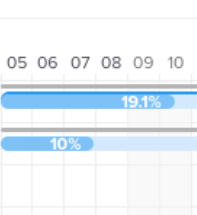

# Configura la visualizzazione delle informazioni nel [!UICONTROL Diagramma di Gantt]

<!-- Audited: 5/2025 -->

È possibile configurare le informazioni visualizzate sia nel Diagramma di Gantt elenco attività che nel Diagramma di Gantt elenco progetti.

## Requisiti di accesso

+++ Espandi per visualizzare i requisiti di accesso per la funzionalità in questo articolo.

<table style="table-layout:auto"> 
 <col> 
 <col> 
 <tbody> 
  <tr> 
   <td role="rowheader">[!DNL Adobe Workfront] pacchetto</td> 
   <td> 
Qualsiasi
 </td> 
  </tr> 
  <tr> 
   <td role="rowheader">[!DNL Adobe Workfront] licenza</td> 
   <td> 
   
[!UICONTROL Light] o versione successiva

   
[!UICONTROL Review] o versione successiva

   </td> 
  </tr> 
  <tr> 
   <td role="rowheader">Configurazioni del livello di accesso</td> 
   <td> 
Accesso di [!UICONTROL View] o versione successiva a progetti e attività
</td> 
  </tr> 
  <tr> 
   <td role="rowheader">Autorizzazioni oggetto</td> 
   <td> 
Accesso di [!UICONTROL View] o versione successiva al progetto e alle attività
 </td> 
  </tr> 
 </tbody> 
</table>

Per ulteriori dettagli sulle informazioni contenute in questa tabella, vedere [Requisiti di accesso nella documentazione di Workfront](/help/quicksilver/administration-and-setup/add-users/access-levels-and-object-permissions/access-level-requirements-in-documentation.md).

+++

<!--Old:
<table style="table-layout:auto"> 
 <col> 
 <col> 
 <tbody> 
  <tr> 
   <td role="rowheader"> Adobe Workfront plan</td> 
   <td> 
Any 
 </td> 
  </tr> 
  <tr> 
   <td role="rowheader">Adobe Workfront license</td> 
   <td> 
   
New: Light

   
Or

   
Current: Review

   </td> 
  </tr> 
  <tr> 
   <td role="rowheader">Access level configurations</td> 
   <td> 
[!UICONTROL View] or higher access to Projects and Tasks
 
Note: If you still don't have access, ask your [!DNL Workfront] administrator if they set additional restrictions in your access level. For information on how a [!DNL Workfront] administrator can modify your access level, see <a href="../../../administration-and-setup/add-users/configure-and-grant-access/create-modify-access-levels.md" class="MCXref xref">Create or modify custom access levels</a>.
 </td> 
  </tr> 
  <tr> 
   <td role="rowheader">Object permissions</td> 
   <td> 
[!UICONTROL View] or higher access to the project
 
For information on requesting additional access, see <a href="../../../workfront-basics/grant-and-request-access-to-objects/request-access.md" class="MCXref xref">Request access to objects </a>.
 </td> 
  </tr> 
 </tbody> 
</table>-->

## Comprendere le opzioni di visualizzazione

La tabella seguente descrive le opzioni di visualizzazione per il [!UICONTROL Diagramma di Gantt]:

<table style="table-layout:auto"> 
 <col> 
 <col> 
 <col> 
 <tbody> 
  <tr> 
   <td role="rowheader">Date effettive</td> 
   <td>  </td> 
   <td> 
[!UICONTROL Actual Start Date] (Data di inizio effettiva) e [!UICONTROL Actual Completion Date] (Data di completamento effettiva) sono visualizzati con un'icona triangolare. Se [!UICONTROL Actual Completion Date] è null, verrà visualizzata solo la [!UICONTROL Actual Start Date].
 
Per ulteriori informazioni, vedere <a href="../../../manage-work/projects/planning-a-project/project-actual-completion-date.md" class="MCXref xref">Panoramica del progetto [!UICONTROL Data di completamento effettiva] </a> e <a href="../../../manage-work/projects/planning-a-project/project-actual-start-date.md" class="MCXref xref">Panoramica del progetto [!UICONTROL Data di inizio effettiva] </a>.
 </td> 
  </tr> 
  <tr> 
   <td role="rowheader">[!UICONTROL Assegnazioni]</td> 
   <td>  </td> 
   <td> 
Mostra gli assegnatari delle attività. Passa il puntatore del mouse sul collegamento Dettagli accanto al nome dell’assegnatario per visualizzare informazioni più dettagliate su di esso, inclusa la percentuale della sua allocazione all’attività.
 
Gli assegnatari non vengono visualizzati nel grafico [!UICONTROL Gantt] quando il grafico [!UICONTROL Gantt] viene esportato in PDF. Quando il grafico di Gantt [!UICONTROL] viene esportato in PDF, gli assegnatari vengono visualizzati solo nell'elenco delle attività.
 </td> 
  </tr> 
  <tr> 
   <td role="rowheader">[!UICONTROL Baseline]</td> 
   <td>  </td> 
   <td> 
Snapshot del progetto che rappresenta i dati chiave del progetto inclusi nel piano di progetto iniziale. Le linee di base possono essere acquisite in tutta la timeline del progetto. Quando si abilita la visualizzazione delle linee di base nel diagramma di Gantt [!UICONTROL], selezionare la linea di base che si desidera visualizzare. È possibile visualizzare una sola linea di base nel diagramma di Gantt [!UICONTROL] alla volta, che verrà visualizzata sotto forma di una barra grigia.
 
Per ulteriori informazioni sulle previsioni, vedere <a href="../../../manage-work/projects/create-projects/create-baselines.md" class="MCXref xref">Creare le previsioni del progetto</a>.
 </td> 
  </tr> 
  <tr> 
   <td role="rowheader">[!UICONTROL Commit Date]</td> 
   <td>  </td> 
   <td> 
La data indicata da un assegnatario come impegno di quando l'attività verrà completata viene visualizzata con un marcatore nel diagramma di Gantt [!UICONTROL]. 
 
Per ulteriori informazioni sulle date di commit, vedere <a href="../../../manage-work/projects/updating-work-in-a-project/overview-of-commit-dates.md" class="MCXref xref">[!UICONTROL Commit Date] overview</a>.
 </td> 
  </tr> 
  <tr> 
   <td role="rowheader">[!UICONTROL % completato]</td> 
   <td>  </td> 
   <td>  La percentuale di completamento dell'attività viene visualizzata nella riga dell'attività.  </td> 
  </tr> 
  <tr> 
   <td role="rowheader">[!UICONTROL Percorso Critico]</td> 
   <td>  </td> 
   <td>Le attività che possono influenzare la sequenza temporale del progetto sono considerate parte del Percorso Critico e sono chiaramente contrassegnate in rosso. </td> 
  </tr> 
  <tr> 
   <td role="rowheader">[!UICONTROL Milestone] Rombi</td> 
   <td>  </td> 
   <td> 
Dopo l'attività associata a un'attività cardine viene visualizzata un'icona a forma di rombo. Passa il cursore del mouse su un'attività cardine per visualizzarne il nome e la data. L'amministratore [!DNL Workfront] determina il colore di ogni rombo milestone.
 
Per ulteriori informazioni sulle milestone, vedere <a href="../../../administration-and-setup/customize-workfront/configure-approval-milestone-processes/create-milestone-path.md" class="MCXref xref">Creare un percorso milestone</a>.
 </td> 
  </tr> 
  <tr> 
   <td role="rowheader">Righe [!UICONTROL Milestone]</td> 
   <td>  </td> 
   <td> 
Dopo l'attività associata a un'attività cardine viene visualizzata una linea. Passa il cursore del mouse su un'attività cardine per visualizzarne il nome e la data. L'amministratore [!DNL Workfront] determina il colore di ogni linea milestone.
 
 Per ulteriori informazioni sulle milestone, vedi  <a href="../../../administration-and-setup/customize-workfront/configure-approval-milestone-processes/create-milestone-path.md" class="MCXref xref">Crea un percorso milestone</a>
 </td> 
  </tr> 
  <tr> 
   <td role="rowheader">[!UICONTROL Predecessors]</td> 
   <td>  </td> 
   <td> 
Riga da un'attività all'altra che mostra la relazione predecessore tra le due attività. Per evidenziare una singola linea predecessore, posizionare il cursore su di essa. Fai clic su di esso per mantenerlo evidenziato. È possibile evidenziare una sola riga predecessore alla volta.
 
Accanto a qualsiasi attività con una relazione predecessore che si estende su più pagine nel diagramma di Gantt o su qualsiasi attività con un predecessore per più progetti viene visualizzata l'icona [!UICONTROL Predecessor].
 
Fai clic sull'icona [!UICONTROL Predecessore] per visualizzare tutte le attività predecessore e successore e i relativi dettagli, ad esempio il nome dell'attività, il tipo di relazione predecessore e le date chiave.
 
Nota: il diagramma di Gantt [!UICONTROL] in un elenco di progetti visualizza informazioni sui predecessori tra progetti. Per ulteriori informazioni su come creare relazioni di predecessori tra progetti diversi, vedi <a href="../../../manage-work/tasks/use-prdcssrs/cross-project-predecessors.md" class="MCXref xref">Creare predecessori tra progetti</a>
 
Per ulteriori informazioni sui predecessori, vedere <a href="../../../manage-work/tasks/use-prdcssrs/enforced-predecessors.md" class="MCXref xref">Applica predecessori</a>.
 </td> 
  </tr> 
  <tr> 
   <td role="rowheader">Stato di avanzamento di [!UICONTROL]</td> 
   <td> 
[!UICONTROL On Time] 
 
[!UICONTROL Dietro]    
 
[!UICONTROL A Rischio]    
 
In Ritardo        
 </td> 
   <td> 
 
 
Stato dell'avanzamento corrente di una determinata attività. 
 
Per ulteriori informazioni, vedere <a href="../../../manage-work/tasks/task-information/task-progress-status.md" class="MCXref xref">Panoramica sullo stato di avanzamento dell'attività [!UICONTROL]</a>.
 </td> 
  </tr> 
  <tr> 
   <td role="rowheader">Date Previste</td> 
   <td>  </td> 
   <td> 
La sequenza temporale prevista che indica le date di inizio e completamento previste in base al lavoro corrente completato, più il lavoro rimanente. 
 
Per ulteriori informazioni sulle date di completamento previste, vedere <a href="../../../manage-work/projects/planning-a-project/project-projected-completion-date.md" class="MCXref xref">Panoramica sulla data di completamento prevista per progetti, attività e problemi</a>.
 </td> 
  </tr> 
 </tbody> 
</table>

## Configura opzioni di visualizzazione

1. Passare al **Diagramma di Gantt elenco attività** o al **Diagramma di Gantt elenco progetti**.\
   Per ulteriori informazioni sulla posizione di uno dei grafici di Gantt, vedere [Introduzione al [!UICONTROL grafico di Gantt]](../../../manage-work/gantt-chart/use-the-gantt-chart/get-started-with-gantt.md).

1. (Facoltativo) Selezionare l&#39;impostazione **Passa a date previste** per visualizzare le attività in base alle relative date previste. Per impostazione predefinita, le attività vengono visualizzate in base alle relative date pianificate.
1. Fai clic sull&#39;icona **Opzioni**. Viene visualizzata la finestra di dialogo **Opzioni**.\
   

1. Selezionare le opzioni di configurazione da visualizzare nel [!UICONTROL Diagramma di Gantt].

   >[!NOTE]
   >
   > Non tutte le opzioni di configurazione sono disponibili nell&#39;elenco dei progetti [!UICONTROL Grafico di Gantt].

1. Fare clic in un punto qualsiasi del diagramma di Gantt per chiudere la finestra di dialogo **Opzioni**.
