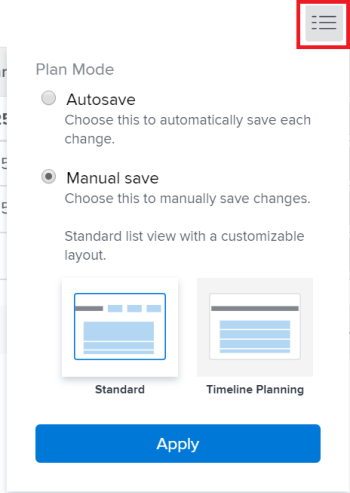

# Livella risorse nel [!UICONTROL Diagramma di Gantt]

<!--Audited: 08/2025-->

È possibile utilizzare il livellamento delle risorse per modificare la sequenza temporale delle attività in modo che non vengano eseguite contemporaneamente, nel caso in cui le stesse risorse vengano assegnate a più attività contemporaneamente.

Il livellamento delle risorse su un progetto ha due scopi:

* Per regolare automaticamente la sovrassegnazione di tempo per gli assegnatari.
* Per creare automaticamente una programmazione realistica delle attività per un progetto.

## Requisiti di accesso

+++ Espandi per visualizzare i requisiti di accesso per la funzionalità in questo articolo. 

<table style="table-layout:auto"> 
 <col> 
 <col> 
 <tbody> 
  <tr> 
   <td role="rowheader">[!DNL Adobe Workfront] pacchetto</td> 
   <td> 
Qualsiasi
 </td> 
  </tr> 
  <tr> 
   <td role="rowheader">[!DNL Workfront] licenza</td> 
   <td> 
[!UICONTROL Standard]

   
[!UICONTROL Plan]
 </td> 
  </tr> 
  <tr> 
   <td role="rowheader">Configurazioni del livello di accesso</td> 
   <td> 
Accesso [!UICONTROL Edit] ai progetti
</td>
</tr> 
  <tr> 
   <td role="rowheader">Autorizzazioni oggetto</td> 
   <td> 
Accesso [!UICONTROL Gestisci] al progetto

</td> 
  </tr> 
 </tbody> 
</table>

Per ulteriori dettagli sulle informazioni contenute in questa tabella, vedere [Requisiti di accesso nella documentazione di Workfront](/help/quicksilver/administration-and-setup/add-users/access-levels-and-object-permissions/access-level-requirements-in-documentation.md).

+++
<!--Old:

<table style="table-layout:auto"> 
 <col> 
 <col> 
 <tbody> 
  <tr> 
   <td role="rowheader">[!DNL Adobe Workfront] plan*</td> 
   <td> 
Any 
 </td> 
  </tr> 
  <tr> 
   <td role="rowheader">[!DNL Workfront] license*</td> 
   <td> 
[!UICONTROL Plan] 
 </td> 
  </tr> 
  <tr> 
   <td role="rowheader">Access level configurations*</td> 
   <td> 
[!UICONTROL Edit] access to Projects
 
<b>NOTE</b>

If you still don't have access, ask your [!DNL Workfront] administrator if they set additional restrictions in your access level. For information on how a [!DNL Workfront] administrator can modify your access level, see <a href="../../../administration-and-setup/add-users/configure-and-grant-access/create-modify-access-levels.md" class="MCXref xref">Create or modify custom access levels</a>.
 </td>
</tr> 
  <tr> 
   <td role="rowheader">Object permissions</td> 
   <td> 
[!UICONTROL Manage] access to the project
 
For information on requesting additional access, see <a href="../../../workfront-basics/grant-and-request-access-to-objects/request-access.md" class="MCXref xref">Request access to objects </a>.
 </td> 
  </tr> 
 </tbody> 
</table> -->

## Panoramica sul livellamento delle risorse

Se la stessa risorsa viene assegnata a due attività diverse, è possibile utilizzare il livellamento delle risorse per modificare la cronologia delle attività in modo che non vengano eseguite contemporaneamente.

Quando si livellano le risorse in un progetto, considera quanto segue:

* Il livellamento delle risorse si applica solo a un progetto, pertanto [!DNL Adobe Workfront] non livella le risorse in più di un progetto alla volta.
* Se **[!UICONTROL Effort Driven]** è selezionato come **[!UICONTROL Duration Type]**, [!DNL Workfront] non livellerà le risorse.
* Quando più utenti vengono assegnati alla stessa attività, il livellamento verrà annullato.
* Le condizioni per il tipo di **[!UICONTROL Vincolo attività]** avranno la precedenza sul livellamento delle risorse. Ad esempio, se **[!UICONTROL Date fisse]** è selezionato come [!UICONTROL Vincolo attività], il livellamento delle risorse non modificherà le date dell&#39;attività.
* Le relazioni con i predecessori avranno la precedenza sul livellamento delle risorse.
* **[!UICONTROL Il livellamento delle risorse]** deve essere impostato su **[!UICONTROL Manuale]** per il progetto al fine di regolare il livellamento nel [!UICONTROL Diagramma di Gantt]. Se disponi delle autorizzazioni di gestione per il progetto, puoi far sì che il sistema livelli automaticamente le risorse regolando questa impostazione sul progetto e selezionando **[!UICONTROL Automatico]** invece di **[!UICONTROL Manuale]** nella casella **[!UICONTROL Modifica progetto]**.

  

* In qualità di proprietario del progetto o di assegnatario dell&#39;attività, è possibile introdurre un ritardo di livellamento per un&#39;attività per indicare che è molto probabile che l&#39;attività richieda più tempo. Per informazioni sull&#39;aggiunta di un ritardo di livellamento a un&#39;attività, vedere [Aggiorna ritardo di livellamento attività](../../../manage-work/tasks/task-information/task-leveling-delay.md).

## Applica livellamento risorse nel [!UICONTROL Diagramma di Gantt]

È possibile utilizzare l&#39;Elenco attività [!UICONTROL Grafico di Gantt] per livellare le risorse.

1. Vai al progetto che desideri livellare.
1. Nell&#39;area **[!UICONTROL Attività]** fare clic sull&#39;icona **[!UICONTROL Grafico di Gantt]**.

   Tutte le modifiche vengono salvate automaticamente quando l&#39;opzione **[!UICONTROL Salvataggio automatico]** è abilitata. Questa opzione è abilitata per impostazione predefinita.

1. (Facoltativo) Fai clic sull&#39;icona della modalità **[!UICONTROL Piano]** e seleziona **[!UICONTROL Salvataggio manuale standard]** o **[!UICONTROL Pianificazione sequenza temporale]** per salvare le modifiche manualmente.

   >[!TIP]
   >
   >Impossibile livellare le risorse nel [!UICONTROL Diagramma di Gantt] quando è abilitata l&#39;opzione [!UICONTROL Salvataggio automatico].

   

1. Fai clic sul menu a discesa **[!UICONTROL Risorse di livello]**.

   

1. Selezionare una delle opzioni seguenti:

   * **[!UICONTROL Livello attuale]**: applica il livellamento delle risorse all&#39;attività selezionata.
   * **[!UICONTROL Cancella livellamento]**: rimuove tutto il livellamento delle risorse dall&#39;attività selezionata.

   >[!NOTE]
   >
   >Le risorse potrebbero essere sovrassegnate se assegnate a più attività che si verificano nello stesso intervallo di tempo.

1. (Facoltativo e condizionale) Se hai disabilitato l&#39;opzione Salvataggio automatico, fai clic sulle icone **[!UICONTROL Annulla]** o **[!UICONTROL Ripristina]** se desideri annullare o duplicare le modifiche.

   >[!TIP]
   >
   >È possibile utilizzare le seguenti scelte rapide da tastiera per annullare o ripristinare le modifiche nel [!UICONTROL Diagramma di Gantt]:
   >
   >* [!DNL Mac]: utilizzare [!UICONTROL Comando + Z] per annullare e [!UICONTROL Comando + Maiusc + Z] per ripetere.
   >* Windows: utilizzare [!UICONTROL Ctrl + Z] per annullare e [!UICONTROL Ctrl + Y] per ripetere.

1. Fai clic su **[!UICONTROL Salva]** nell&#39;angolo superiore destro del [!UICONTROL Diagramma di Gantt].

<!--

<h2>Overview of Leveling Delay</h2>

(NOTE: moved to its own article: /Content/Manage work/Tasks/Task information/task-leveling-delay.htm) 

At times, there might be conflicts between task schedules on a project. You can level resources or address resource conflicts by rescheduling resources and tasks so that all tasks can be completed within a realistic schedule. 

As the project manager, or the task assignee, you can also add a Leveling Delay on individual tasks to account for any resource or scheduling conflicts. In other words, a task might be scheduled with a delay to ensure that when Adobe Workfront levels the tasks a more realistic schedule overcomes resource conflicts.

To manually add a Leveling Delay to a task:

<ol>
<li value="1">Navigate to a task for which you want to add a Leveling Delay.</li>
<li value="2"> 
 Click the <strong>More icon</strong> to the right of the task name, then click <strong>Edit</strong>. 
  </li>
<li value="3">Click <strong>Settings</strong>. </li>
<li value="4">Specify the <strong>Leveling Delay</strong>, in hours. This is the time that the resource will be delayed starting the task due to resource conflicts.</li>
<li value="5">Click <strong>Save Changes</strong>. </li>
</ol>

-->
