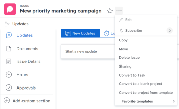

# Convertire un problema in un progetto in Adobe Workfront

Se dopo l’invio del problema è necessario eseguire più operazioni per completare un problema, puoi convertire il problema in un progetto.

Puoi convertire un problema in un nuovo progetto o in un progetto utilizzando un modello. Questo articolo descrive entrambi i modi per convertire i problemi in progetti.

Per informazioni generali sulla conversione dei problemi, vedi [Panoramica sulla conversione dei problemi in Adobe Workfront](../../../manage-work/issues/convert-issues/convert-issues.md).

Durante la creazione di un progetto da un problema, alcuni campi del progetto vengono compilati da altri oggetti. Per ulteriori informazioni, consulta la sezione &quot;Nuove impostazioni predefinite progetto&quot; nell’articolo [Creare un progetto](../../../manage-work/projects/create-projects/create-project.md).

## Requisiti di accesso

Per eseguire i passaggi descritti in questo articolo, è necessario disporre dei seguenti diritti di accesso:

<table style="table-layout:auto"> 
 <col> 
 <col> 
 <tbody> 
  <tr> 
   <td role="rowheader">piano Adobe Workfront*</td> 
   <td> 
Qualsiasi
 </td> 
  </tr> 
  <tr> 
   <td role="rowheader">Licenza Adobe Workfront*</td> 
   <td> 
Piano 
 </td> 
  </tr> 
  <tr> 
   <td role="rowheader">Configurazioni a livello di accesso*</td> 
   <td> 
Modificare l’accesso a Problemi, Attività e Progetti
 
Modifica l'accesso ai dati finanziari per aggiornare le informazioni finanziarie per una conversione proiettata dal problema
 
Nota: Se non disponi ancora dell’accesso, chiedi all’amministratore Workfront se ha impostato ulteriori restrizioni nel livello di accesso. Per informazioni su come un amministratore Workfront può modificare il livello di accesso, consulta <a href="../../../administration-and-setup/add-users/configure-and-grant-access/create-modify-access-levels.md" class="MCXref xref">Creare o modificare livelli di accesso personalizzati</a>.
 </td> 
  </tr> 
  <tr> 
   <td role="rowheader">Autorizzazioni oggetto</td> 
   <td> 
Visualizza le autorizzazioni per il problema
 
Ottieni le autorizzazioni di gestione per il progetto dopo la conversione del problema
 
Per informazioni sulla richiesta di accesso aggiuntivo, vedi <a href="../../../workfront-basics/grant-and-request-access-to-objects/request-access.md" class="MCXref xref">Richiedere l’accesso agli oggetti </a>.
 </td> 
  </tr> 
 </tbody> 
</table>

*Per sapere quale piano, tipo di licenza o accesso si dispone, contattare l&#39;amministratore Workfront.

## Convertire un problema in un progetto

Puoi convertire un problema in un progetto vuoto o convertire un problema in un progetto utilizzando un modello.

1. Vai a un progetto e fai clic su **[!UICONTROL Problemi]** nel pannello a sinistra.
1. Nell’elenco dei problemi visualizzati, effettua una delle seguenti operazioni:

   * Per convertire un problema in un progetto vuoto, fai clic sul nome del problema, quindi fai clic sul pulsante **[!UICONTROL Altro]** menu  a destra del nome del problema, quindi fai clic su **[!UICONTROL Converti in progetto vuoto]**.

      Oppure

      Seleziona il problema nell’elenco dei problemi, fai clic sul pulsante **[!UICONTROL Altro]** menu  in alto nell’elenco, quindi fai clic su **[!UICONTROL Converti in progetto vuoto]**.

      >[!IMPORTANT]
      >
      >L’opzione Converti in progetto vuoto viene visualizzata solo quando l’amministratore di sistema o di gruppo ha abilitato [!UICONTROL Consente agli utenti di creare progetti senza utilizzare un modello] preferenza [!UICONTROL Configurazione] area. Per ulteriori informazioni, consulta [Configurare le preferenze del progetto a livello di sistema](../../../administration-and-setup/set-up-workfront/configure-system-defaults/set-project-preferences.md).

      È necessario aggiungere manualmente le attività al progetto o allegare un modello al progetto dopo la conversione del problema.

      Continua con il passaggio 3e qui sotto.

      <!--
     Is this accurate?
     -->

      >[!TIP]
      >   
      >* Se il problema è stato creato utilizzando una coda di richiesta, il nuovo progetto eredita il gruppo della coda di richiesta.
      >* Se il problema è stato creato aggiungendolo alla sezione Problemi del progetto, il nuovo progetto eredita il Gruppo del progetto del problema.

   * Per convertire un problema in un progetto utilizzando un modello, effettua una delle seguenti operazioni:

      * Fai clic sul nome di un problema, quindi fai clic sul pulsante [!UICONTROL **Altro**] menu  a destra del nome del problema

         

         Oppure

      * Seleziona il problema nell’elenco dei problemi, in un rapporto o in un dashboard, fai clic sul **Altro** menu  in alto nell’elenco, quindi fai clic su **Converti in progetto da modello** e inizia a digitare il nome di un modello nel **Modello di ricerca** quindi fare clic sul nome del modello quando viene visualizzato nell&#39;elenco. Procedi con il passaggio 3.

         <!--      
        (is this accurate?)      
        -->
      >[!TIP]
      >
      >Se hai aggiunto dei modelli all&#39;elenco Preferiti, puoi passare il cursore sopra [!UICONTROL **Modelli preferiti**] e fare clic sul modello da utilizzare.

      Viene visualizzata la casella Nuovo progetto da modello.

      

      >[!TIP]
      >
      >Se il problema è associato a un processo di approvazione o è già associato a un oggetto di risoluzione, Workfront visualizza un avviso nella parte superiore della casella Converti in progetto per notificare all&#39;utente che l&#39;approvazione verrà rimossa o che l&#39;oggetto di risoluzione verrà sovrascritto durante la conversione. Per ulteriori informazioni, consulta [Panoramica sulla conversione dei problemi in Adobe Workfront](../../../manage-work/issues/convert-issues/convert-issues.md).

1. (Condizionale) Se hai selezionato di convertire il problema in un progetto utilizzando un modello, continua con i seguenti passaggi:

   1. Rivedi i dettagli del modello a destra.

      I dettagli del modello includono quanto segue:

      * Durata del modello
      * Proprietario del modello
      * Numero di attività di primo livello che include i nomi delle tre attività principali
      * Numero di tutte le attività nel modello
      * Nomi dei moduli personalizzati del modello
   1. (Facoltativo) Passa il puntatore del mouse sul nome di un modello e fai clic sull&#39;icona Preferiti  contrassegnarlo come preferito per uso futuro.

      >[!TIP]
      >
      >Puoi avere fino a 40 elementi Workfront contrassegnati come preferiti. Ciò include modelli e altri elementi.

   1. Fai clic su [!UICONTROL **Utilizza modello**] per selezionare un modello.

      La [!UICONTROL Converti in progetto] si apre la casella.

      

   1. Se un campo è già compilato nel modello, viene precompilato nel [!UICONTROL Converti in progetto] scatola. Puoi modificare i valori precompilati per adattarli al meglio al tuo progetto. Per ulteriori informazioni, consulta [Modifica progetti](../../../manage-work/projects/manage-projects/edit-projects.md).

      >[!TIP]
      >
      >* L’amministratore di sistema o di gruppo può aggiungere o rimuovere campi nella sezione [!UICONTROL Casella Converti in progetto] aggiornando le informazioni sui dettagli del progetto nella [!UICONTROL Modello di layout].
      >
      >* Per aggiornare i campi nel [!UICONTROL Finanza] nella sezione [!UICONTROL Converti in progetto] box che deve avere [!UICONTROL Modifica] accesso [!UICONTROL Dati finanziari] nel livello di accesso. Se [!UICONTROL Visualizza] accesso [!UICONTROL Dati finanziari] nel livello di accesso tutte le informazioni finanziarie del modello vengono trasferite al nuovo progetto e non è possibile modificarle durante la conversione del problema. Per informazioni, consulta [Concedere l’accesso ai dati finanziari](../../../administration-and-setup/add-users/configure-and-grant-access/grant-access-financial.md) e [Condividere un modello](../../../workfront-basics/grant-and-request-access-to-objects/share-a-template.md).

   1. (Facoltativo e condizionale) Fai clic su [!UICONTROL **Opzioni**] nel pannello a sinistra, seleziona una delle opzioni disponibili:

      * [!UICONTROL **Mantenere il problema originale e legarne la risoluzione a questo progetto**]

         Se deselezionato, il problema originale viene eliminato.

         >[!NOTE]
         >
         >Gli utenti senza accesso o autorizzazioni per eliminare i problemi non saranno in grado di eliminare il problema durante la conversione, indipendentemente dallo stato di questa impostazione. Per informazioni sull’accesso e le autorizzazioni per i problemi, consulta:
         >
         >* [Concedere l’accesso ai problemi](../../../administration-and-setup/add-users/configure-and-grant-access/grant-access-issues.md)
         > 
         >* [Condividere un problema](../../../workfront-basics/grant-and-request-access-to-objects/share-an-issue.md)

      * [!UICONTROL **Consenti accesso al progetto (nome utente)**]

         Se non è selezionato, il problema è [!UICONTROL Contatto principale] non ha accesso alla nuova attività.

         >[!NOTE]
         >
         >Le opzioni disponibili dipendono dal modo in cui l’amministratore di Workfront le ha configurate per tutti gli utenti del sistema o per il gruppo. Per ulteriori informazioni, consulta [Configurare le preferenze relative alle attività e ai problemi a livello di sistema](../../../administration-and-setup/set-up-workfront/configure-system-defaults/set-task-issue-preferences.md).
         >
         >
         >Oppure, se i gruppi di primo livello dell’organizzazione li hanno configurati separatamente, le opzioni disponibili qui dipendono dal gruppo selezionato per il nuovo progetto al passaggio 6. Per ulteriori informazioni, consulta [Configurare le preferenze per attività e problemi per un gruppo](../../../administration-and-setup/manage-groups/create-and-manage-groups/configure-task-issue-preferences-group.md).
   1. Fai clic su [!UICONTROL **Forms personalizzato**] ed effettuare una delle seguenti operazioni:

      * Esamina i moduli personalizzati allegati al modello. Saranno trasferiti al nuovo progetto.
      * Assicurati che tutti i campi obbligatori dispongano di informazioni valide.
      * Ridisporre i moduli personalizzati trascinandoli  dove li volete.
      * Fai clic sul pulsante **x** a destra di qualsiasi modulo che non si desidera trasferire al progetto.
      * Se necessario, trasferisci le informazioni sul modulo personalizzato dal problema al progetto.

         >[!TIP]
         >
         >* Se un modulo personalizzato con più oggetti allegato al problema è configurato per l’utilizzo sia con problemi che con progetti, tutte le informazioni salvate nel modulo vengono mantenute quando si effettua la conversione, se i campi sono presenti sia sul problema che nei moduli personalizzati del progetto.
         >* Se al problema e al progetto è associato un modulo personalizzato con più oggetti con un campo calcolato, il problema e il progetto devono essere compatibili con tutti i campi a cui si fa riferimento nei campi personalizzati calcolati del modulo. In caso di incompatibilità, un messaggio ti avvisa di apportare modifiche. Per ulteriori informazioni, consultare la sezione &quot;Campi personalizzati calcolati nei moduli personalizzati con più oggetti&quot; nella sezione [Aggiungere dati calcolati a un modulo personalizzato con il modulo precedente](../../../administration-and-setup/customize-workfront/create-manage-custom-forms/add-calculated-data-to-custom-form.md).
         >* Se utilizzi un modello per la conversione e un modulo personalizzato allegato al modello contiene un campo personalizzato anch’esso presente in un modulo personalizzato allegato al problema, per il nuovo progetto viene utilizzato il valore del campo relativo al problema. Tuttavia, se il campo personalizzato è vuoto nel problema, viene utilizzato il valore del modello.

   1. Fai clic su [!UICONTROL **Converti in progetto**].

      >[!TIP]
      >
      >Se hai deciso di eliminare il problema originale, ora il problema è un progetto.
      >   
      >Oppure
      >  
      >Se hai deciso di mantenere il problema originale, ora il problema è collegato al nuovo progetto e verrà completato al termine del progetto.
      >
      >Alcuni campi del problema vengono trasferiti al progetto. La maggior parte dei campi definiti nel modello viene automaticamente trasferita al progetto appena creato, se non li hai modificati nei passaggi precedenti. Per informazioni, consulta [Panoramica sulla conversione dei problemi in Adobe Workfront](../../../manage-work/issues/convert-issues/convert-issues.md).

1. (Facoltativo) Imposta eventuali ulteriori dettagli del progetto &#x200B;(proprietario del progetto, date del progetto) e le attività in base alle esigenze.
1. Fai clic su [!UICONTROL **Converti in progetto**].

   Il problema viene ora convertito in progetto.

1. Fai clic su [!UICONTROL **Vai al progetto**] all&#39;interno del [!UICONTROL Completato] nell’angolo superiore destro della pagina. Viene visualizzata la pagina del progetto.
