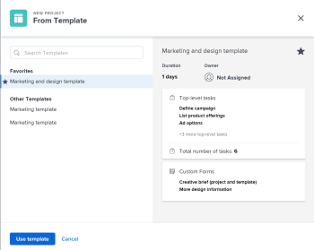

# Convertire un problema in un progetto in Adobe Workfront

<!--Audited: 01/2024-->

Se è necessario fare di più per completare un problema dopo l’invio del problema, puoi convertire il problema in un progetto.

È possibile convertire un problema in un nuovo progetto oppure convertirlo in un progetto utilizzando un modello. In questo articolo vengono descritti entrambi i modi per convertire i problemi in progetti.

>[!IMPORTANT]
>
>Per informazioni generali sui problemi di conversione, si consiglia di leggere anche l&#39;articolo [Panoramica dei problemi di conversione in Adobe Systems Workfront](../../../manage-work/issues/convert-issues/convert-issues.md).

Quando si crea un progetto da un problema, alcuni campi del progetto vengono popolati da altri oggetti. Per ulteriori informazioni, vedere la sezione &quot;Nuovo impostazioni predefinite del progetto&quot; nell&#39;articolo [Crea un progetto](../../../manage-work/projects/create-projects/create-project.md).

## Requisiti di accesso

+++ Espandere per visualizzare accesso requisiti per la funzionalità in questo articolo.

Per eseguire i passaggi descritti in questo articolo, è necessario disporre dei seguenti diritti di accesso:

<table style="table-layout:auto"> 
 <col> 
 <col> 
 <tbody> 
  <tr> 
   <td role="rowheader">piano Adobe Workfront</td> 
   <td> 
Qualsiasi
 </td> 
  </tr> 
  <tr> 
   <td role="rowheader">Licenza Adobe Workfront</td> 
   <td>
   
Nuovo: Standard 
 
    
Corrente: Piano 
 </td> 
  </tr> 
  <tr> 
   <td role="rowheader">Configurazioni del livello di accesso*</td> 
   <td> 
Modificare l’accesso a Issues, Tasks, and Projects
 
Modifica l'accesso ai dati finanziari per aggiornare le informazioni finanziarie per un progetto convertito dall'emissione
 </td> 
  </tr> 
  <tr> 
   <td role="rowheader">Autorizzazioni oggetto</td> 
   <td> 
Visualizzare le autorizzazioni per il problema
 
Ottieni le autorizzazioni di gestione per il progetto dopo la conversione del problema
 </td> 
  </tr> 
 </tbody> 
</table>

Per ulteriori dettagli sulle informazioni contenute in questa tabella, vedere [Requisiti di accesso nella documentazione di Workfront](/help/quicksilver/administration-and-setup/add-users/access-levels-and-object-permissions/access-level-requirements-in-documentation.md).

+++

## Considerazioni

* Quando si converte un problema in un progetto, è previsto un limite di elaborazione di 5 minuti. Se al problema è allegato un numero elevato di documenti e la conversione non riesce, potrebbe essere necessario rimuovere alcuni documenti e riprovare.

## Convertire un problema in un progetto

È possibile convertire un problema in un progetto vuoto.

1. Vai a un progetto e fai clic su **[!UICONTROL Problemi]** nel pannello a sinistra.
1. Nell’elenco dei problemi visualizzato, effettua una delle seguenti operazioni:

   * Per convertire un problema in un progetto vuoto, fai clic sul nome del problema, fai clic sul menu **[!UICONTROL Altro]**  a destra del nome del problema, quindi fai clic su **[!UICONTROL Converti in progetto vuoto]**.

     Oppure

     Seleziona il problema nell&#39;elenco dei problemi, fai clic sul menu **[!UICONTROL Altro]**  nella parte superiore dell&#39;elenco, quindi fai clic su **[!UICONTROL Converti in progetto vuoto]**.

     >[!IMPORTANT]
     >
     >L&#39;opzione Converti in progetto vuoto viene visualizzata solo quando l&#39;amministratore di sistema o di gruppo ha abilitato l&#39;opzione [!UICONTROL Consenti agli utenti di creare progetti senza utilizzare una preferenza di modello] nell&#39;area [!UICONTROL Configurazione]. Per ulteriori informazioni, vedere [Configurare le preferenze di progetto a livello di sistema](../../../administration-and-setup/set-up-workfront/configure-system-defaults/set-project-preferences.md).

     Dopo aver convertito il problema, è necessario aggiungere manualmente le attività al progetto o allegare un modello al progetto.

     >[!TIP]
     >   
     >* Se il problema è stato creato utilizzando una coda di richieste, il nuovo progetto eredita il Gruppo della coda di richieste.
     >* Se il problema è stato creato aggiungendolo alla sezione Problemi del progetto, il nuovo progetto eredita il Gruppo del progetto del problema.

     >[!TIP]
     >
     >Se il problema è associato a un processo di approvazione o è già associato a un oggetto di risoluzione, Workfront visualizza un avviso nella parte superiore della casella Converti in progetto per notificare che l&#39;approvazione verrà rimossa o che l&#39;oggetto di risoluzione verrà sovrascritto durante la conversione. Per ulteriori informazioni, vedere [Panoramica sulla conversione dei problemi in Adobe Workfront](../../../manage-work/issues/convert-issues/convert-issues.md).

1. (Facoltativo e condizionale) Fai clic su [!UICONTROL **Opzioni**] nel pannello a sinistra, quindi seleziona una delle opzioni disponibili:

   * [!UICONTROL **Mantieni il problema originale e collegane la risoluzione al progetto**]

     Se questa opzione è deselezionata, il problema originale viene eliminato.

     >[!NOTE]
     >
     >Gli utenti che non dispongono dell’accesso o delle autorizzazioni necessarie per eliminare un problema non potranno eliminarlo mentre lo stanno convertendo, indipendentemente dallo stato di questa impostazione. Per informazioni sull’accesso e le autorizzazioni per i problemi, consulta:
     >
     >* [Concedere accesso alle emissioni](../../../administration-and-setup/add-users/configure-and-grant-access/grant-access-issues.md)
     > 
     >* [Condividi un problema](../../../workfront-basics/grant-and-request-access-to-objects/share-an-issue.md)

   * [!UICONTROL **Consenti a (Nome utente) di accedere a questo progetto**]

     Se l&#39;opzione è deselezionata, il [!UICONTROL contatto principale] del problema non ha accesso alla nuova attività.

     >[!NOTE]
     >
     >Le opzioni disponibili dipendono dal modo in cui l’amministratore di Workfront le ha configurate per tutti gli utenti del sistema o per il gruppo. Per ulteriori informazioni, consulta [Configurare le preferenze per attività e problemi a livello di sistema](../../../administration-and-setup/set-up-workfront/configure-system-defaults/set-task-issue-preferences.md).
     >
     >
     >In alternativa, se i gruppi principali dell&#39;organizzazione li hanno configurati separatamente, le opzioni disponibili dipendono dal gruppo selezionato per il nuovo progetto nel passaggio 6. Per ulteriori informazioni, consulta [Configurare le preferenze per attività e problemi per un gruppo](../../../administration-and-setup/manage-groups/create-and-manage-groups/configure-task-issue-preferences-group.md).

1. Fare clic su [!UICONTROL **Forms personalizzato**] ed eseguire una delle operazioni seguenti:

   * Esamina i moduli personalizzati allegati al problema. Si trasferiranno al nuovo progetto, se sono anche moduli personalizzati del progetto.
   * Aggiungi altri moduli personalizzati
   * Assicurati che tutti i campi obbligatori contengano informazioni valide.
   * Ridisporre i moduli personalizzati trascinandoli  nella posizione desiderata.
   * Fai clic sull&#39;icona **x** a destra di qualsiasi modulo che non desideri trasferire al progetto. Questo rimuove il modulo dal progetto.
   * Se necessario, trasferisci le informazioni del modulo personalizzato dal problema al progetto.

     >[!TIP]
     >
     >* Se un modulo personalizzato con più oggetti allegato al problema è configurato per l’utilizzo sia con problemi che con progetti, tutte le informazioni salvate nel modulo vengono mantenute quando si effettua la conversione, se i campi sono presenti sia sul problema che nei moduli personalizzati del progetto.
     >* Se al problema e al progetto è allegato un modulo personalizzato con più oggetti con un campo calcolato, il problema e il progetto devono essere compatibili con tutti i campi a cui si fa riferimento nei campi personalizzati calcolati del modulo. In caso di incompatibilità, un messaggio ti avvisa di apportare le modifiche necessarie. Per ulteriori informazioni, vedere la sezione &quot;Campi personalizzati calcolati in moduli personalizzati multi-oggetto&quot; in [Aggiunta di campi calcolati a un modulo](/help/quicksilver/administration-and-setup/customize-workfront/create-manage-custom-forms/form-designer/design-a-form/add-a-calculated-field.md).

1. Fare clic su [!UICONTROL **Converti in progetto**].

   >[!TIP]
   >
   >Se hai deciso di eliminare il problema originale, ora il problema è un progetto.
   >   
   >Oppure
   >  
   >Se hai deciso di mantenere il problema originale, questo ora è collegato al nuovo progetto e verrà completato al termine del progetto.
   >
   >Le informazioni in alcuni campi problematici vengono trasferite al progetto, se non sono state modificate durante la conversione.

1. (Facoltativo) Imposta eventuali ulteriori dettagli del progetto (proprietario del progetto, date del progetto) e le attività in base alle esigenze.
1. Fai clic su [!UICONTROL **Converti in progetto**].

   Il problema è stato convertito in progetto. Viene visualizzata la pagina del progetto.

## Convertire un problema in un progetto utilizzando un modello

È possibile convertire un problema in un progetto utilizzando un modello.

1. Vai a un progetto e fai clic su **[!UICONTROL Problemi]** nel pannello a sinistra.
1. Nell&#39;elenco dei problemi visualizzato, fare clic sul nome del problema, fare clic sul menu **[!UICONTROL Altro]**  a destra del nome del problema, quindi fare clic su **Converti in progetto da modello** e iniziare a digitare il nome di un modello nella casella **Cerca modello**, quindi fare clic sul nome del modello quando viene visualizzato nell&#39;elenco. Continuare con il passaggio 3.

   >[!TIP]
   >
   >Se hai aggiunto dei modelli all&#39;elenco Preferiti, puoi passare il puntatore del mouse sul menu [!UICONTROL **Modelli preferiti**] e fare clic sul modello che desideri utilizzare.

   Viene visualizzata la casella Nuovo progetto da modello (New Project from Template).

   

   >[!TIP]
   >
   >* Se il problema è associato a un processo di approvazione o è già associato a un oggetto di risoluzione, Workfront visualizza un avviso nella parte superiore della casella Converti in progetto per avvisarti che l’approvazione verrà rimossa o che l’oggetto di risoluzione verrà sovrascritto durante la conversione. Per ulteriori informazioni, vedere [Panoramica sulla conversione dei problemi in Adobe Workfront](../../../manage-work/issues/convert-issues/convert-issues.md).
   >   
   >* Se il problema è stato creato utilizzando una coda di richieste, il nuovo progetto eredita il Gruppo della coda di richieste.
   >* Se il problema è stato creato aggiungendolo alla sezione Problemi del progetto, il nuovo progetto eredita il Gruppo del progetto del problema.

1. Rivedi i dettagli del modello a destra.

   I dettagli del modello includono quanto segue:

   * Durata modello
   * Proprietario del modello
   * Numero di attività di primo livello che includono i nomi delle tre attività principali
   * Numero di tutte le attività nel modello
   * Nomi dei moduli personalizzati del modello

1. (Facoltativo) Passa il puntatore del mouse sul nome di un modello e fai clic sull&#39;icona **Preferiti**  per contrassegnarlo come preferito per un utilizzo futuro.

   >[!TIP]
   >
   >Puoi avere fino a 40 elementi Workfront contrassegnati come preferiti. Ciò include modelli e altri elementi.

1. Fare clic su [!UICONTROL **Usa modello**] per selezionare un modello.

   Viene visualizzata la casella [!UICONTROL Converti in progetto].

   

1. Se un campo è già popolato nel modello, il campo viene precompilato nella casella [!UICONTROL Converti in progetto]. Puoi modificare i valori precompilati in modo che corrispondano meglio al tuo progetto. Per ulteriori informazioni, vedere [Modifica progetti](../../../manage-work/projects/manage-projects/edit-projects.md).

   >[!TIP]
   >
   >* L&#39;amministratore del sistema o del gruppo può aggiungere o rimuovere campi nella casella [!UICONTROL Converti in progetto] aggiornando le informazioni dei dettagli del progetto nel [!UICONTROL modello di layout].
   >
   >* Per aggiornare i campi della [!UICONTROL sezione Finanza] nella [!UICONTROL casella Converti in progetto] , è necessario disporre [!UICONTROL di Modifica] accesso a [!UICONTROL Dati] finanziari nel proprio livello di accesso. Se disponi dell&#39;accesso [!UICONTROL Visualizzazione] a [!UICONTROL Dati finanziari] nel tuo livello di accesso, tutte le informazioni finanziarie dal modello vengono trasferite al nuovo progetto e non puoi modificarle mentre converti il problema. Per informazioni, vedere [Concedere accesso ai dati](../../../administration-and-setup/add-users/configure-and-grant-access/grant-access-financial.md) finanziari e [Condividere un modello](../../../workfront-basics/grant-and-request-access-to-objects/share-a-template.md).

1. (Facoltativo e condizionale) Fai clic su [!UICONTROL **Opzioni**] nel pannello a sinistra, quindi seleziona una delle opzioni disponibili:

   * [!UICONTROL **Mantieni il problema originale e collegane la risoluzione al progetto**]

     Se questa opzione è deselezionata, il problema originale viene eliminato.

     >[!NOTE]
     >
     >Gli utenti che non dispongono dell’accesso o delle autorizzazioni necessarie per eliminare un problema non potranno eliminarlo mentre lo stanno convertendo, indipendentemente dallo stato di questa impostazione. Per informazioni sull’accesso e le autorizzazioni per i problemi, consulta:
     >
     >* [Concedi l&#39;accesso ai problemi](../../../administration-and-setup/add-users/configure-and-grant-access/grant-access-issues.md)
     > 
     >* [Condividi un problema](../../../workfront-basics/grant-and-request-access-to-objects/share-an-issue.md)

   * [!UICONTROL **Consenti a (Nome utente) di accedere a questo progetto**]

     Se l&#39;opzione è deselezionata, il [!UICONTROL contatto principale] del problema non ha accesso alla nuova attività.

     >[!NOTE]
     >
     >Le opzioni disponibili dipendono dal modo in cui l’amministratore di Workfront le ha configurate per tutti gli utenti del sistema o per il gruppo. Per ulteriori informazioni, consulta [Configurare le preferenze per attività e problemi a livello di sistema](../../../administration-and-setup/set-up-workfront/configure-system-defaults/set-task-issue-preferences.md).
     >
     >
     >Oppure, se i gruppi di livello superiore dell’organizzazione li hanno configurati separatamente, le opzioni disponibili dipendono dal gruppo selezionato per il nuovo progetto al passaggio 6. Per ulteriori informazioni, consulta [Configurare le preferenze per attività e problemi per un gruppo](../../../administration-and-setup/manage-groups/create-and-manage-groups/configure-task-issue-preferences-group.md).

   1. Fare clic su [!UICONTROL **Forms personalizzato**] ed eseguire una delle operazioni seguenti:

      * Esamina i moduli personalizzati allegati al modello. Si trasferiranno al nuovo progetto.
      * Esamina i moduli personalizzati allegati al problema. Se sono anche moduli di progetto, verranno trasferiti al progetto.
      * Assicurati che tutti i campi obbligatori contengano informazioni valide.
      * Ridisporre i moduli personalizzati trascinandoli  nella posizione desiderata.
      * Fai clic sull&#39;icona **x** a destra di qualsiasi modulo che non desideri trasferire al progetto.
      * Se necessario, trasferisci le informazioni del modulo personalizzato dal problema al progetto.

        >[!TIP]
        >
        >* Se un modulo personalizzato con più oggetti allegato al problema è configurato per l’utilizzo sia con problemi che con progetti, tutte le informazioni salvate nel modulo vengono mantenute quando si effettua la conversione, se i campi sono presenti sia sul problema che nei moduli personalizzati del progetto.
        >* Se al problema e al progetto è allegato un modulo personalizzato con più oggetti con un campo calcolato, il problema e il progetto devono essere compatibili con tutti i campi a cui si fa riferimento nei campi personalizzati calcolati del modulo. In caso di incompatibilità, un messaggio ti avvisa di apportare le modifiche necessarie. Per ulteriori informazioni, vedere [Aggiungere campi calcolati a un modulo](/help/quicksilver/administration-and-setup/customize-workfront/create-manage-custom-forms/form-designer/design-a-form/add-a-calculated-field.md).
        >* Se un modulo personalizzato allegato al modello contiene un campo personalizzato presente anche in un modulo personalizzato allegato al problema, il valore del campo del problema viene utilizzato per il nuovo progetto. Tuttavia, se il campo personalizzato è vuoto nel problema, viene utilizzato il valore del modello.

1. (Facoltativo) Se necessario, imposta ulteriori dettagli &#x200B; progetto (proprietario del progetto, date del progetto) e attività.

   1. Fare clic su [!UICONTROL **Converti in progetto**].

      >[!TIP]
      >
      >Se hai deciso di eliminare il problema originale, ora il problema è un progetto.
      >   
      >Oppure
      >  
      >Se hai deciso di mantenere il problema originale, il problema è ora collegato al nuovo progetto e verrà completato al completamento del progetto.
      >
      >Alcuni campi problema vengono trasferiti al progetto. La maggior parte dei campi definiti nel modello viene trasferita automaticamente al progetto appena creato, se non sono stati modificati nei passaggi precedenti. Per informazioni, vedere [Panoramica dei problemi di conversione in Adobe Systems Workfront](../../../manage-work/issues/convert-issues/convert-issues.md).

   Il problema è stato convertito in progetto. Viene visualizzata la pagina del progetto.
