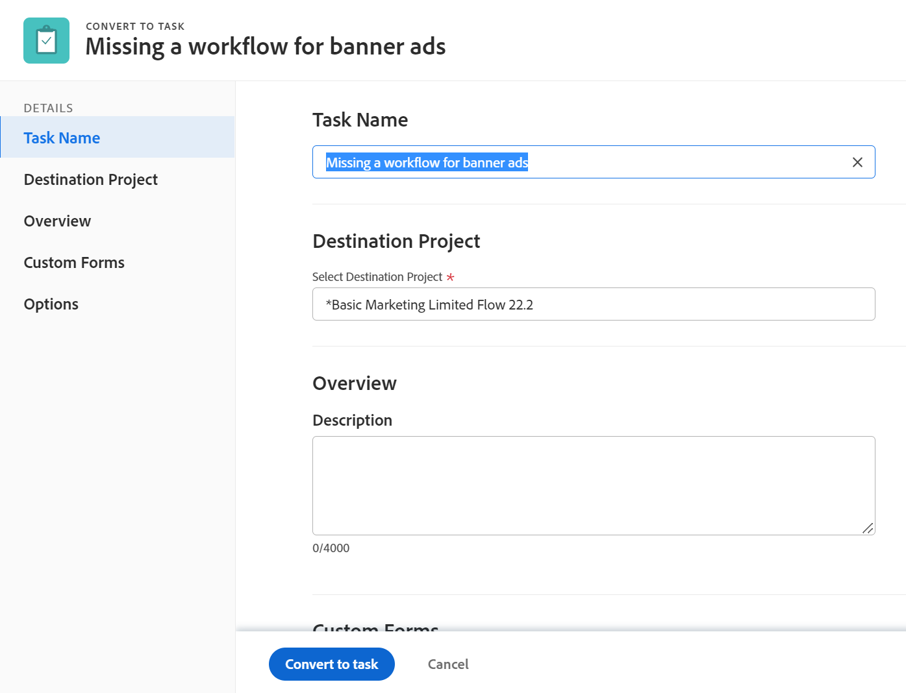

# Convertire un problema in un’attività in Adobe Workfront

Se dopo l’invio del problema è necessario eseguire più operazioni per completare un problema, puoi convertire il problema in un’attività.

Per informazioni generali sulla conversione dei problemi, vedi [Panoramica sulla conversione dei problemi in Adobe Workfront](../../../manage-work/issues/convert-issues/convert-issues.md).

## Requisiti di accesso

Per eseguire i passaggi descritti in questo articolo, è necessario disporre dei seguenti diritti di accesso:

<table style="table-layout:auto"> 
 <col> 
 <col> 
 <tbody> 
  <tr> 
   <td role="rowheader">piano Adobe Workfront*</td> 
   <td> 
Qualsiasi
 </td> 
  </tr> 
  <tr> 
   <td role="rowheader">Licenza Adobe Workfront*</td> 
   <td> 
Lavoro o superiore
 </td> 
  </tr> 
  <tr> 
   <td role="rowheader">Configurazioni a livello di accesso*</td> 
   <td> 
Modificare l’accesso a Problemi, Attività e Progetti
 
Nota: Se non disponi ancora dell’accesso, chiedi all’amministratore Workfront se ha impostato ulteriori restrizioni nel livello di accesso. Per informazioni su come un amministratore Workfront può modificare il livello di accesso, consulta <a href="../../../administration-and-setup/add-users/configure-and-grant-access/create-modify-access-levels.md" class="MCXref xref">Creare o modificare livelli di accesso personalizzati</a>.
 </td> 
  </tr> 
  <tr> 
   <td role="rowheader">Autorizzazioni oggetto</td> 
   <td> 
Visualizza le autorizzazioni per il problema
 
Autorizzazioni di Contribute per il progetto
 
Ottieni le autorizzazioni di gestione per l’attività dopo la conversione del problema
 
Per informazioni sulla richiesta di accesso aggiuntivo, vedi <a href="../../../workfront-basics/grant-and-request-access-to-objects/request-access.md" class="MCXref xref">Richiedere l’accesso agli oggetti </a>.
 </td> 
  </tr> 
 </tbody> 
</table>

*Per sapere quale piano, tipo di licenza o accesso si dispone, contattare l&#39;amministratore Workfront.

## Convertire un problema in un’attività

1. Vai a un progetto e fai clic su [!UICONTROL **Problemi** ] nel pannello a sinistra.
1. Fai clic sul problema da convertire per passare alla pagina di destinazione del problema.
1. Fai clic sul pulsante [!UICONTROL **Altro**] sul problema, quindi [!UICONTROL **Converti in attività**].

   

   >[!TIP]
   >
   >Se il problema è associato a un processo di approvazione o è già associato a un oggetto di risoluzione, Workfront visualizza un avviso nella parte superiore della [!UICONTROL Converti in progetto] per notificare all&#39;utente la rimozione dell&#39;approvazione o la sovrascrittura dell&#39;oggetto di risoluzione durante la conversione. Per ulteriori informazioni, consulta [Panoramica sulla conversione dei problemi in Adobe Workfront](../../../manage-work/issues/convert-issues/convert-issues.md).

1. Aggiorna il nome dell’attività nella [!UICONTROL Nome attività] sezione . Per impostazione predefinita, il nome dell’attività corrisponde a quello del problema originale.

   

1. Fai clic su [!UICONTROL **Progetto di destinazione**], quindi inizia a digitare il nome del progetto in cui desideri inserire la nuova attività nel [!UICONTROL **Progetto di destinazione**] e selezionalo quando viene visualizzato nell’elenco. Il progetto del problema è selezionato per impostazione predefinita.

1. Fai clic su [!UICONTROL **Panoramica**], quindi digita a [!UICONTROL **Descrizione**] per l&#39;attività.

   >[!TIP]
   >
   >   Un amministratore di sistema o di gruppo può modificare l’ordine delle sezioni nel pannello a sinistra della casella di conversione modificando il modello di layout.

1. (Facoltativo e condizionale) Fai clic su [!UICONTROL **Opzioni**], seleziona una delle opzioni seguenti.

   L’amministratore di Workfront o l’amministratore di gruppo deve abilitare queste preferenze prima che siano visibili durante la conversione dei problemi:

   * [!UICONTROL **Mantenere il problema originale e legarne la risoluzione a questo compito**]

      Se non è selezionato, il problema originale viene eliminato.

      >[!NOTE]
      >
      >Gli utenti senza accesso o autorizzazioni per eliminare i problemi non saranno in grado di eliminare il problema durante la conversione, indipendentemente dallo stato di questa impostazione. Per informazioni sull’accesso e le autorizzazioni per i problemi, consulta:
      >   
      >   * [Concedere l’accesso ai problemi](../../../administration-and-setup/add-users/configure-and-grant-access/grant-access-issues.md)
      >   * [Condividere un problema](../../../workfront-basics/grant-and-request-access-to-objects/share-an-issue.md)

   * [!UICONTROL **Consenti accesso a questa attività (nome utente)**]

      Se non è selezionato, il contatto principale del problema non ha accesso alla nuova attività.

   * [!UICONTROL **Mantieni la data di completamento pianificata del problema**]

      Se non è selezionata, la [!UICONTROL Data completamento pianificata] della nuova attività viene calcolata dal [!UICONTROL Data di inizio prevista] del compito. La [!UICONTROL Data di inizio prevista] della nuova attività viene impostata in base alle preferenze di sistema per le nuove attività.

      >[!NOTE]
      >
      >
      >Le opzioni visualizzate dipendono dal modo in cui l’amministratore di Workfront le ha configurate per tutti gli utenti del sistema. Per ulteriori informazioni, consulta [Configurare le preferenze relative alle attività e ai problemi a livello di sistema](../../../administration-and-setup/set-up-workfront/configure-system-defaults/set-task-issue-preferences.md).
      >
      >Oppure, se i gruppi di primo livello dell’organizzazione li hanno configurati separatamente, le opzioni visualizzate qui dipendono dal gruppo associato al progetto selezionato al passaggio 6. Per ulteriori informazioni, consulta [Configurare le preferenze per attività e problemi per un gruppo](../../../administration-and-setup/manage-groups/create-and-manage-groups/configure-task-issue-preferences-group.md).

1. (Facoltativo) Fai clic su [!UICONTROL **Forms personalizzato**] e allegare un modulo personalizzato per la nuova attività.

   >[!TIP]
   >
   >* Se un modulo personalizzato con più oggetti associato al problema è configurato per l’utilizzo sia con problemi che con attività, tutte le informazioni salvate nel modulo vengono mantenute quando si effettua la conversione, se i campi sono presenti sia sul problema che nei moduli personalizzati dell’attività.
   >* Se al problema e all’attività è associato un modulo personalizzato con più oggetti con un campo calcolato, il problema e l’attività devono essere compatibili con tutti i campi a cui si fa riferimento nei campi personalizzati calcolati del modulo. In caso di incompatibilità, un messaggio ti avvisa di apportare modifiche. Per ulteriori informazioni, consultare la sezione &quot;Campi personalizzati calcolati nei moduli personalizzati con più oggetti&quot; nella sezione [Aggiungere dati calcolati a un modulo personalizzato con il modulo precedente](../../../administration-and-setup/customize-workfront/create-manage-custom-forms/add-calculated-data-to-custom-form.md).
   >* Se nel progetto di destinazione sono presenti moduli predefiniti definiti nel campo Forms personalizzato predefinito attività durante la modifica del progetto, tali moduli di attività vengono aggiunti anche alla nuova attività. Tutti i campi personalizzati comuni tra il problema originale e i campi nei moduli attività predefiniti vengono precompilati con le informazioni dei campi del problema.

1. Fai clic su [!UICONTROL **Converti in attività**].

   Se hai deciso di eliminare il problema originale, ora il problema è un’attività sul progetto designato.

   Oppure

   Il problema è ora collegato alla nuova attività sul progetto scelto e verrà completato una volta completata l&#39;attività, se si decide di mantenere il problema originale.

   Alcuni campi del problema vengono trasferiti all&#39;attività. Per informazioni, consulta la sezione [Visualizza le informazioni originali sui problemi relativi a progetti e attività](#view-original-issue-information-on-projects-and-tasks) in questo articolo.

1. (Facoltativo) Continua a modificare l’attività come necessario.

## Visualizza le informazioni originali sui problemi relativi a progetti e attività {#view-original-issue-information-on-projects-and-tasks}

È possibile visualizzare le informazioni originali sul problema negli elenchi di progetti e task o nell&#39;area Dettagli progetto. Per informazioni sulla creazione dei rapporti, vedi [Creare un rapporto personalizzato](../../../reports-and-dashboards/reports/creating-and-managing-reports/create-custom-report.md).

La tabella seguente illustra i campi dei problemi visibili dai progetti e dalle attività convertiti.

| Campi del problema | Campo progetto o attività | Elenco o rapporto di progetto | Area Dettagli progetto | Elenco o rapporto delle attività | Area Dettagli attività |
|---|---|---|---|---|---|
| [!UICONTROL Nome Issue] | [!UICONTROL Nome problema convertito] | ↓ | ✔ | ✔ | ✔ |
| [!UICONTROL Contatto principale] | [!UICONTROL Nome dell&#39;origine del problema convertito] | ✔ | ✔ | ✔ |
| [!UICONTROL Data inserimento] | [!UICONTROL Data voce problema convertito] | ✔ |  | ✔ |

>[!CAUTION]
>
>Se la [!UICONTROL Contatto principale] di un problema cambia o se il problema viene scollegato dal progetto o dall&#39;attività dopo la conversione, il [!UICONTROL Nome dell&#39;origine del problema convertito ]non aggiorna e visualizza l&#39;originale [!UICONTROL Contatto principale] del problema al momento della conversione.
