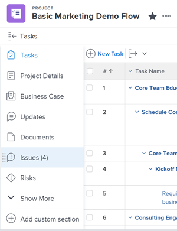

# Panoramica sulla conversione dei problemi in Adobe Workfront

Se dopo l’invio del problema è necessario eseguire più operazioni per completare un problema, puoi convertire il problema in un progetto o in un’attività.

Per informazioni sulla conversione dei problemi in attività, consulta [Convertire un problema in un’attività in Adobe Workfront](../../../manage-work/issues/convert-issues/convert-issue-to-task.md).

Per informazioni sulla conversione dei problemi in progetti, consulta [Convertire un problema in un progetto in Adobe Workfront](../../../manage-work/issues/convert-issues/convert-issue-to-project.md).

## Considerazioni sulla conversione dei problemi

* L&#39;amministratore di Workfront o l&#39;amministratore di gruppo ha già impostato le preferenze per ciò che accade a un problema, la sua risoluzione e l&#39;accesso al contatto principale quando viene convertito in un progetto o in un&#39;attività, come descritto in [Configurare le preferenze relative alle attività e ai problemi a livello di sistema](../../../administration-and-setup/set-up-workfront/configure-system-defaults/set-task-issue-preferences.md).
* Workfront rimuove tutte le approvazioni associate a problemi durante la conversione.
* Workfront sovrascrive l’oggetto di risoluzione del problema quando lo si converte in un’attività o in un progetto. La nuova attività o problema diventa il nuovo oggetto di risoluzione del problema dopo la conversione.
* Considera quanto segue:

   * Durante la conversione, ti potrebbe essere chiesto se desideri mantenere il problema e la sua risoluzione legate al progetto o all’attività che stai creando.
   * Se si mantiene il problema, lo stato e la percentuale di completamento del progetto o dell&#39;attività aggiornano automaticamente lo stato e la percentuale di completamento del problema quando si verificano modifiche al progetto, all&#39;attività o al problema oppure quando Workfront ricalcola la timeline.

* Quando si converte un problema in un progetto utilizzando un modello, la maggior parte delle informazioni del modello vengono trasferite al nuovo progetto. Tuttavia, alcune informazioni del problema possono anche essere trasferite al nuovo progetto. Per ulteriori informazioni, consulta la sezione [Panoramica dei campi del progetto durante la conversione di un problema in un progetto utilizzando un modello](#overview-of-project-fields-when-converting-an-issue-to-a-project-using-a-template) in questo articolo.
* Durante la conversione di un problema, non tutti i documenti o le relative informazioni vengono spostati nel nuovo oggetto in cui viene convertito il problema. Quando si converte un problema a cui sono allegati documenti o collegamenti a documenti, vengono inclusi gli elementi seguenti:

   * Documento
   * Documentare i collegamenti a servizi di terze parti, ad esempio Google Drive o SharePoint.
   * Versioni
   * Le bozze sono incluse solo quando l’opzione **Mantenere il problema originale e legarne la risoluzione a questo compito** viene deselezionato.
   * Le approvazioni dei documenti non vengono incluse quando si converte un problema a cui sono allegati documenti e collegamenti ai documenti.

* Se hai deciso di mantenere il problema nella conversione e presenta documenti allegati, il documento e le relative versioni vengono copiati nel progetto o nell’attività. Le bozze e le approvazioni del documento non vengono copiate nel progetto o nell&#39;attività.
* Se hai deciso di non mantenere il problema nella conversione e presenta documenti allegati, il documento, le sue versioni e le bozze trasferite al progetto o all’attività. Le approvazioni del documento non verranno trasferite al progetto o all&#39;attività.
* Se hai documenti e cartelle collegati al problema originale da servizi di terze parti, come Google Drive, indipendentemente dal fatto che tu stia conservando il problema o meno durante la conversione, questi collegamenti verranno copiati nel nuovo oggetto.
* I commenti relativi al problema vengono copiati anche nell’attività o nel progetto convertito dal problema, ma gli utenti con tag non verranno trasferiti.
* Se si desidera trasferire le informazioni del modulo personalizzato dal problema al progetto o all&#39;attività in cui si sta convertendo, assicurarsi di disporre di un modulo personalizzato per il progetto o l&#39;attività che includa gli stessi campi che si desidera trasferire dal problema. Per ulteriori informazioni, consulta [Trasferimento di dati modulo personalizzati durante la conversione di un oggetto](../../../administration-and-setup/customize-workfront/create-manage-custom-forms/transfer-custom-form-data-larger-item.md).

## Panoramica dei campi del progetto durante la conversione di un problema in un progetto utilizzando un modello {#overview-of-project-fields-when-converting-an-issue-to-a-project-using-a-template}

Durante la conversione di un problema in un progetto, puoi convertirlo in un progetto vuoto o utilizzare un modello.

Per informazioni, consulta [Convertire un problema in un progetto in Adobe Workfront](../../../manage-work/issues/convert-issues/convert-issue-to-project.md).

Quando si utilizza un modello, alcuni campi compilati nel modello vengono trasferiti al progetto creato dal problema convertito. Altri campi vengono trasferiti al progetto dal problema convertito.

Nella tabella seguente sono elencate le informazioni sul progetto e se vengono trasferite dal modello o dal problema:

<table style="table-layout:auto"> 
 <col> 
 <col> 
 <tbody> 
  <tr> 
   <td>Descrizione</td> 
   <td> 
La descrizione del problema effettua il trasferimento al nuovo progetto. 
 
 Se non è presente alcuna descrizione del problema, la descrizione del modello viene trasferita al progetto. 
 
Se il campo Descrizione è vuoto sia per il problema che per il modello, il campo è vuoto nel progetto. 
 </td> 
  </tr> 
  <tr> 
   <td>Stato</td> 
   <td>Stato predefinito selezionato per il gruppo nel modello. Se il modello non è associato al gruppo, lo stato del progetto viene impostato sullo stato predefinito impostato dall’amministratore Workfront nell’area Preferenze progetto di Configurazione. Per informazioni, consulta <a href="../../../administration-and-setup/set-up-workfront/configure-system-defaults/set-project-preferences.md" class="MCXref xref">Configurare le preferenze del progetto a livello di sistema</a>.</td> 
  </tr> 
  <tr> 
   <td>Priorità</td> 
   <td>Trasferimenti dal modello. </td> 
  </tr> 
  <tr> 
   <td>URL</td> 
   <td> 
L’URL dal problema viene trasferito al nuovo progetto. 
 
 Se non è specificato alcun URL sul problema, l’URL del modello viene trasferito al progetto. 
 
Se il campo URL è vuoto sia per il problema che per il modello, il campo è vuoto nel progetto. 
 </td> 
  </tr> 
  <tr> 
   <td>Tipo di condizione del progetto</td> 
   <td>Trasferimenti dal modello.</td> 
  </tr> 
  <tr> 
   <td>Condizione del progetto</td> 
   <td>Corrisponde alla preferenza predefinita a livello di sistema determinata dall'amministratore Workfront nell'area Configurazione. Per informazioni, consulta <a href="../../../administration-and-setup/customize-workfront/create-manage-custom-conditions/set-custom-condition-default-projects.md" class="MCXref xref">Impostare una condizione personalizzata come predefinita per i progetti</a></td> 
  </tr> 
  <tr> 
   <td>Pianifica da</td> 
   <td>Trasferimenti dal modello.</td> 
  </tr> 
  <tr> 
   <td>Date progetto</td> 
   <td> 
    <ul> 
     <li> 
<b>Data di inizio prevista</b>: L'orario di lavoro più vicino in base all'orario di lavoro della pianificazione del modello deve essere preselezionato, in base al fuso orario della pianificazione del modello. Questo campo è disabilitato se il campo Schedule From (Pianificazione da) è impostato su From Completion (Da completamento). 
 </li> 
     <li> 
<b>Data completamento pianificata</b>: L'orario di lavoro più vicino in base all'orario di lavoro della pianificazione del modello deve essere preselezionato, in base al fuso orario della pianificazione del modello. Questo campo è disabilitato se il campo Schedule From (Pianificazione da) è impostato su From Start (Dall'inizio). 
 </li> 
    </ul> </td> 
  </tr> 
  <tr> 
   <td>Portfolio</td> 
   <td>Trasferimenti dal modello. In caso contrario, il campo è vuoto.</td> 
  </tr> 
  <tr> 
   <td>Programma</td> 
   <td>Trasferimenti dal modello. In caso contrario, il campo è vuoto.</td> 
  </tr> 
  <tr> 
   <td>Gruppo</td> 
   <td>Trasferimenti dal modello. Se il modello non contiene gruppi, viene impostato sul gruppo del progetto a cui appartiene il problema.</td> 
  </tr> 
  <tr> 
   <td>Azienda</td> 
   <td>Trasferimenti dal modello. In caso contrario, il campo è vuoto.</td> 
  </tr> 
  <tr> 
   <td>Proprietario progetto</td> 
   <td>Trasferimenti dal campo Proprietario modello nel modello. In caso contrario, viene impostato sull'utente connesso che sta eseguendo la conversione. </td> 
  </tr> 
  <tr> 
   <td>Sponsor del progetto</td> 
   <td>Trasferimenti dal campo Sponsor modello sul modello. In caso contrario, il campo è vuoto.</td> 
  </tr> 
  <tr> 
   <td>Gestione risorse</td> 
   <td>Trasferimenti dal modello. In caso contrario, il campo è vuoto.</td> 
  </tr> 
  <tr> 
   <td>Impostazioni attività</td> 
   <td>Trasferisci dal modello.</td> 
  </tr> 
  <tr> 
   <td>Impostazioni problema</td> 
   <td>Trasferisci dal modello. </td> 
  </tr> 
  <tr> 
   <td>Accesso</td> 
   <td> 
Trasferimenti dalla sezione Accesso del modello. 
 </td> 
  </tr> 
  <tr> 
   <td>Approvazioni</td> 
   <td>Trasferisci dal modello. Le approvazioni associate al problema vengono rimosse durante la conversione. </td> 
  </tr> 
 </tbody> 
</table>

<!--WRITER

<h2>Convert an issue to a project</h2> 

(NOTE:&nbsp;moved to its own article)

-->
<!--
<ol>
<li value="1"> Click the <strong>Issues</strong> icon on a project. 
  
 </li>
<li value="2"> 
Click the issue to be converted to access the issue.
 </li>
<li value="3"> 
 Click the <strong>More</strong> menu, then click <strong>Convert to Project</strong>. 
 
  
 </li>
<li value="4"> 
In the submenu that displays, do one of the following:

<ul>
<li>Click <strong>New Project</strong></li>
<li>Under <strong>New from Template</strong>, click the name of a project template you want to use</li>
</ul> </li>
<li value="5"> 
Specify a name for the project.
 
The default name is the name of the issue you are converting.
 </li>
<li value="6">(Optional and conditional) If you are creating this project from a template, update the available fields in the Convert to Project box. For more information about editing fields on projects, see <a href="../../../manage-work/projects/manage-projects/edit-projects.md" class="MCXref xref">Edit projects</a>.</li>
<li value="7"> 
(Optional and conditional) Under <strong>Options</strong>, select any of the available options:

<ul>
<li> 
<strong>Keep the original issue and tie its resolution to the this project</strong>When deselected, the original issue is deleted.
 <note type="note">

Users without access or permissions to delete issues will not be able to delete the issue as they are converting it, regardless of the status of this setting. For information about access and permissions to issues, see:

<ul>
<li> 
<a href="../../../administration-and-setup/add-users/configure-and-grant-access/grant-access-issues.md" class="MCXref xref">Grant access to issues</a> 
 </li>
<li> 
<a href="../../../workfront-basics/grant-and-request-access-to-objects/share-an-issue.md" class="MCXref xref">Share an issue </a> 
 </li>
</ul>
</note> </li>
<li><strong>Allow <User Name> to have access to this project</strong>If unselected, the user who entered the issue has no access to the new task.</li>
</ul> <note type="note">

The options that are available here depend on how the Workfront administrator has configured them for everyone in the system or for your group. For more information, see <a href="../../../administration-and-setup/set-up-workfront/configure-system-defaults/set-task-issue-preferences.md" class="MCXref xref">Configure system-wide task and issue preferences</a>.

Or, if the top-level groups in your organization configured them separately, the options available here depend on which group you selected for the new project in step 6. For more information, see <a href="../../../administration-and-setup/manage-groups/create-and-manage-groups/configure-task-issue-preferences-group.md" class="MCXref xref">Configure task and issue preferences for a group</a>.

</note> </li>
<li value="8">(Optional) In the <strong>Custom Forms</strong> section, attach any custom forms. For more information about transferring information from the custom form of the issue to that of the new project, see <a href="../../../administration-and-setup/customize-workfront/create-manage-custom-forms/transfer-custom-form-data-larger-item.md" class="MCXref xref">Transfer custom form data when converting an object</a>.</li>
<li value="9"> 
Click <strong>Save Changes.</strong>
 
  
 
The issue is now a project, if you decided to delete the original issue. Or The issue is now linked to the new project and it will complete when the project completes, if you decided to keep the original issue. 
 
Some issue fields transfer to the project. For information, see the <a href="#view-original-issue-information-on-projects-and-tasks" class="MCXref xref">View original issue information on projects and tasks</a> section in this article. 
 </li>
<li value="10"> 
(Optional) Set any further project details ​(project owner, project dates) and tasks as necessary.
 </li>
</ol>

-->

<!--

<h2>Convert an issue to a task</h2> 
(NOTE: moved to its own article)

-->
<!--
<ol>
<li value="1"> Click the Issues icon on a project.  </li>
<li value="2"> 
Click the issue you want to convert to go to the issue's landing page. 
 </li>
<li value="3"> 
 Click the <strong>More</strong> menu on the issue, then <strong>Convert to Task</strong>.  
 
  
 </li>
<li value="4"> 
Name the task.
 </li>
<li value="5"> 
Identify the project where the task will reside. 
 
You can select a different project from the project that the issue is on.
 </li>
<li value="6"> 
In the <strong>Project</strong> box, start typing the name of the project where you want to put the new task, then press <strong>Enter</strong> when it appears.
 
By default, this box the name of the project containing the issue that you are converting.
 </li>
<li value="7"> 
(Optional and conditional) Under <strong>Options</strong>, select any of the following options. 
 
The Workfront administrator or group administrator must enable these preferences before they are visible during the conversion of issues: 

<ul>
<li> 
<strong>Keep the original issue and tie its resolution to the this task</strong> 
 
If unselected, the original issue is deleted.
 <note type="note">

Users without access or permissions to delete issues will not be able to delete the issue as they are converting it, regardless of the status of this setting. For information about access and permissions to issues, see:

<ul>
<li> 
<a href="../../../administration-and-setup/add-users/configure-and-grant-access/grant-access-issues.md" class="MCXref xref">Grant access to issues</a> 
 </li>
<li> 
<a href="../../../workfront-basics/grant-and-request-access-to-objects/share-an-issue.md" class="MCXref xref">Share an issue </a> 
 </li>
</ul>
</note> </li>
<li> 
<strong>Allow <User Name> to have access to this task</strong> 
 
If unselected, the user who entered the issue has no access to the new task.
 </li>
<li> 
<strong>Keep the planned completion date of the issue</strong> 
 
If unselected, the Planned Completion Date of the new task is calculated from the Planned Start Date of the task. The Planned Start Date of the new task is set according to the system preferences for new tasks.
 </li>
</ul> <note type="note">

The options that display here depend on how the Workfront administrator configured them for everyone in the system. For more information, see <a href="../../../administration-and-setup/set-up-workfront/configure-system-defaults/set-task-issue-preferences.md" class="MCXref xref">Configure system-wide task and issue preferences</a>.

Or, if the top-level groups in your organization configured them separately, the options that display here depend on which group is associated with the project you selected in step 6. For more information, see <a href="../../../administration-and-setup/manage-groups/create-and-manage-groups/configure-task-issue-preferences-group.md" class="MCXref xref">Configure task and issue preferences for a group</a>.

</note> </li>
<li value="8">(Optional) Attach custom forms. For more information about transferring information from the custom form of the issue to that of the new task, see <a href="../../../administration-and-setup/customize-workfront/create-manage-custom-forms/transfer-custom-form-data-larger-item.md" class="MCXref xref">Transfer custom form data when converting an object</a>. 

</li>
<li value="9"> 
Click <strong>Save Changes</strong> when all task settings are set.
 
The issue is now a task on the designated project, if you decided to delete the original issue.
 
Or
 
The issue is now linked to the new task on the project you chose, and it will complete once the task completes, if you decided to keep the original issue.
 
Some issue fields transfer to the task. For information, see the <a href="#view-original-issue-information-on-projects-and-tasks" class="MCXref xref">View original issue information on projects and tasks</a> section in this article.  
 </li>
<li value="10"> 
(Optional) Continue editing the task (assignments, dates) as necessary. 
 </li>
</ol>

-->

## Visualizza le informazioni originali sui problemi relativi a progetti e attività {#view-original-issue-information-on-projects-and-tasks}

È possibile visualizzare le informazioni originali sul problema negli elenchi di progetti e task o nell&#39;area Dettagli progetto. Per informazioni sulla creazione dei rapporti, vedi [Creare un rapporto personalizzato](../../../reports-and-dashboards/reports/creating-and-managing-reports/create-custom-report.md).

La tabella seguente illustra i campi dei problemi visibili dai progetti e dalle attività convertiti.

| Campi del problema | Campo progetto o attività | Elenco o rapporto di progetto | Area Dettagli progetto | Elenco o rapporto delle attività | Area Dettagli attività |
|---|---|---|---|---|---|
| Nome Issue | Nome problema convertito | ↓ | ✔ | ✔ | ✔ |
| Contatto principale | Nome dell&#39;origine del problema convertito | ✔ | `✔` | ✔ |   |
| Data inserimento | Data di ingresso emissione convertita | ✔ |   | ✔ |   |

>[!CAUTION]
>
>Se il contatto primario di un problema cambia o se il problema viene scollegato dal progetto o dall&#39;attività dopo la conversione del problema, il nome dell&#39;origine dell&#39;emissione convertita non viene aggiornato e visualizza il contatto principale originale del problema al momento della conversione del problema.
