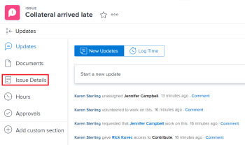

# Aggiorna priorità del problema

Puoi definire una priorità per un problema per indicare l’importanza del problema.

Per modificare la priorità del problema è necessario disporre delle autorizzazioni di gestione.  [Aggiornare la priorità di un problema](#update-the-priority-of-an-issue).

## Requisiti di accesso

Per eseguire i passaggi descritti in questo articolo, è necessario disporre dei seguenti diritti di accesso:

<table style="table-layout:auto"> 
 <col> 
 <col> 
 <tbody> 
  <tr> 
   <td role="rowheader">piano Adobe Workfront*</td> 
   <td> 
Qualsiasi 
 </td> 
  </tr> 
  <tr> 
   <td role="rowheader">Licenza Adobe Workfront*</td> 
   <td> 
Richiesta o superiore
 </td> 
  </tr> 
  <tr> 
   <td role="rowheader">Configurazioni a livello di accesso*</td> 
   <td> 
Modifica accesso ai problemi
 
Nota: Se non disponi ancora dell’accesso, chiedi all’amministratore Workfront se ha impostato ulteriori restrizioni nel livello di accesso. Per informazioni su come un amministratore Workfront può modificare il livello di accesso, consulta <a href="../../../administration-and-setup/add-users/configure-and-grant-access/create-modify-access-levels.md" class="MCXref xref">Creare o modificare livelli di accesso personalizzati</a>.
 </td> 
  </tr> 
  <tr> 
   <td role="rowheader">Autorizzazioni oggetto</td> 
   <td> 
Gestire le autorizzazioni al problema
 
Per informazioni sulla richiesta di accesso aggiuntivo, vedi <a href="../../../workfront-basics/grant-and-request-access-to-objects/request-access.md" class="MCXref xref">Richiedere l’accesso agli oggetti </a>.
 </td> 
  </tr> 
 </tbody> 
</table>

&#42;Per informazioni sul piano, il tipo di licenza o l&#39;accesso, contattare l&#39;amministratore Workfront.

## Panoramica delle priorità delle questioni

A ogni etichetta di priorità è associato un numero che non può essere modificato.

Gli amministratori di Adobe Workfront possono modificare le etichette di priorità in Workfront oppure possono creare nuove priorità. Di conseguenza, le opzioni disponibili per il campo Priorità nell’istanza di Workfront potrebbero essere diverse da quelle elencate di seguito.

È necessario acquisire familiarità con la sequenza di numerazione per le priorità utilizzate nell&#39;organizzazione.\
Ad esempio, se l’etichetta della priorità è stata modificata, l’organizzazione potrebbe utilizzare il numero 1 per fare riferimento alle attività urgenti.

Per ulteriori informazioni sulla personalizzazione dei nomi delle priorità nell’istanza, vedi [Creare e personalizzare le priorità](../../../administration-and-setup/customize-workfront/creating-custom-status-and-priority-labels/create-customize-priorities.md).

Per informazioni su ciascuna etichetta di priorità predefinita e il relativo numero, fare riferimento alla tabella seguente:

<table style="table-layout:auto"> 
 <col> 
 <col> 
 <thead> 
  <tr> 
   <th>Etichetta priorità  (Può essere modificato) </th> 
   <th>Numero priorità  (Impossibile modificare) </th> 
  </tr> 
 </thead> 
 <tbody> 
  <tr> 
   <td> Nessuno </td> 
   <td> 0 </td> 
  </tr> 
  <tr> 
   <td> Basso </td> 
   <td> 1 </td> 
  </tr> 
  <tr> 
   <td> Normal </td> 
   <td> 2 </td> 
  </tr> 
  <tr> 
   <td> Alta </td> 
   <td> 3 </td> 
  </tr> 
  <tr> 
   <td> Urgente </td> 
   <td> 4 </td> 
  </tr> 
 </tbody> 
</table>

## Aggiornare la priorità di un problema {#update-the-priority-of-an-issue}

1. Passa al problema di cui vuoi modificare la priorità.
1. Fai clic su **Dettagli del problema** nel pannello a sinistra.

   

   La **Panoramica** La sezione deve essere visualizzata per impostazione predefinita.

1. Fai clic sul pulsante **Priorità** nel campo **Informazioni di base** area.

   

1. Seleziona un valore per la **Priorità** campo .

   Le opzioni variano a seconda della configurazione delle priorità da parte dell’amministratore di Workfront nel sistema.

1. Fai clic su **Salva modifiche**.
