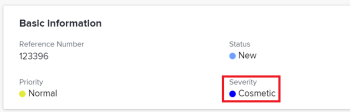

# Aggiorna gravità del problema

Puoi associare una gravità ai problemi in Adobe Workfront. Le attività e i progetti non hanno gravità.

I problemi sono eventi imprevisti che possono impedire il completamento dei progetti nei tempi o con budget limitati. È possibile utilizzare le gravità per indicare la gravità di un problema. 

L’amministratore di Workfront definisce le gravità disponibili in Workfront. Dopo averli stabiliti, possono essere associati a un problema.\
Per ulteriori informazioni sulla creazione di gravità in Workfront, vedi [Creare o personalizzare le gravità dei problemi](../../../administration-and-setup/customize-workfront/creating-custom-status-and-priority-labels/create-customize-issue-severities.md).

Per poter aggiornare la gravità di un problema è necessario disporre delle autorizzazioni di Contribute. 

Puoi aggiornare la gravità dei problemi nelle seguenti aree di Workfront:

* In **Modifica problema** finestra di dialogo
* In **Dettagli del problema** area di emissione
* In un elenco o report dei problemi

## Requisiti di accesso

Per eseguire i passaggi descritti in questo articolo, è necessario disporre dei seguenti diritti di accesso:

<table style="table-layout:auto"> 
 <col> 
 <col> 
 <tbody> 
  <tr> 
   <td role="rowheader">piano Adobe Workfront*</td> 
   <td> 
Qualsiasi 
 </td> 
  </tr> 
  <tr> 
   <td role="rowheader">Licenza Adobe Workfront*</td> 
   <td> 
Richiesta o superiore
 </td> 
  </tr> 
  <tr> 
   <td role="rowheader">Configurazioni a livello di accesso*</td> 
   <td> 
Modifica accesso ai problemi
 
Nota: Se non disponi ancora dell’accesso, chiedi all’amministratore Workfront se ha impostato ulteriori restrizioni nel livello di accesso. Per informazioni su come un amministratore Workfront può modificare il livello di accesso, consulta <a href="../../../administration-and-setup/add-users/configure-and-grant-access/create-modify-access-levels.md" class="MCXref xref">Creare o modificare livelli di accesso personalizzati</a>.
 </td> 
  </tr> 
  <tr> 
   <td role="rowheader">Autorizzazioni oggetto</td> 
   <td> 
Gestire le autorizzazioni al problema
 
Per informazioni sulla richiesta di accesso aggiuntivo, vedi <a href="../../../workfront-basics/grant-and-request-access-to-objects/request-access.md" class="MCXref xref">Richiedere l’accesso agli oggetti </a>.
 </td> 
  </tr> 
 </tbody> 
</table>

&#42;Per informazioni sul piano, il tipo di licenza o l&#39;accesso, contattare l&#39;amministratore Workfront.

## Aggiorna gravità del problema

Per aggiornare la gravità di un problema nell&#39;area Dettagli problema di un problema:

1. Passa al problema di cui desideri aggiornare la gravità.
1. Fai clic su **Dettagli del problema** nel pannello a sinistra.

   La **Panoramica** La sezione deve essere visualizzata per impostazione predefinita.

1. Fai clic sul pulsante **Gravità** nel campo **Informazioni di base** area.

   

1. Selezionare il **Gravità** dal menu a discesa.

   Le opzioni variano a seconda della configurazione delle severità da parte dell’amministratore di Workfront nel sistema.

1. Fai clic su **Salva modifiche**.
