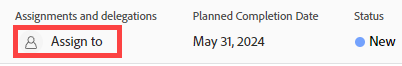
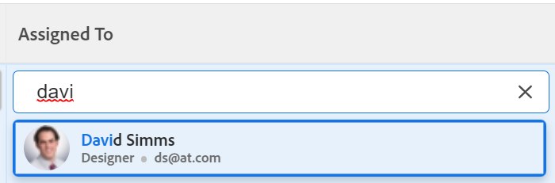

# Assegna problemi

<!--Audited: 07/2024-->

Puoi assegnare i problemi a utenti, ruoli e team per indicare chi è responsabile del completamento dei problemi. Per informazioni generali sull&#39;assegnazione dei problemi, vedere [Panoramica sulla modifica delle assegnazioni dei problemi](../../../manage-work/issues/manage-issues/modify-issue-assignments-overview.md).

>[!TIP]
>
>Puoi assegnare più utenti, mansioni o team. Puoi assegnare solo utenti attivi, mansioni e team.
>
>Se un utente, una mansione o un team è stato assegnato prima della disattivazione, rimane assegnato all&#39;elemento di lavoro. In questo caso, consigliamo quanto segue:
>
>* Riassegnare l&#39;elemento di lavoro alle risorse attive.
>* Associare gli utenti di un team disattivato a un team attivo e riassegnare l&#39;elemento di lavoro al team attivo.

Oltre a questo articolo, si consiglia di leggere i seguenti articoli per ulteriori informazioni sull’assegnazione dei problemi:

* [Panoramica sulla modifica delle assegnazioni dei problemi](../../../manage-work/issues/manage-issues/modify-issue-assignments-overview.md)
* [Modifica problemi](../../../manage-work/issues/manage-issues/edit-issues.md)
* [Modifica le assegnazioni utente per più problemi in un elenco](../../../manage-work/issues/manage-issues/edit-assignments-for-multiple-issues.md)
* [Crea assegnazioni avanzate](../../../manage-work/tasks/assign-tasks/create-advanced-assignments.md)
* [Assegnazioni intelligenti](../../../manage-work/tasks/assign-tasks/make-smart-assignments.md)
* [Panoramica assegnazioni avanzate](../../../manage-work/tasks/assign-tasks/smart-assignments.md)
* [Panoramica sull’assegnazione del lavoro nel Bilanciatore dei carichi di lavoro](../../../resource-mgmt/workload-balancer/assign-work-in-workload-balancer.md)

È possibile assegnare un problema a una o più risorse a livello di singolo problema oppure più risorse a più problemi contemporaneamente.

L’assegnazione di problemi e attività è simile in Adobe Workfront. Per informazioni generali sull&#39;assegnazione delle attività, vedere [Panoramica sulla modifica delle assegnazioni delle attività](../../../manage-work/tasks/assign-tasks/modify-task-assignments-overview.md).

## Requisiti di accesso

+++ Espandi per visualizzare i requisiti di accesso per la funzionalità in questo articolo. 

<table style="table-layout:auto"> 
 <col> 
 </col>
 <tbody> 
  <tr> 
   <td>Pacchetto Adobe Workfront</td> 
   <td> 
Qualsiasi 
 </td> 
  </tr> 
  <tr> 
   <td>Licenza Adobe Workfront</td> 
   <td> 
Collaboratore o versione successiva

   
Revisione o successiva
 </td> 
  </tr> 
  <tr> 
   <td>Configurazioni del livello di accesso</td> 
   <td> 
Modifica l'accesso alle Issues
 
Accesso di visualizzazione o superiore a progetti e attività per assegnare un problema
 </td> 
  </tr> 
  <tr> 
   <td>Autorizzazioni oggetto</td> 
   <td> 
Gestire le autorizzazioni per il problema
 
 Visualizzare le autorizzazioni o versioni successive per il progetto o l’attività in cui si trova il problema, quando si assegna un problema

Quando si assegnano più problemi, contribuire con autorizzazioni o versioni successive al progetto o all’attività in cui si trova il problema.
 </td> 
  </tr> 
 </tbody> 
</table>

Per informazioni, consulta [Requisiti di accesso nella documentazione di Workfront](/help/quicksilver/administration-and-setup/add-users/access-levels-and-object-permissions/access-level-requirements-in-documentation.md).

+++

## Considerazioni per più assegnazioni a mansioni, team e utenti

Quando si assegnano più risorse a un elemento di lavoro, tenere presente quanto segue:

* Gli utenti possono avere più di una mansione associata al loro profilo. Per informazioni sull&#39;associazione degli utenti alle mansioni, vedere [Modificare il profilo di un utente](../../../administration-and-setup/add-users/create-and-manage-users/edit-a-users-profile.md).

* Le attività o i problemi vengono in genere prima assegnati a uno o più ruoli o team. Quando i progetti sono pronti per essere avviati, potrebbe essere necessario assegnarli anche agli utenti.

  Se un’attività o un problema è assegnato a uno o più ruoli e successivamente si assegna anche un utente, Adobe Workfront decide quale ruolo associare all’utente aggiuntivo (se presente) in base alle seguenti regole:

   * Se è stata assegnata una sola mansione e questa corrisponde alla mansione principale dell’utente, l’attività o il problema viene assegnato solo all’utente che svolge la sua mansione principale.
   * Se sono stati assegnati più ruoli e almeno uno dei ruoli corrisponde ai ruoli secondari dell’utente, l’attività o il problema viene assegnato all’utente che svolge uno dei suoi Altri ruoli, che Workfront seleziona in modo casuale in caso di più corrispondenze, nonché a eventuali ruoli aggiuntivi assegnati.
   * Se sono state assegnate una o più mansioni e non vi sono corrispondenze ai ruoli dell’utente, l’attività o il problema viene assegnato sia al ruolo o alle mansioni che all’utente.

* Se un’attività o un problema è assegnato a un team e si assegna anche un utente, l’attività o il problema rimane assegnato sia al team che all’utente.

<!--

<h2> </h2>
<h2>Considerations about removing assignments from issues</h2> 

(NOTE: drafted and moved to Modify issue assignments overview article)

You can remove assignments from one issue at a time, or you can remove assignments from multiple issues in bulk.

For more information about removing assignments from issues in bulk, see <a href="../../../manage-work/issues/manage-issues/edit-assignments-for-multiple-issues.md" class="MCXref xref">Modify user assignments for multiple issues in a list</a>. 

Consider the following when removing assignments from issues: 

<ul>
<li>When you unassign a user from an issue, the issue remains assigned to the job role that the user fulfilled on the issue.</li>
<li>When you unassign a job role or a team from an issue, the issue remains unassigned if it is not assigned to any other resources. </li>
</ul>

-->

## Assegnare un singolo problema

1. Passa al problema che desideri assegnare.
1. Fai clic su **Assegna a** nell&#39;angolo superiore destro dell&#39;intestazione del problema, nell&#39;area **Assegnazioni**

   Oppure

   Se il problema è già stato assegnato, fai clic sul nome delle assegnazioni correnti.

   

1. Esegui una delle operazioni seguenti:

   * Inizia a digitare il nome di un utente, una mansione o un team che desideri assegnare, quindi fai clic su di esso quando viene visualizzato nell’elenco.

     

   * (Condizionale) Fai clic su uno dei nomi, dei ruoli o dei team negli elenchi disponibili
   * Fai clic su **Assegna a me** per assegnarti
   * Fare clic su **Avanzate**.

     La creazione di assegnazioni avanzate è simile per attività e problemi. Per informazioni su come effettuare assegnazioni avanzate, vedere [Creare assegnazioni avanzate](../../../manage-work/tasks/assign-tasks/create-advanced-assignments.md).

     >[!TIP]
     >
     >Quando aggiungi un’assegnazione utente, osserva l’avatar, il ruolo principale dell’utente o il suo indirizzo e-mail per distinguere gli utenti con nomi identici.
     >
     >Gli utenti devono essere associati ad almeno una mansione per visualizzarla quando vengono aggiunti.
     >
     >Per consentire agli utenti di visualizzare le e-mail degli utenti, nel proprio livello di accesso deve essere abilitata l’impostazione Visualizza informazioni di contatto. Per informazioni, vedere [Concedere l&#39;accesso agli utenti](../../../administration-and-setup/add-users/configure-and-grant-access/grant-access-other-users.md)
     >

     <!-- this doesn't apply to issues; if it does, add this to the TIP above: 
      >When adding a job role assignment, you can search for the job role or location. Select a role from the Job roles list to use the default billing rate for the assignment, or select a Rate card job role to use the billing rate from the rate card. For more information on rate cards, see [Manage rate cards](/help/quicksilver/administration-and-setup/set-up-workfront/configure-system-defaults/manage-rate-cards.md).-->

1. Fai clic su **Salva** per completare l&#39;assegnazione del problema.
1. (Facoltativo) Fai clic sull&#39;icona **X** accanto al nome delle assegnazioni nell&#39;area Assegnazioni nell&#39;intestazione del problema per rimuovere un&#39;assegnazione.

## Assegnare un problema in un elenco

È possibile assegnare problemi in un elenco o in un report quando uno qualsiasi dei campi di assegnazione è visibile nella visualizzazione dell&#39;elenco. Questo è un modo più veloce per assegnare i problemi.

A seconda del campo visibile nella vista, puoi assegnare le seguenti entità al problema:

| Opzione | Entità assegnate |
|---|---|
| **Assegna a** | Assegna un utente |
| **Assegnato** | Assegna un utente |
| **Assegnazioni** | Assegna utenti, mansioni o team. |

Per assegnare i problemi in un elenco:

1. Consente di passare a un elenco di problemi con i campi Assegnato a, Assegnato o Assegnazioni nella visualizzazione.
1. Per assegnare i problemi, effettuare una delle seguenti operazioni:

   * Fai clic all&#39;interno dei campi **Assegnato a** o **Assegnato** e inizia a digitare il nome di un utente attivo che desideri assegnare al problema, quindi fai clic su di esso quando viene visualizzato nell&#39;elenco.

     

   * Fai clic all&#39;interno del campo **Assegnazioni** e inizia a digitare il nome di un utente attivo, una mansione o un team attivo che desideri assegnare al problema, quindi fai clic su di esso quando viene visualizzato nell&#39;elenco.

     

   >[!TIP]
   >
   >Quando aggiungi un’assegnazione utente, osserva l’avatar, il ruolo principale dell’utente o il suo indirizzo e-mail per distinguere gli utenti con nomi identici.
   >
   >Gli utenti devono essere associati ad almeno una mansione per visualizzarla quando vengono aggiunti.
   >
   >Per consentire agli utenti di visualizzare le e-mail degli utenti, nel proprio livello di accesso deve essere abilitata l’impostazione Visualizza informazioni di contatto. Per informazioni, vedere [Concedere l&#39;accesso agli utenti](../../../administration-and-setup/add-users/configure-and-grant-access/grant-access-other-users.md).

1. (Condizionale) Nel campo Assegnazioni fare clic su **Avanzate** nella parte inferiore dell&#39;elenco oppure sull&#39;icona **Persone**  nell&#39;angolo superiore destro della casella Assegnazioni per aprire la casella Assegnazioni avanzate e creare assegnazioni avanzate. Per ulteriori informazioni, vedere [Creare assegnazioni avanzate](../../../manage-work/tasks/assign-tasks/create-advanced-assignments.md).

   >[!TIP]
   >
   >Non è possibile effettuare assegnazioni avanzate dai campi Assegnato a o Assegnato.

1. Dopo aver aggiunto gli assegnatari al problema, premi Invio o fai clic in un punto qualsiasi della pagina per salvare le modifiche.

## Assegna problemi in blocco

1. Passare a un elenco di problemi che si desidera assegnare in blocco.
1. Seleziona diversi problemi nell’elenco.
1. Fai clic sull&#39;icona **Modifica** .

   Viene visualizzata la finestra di dialogo **Modifica problemi**.

1. Nell&#39;area **Assegnazioni**, selezionare la casella **Assegnatario**, quindi iniziare a digitare il nome di un utente, una mansione o un team che si desidera assegnare a tutti i problemi.

   >[!IMPORTANT]
   >
   >Se uno dei problemi è già assegnato, le risorse indicate qui vengono aggiunte ai problemi invece di sostituire le risorse esistenti sui problemi.

1. (Facoltativo) Seleziona il pulsante di opzione nella colonna **Proprietario problema** per indicare quale risorsa è l&#39;assegnatario principale o il proprietario del problema, quando assegni più di una risorsa al problema. Questa funzione non è disponibile per i team.
1. (Facoltativo) Seleziona un ruolo che l&#39;utente deve svolgere sul problema dal menu a discesa **Scegli un ruolo** nella colonna **Ruolo dell&#39;assegnatario** quando assegni gli utenti ai problemi. Se non si seleziona un ruolo, Workfront seleziona automaticamente il ruolo principale dell&#39;utente.

1. (Facoltativo) Se desideri rimuovere gli assegnatari esistenti da tutti i problemi, effettua una delle seguenti operazioni:

   1. Inizia a digitare il nome di un utente, una mansione o un team che desideri rimuovere dal problema, quindi selezionalo quando viene visualizzato nell&#39;elenco e fai clic su **Rimuovi assegnatario** per aggiungere altri assegnatari da rimuovere.
   1. Fare clic su **Rimuovi tutti gli assegnatari esistenti** per rimuovere tutti gli assegnatari da tutti i problemi selezionati.

1. Fai clic su **Salva modifiche**.
1. (Facoltativo e condizionale) Quando i campi Assegnato a o Assegnazioni vengono visualizzati nell&#39;elenco dei problemi, fai clic all&#39;interno di una di queste colonne per segnalare un problema, quindi fai clic sull&#39;icona **X** accanto al nome di un assegnatario per rimuoverlo dal problema.
