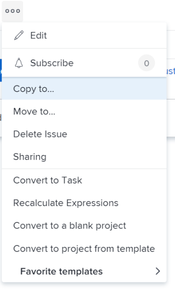

# Copia i problemi

Puoi copiare un problema o una richiesta e salvarli sullo stesso o su un altro progetto. Puoi anche copiare un problema da un’attività a un altro progetto.

È possibile copiare i problemi dai seguenti oggetti:

* Da un progetto allo stesso progetto (duplicalo nello stesso progetto)
* Da un&#39;attività alla stessa attività (duplica se presente nella stessa attività)
* Da un progetto a un altro progetto
* Da un&#39;attività a un progetto

>[!TIP]
>
>&quot;Issues&quot; e &quot;requests&quot; vengono utilizzati in modo intercambiabile in Workfront. È possibile registrare i problemi relativi a progetti e attività per indicare il lavoro imprevisto che deve essere affrontato. È inoltre possibile inviare richieste registrate come problemi in un progetto designato come coda di richiesta.

## Requisiti di accesso

Per eseguire i passaggi descritti in questo articolo, è necessario disporre dei seguenti diritti di accesso:

<table style="table-layout:auto"> 
 <col> 
 <col> 
 <tbody> 
  <tr> 
   <td role="rowheader">piano Adobe Workfront*</td> 
   <td> 
Qualsiasi
 </td> 
  </tr> 
  <tr> 
   <td role="rowheader">Licenza Adobe Workfront*</td> 
   <td> 
Richiesta o superiore
 
Rivedi o una licenza superiore per copiare un problema nella sezione Problemi di un progetto.
 </td> 
  </tr> 
  <tr> 
   <td role="rowheader">Livello di accesso*</td> 
   <td> 
Modifica accesso ai problemi
 
Visualizza o consente un accesso più elevato a progetti e attività
 
Nota: Se non disponi ancora dell’accesso, chiedi all’amministratore Workfront se ha impostato ulteriori restrizioni nel livello di accesso. Per informazioni sull'accesso ai problemi relativi al livello di accesso, consulta <a href="../../../administration-and-setup/add-users/configure-and-grant-access/grant-access-issues.md" class="MCXref xref">Concedere l’accesso ai problemi</a>. Per informazioni su come un amministratore Workfront può modificare il livello di accesso, consulta <a href="../../../administration-and-setup/add-users/configure-and-grant-access/create-modify-access-levels.md" class="MCXref xref">Creare o modificare livelli di accesso personalizzati</a>. 
 </td> 
  </tr> 
  <tr> 
   <td role="rowheader">Autorizzazioni oggetto</td> 
   <td> 
Gestire le autorizzazioni al problema
 
Autorizzazioni di Contribute per l'elemento in cui si copia il problema con la possibilità di aggiungere problemi.
 
 Per informazioni sulla concessione delle autorizzazioni per i problemi, consulta <a href="../../../workfront-basics/grant-and-request-access-to-objects/share-an-issue.md" class="MCXref xref">Condividere un problema </a>
 
Per informazioni sulla richiesta di autorizzazioni aggiuntive, consulta <a href="../../../workfront-basics/grant-and-request-access-to-objects/request-access.md" class="MCXref xref">Richiedere l’accesso agli oggetti </a>.
 </td> 
  </tr> 
 </tbody> 
</table>

&#42;Per informazioni sul piano, il tipo di licenza o l&#39;accesso, contattare l&#39;amministratore Workfront.

## Considerazioni sui problemi associati ai documenti o alle code di richieste

Quando copi problemi che contengono documenti o sono associati a una coda di richiesta, considera quanto segue:

* **Quando un problema è associato a una coda di richiesta:** Quando copi un problema in un altro oggetto e il problema è associato a una coda di richiesta, il problema copiato non è più associato alla coda originale da cui è nato il primo problema.
* **Quando un documento è allegato al problema:** Quando copi un problema in un altro oggetto e al problema è allegato un documento, anche il documento e le sue versioni passano al nuovo problema. Le bozze o le approvazioni associate al documento non vengono spostate.
* **Quando un problema è collegato a un documento o a una cartella:** Quando copi un problema che ha documenti o cartelle collegati a un servizio di terze parti come Google Drive, i collegamenti ai documenti vengono trasferiti al problema copiato. 

## Copiare i problemi in un elenco

È possibile copiare uno o più problemi da un elenco di problemi o da un report di problemi.

1. Vai al progetto che contiene il problema o i problemi che desideri copiare.

   Oppure

   Passa a un rapporto del problema.

1. Se hai selezionato di passare a un progetto, fai clic su **Problemi** nel pannello a sinistra.
1. Seleziona il problema o i problemi da copiare e fai clic sul pulsante **Menu Altro** in alto nell&#39;elenco dei problemi, quindi fai clic su **Copia in**.

   

1. Continua a copiare il problema, come descritto nella sezione . [Copia un singolo problema](#copy-a-single-issue) a partire dal passaggio 2.

   <!--
   <MadCap:conditionalText data-mc-conditions="QuicksilverOrClassic.Draft mode">
   (NOTE:&nbsp;ensure step number stays accurate)
   </MadCap:conditionalText>
   -->

## Copia un singolo problema {#copy-a-single-issue}

Puoi copiare un problema quando lo visualizzi.

1. Passa a un problema da copiare, quindi fai clic sul pulsante **Altro** menu  a destra del nome del problema, quindi **Copia** a.

   

   La **Problema copia** viene visualizzata la casella .

   

1. In **Seleziona progetto di destinazione** Specifica il nome del progetto in cui copiare i problemi. Per impostazione predefinita viene visualizzato il nome del progetto corrente.

   >[!TIP]
   >
   >Nell’elenco vengono visualizzati solo 100 progetti.

1. (Condizionale) Fai clic su **richiesta di accesso** se non hai accesso per copiare i problemi nel progetto.
1. (Facoltativo) Continua a copiare il problema nel progetto di destinazione selezionato senza richiedere l’accesso se hai accesso per aggiungere problemi a una delle attività del progetto di destinazione.

   

   >[!TIP]
   >
   >Messaggi simili vengono visualizzati se il progetto selezionato è in attesa di approvazione, completato o disattivato, quando l’amministratore di Workfront impedisce l’aggiunta di problemi a tali progetti. Per ulteriori informazioni, consulta [Configurare le preferenze del progetto a livello di sistema](../../../administration-and-setup/set-up-workfront/configure-system-defaults/set-project-preferences.md).

1. (Facoltativo) In **Opzioni** deseleziona uno degli elementi elencati nella tabella seguente per rimuoverli dal nuovo problema. Tutte le opzioni sono selezionate per impostazione predefinita.

   >[!NOTE]
   Questo interessa solo i problemi copiati e non i problemi originali.

   <table style="table-layout:auto"> 
    <col> 
    <col> 
    <tbody> 
     <tr> 
      <td role="rowheader">Assegnazioni</td> 
      <td>Rimuove utenti, ruoli o team assegnati al problema.</td> 
     </tr> 
     <tr> 
      <td role="rowheader">Avanzamento</td> 
      <td>Rimuove l’eventuale percentuale di completamento del problema. </td> 
     </tr> 
     <tr> 
      <td role="rowheader">Documenti</td> 
      <td>Rimuove tutti gli elementi presenti nella scheda documenti, incluse le versioni del documento, i documenti collegati e le cartelle.  Per impostazione predefinita, le bozze dei documenti e le approvazioni non possono essere copiate in un altro problema.</td> 
     </tr> 
     <tr> 
      <td role="rowheader">Autorizzazioni</td> 
      <td>Rimuove le entità con cui è condiviso il problema. </td> 
     </tr> 
     <tr> 
      <td role="rowheader">Aggiornamenti</td> 
      <td>Rimuove i commenti dalla sezione Aggiornamenti del problema.</td> 
     </tr> 
     <tr> 
      <td role="rowheader">Dati personalizzati</td> 
      <td>Rimuove le informazioni dal modulo personalizzato sul problema, nonché quelle sui moduli personalizzati associati a Documenti allegati al problema, se vengono anche copiate con il problema. I moduli personalizzati rimarranno allegati ai problemi e ai documenti, ma le informazioni sui moduli non verranno riportate al nuovo problema. </td> 
     </tr> 
    </tbody> 
   </table>

1. (Facoltativo) In **Seleziona attività** selezionare l&#39;attività in cui si desidera spostare il problema.
1. Fai clic su **Copia problema** o **Problemi relativi alla copia** se hai selezionato più problemi in un elenco.

   I problemi copiati vengono aggiunti al progetto specificato.

 
