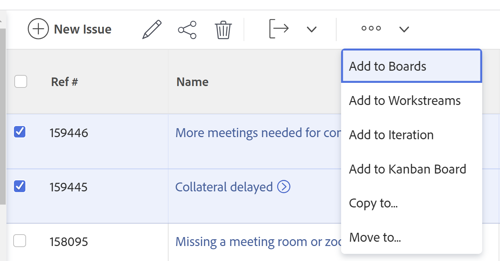
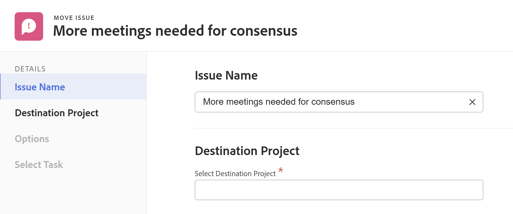

# Sposta i problemi

<!--Audited: 12/2024-->

<!--The highlighted information on this page refers to functionality not yet generally available. It is available only in the Preview environment for all customers. After the monthly releases to Production, the same features are also available in the Production environment for customers who enabled fast releases.    

For information about fast releases, see [Enable or disable fast releases for your organization](/help/quicksilver/administration-and-setup/set-up-workfront/configure-system-defaults/enable-fast-release-process.md). -->

È possibile spostare i problemi tra i seguenti oggetti:

* Da un progetto a un altro
* Da un&#39;attività a un&#39;altra attività nello stesso progetto o in un altro progetto
* Da un&#39;attività al progetto o a un altro progetto
* Da un progetto a un&#39;attività nello stesso progetto o a un&#39;attività in un altro progetto

## Requisiti di accesso

+++ Espandi per visualizzare i requisiti di accesso per la funzionalità in questo articolo.

Per eseguire i passaggi descritti in questo articolo, è necessario disporre dei seguenti diritti di accesso:

<table style="table-layout:auto"> 
 <col> 
 <col> 
 <tbody> 
  <tr> 
   <td role="rowheader">piano Adobe Workfront</td> 
   <td> 
Qualsiasi
 </td> 
  </tr> 
  <tr> 
   <td role="rowheader">Licenza Adobe Workfront*</td> 
   <td> 
Nuovo:
 
   <ul><li>Collaboratore o versione successiva</li>
   <li>Chiaro o superiore per spostare i problemi nella sezione Problemi di un progetto</li></ul>
   
Corrente:

   <ul>
   <li>
Richiedi o superiore
</li>
   <li>
Rivedi o ottieni una licenza per spostare i problemi nella sezione Problemi di un progetto.
</li></ul>   
     </td> 
  </tr> 
  <tr> 
   <td role="rowheader">Configurazioni del livello di accesso</td> 
   <td> 
Modifica l'accesso alle Issues
 
Accesso di visualizzazione o superiore ai progetti e alle attività
 </td> 
  </tr> 
  <tr> 
   <td role="rowheader">Autorizzazioni oggetto</td> 
   <td> 
Gestire le autorizzazioni per il problema
 
Concedere le autorizzazioni per l’elemento in cui si sta spostando il problema con la possibilità di aggiungere problemi.</td> 
  </tr> 
 </tbody> 
</table>

*Per informazioni, consulta [Requisiti di accesso nella documentazione di Workfront](/help/quicksilver/administration-and-setup/add-users/access-levels-and-object-permissions/access-level-requirements-in-documentation.md).

+++

## Considerazioni sullo spostamento dei problemi

Quando si spostano problemi che contengono documenti o sono associati a una coda di richieste, considera quanto segue:

* L’amministratore di sistema o di gruppo può impedire lo spostamento di problemi che hanno registrato ore, a seconda di come ha configurato la preferenza Consenti agli utenti di spostare attività e problemi con ore registrate nell’area Configura. Per informazioni, consulta [Configurare le preferenze per attività e problemi a livello di sistema](/help/quicksilver/administration-and-setup/set-up-workfront/configure-system-defaults/set-task-issue-preferences.md).

* **Quando un problema è associato a una coda di richieste:** Quando si sposta un problema in un altro oggetto e il problema è associato a una coda di richieste, il problema spostato non è più associato alla coda originale da cui ha avuto origine il primo problema.
* **Quando un documento è allegato al problema:** Quando si sposta un problema in un altro oggetto a cui è associato un documento, anche il documento, le relative versioni e bozze vengono spostati nel nuovo problema. Eventuali approvazioni associate al documento non vengono spostate.
* **Quando un problema è collegato a un documento o a una cartella:** Quando si sposta un problema che include documenti o cartelle collegati a un servizio di terze parti come Google Drive, i collegamenti ai documenti vengono spostati insieme al problema.

## Sposta i problemi in un elenco

È possibile spostare uno o più problemi da un elenco di problemi o da un report di problemi.

1. Vai al progetto che contiene il problema o i problemi che desideri spostare.

   Oppure

   Passa a un report sui problemi.

1. Se hai selezionato di passare a un progetto, fai clic su **Problemi** nel pannello a sinistra.
1. Seleziona il problema o i problemi da spostare e fai clic sul **menu Altro** nella parte superiore dell&#39;elenco dei problemi, quindi fai clic su **Sposta in**.

   

1. Continuare con lo spostamento dei problemi, come descritto nella sezione [Spostare un singolo problema](#move-a-single-issue) a partire dal passaggio 2.

## Spostare un singolo problema {#move-a-single-issue}

È possibile spostare un problema durante la visualizzazione.

### Spostare un singolo problema

1. Vai al problema che desideri spostare, fai clic sul menu **Altro**  a destra del nome del problema, quindi fai clic su **Sposta in**.

   

   Viene visualizzata la casella **Sposta problema**.

   

1. Nella sezione **Seleziona progetto di destinazione**, specifica il nome del progetto in cui desideri spostare i problemi. Il nome del progetto corrente viene visualizzato per impostazione predefinita.

   >[!TIP]
   >
   >Nell’elenco vengono visualizzati solo 100 progetti.

1. (Condizionale) Se non disponi dell&#39;accesso per spostare i problemi nel progetto, fai clic su **richiedi accesso**.
1. (Facoltativo) Se disponi dell’accesso per aggiungere problemi a una delle attività nel progetto di destinazione, continua a spostare il problema sul progetto di destinazione selezionato senza richiedere l’accesso.

   

   >[!TIP]
   >
   >Messaggi simili vengono visualizzati se il progetto selezionato è in attesa di approvazione, completato o inattivo, quando l’amministratore di Workfront impedisce l’aggiunta di problemi a questi progetti. Per ulteriori informazioni, vedere [Configurare le preferenze di progetto a livello di sistema](../../../administration-and-setup/set-up-workfront/configure-system-defaults/set-project-preferences.md).

1. (Facoltativo) Nella sezione **Opzioni**, deseleziona uno degli elementi elencati nella tabella seguente per rimuoverli dal problema spostato. Tutte le opzioni sono selezionate per impostazione predefinita.

   >[!IMPORTANT]
   >
   >Deselezionando gli elementi nell&#39;elenco Opzioni si verifica una perdita di dati. Le informazioni del problema esistente verranno rimosse e non potranno essere recuperate.

   <table style="table-layout:auto"> 
    <col> 
    <col> 
    <tbody> 
     <tr> 
      <td role="rowheader">Seleziona tutto</td> 
      <td>Deseleziona questa opzione per rimuovere tutte le informazioni dal problema durante lo spostamento nella nuova posizione. </td> 
     </tr> 
     <tr> 
      <td role="rowheader">Assegnazioni</td> 
      <td>Rimuove gli utenti, le mansioni o i team assegnati al problema.</td> 
     </tr> 
     <tr> 
      <td role="rowheader">Avanzamento</td> 
      <td>Rimuove l'eventuale percentuale di completamento del problema. </td> 
     </tr> 
     <tr> 
      <td role="rowheader">
Documenti
</td> 
      <td> 
Rimuove tutti gli elementi presenti nella scheda documenti, incluse le versioni dei documenti, i documenti collegati e le cartelle.

   <b>NOTA</b>

   Se si sceglie di non spostare i documenti con il problema, i documenti verranno eliminati e posizionati nel Cestino per 30 giorni. Un amministratore può ripristinarli e saranno ripristinati al momento dello spostamento del problema.

   Se il problema viene eliminato dopo lo spostamento, i documenti ripristinati verranno inseriti nell&#39;area Documenti della pagina utente dell&#39;amministratore che li ripristina.
     
 </td>
   </tr> 
     <tr> 
      <td role="rowheader">Autorizzazioni</td> 
      <td>Rimuove le entità con cui è condiviso il problema. </td> 
     </tr> 
     <tr> 
      <td role="rowheader">Aggiornamenti</td> 
      <td>Rimuove i commenti dalla sezione Aggiornamenti del problema.</td> 
     </tr> 
    </tbody> 
   </table>

1. (Facoltativo) Nella sezione **Seleziona attività**, seleziona l&#39;attività in cui desideri spostare il problema.
1. Se hai selezionato più problemi in un elenco, fai clic su **Sposta problema** o **Sposta problemi**.

   I problemi spostati vengono aggiunti al progetto specificato.

