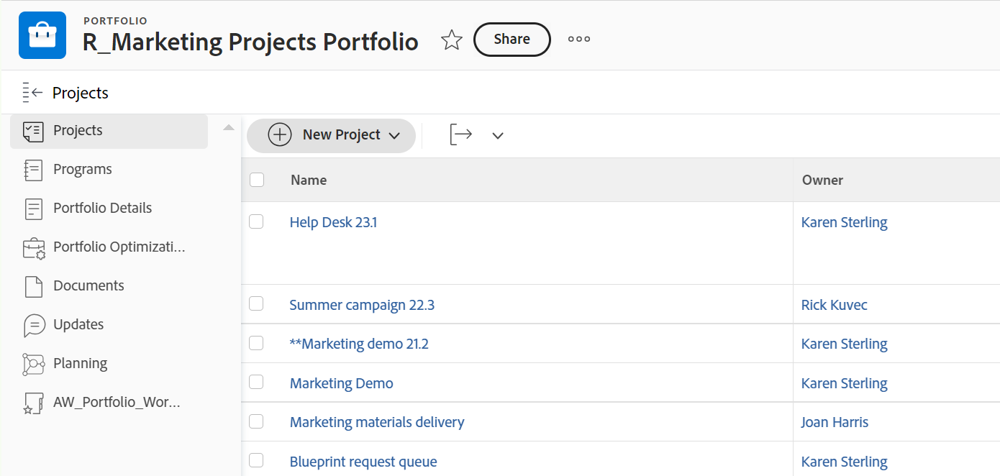
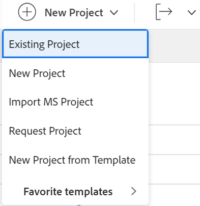

# Aggiungere progetti a un portfolio

È consigliabile aggiungere progetti ai portfolio quando li avvii. Tuttavia, puoi aggiungerli a un portfolio in qualsiasi momento durante il loro ciclo di vita.

Quando aggiungi progetti ai portfolio, considera quanto segue:

* Anche se un portfolio può contenere un numero illimitato di progetti, puoi associare un solo portfolio a un progetto.
* Un progetto rimane in un portfolio finché non viene rimosso o associato a un altro portfolio.

## Requisiti di accesso

Per eseguire i passaggi descritti in questo articolo, è necessario disporre dei seguenti diritti di accesso:

<table style="table-layout:auto"> 
 <col> 
 <col> 
 <tbody> 
  <tr> 
   <td role="rowheader">[!DNL Adobe Workfront] piano*</td> 
   <td> 
[!UICONTROL Business] o superiore
 </td> 
  </tr> 
  <tr> 
   <td role="rowheader">[!DNL Adobe Workfront] licenza*</td> 
   <td> 
[!UICONTROL Plan] 
 </td> 
  </tr> 
  <tr> 
   <td role="rowheader">Configurazioni a livello di accesso*</td> 
   <td> 
Accesso a Portfoli o versioni successive
 
Accesso a progetti con [!UICONTROL Edit]
 
Nota: Se non hai ancora accesso, chiedi [!DNL Workfront] amministratore se imposta ulteriori restrizioni nel livello di accesso. Per informazioni su come [!DNL Workfront] l'amministratore può modificare il livello di accesso, vedi <a href="../../../administration-and-setup/add-users/configure-and-grant-access/create-modify-access-levels.md" class="MCXref xref">Creare o modificare livelli di accesso personalizzati</a>.
 </td> 
  </tr> 
  <tr> 
   <td role="rowheader">Autorizzazioni oggetto</td> 
   <td> 
Autorizzazioni [!UICONTROL View] per il portfolio
 
Autorizzazioni di [!UICONTROL Manage] per i progetti
 
Per informazioni sulla richiesta di accesso aggiuntivo, vedi <a href="../../../workfront-basics/grant-and-request-access-to-objects/request-access.md" class="MCXref xref">Richiedere l’accesso agli oggetti </a>.
 </td> 
  </tr> 
 </tbody> 
</table>

&#42;Per sapere quale piano, tipo di licenza o accesso hai, contatta il tuo [!DNL Workfront] amministratore.

## Aggiungere un progetto a un portfolio

1. Vai a un portfolio, quindi fai clic su **[!UICONTROL Progetti]** nel pannello a sinistra.

   

1. Fai clic su **[!UICONTROL Nuovo progetto]** e seleziona un metodo per aggiungere un progetto.

   >[!TIP]
   >
   >Non puoi aggiungere un progetto quando visualizzi l’elenco dei progetti nel [!UICONTROL Milestone] visualizza.

   Seleziona tra le seguenti opzioni:

   <table style="table-layout:auto"> 
    <col> 
    <col> 
    <tbody> 
     <tr> 
      <td role="rowheader">[!UICONTROL Progetto esistente]</td> 
      <td> 
Aggiungi un progetto già creato.
 </td> 
     </tr> 
     <tr> 
      <td role="rowheader">[!UICONTROL Nuovo progetto]</td> 
      <td> 
Aggiungi un nuovo progetto. 
 
Per ulteriori informazioni sulla creazione di un nuovo progetto, consulta <a href="../../../manage-work/projects/create-projects/create-project.md" class="MCXref xref">Creare un progetto</a>. 
 </td> 
     </tr> 
     <tr> 
      <td role="rowheader">Importazione di un progetto da [!DNL MS Project]] </td> 
      <td> 
Aggiungi un progetto esportato in precedenza da [!DNL MS Project] e sono stati salvati sul computer. 
 
Per ulteriori informazioni sulla creazione di un nuovo progetto importandolo da [!DNL Microsoft Project], vedi <a href="../../../manage-work/projects/create-projects/import-project-from-ms-project.md" class="MCXref xref">Importa progetto da [!DNL Microsoft Project]</a>.
 </td> 
     </tr> 
     <tr> 
      <td role="rowheader">[!UICONTROL Request Project]</td> 
      <td> 
Richiedi l’approvazione di un progetto.
 
Per informazioni sulla richiesta dei progetti, consulta <a href="../../../manage-work/projects/create-projects/request-project.md">Richiesta di un progetto</a>. 
 </td> 
     </tr> 
     <tr> 
      <td role="rowheader">[!UICONTROL Novità da modello]</td> 
      <td> 
Aggiungi un nuovo progetto utilizzando un modello esistente. 
 
Per ulteriori informazioni sulla creazione di un progetto da un modello, consulta <a href="../../../manage-work/projects/create-projects/create-project-from-template.md" class="MCXref xref">Creare un progetto utilizzando un modello</a>.
 </td> 
     </tr> 
    </tbody> 
   </table>

   

1. (Condizionale) Se hai selezionato di aggiungere un progetto esistente, inizia a digitare il nome di un progetto nel **[!UICONTROL Aggiungi progetti]** quindi fare clic su di esse quando vengono visualizzate nell&#39;elenco. Puoi aggiungere diversi progetti alla volta.

   

1. Fai clic su **[!UICONTROL Aggiungi progetti]**.

   Il progetto o i progetti selezionati sono ora associati al portfolio.
