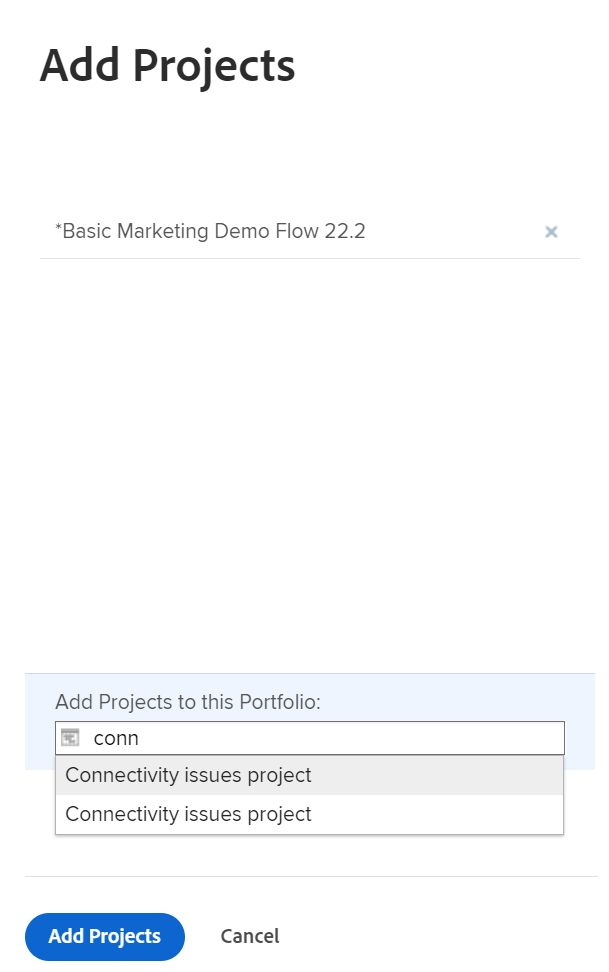

# Aggiungere progetti a un portfolio

<!--Audited: 7/2024-->

È consigliabile aggiungere progetti ai portfolio quando vengono avviati. Tuttavia, puoi aggiungerli a un portfolio in qualsiasi momento della loro durata.

Quando aggiungi progetti ai portfolio, tieni presente quanto segue:

* Anche se un portfolio può contenere un numero illimitato di progetti, puoi associare un solo portfolio a un progetto.
* Un progetto rimane in un portfolio fino a quando non viene rimosso o associato a un altro portfolio.

## Requisiti di accesso

+++ Espandi per visualizzare i requisiti di accesso per la funzionalità in questo articolo.

<table style="table-layout:auto"> 
 <col> 
 <col> 
 <tbody> 
  <tr> 
   <td role="rowheader">[!DNL Adobe Workfront] piano*</td> 
   <td> 
Nuovo: Qualsiasi

   
Corrente:[!UICONTROL Business] o versione successiva
</td> 
  </tr> 
  <tr> 
   <td role="rowheader">[!DNL Adobe Workfront] licenza*</td> 
   <td>
Nuovo: Standard
 
   
Corrente:[!UICONTROL Plan] 
 </td> 
  </tr> 
  <tr> 
   <td role="rowheader">Livello di accesso</td> 
   <td> 
Portfoli di accesso a [!UICONTROL Edit]
 
Accesso [!UICONTROL Edit] ai progetti
 </td> 
  </tr> 
  <tr> 
   <td role="rowheader">Autorizzazioni oggetto</td> 
   <td> 
Autorizzazioni di [!UICONTROL Manage] per il portfolio
 
Autorizzazioni [!UICONTROL Manage] per i progetti
  </td> 
  </tr> 
 </tbody> 
</table>

*Per informazioni, consulta [Requisiti di accesso nella documentazione di Workfront](/help/quicksilver/administration-and-setup/add-users/access-levels-and-object-permissions/access-level-requirements-in-documentation.md).

+++

## Aggiungere un progetto a un portfolio

1. Vai a un portfolio, quindi fai clic su **[!UICONTROL Progetti]** nel pannello a sinistra.

   

1. Fare clic su **[!UICONTROL Nuovo progetto]** e selezionare un metodo per aggiungere un progetto.

   >[!TIP]
   >
   >Non puoi aggiungere un progetto quando visualizzi l&#39;elenco dei progetti nella visualizzazione [!UICONTROL Milestone].

   Selezionare una delle opzioni seguenti:

   <table style="table-layout:auto"> 
    <col> 
    <col> 
    <tbody> 
     <tr> 
      <td role="rowheader">[!UICONTROL Progetto Esistente]</td> 
      <td> 
Aggiungi un progetto già creato.
 </td> 
     </tr> 
     <tr> 
      <td role="rowheader">[!UICONTROL Nuovo Progetto]</td> 
      <td> 
Aggiungi un nuovo progetto. 
 
Per ulteriori informazioni sulla creazione di un nuovo progetto, vedere <a href="../../../manage-work/projects/create-projects/create-project.md" class="MCXref xref">Creare un progetto</a>. 
 </td> 
     </tr> 
     <tr> 
      <td role="rowheader">[!UICONTROL Importa un progetto da [!DNL MS Project]] </td> 
      <td> 
Aggiungere un progetto esportato in precedenza da [!DNL MS Project] e salvato nel computer. 
 
Per ulteriori informazioni sulla creazione di un nuovo progetto importandolo da [!DNL Microsoft Project], vedere <a href="../../../manage-work/projects/create-projects/import-project-from-ms-project.md" class="MCXref xref">Importare un progetto da [!DNL Microsoft Project]</a>.
 </td> 
     </tr> 
     <tr> 
      <td role="rowheader">[!UICONTROL Request Project]</td> 
      <td> 
Richiesta di approvazione di un progetto.
 
Per informazioni sulla richiesta di progetti, vedere <a href="../../../manage-work/projects/create-projects/request-project.md">Richiesta di un progetto</a>. 
 </td> 
     </tr> 
     <tr> 
      <td role="rowheader">[!UICONTROL Nuovo da modello]</td> 
      <td> 
Aggiungi un nuovo progetto utilizzando un modello esistente. 
 
Per ulteriori informazioni sulla creazione di un progetto da un modello, vedere <a href="../../../manage-work/projects/create-projects/create-project-from-template.md" class="MCXref xref">Creare un progetto utilizzando un modello</a>.
 </td> 
     </tr> 
    </tbody> 
   </table>

   

1. (Condizionale) Se hai selezionato di aggiungere un progetto esistente, inizia a digitare il nome di un progetto nella casella **[!UICONTROL Aggiungi progetti]** e fai clic su di esso quando viene visualizzato nell&#39;elenco. Puoi aggiungere più progetti alla volta.

   

1. Fai clic su **[!UICONTROL Aggiungi progetti]**.

   Il progetto o i progetti selezionati sono ora associati al portfolio.
