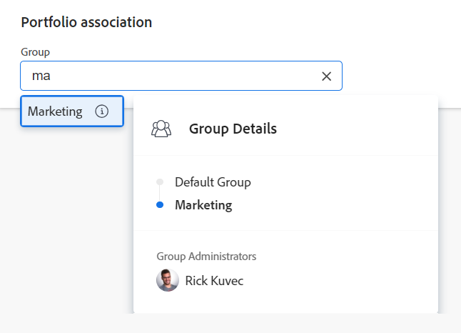

# Creare un portfolio

<!--Audited: 08/2025-->

Un Portfolio è una raccolta di progetti in competizione per le stesse risorse, budget e pianificazione. I progetti in un Portfolio sono abbastanza simili da utilizzare lo stesso Pool di Risorse e venire misurati sulla stessa scorecard.

È possibile utilizzare i portafogli per raggruppare progetti appartenenti alle stesse linee di prodotti, divisioni, reparti, società o altre unità aziendali.

## Requisiti di accesso

+++ Espandi per visualizzare i requisiti di accesso per la funzionalità descritta in questo articolo. 

<table style="table-layout:auto"> 
 <col> 
 <col> 
 <tbody> 
  <tr> 
   <td role="rowheader">[!DNL Adobe Workfront] pacchetto</td> 
   <td> 
Qualsiasi
</td> 
  </tr> 
  <tr> 
   <td role="rowheader">[!DNL Adobe Workfront] licenza</td> 
   <td> 
[!UICONTROL Standard]

   
[!UICONTROL Piano] 
 </td> 
  </tr> 
  <tr> 
   <td role="rowheader">Configurazioni del livello di accesso</td> 
   <td> 
Accesso di [!UICONTROL Edit] ai portfolio
  </td> 
  </tr> 
  <tr> 
   <td role="rowheader">Autorizzazioni sugli oggetti</td> 
   <td> 
Dopo aver creato un portfolio, disponi delle autorizzazioni di gestione per esso
  </td> 
  </tr> 
 </tbody> 
</table>

*Per informazioni, consulta [Requisiti di accesso nella documentazione di Workfront](/help/quicksilver/administration-and-setup/add-users/access-levels-and-object-permissions/access-level-requirements-in-documentation.md).

+++

<!--
Old:

<table style="table-layout:auto"> 
 <col> 
 <col> 
 <tbody> 
  <tr> 
   <td role="rowheader">[!DNL Adobe Workfront] plan*</td> 
   <td> 
Any
</td> 
  </tr> 
  <tr> 
   <td role="rowheader">[!DNL Adobe Workfront] license*</td> 
   <td> 
New: [!UICONTROL Standard]

   
Current:[!UICONTROL Plan] 
 </td> 
  </tr> 
  <tr> 
   <td role="rowheader">Access level configurations</td> 
   <td> 
[!UICONTROL Edit] access to Portfolios
  </td> 
  </tr> 
  <tr> 
   <td role="rowheader">Object permissions</td> 
   <td> 
After you create a portfolio, you have Manage permissions to it, by default
  </td> 
  </tr> 
 </tbody> 
</table>

*For information, see [Access requirements in Workfront documentation](/help/quicksilver/administration-and-setup/add-users/access-levels-and-object-permissions/access-level-requirements-in-documentation.md).
-->

## Modi per creare i portfolio

Puoi creare un portfolio in Workfront utilizzando uno dei seguenti metodi:

* Crea un portfolio da zero a partire dall’area Portfolio del menu principale. Questo articolo descrive come creare un portfolio da zero.

* Importa un portfolio utilizzando le funzioni di avvio.

  In qualità di amministratore di Workfront, puoi importare i portfolio con una procedura di avvio.

  Per informazioni sull&#39;importazione di dati tramite Kick-Start in Workfront, vedere [Importare dati in Adobe Workfront utilizzando un modello Kick-Start](/help/quicksilver/administration-and-setup/manage-workfront/using-kick-starts/import-data-via-kickstarts.md).

* Aggiungere i portfolio da Workfront Planning nei modi seguenti:

   * Collegandoli da un tipo di record in Workfront Planning.

  Per informazioni sulla creazione di portafogli tramite l&#39;aggiunta di tali portafogli ai record, vedere la sezione &quot;Creare record durante la connessione&quot; nell&#39;articolo [Creare record](/help/quicksilver/planning/records/create-records.md).
   * Utilizzo delle automazioni di Workfront Planning.

  Per informazioni, vedere [Creare oggetti utilizzando le automazioni dei record di Adobe Workfront Planning](/help/quicksilver/planning/records/create-wf-objects-using-planning-automations.md).

  È necessario disporre di una nuova licenza Workfront e di un pacchetto Workfront Planning aggiuntivo per Workfront Planning.

  Per informazioni sull&#39;accesso a Workfront Planning, vedere [Panoramica dell&#39;accesso](/help/quicksilver/planning/access/access-overview.md).

## Creare un portfolio

{{step1-click-main-menu}}

1. Fai clic su **[!UICONTROL Portfolio]**.

1. (Condizionale) A seconda dell&#39;archiviazione documenti utilizzata dall&#39;organizzazione, fare clic su una delle opzioni seguenti:

   * **Nuovo portfolio**, quando l&#39;amministratore di Workfront sceglie **Adobe Cloud Storage** o **Legacy Workfront** e ha selezionato o meno l&#39;impostazione **Consenti all&#39;utente di selezionare il provider di archiviazione**.
   * **Nuovo portfolio (Archiviazione legacy)**, quando l&#39;amministratore di Workfront sceglie **Archiviazione cloud Adobe** o **Workfront legacy** e seleziona anche l&#39;impostazione **Consenti all&#39;utente di selezionare il provider di archiviazione**.

     Questa opzione viene visualizzata solo quando nell&#39;area Consenti impostazione **Consenti all&#39;utente di selezionare il provider di archiviazione** è selezionato.

     Per ulteriori informazioni, consulta [Abilitare l&#39;archiviazione cloud Adobe per la tua organizzazione](/help/quicksilver/administration-and-setup/set-up-workfront/configure-system-defaults/enable-esm.md).

     >[!NOTE]
     >
     >L&#39;istanza di Workfront potrebbe non disporre di entrambi i tipi di archiviazione dei documenti.

     Viene creato un portfolio il cui nome predefinito segue i seguenti pattern, a seconda del Workfront di archiviazione utilizzato per i documenti:

      * `Untitled Portfolio` per un portfolio di archiviazione Workfront legacy.

        Un portfolio di archiviazione legacy di Workfront visualizza un&#39;icona **Archiviazione legacy di Workfront**  accanto al nome.

      * `Untitled Portfolio - < Month day, year hour.minute.second >` per un portfolio di archiviazione cloud Adobe

        >[!IMPORTANT]
        >
        >I portfolio che utilizzano l’archiviazione cloud di Adobe devono avere nomi univoci.

     Per i portfolio di archiviazione cloud Adobe, nell’area Documenti viene creata automaticamente una nuova cartella di documenti con lo stesso nome del portfolio.

1. Sostituisci il nome del portfolio con un nuovo nome nell’intestazione del portfolio.

   Il nome può contenere fino a 255 caratteri.

1. (Facoltativo) Fai clic sul nome in **[!UICONTROL Portfolio Manager]** nell&#39;intestazione nella parte superiore della pagina per assegnare un manager diverso per il portfolio.

   

   In qualità di creatore del portfolio, per impostazione predefinita ti viene assegnato il ruolo di gestore del portfolio.

1. Fai clic su **[!UICONTROL Dettagli Portfolio]** nel pannello a sinistra.
1. Nell&#39;area **[!UICONTROL Panoramica]**, modificare una delle seguenti informazioni:

   <table style="table-layout:auto"> 
    <col> 
    <col> 
    <tbody> 
     <tr> 
      <td role="rowheader">[!UICONTROL Descrizione]</td> 
      <td> 
Digita una descrizione per Portfolio per indicare cosa c’è di univoco. 
 </td> 
     </tr> 
     <tr> 
      <td role="rowheader">[!UICONTROL Portfolio Manager]</td> 
      <td> 
Inizia a digitare il nome di un utente che desideri indicare come gestore del portfolio, quindi selezionalo quando viene visualizzato nell’elenco. È lo stesso del [!UICONTROL Portfolio Owner]. Questa è la persona che può supervisionare il lavoro definito nei progetti del portfolio e può approvare il Business Case.
 
Importante: quando si designa un utente come [!UICONTROL Portfolio Manager], questi ottiene automaticamente le autorizzazioni [!UICONTROL Manage] per il portfolio, i programmi e i progetti in esso contenuti. 
 
Suggerimento: è inoltre possibile aggiornare [!UICONTROL Portfolio Manager] nell'intestazione nella parte superiore della pagina.
 </td> 
     </tr> 
     <tr data-mc-conditions=""> 
      <td role="rowheader">Gruppo </td> 
      <td> 
Aggiungi il nome di un singolo gruppo se il gruppo possiede il portfolio o ha la responsabilità di completarlo. 
 
Per assicurarsi di selezionare il gruppo corretto, posizionare il puntatore del mouse su di esso e fare clic sull'icona [!UICONTROL information]  visualizzata accanto ad esso. In questo modo viene visualizzata una descrizione del gruppo contenente informazioni sul gruppo stesso, ad esempio la gerarchia dei gruppi al di sopra del gruppo e i relativi amministratori.
 
  
 </td> 
     </tr> 
    </tbody> 
   </table>

1. (Facoltativo) Fai clic nella casella **[!UICONTROL Aggiungi modulo personalizzato]** nell&#39;angolo superiore destro della pagina [!UICONTROL Dettagli Portfolio] per selezionare un modulo personalizzato per il portfolio e aggiornare i campi personalizzati.

   >[!TIP]
   >
   >Per allegare i moduli personalizzati del portfolio è necessario averli già creati.

1. Fai clic su **[!UICONTROL Salva modifiche]**.
1. (Facoltativo) Fai clic su **[!UICONTROL Programmi]** nel pannello a sinistra, quindi su **[!UICONTROL Aggiungi programmi]** per aggiungere programmi al portfolio.

   Per ulteriori informazioni sulla creazione di programmi, vedere [Creare un programma](../../../manage-work/portfolios/create-and-manage-programs/create-program.md).

1. (Facoltativo) Fai clic su **[!UICONTROL Progetti]** nel pannello a sinistra, quindi su **[!UICONTROL Aggiungi progetti]** per aggiungere progetti al portfolio.

   Per ulteriori informazioni sull&#39;aggiunta di progetti a un Portfolio, vedere [Aggiungere progetti a un portfolio](../../../manage-work/portfolios/create-and-manage-portfolios/add-projects-to-portfolios.md).

<!--

<h2>Deactivate a portfolio</h2>

(NOTE: drafted this and moved it to their own article: delete-deactivate-portfolios)

When you deactivate a portfolio, you can still access it from the Portfolios area, but it no longer displays in the list of portfolios when users try to add it to a project.

<ol>
<li value="1">Click the <strong>Main Menu</strong> icon  in the upper-right corner of Adobe Workfront.</li>
<li value="2">Click <strong>Portfolios</strong> .</li>
<li value="3"> 
Click the name of the portfolio.
 </li>
<li value="4" data-mc-conditions="QuicksilverOrClassic.Quicksilver">Click the More menu  to the right of the portfolio name, then click <strong>Deactivate Portfolio</strong>.</li>
</ol>
<h2>Delete a portfolio</h2>
<ol>
<li value="1">Click the <strong>Main Menu</strong> icon  in the upper-right corner of Adobe Workfront.</li>
<li value="2"> 
Click <strong>Portfolios</strong> .
 </li>
<li value="3"> 
Select the portfolio, then click the Delete icon .
 </li>
<li value="4"> 
In the box that appears, click <strong>Yes, Delete It</strong> to confirm.
 </li>
</ol>

-->
