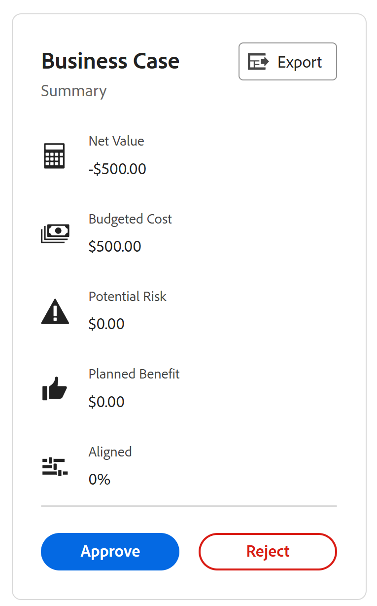

# Rivedere i progetti richiesti

<!--Audited: 10/2025-->

Quando si inviano più richieste di progetto per la revisione, l&#39;ufficio di gestione del progetto o il comitato del portfolio possono riunirsi per esaminare le richieste inviate e determinare le approvazioni delle richieste di progetto. Le richieste di progetto vengono visualizzate come progetti con stato [!UICONTROL Richiesto] in [!DNL Adobe Workfront].

È possibile inviare una richiesta di revisione di un progetto effettuando una delle seguenti operazioni:

* Cambia lo stato del progetto in **[!UICONTROL Richiesto]**.
* Completa il [!UICONTROL Business Case] del progetto e invialo per l&#39;approvazione.\
   Per ulteriori informazioni sul completamento di un Business Case per un progetto, vedere [Creare un Business Case per un progetto](../../../manage-work/projects/define-a-business-case/create-business-case.md).

È possibile esaminare i progetti richiesti nelle seguenti aree di [!DNL Adobe Workfront]:

* In un report di progetto
* All’interno di un portfolio

## Requisiti di accesso

+++ Espandi per visualizzare i requisiti di accesso per la funzionalità descritta in questo articolo. 

<table style="table-layout:auto"> 
 <col> 
 <col> 
 <tbody> 
  <tr> 
   <td role="rowheader">[!DNL Adobe Workfront] pacchetto</td> 
   <td>
Qualsiasi
 </td> 
  </tr> 
  <tr> 
   <td role="rowheader">[!DNL Adobe Workfront] licenza</td> 
   <td> 
[!UICONTROL Standard] 
 
   
[!UICONTROL Piano]
 </td> 
  </tr> 
  <tr> 
   <td role="rowheader">Configurazioni del livello di accesso</td> 
   <td> 
Accesso di [!UICONTROL View] o versione successiva ai portafogli
 
Accesso [!UICONTROL Edit] ai progetti
  </td> 
  </tr> 
  <tr> 
   <td role="rowheader">Autorizzazioni sugli oggetti</td> 
   <td> 
Autorizzazioni di [!UICONTROL View] o superiori per il portfolio
 
Autorizzazioni [!UICONTROL Manage] per aggiornare lo stato dei progetti
  </td> 
  </tr> 
 </tbody> 
</table>

*Per informazioni, consulta [Requisiti di accesso nella documentazione di Workfront](/help/quicksilver/administration-and-setup/add-users/access-levels-and-object-permissions/access-level-requirements-in-documentation.md).

+++

<!--
Old:

<table style="table-layout:auto"> 
 <col> 
 <col> 
 <tbody> 
  <tr> 
   <td role="rowheader">[!DNL Adobe Workfront] plan</td> 
   <td>
Any
 </td> 
  </tr> 
  <tr> 
   <td role="rowheader">[!DNL Adobe Workfront] license*</td> 
   <td> 
[!UICONTROL Plan] 
 </td> 
  </tr> 
  <tr> 
   <td role="rowheader">Access level configurations</td> 
   <td> 
[!UICONTROL View] access or higher to Portfolios
 
[!UICONTROL Edit] access to Projects
  </td> 
  </tr> 
  <tr> 
   <td role="rowheader">Object permissions</td> 
   <td> 
[!UICONTROL View] permissions or higher on the portfolio
 
[!UICONTROL Manage] permissions on the projects to update their status
  </td> 
  </tr> 
 </tbody> 
</table>
-->

## Revisione dei progetti richiesti in un report di progetto

È possibile generare un report per i progetti per visualizzare i progetti con stato [!UICONTROL Richiesto].

Per ulteriori informazioni sull&#39;approvazione delle richieste di progetto tramite la creazione di un report di progetto, vedere la sezione [[!UICONTROL Approvazione del caso aziendale tramite la creazione di un report di progetto]](../../../manage-work/projects/define-a-business-case/approve-business-case.md#build-a-report) in [Approvare un caso aziendale](../../../manage-work/projects/define-a-business-case/approve-business-case.md).

## Revisione dei progetti richiesti all&#39;interno di un portfolio

1. Vai al portfolio di cui desideri rivedere i progetti richiesti.
1. Fai clic su **[!UICONTROL Progetti]** nel pannello a sinistra
1. Dal menu a discesa **[!UICONTROL Filtro]**, seleziona **[!UICONTROL Richiesto]**.

   Nell&#39;elenco vengono visualizzati solo i progetti con stato **[!UICONTROL Richiesto]**.

   >[!TIP]
   >
   > Oltre allo stato **[!UICONTROL Richiesto]**, i progetti devono essere associati al Portfolio selezionato per essere visualizzati in questo elenco.

1. Fare clic sul nome di un progetto nell&#39;elenco per aprirlo.
1. Fai clic su **[!UICONTROL Dettagli progetto]** nel pannello a sinistra.
1. Effettuare una delle seguenti operazioni:

   * Fai clic su **[!UICONTROL Caso di business]**, quindi su **[!UICONTROL Approva]** o **[!UICONTROL Rifiuta]** nell&#39;area [!UICONTROL Riepilogo caso di business] per approvare o rifiutare il caso di business.

     

     Lo stato del progetto viene modificato in **[!UICONTROL Approvato]** se il Business Case viene approvato.

     Lo stato del progetto viene modificato in **[!UICONTROL Rifiutato]** se il caso aziendale viene rifiutato.

     >[!NOTE]
     >
     >Non vi sono notifiche che avvisano l’utente che ha inviato l’approvazione del business case se la richiesta di progetto è stata approvata o rifiutata.

     Oppure

   * Cambia lo stato del progetto in qualsiasi altro stato nel menu a discesa **[!UICONTROL Stato]**.

     

