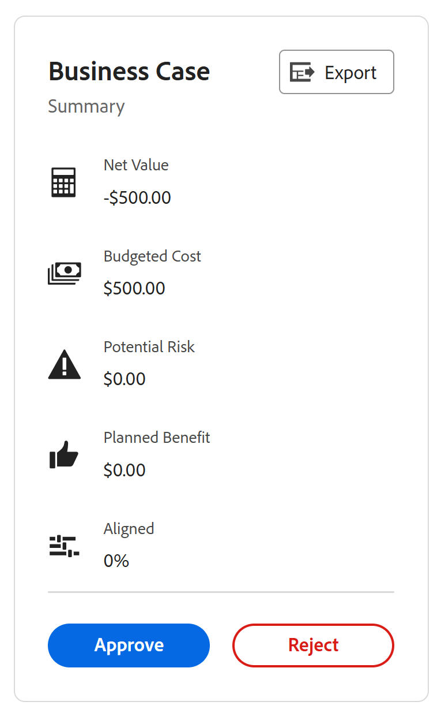

# Revisione dei progetti richiesti

Quando vengono presentate più richieste di progetto per la revisione, l&#39;ufficio di gestione del progetto o il comitato di portafoglio possono incontrarsi per rivedere le richieste inviate e determinare le approvazioni delle richieste di progetto. Le richieste di progetto vengono visualizzate come progetti con stato [!UICONTROL Richiesto] in [!DNL Adobe Workfront].

Per inviare una richiesta di revisione di un progetto, effettuare una delle seguenti operazioni:

* Cambia lo stato del progetto in **[!UICONTROL Richiesto]**.
* Completa il [!UICONTROL Business case] del progetto e sottoporlo all&#39;approvazione.\
   Per ulteriori informazioni sul completamento di un caso aziendale per un progetto, consulta [Creare un business case per un progetto](../../../manage-work/projects/define-a-business-case/create-business-case.md).

Puoi esaminare i progetti richiesti nelle seguenti aree di [!DNL Adobe Workfront]:

* In un rapporto di progetto
* All&#39;interno di un portafoglio

## Requisiti di accesso

Per eseguire i passaggi descritti in questo articolo, è necessario disporre dei seguenti diritti di accesso:

<table style="table-layout:auto"> 
 <col> 
 <col> 
 <tbody> 
  <tr> 
   <td role="rowheader">[!DNL Adobe Workfront] piano*</td> 
   <td> 
[!UICONTROL Business] o superiore
 </td> 
  </tr> 
  <tr> 
   <td role="rowheader">[!DNL Adobe Workfront] licenza*</td> 
   <td> 
[!UICONTROL Plan] 
 </td> 
  </tr> 
  <tr> 
   <td role="rowheader">Configurazioni a livello di accesso*</td> 
   <td> 
Accesso a Portfoli o versioni successive
 
Accesso a progetti con [!UICONTROL Edit]
 
Nota: Se non hai ancora accesso, chiedi [!DNL Workfront] amministratore se imposta ulteriori restrizioni nel livello di accesso. Per informazioni su come [!DNL Workfront] l'amministratore può modificare il livello di accesso, vedi <a href="../../../administration-and-setup/add-users/configure-and-grant-access/create-modify-access-levels.md" class="MCXref xref">Creare o modificare livelli di accesso personalizzati</a>.
 </td> 
  </tr> 
  <tr> 
   <td role="rowheader">Autorizzazioni oggetto</td> 
   <td> 
Autorizzazioni di [!UICONTROL View] o superiori per il portfolio
 
Autorizzazioni di [!UICONTROL Manage] per aggiornare lo stato dei progetti
 
Per informazioni sulla richiesta di accesso aggiuntivo, vedi <a href="../../../workfront-basics/grant-and-request-access-to-objects/request-access.md" class="MCXref xref">Richiedere l’accesso agli oggetti </a>.
 </td> 
  </tr> 
 </tbody> 
</table>

&#42;Per sapere quale piano, tipo di licenza o accesso hai, contatta il tuo [!DNL Workfront] amministratore.

## Revisione dei progetti richiesti in un rapporto di progetto

È possibile creare un rapporto per i progetti per verificare lo stato dei progetti [!UICONTROL Richiesto].

Per ulteriori informazioni sull’approvazione delle richieste di progetto mediante la creazione di un rapporto sul progetto, consulta la sezione [[!UICONTROL Approvazione del caso aziendale mediante la creazione di un rapporto sul progetto]](../../../manage-work/projects/define-a-business-case/approve-business-case.md#build-a-report) sezione [Approvare un caso aziendale](../../../manage-work/projects/define-a-business-case/approve-business-case.md). 

## Esamina i progetti richiesti all’interno di un portfolio

1. Passa al portfolio di cui desideri esaminare i progetti richiesti.
1. Fai clic su &#x200B;**[!UICONTROL Progetti]** nel pannello a sinistra
1. Da **[!UICONTROL Filtro]** menu a discesa, seleziona **[!UICONTROL Richiesto]**.

   Solo i progetti con stato di **[!UICONTROL Richiesto]** nell&#39;elenco.

   >[!TIP]
   >
   > Oltre ad avere uno status di **[!UICONTROL Richiesto]**, i progetti devono essere associati al Portfolio selezionato per essere visualizzati in questo elenco.

1. Fai clic sul nome di un progetto nell’elenco per aprirlo.
1. Fai clic su **[!UICONTROL Dettagli progetto]** nel pannello a sinistra.
1. Effettua una delle seguenti operazioni:

   * Fai clic su **[!UICONTROL Business case]**, quindi fai clic su **[!UICONTROL Approva]** o **[!UICONTROL Rifiuta]** in [!UICONTROL Riepilogo del caso aziendale] area per approvare o rifiutare il Business Case.

      

      Lo stato del progetto viene modificato in **[!UICONTROL Approvato]** se il Business Case è approvato.

      Lo stato del progetto viene modificato in **[!UICONTROL Rifiutato]** se il caso aziendale viene rifiutato.

      >[!NOTE]
      Nessuna notifica avvisa l&#39;utente che ha inviato l&#39;approvazione del business case se la sua richiesta di progetto è stata approvata o rifiutata. 

      Oppure

   * Cambia lo stato del progetto in qualsiasi altro stato nel **[!UICONTROL Stato]** menu a discesa.

      
 

 
