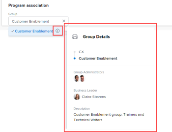

# Creare un programma

<!-- Audited: 05/2026-->

<!--
The highlighted information on this page refers to functionality not yet generally available. It is available only in the Preview environment for all customers. The same features will also be available in the Production environment for all customers after a week from the Preview release.    

For more information, see [Interface modernization](/help/quicksilver/product-announcements/product-releases/interface-modernization/interface-modernization.md). 
-->

Un programma rappresenta una raccolta di progetti che condividono una strategia, un obiettivo o un obiettivo comune che trascende i limiti del progetto.
I programmi sono una suddivisione dei portafogli e non possono esistere al di fuori di un portfolio. In genere, i programmi condividono le stesse risorse di altri programmi all’interno dello stesso portfolio.

Puoi creare programmi per organizzare i portfolio quando diventano troppo grandi.

Ad esempio, puoi avere un Portfolio Marketing Fiscal Year 2024 che contiene tutti i progetti della tua divisione Marketing. È consigliabile organizzare ulteriormente i progetti in trimestri fiscali e aggiungere programmi Marketing Fiscal Quarter 1-4 2024 all&#39;interno del Portfolio Marketing Fiscal Year 2024.

## Requisiti di accesso

+++ Espandi per visualizzare i requisiti di accesso per la funzionalità descritta in questo articolo.

<table style="table-layout:auto"> 
 <col> 
 <col> 
 <tbody> 
  <tr> 
   <td role="rowheader">[!DNL Adobe Workfront] pacchetto</td>

<td> 
Qualsiasi
 </td> 
  </tr> 
  <tr> 
   <td role="rowheader">[!DNL Adobe Workfront] licenza</td> 
   <td> 
[!UICONTROL Standard]

   
[!UICONTROL Piano]
 </td> 
  </tr> 
  <tr> 
   <td role="rowheader">Configurazioni del livello di accesso</td> 
   <td> 
Accesso a portafogli e programmi tramite [!UICONTROL Edit] 
  </td> 
  </tr> 
  <tr> 
   <td role="rowheader">Autorizzazioni sugli oggetti</td> 
   <td> 
Autorizzazioni di [!UICONTROL Manage] per il portfolio
 
Per impostazione predefinita, dopo aver creato un programma, si dispone di autorizzazioni [!UICONTROL Manage].
  </td> 
  </tr> 
 </tbody> 
</table>

Per ulteriori dettagli sulle informazioni contenute in questa tabella, consulta [Requisiti di accesso nella documentazione Workfront](/help/quicksilver/administration-and-setup/add-users/access-levels-and-object-permissions/access-level-requirements-in-documentation.md).

+++

<!--
Old:

<table style="table-layout:auto"> 
 <col> 
 <col> 
 <tbody> 
  <tr> 
   <td role="rowheader">[!DNL Adobe Workfront] plan</td> 

   <td> 
Any
 </td> 
  </tr> 
  <tr> 
   <td role="rowheader">[!DNL Adobe Workfront] license</td> 
   <td> 
New: [!UICONTROL Standard] 

Or 

Current: [!UICONTROL Plan] 
 </td> 
  </tr> 
  <tr> 
   <td role="rowheader">Access level configurations</td> 
   <td> 
[!UICONTROL Edit] access to Portfolios and Programs 
  </td> 
  </tr> 
  <tr> 
   <td role="rowheader">Object permissions</td> 
   <td> 
[!UICONTROL Manage] permissions to the portfolio
 
After you create a program, you have [!UICONTROL Manage] permissions to it, by default.
  </td> 
  </tr> 
 </tbody> 
</table>
-->

## Modalità di creazione dei programmi

È possibile creare un programma in Workfront utilizzando uno dei metodi seguenti:

* Creare un programma partendo da zero dall&#39;area Programmi del menu principale o dalla sezione Programmi di un portfolio. Questo articolo descrive come creare un programma da zero.

* Importa un programma utilizzando i kick-start.

  In qualità di amministratore di Workfront, puoi importare programmi utilizzando una funzione di avvio.

  Per informazioni sull&#39;importazione di dati tramite Kick-Start in Workfront, vedere [Importare dati in Adobe Workfront utilizzando un modello Kick-Start](/help/quicksilver/administration-and-setup/manage-workfront/using-kick-starts/import-data-via-kickstarts.md).

* Creare programmi da Workfront Planning nei modi seguenti:

   * Collegandoli da un tipo di record in Workfront Planning.

  Per informazioni sulla creazione di programmi tramite l&#39;aggiunta di tali record ai record, vedere la sezione &quot;Creare record durante la connessione&quot; nell&#39;articolo [Creare record](/help/quicksilver/planning/records/create-records.md).
   * Utilizzo delle automazioni di Workfront Planning.

  Per informazioni, vedere [Creare oggetti utilizzando le automazioni dei record di Adobe Workfront Planning](/help/quicksilver/planning/records/create-wf-objects-using-planning-automations.md).

  È necessario disporre di una nuova licenza Workfront e di un pacchetto Workfront Planning aggiuntivo per Workfront Planning.

  Per informazioni sull&#39;accesso a Workfront Planning, vedere [Panoramica dell&#39;accesso](/help/quicksilver/planning/access/access-overview.md).

## Creare un programma

{{step1-click-main-menu}}

1. Effettuare una delle seguenti operazioni.

   * Crea un programma dall&#39;area [!UICONTROL Programmi]:

      1. Fare clic su **[!UICONTROL Programmi]** nel [!DNL **Menu principale**] .
      1. Fai clic su **[!UICONTROL Nuovo programma]**.
      1. Nella casella visualizzata digitare il nome di un Portfolio esistente nel campo **[!UICONTROL Seleziona Portfolio]**.
      1. Digitare il nome del nuovo programma nel campo **[!UICONTROL Nome]**.
      1. Fai clic su **[!UICONTROL Salva]**.
   * Crea un programma dall&#39;area [!UICONTROL Portfolio]:

      1. Fai clic su **[!UICONTROL Portfolio]** nel [!DNL **Menu principale**] , quindi apri un portfolio.
      1. Nel pannello a sinistra, fai clic su **[!UICONTROL Programmi]**.
      1. Fai clic sul menu a discesa **[!UICONTROL Nuovo programma]**, quindi su **[!UICONTROL Nuovo programma]**.
   * Aggiungi un programma esistente:
      1. Fai clic su **[!UICONTROL Portfolio]** nel [!DNL **Menu principale**] , quindi apri un portfolio.
      1. Nel pannello a sinistra, fai clic su **[!UICONTROL Programmi]**.
      1. Fai clic sul menu a discesa **[!UICONTROL Nuovo programma]**, quindi **[!UICONTROL Programma esistente]**.
      1. Inizia a digitare il nome di un programma esistente o fai clic sul menu a discesa e selezionalo dall’elenco.

     >[!NOTE]
     >
     >Quando l’organizzazione utilizza sia archivi di documenti cloud Workfront legacy che Adobe, non è possibile aggiungere a un programma un progetto con un tipo di archiviazione diverso da quello del programma.
     >L&#39;istanza di Workfront potrebbe non disporre di entrambi i tipi di archiviazione dei documenti.
     >Per informazioni, consulta [Panoramica sulla gestione dei documenti per progetti e oggetti correlati](/help/quicksilver/manage-work/projects/manage-projects/manage-documents-on-projects.md).

1. (Condizionale) Se il programma è stato creato da un portfolio, specificare il nome del programma nel campo **[!UICONTROL Programma senza titolo]**.

   Il nome può contenere fino a 255 caratteri.

1. (Facoltativo) Fai clic su **[!UICONTROL Responsabile del programma]** nell&#39;intestazione del programma per aggiornarla.

   >[!TIP]
   >
   >In qualità di creatore del programma, per impostazione predefinita viene impostato come responsabile del programma.

1. Fai clic su **[!UICONTROL Dettagli programma]** nel pannello a sinistra.
1. Fare doppio clic su un campo per aggiornare le informazioni nell&#39;area **[!UICONTROL Panoramica]**.

È possibile specificare le seguenti informazioni:

<table style="table-layout:auto"> 
    <col> 
    <col> 
    <thead> 
     <tr> 
      <th>Campo</th> 
      <th>Descrizione</th> 
     </tr> 
    </thead> 
    <tbody> 
     <tr> 
      <td role="rowheader">[!UICONTROL Descrizione]</td> 
      <td> 
Specificare una descrizione per il programma.
 
La descrizione viene visualizzata nella pagina di destinazione del programma.
 </td> 
     </tr> 
     <tr> 
      <td role="rowheader">[!UICONTROL Program Manager]</td> 
      <td> 
Iniziare a digitare il nome dell'utente che si desidera utilizzare come responsabile del programma, quindi fare clic sul nome dell'utente quando viene visualizzato nell'elenco a discesa. È lo stesso del [!UICONTROL Proprietario del programma]. 
 
Suggerimento: puoi anche aggiornare il Responsabile del programma nell’intestazione del programma. 
 </td> 
     </tr> 
     <tr> 
      <td role="rowheader">[!UICONTROL Gruppo] </td> 
      <td> 
Aggiungere il nome di un singolo gruppo se il gruppo è proprietario del programma o se ne è responsabile. 
 
Per assicurarsi di selezionare il gruppo corretto, posizionare il puntatore del mouse su di esso e fare clic sull'icona [!UICONTROL information]  visualizzata accanto ad esso. In questo modo viene visualizzata una descrizione del gruppo contenente informazioni sul gruppo stesso, ad esempio la gerarchia dei gruppi al di sopra del gruppo e i relativi amministratori.
 
        
        </td> 
     </tr>

</tr> 
   <tr> 
   <td role="rowheader">[!UICONTROL È Attivo] </td> 
   <td> 
Seleziona questa impostazione se desideri che il programma sia attivo e che gli utenti lo trovino per associarlo ai progetti.

   
Se questa opzione è deselezionata, il programma non viene visualizzato nel campo Programma relativo a un progetto o a un modello. 
 
 </td> 
   </tr> 
    </tbody> 
   </table>

1. (Facoltativo e condizionale) Fai clic nella casella **[!UICONTROL Aggiungi modulo personalizzato]** per selezionare un modulo personalizzato per il portfolio e aggiornare i campi personalizzati.

   >[!TIP]
   >
   >Prima di allegare i moduli personalizzati ai programmi, è necessario che siano già stati creati.

1. (Facoltativo e condizionale) Se si aggiunge un modulo personalizzato, fare clic su un campo del modulo personalizzato per aggiornare le informazioni contenute in tale campo.
1. Fai clic su **[!UICONTROL Salva modifiche]**.
1. Fai clic su **[!UICONTROL Progetti]** nel pannello a sinistra, quindi su **[!UICONTROL Aggiungi progetti]** per aggiungere progetti al programma.

   Per informazioni sull&#39;aggiunta di progetti ai programmi, vedere [Aggiungere un progetto a un programma](../../../manage-work/portfolios/create-and-manage-programs/add-project-to-program.md).

1. Fai clic su **[!UICONTROL Salva modifiche]**.
1. (Facoltativo) Fai clic sul **[!UICONTROL Altro menu]**  accanto al nome del programma e fai clic su **[!UICONTROL Disattiva programma]**.

   Quando si disattiva un programma, il programma non viene più visualizzato in un elenco di programmi quando gli utenti tentano di aggiungerlo a un progetto. Puoi comunque accedere al programma dall&#39;area [!UICONTROL Programmi].

## Panoramica dell’intestazione del programma

Puoi trovare alcune informazioni sul programma nella sua intestazione.

Le seguenti informazioni vengono visualizzate nell’intestazione di un programma:

<table style="table-layout:auto"> 
 <col> 
 <col> 
 <tbody> 
  <tr> 
   <td role="rowheader"><strong>Informazioni intestazione</strong></td> 
   <td> <strong>Note</strong> </td> 
  </tr> 
  <tr> 
   <td role="rowheader">Breadcrumb con il nome del portfolio</td> 
   <td>Puoi accedere al portfolio a cui appartiene il programma dall’intestazione del programma. </td> 
  </tr> 
  <tr> 
   <td role="rowheader">Nome del programma</td> 
   <td>Puoi modificare il nome del programma nell’intestazione.</td> 
  </tr> 
  <tr> 
   <td role="rowheader">Nome del tipo di oggetto e stato di attivazione</td> 
   <td>La parola "Programma" viene visualizzata con un'icona arancione quando si visualizza un programma. La parola "[!UICONTROL Disattivato]" viene visualizzata accanto a essa se il programma non è contrassegnato come [!UICONTROL È attivo] nell'area [!UICONTROL **Dettagli programma**]. </td> 
  </tr> 
  <tr> 
   <td role="rowheader">Il settore d'azione del programma </td> 
   <td> 
Fare clic su una delle opzioni seguenti per accedere a ulteriori informazioni o opzioni di modifica per il programma:
 
    <ul> 
     <li>Icona a forma di stella per aggiungere il programma all'elenco dei preferiti</li> 
     <li>Pulsante [!UICONTROL **Condividi**] per condividerlo con altri utenti</li> 
     <li> 
Il menu [!UICONTROL Altro]  consente di eseguire una delle operazioni seguenti: 
 
      <ul> 
       <li>Modifica il programma</li> 
       <li>Disattivala. Quando un programma viene disattivato, non è più possibile associarlo ai progetti a livello di progetto. </li> 
       <li> 
Eliminalo. L’eliminazione del programma non comporta l’eliminazione dei progetti al suo interno. Elimina l'associazione dei progetti al programma. 
 </li> 
       <li>Ricalcolare le espressioni per il programma. Ricalcola tutti i campi personalizzati calcolati nel modulo personalizzato del programma. </li> 
      </ul> </li> 
    </ul> </td> 
  </tr> 
  <tr> 
   <td role="rowheader">[!UICONTROL Percentuale completata]</td> 
   <td> 
Impossibile modificare il [!UICONTROL Percent Complete] del programma nell'intestazione. Queste informazioni vengono aggiornate dai progetti nel programma. Per impostazione predefinita, la percentuale di completamento del programma corrisponde alla media dei valori della percentuale di completamento dei progetti in uno stato [!UICONTROL Current] o [!UICONTROL Approved] che appartengono al programma.
 </td> 
  </tr> 
  <tr> 
   <td role="rowheader">[!UICONTROL Program Manager]</td> 
   <td> 
Puoi modificare il Responsabile del programma nell’intestazione. È lo stesso del [!UICONTROL Proprietario del programma]. 
 </td> 
  </tr> 
  <tr> 
   <td role="rowheader">[!UICONTROL Data di completamento pianificata]</td> 
   <td>Non puoi modificare la Data di completamento pianificata del programma nell’intestazione. Queste informazioni vengono aggiornate dai progetti nel programma. La data di completamento pianificata dell'ultimo progetto del programma diventa la data di completamento pianificata del programma.  </td> 
  </tr> 
  <tr> 
   <td role="rowheader">Condizione progetti attivi </td> 
   <td>Questo è un calcolo della percentuale di progetti nel programma per cui la condizione  è impostata come [!UICONTROL On Target], [!UICONTROL At Risk] o [!UICONTROL In Trouble]. I progetti qui rappresentati sono progetti con uno stato di [!UICONTROL Current] e [!UICONTROL Approved]. </td> 
  </tr> 
 </tbody> 
</table>

## Spostare un programma

È possibile aggiungere programmi esistenti a un portfolio. Poiché i programmi non possono esistere in due portafogli diversi, l&#39;aggiunta di un programma esistente comporta lo spostamento permanente da un portfolio all&#39;altro.

Per ulteriori informazioni, vedere [Aggiungere un programma esistente a un portfolio](../../../manage-work/portfolios/create-and-manage-programs/move-program.md).
