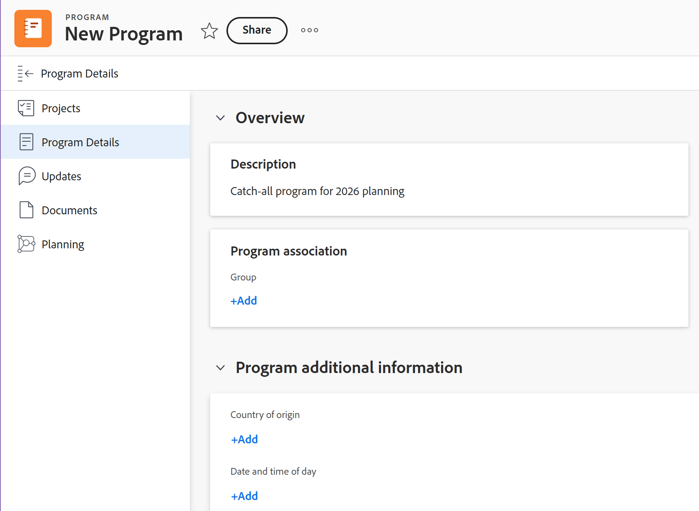

# Modifica programmi

È possibile modificare le informazioni relative ai programmi creati dall&#39;utente o da altri utenti se questi li hanno condivisi con l&#39;utente.

È possibile modificare un programma nella pagina del programma oppure modificare uno o più programmi in blocco in un elenco.

## Requisiti di accesso

+++ Espandi per visualizzare i requisiti di accesso per la funzionalità in questo articolo.

<table style="table-layout:auto"> 
 <col> 
 <col> 
 <tbody> 
  <tr> 
   <td role="rowheader">[!DNL Adobe Workfront] pacchetto</td> 
   <td> 
Qualsiasi
 </td> 
  </tr> 
  <tr> 
   <td role="rowheader">[!DNL Adobe Workfront] licenza*</td> 
   <td> 
[!UICONTROL Standard]

   
[!UICONTROL Plan]
 </td> 
  </tr> 
  <tr> 
   <td role="rowheader">Configurazioni del livello di accesso</td> 
   <td> 
Accesso a [!UICONTROL Edit] ai programmi
  </td> 
  </tr> 
  <tr> 
   <td role="rowheader">Autorizzazioni oggetto</td> 
   <td> 
Autorizzazioni [!UICONTROL Manage] per un programma
  </td> 
  </tr> 
 </tbody> 
</table>

*Per informazioni, consulta [Requisiti di accesso nella documentazione di Workfront](/help/quicksilver/administration-and-setup/add-users/access-levels-and-object-permissions/access-level-requirements-in-documentation.md).

+++

## Modifica programmi

1. Passa al **[!UICONTROL menu principale]**.
1. Fai clic su **[!UICONTROL Programmi]**, quindi fai clic sul nome di un programma per aprirlo.

   >[!TIP]
   >
   >Per accedere a un programma dal portfolio a cui è associato, vai prima al portfolio e poi fai clic su **[!UICONTROL Programmi]** nel pannello a sinistra. Per ulteriori informazioni, vedere [Creare un programma](../../../manage-work/portfolios/create-and-manage-programs/create-program.md).

1. (Facoltativo) Per modificare informazioni limitate sul programma, fai clic su **[!UICONTROL Dettagli programma]** nel pannello a sinistra.

   >[!TIP]
   >
   >Se si desidera modificare tutte le informazioni sul programma, andare al passaggio 4.

   

   >[!NOTE]
   >
   >A seconda del modo in cui l&#39;amministratore di [!DNL Workfront] o il gruppo ha modificato il modello di layout, i campi nell&#39;area [!UICONTROL Dettagli programma] potrebbero essere ridisposti o non essere visualizzati. Per informazioni, vedere [Personalizzare la visualizzazione [!UICONTROL Dettagli] utilizzando un modello di layout](../../../administration-and-setup/customize-workfront/use-layout-templates/customize-details-view-layout-template.md).

   <!--
   
(NOTE: the above note will also come to the Edit Program box)

   -->

   Per modificare le informazioni nella sezione [!UICONTROL Dettagli], eseguire le operazioni seguenti:

   1. (Facoltativo) Fai clic sull&#39;icona **[!UICONTROL Comprimi tutto]** nell&#39;angolo superiore destro per comprimere tutte le aree.
   1. (Facoltativo e condizionale) Quando un&#39;area è compressa, fare clic sulla **freccia rivolta a destra**  accanto a ogni area per espandere l&#39;area che si desidera modificare.
   1. Per informazioni sui campi visibili nella sezione [!UICONTROL Dettagli programma], continuare a modificare il programma nella casella [!UICONTROL Modifica programma] come descritto di seguito.
   1. (Facoltativo) Se al programma non sono allegati moduli personalizzati, inizia a digitare il nome di un modulo nel campo **[!UICONTROL Aggiungi modulo personalizzato]**, selezionalo quando viene visualizzato nell&#39;elenco, quindi fai clic su **[!UICONTROL Salva modifiche]**.
   1. (Facoltativo) Fai clic sull&#39;icona **[!UICONTROL Esporta]**  per esportare le informazioni di [!UICONTROL Panoramica] e moduli personalizzati in un file PDF, quindi fai clic su **[!UICONTROL Esporta]**. Selezionare una delle opzioni seguenti:

      * Seleziona tutto (viene visualizzato solo se è allegato almeno un modulo personalizzato)
      * [!UICONTROL Panoramica]
      * Nome di uno o più moduli personalizzati

      Il file PDF viene scaricato nel computer.

      

      Per ulteriori informazioni, vedere [Esportare moduli personalizzati e dettagli oggetto](../../../workfront-basics/work-with-custom-forms/export-custom-forms-details.md).

1. Per modificare tutte le informazioni su uno o più programmi, effettuare una delle seguenti operazioni:

   * Fai clic sul menu **[!UICONTROL Altro]**  accanto al nome del programma, quindi **[!UICONTROL Modifica].**
   * Vai a un elenco di programmi e seleziona uno o più programmi da modificare, quindi fai clic sull&#39;icona **[!UICONTROL Modifica]**  nella parte superiore dell&#39;elenco.

     Viene visualizzata la casella **[!UICONTROL Modifica programma]**.

     

     Tutti i campi del programma sono disponibili nella casella [!UICONTROL Modifica programma] e sono raggruppati per le aree elencate nel pannello sinistro.

1. Prendere in considerazione la possibilità di specificare informazioni in una delle sezioni seguenti:

   * [[!UICONTROL Panoramica]](#overview)
   * [[!UICONTROL Moduli personalizzati]](#Custom%C2%A0F)
   * [[!UICONTROL Commento]](#comment)

### [!UICONTROL Panoramica] {#overview}

1. Inizia a modificare un programma come descritto in precedenza.
1. Fai clic su **[!UICONTROL Panoramica]** e specifica i campi seguenti:

   <!--
   
(NOTE:&nbsp;note below drafted for now)

   -->

   <!--
   <note type="note">
   Depending on how your Workfront administrator or Group administrator sets up our Layout Template, the fields in the Edit Program box might be rearranged or not display. For information, see
   <a href="../../../administration-and-setup/customize-workfront/use-layout-templates/customize-details-view-layout-template.md" class="MCXref xref">Customize the Details view using a layout template</a>.
   </note>
   -->

   <table style="table-layout:auto"> 
    <col> 
    <col> 
    <tbody> 
     <tr> 
      <td role="rowheader">[!UICONTROL Name]</td> 
      <td> 
Aggiorna il nome del programma. 
 
<b>SUGGERIMENTO</b>

Questa opzione non è disponibile se sono stati selezionati più programmi.
 </td> 
     </tr> 
     <tr> 
      <td role="rowheader">[!UICONTROL Descrizione]</td> 
      <td> 
Digita una descrizione del portfolio per indicare cosa c’è di univoco. 
 </td> 
     </tr> 
     <tr> 
      <td role="rowheader">[!UICONTROL Program Manager]</td> 
      <td> 
Inizia a digitare il nome di un utente che desideri indicare come responsabile del programma, quindi selezionalo quando viene visualizzato nell’elenco. Questa è la persona che può supervisionare il lavoro definito nei progetti del programma. 
 
<b>
IMPORTANTE</b>
 
Quando si designa un utente come Responsabile del programma, questi ottiene automaticamente le autorizzazioni [!UICONTROL Manage] per il programma e i progetti nel programma. 
 
<b>SUGGERIMENTO</b>
 
Puoi aggiornare rapidamente il responsabile del programma nell’intestazione del programma. 
 </td> 
     </tr> 
     <tr> 
      <td role="rowheader">[!UICONTROL Group]</td> 
      <td> 
Aggiungere il nome di un singolo gruppo se il gruppo è associato al programma o se è responsabile del completamento. 
 
<b>SUGGERIMENTO</b>
  
Quando si accede al campo [!UICONTROL Group] dalla pagina [!UICONTROL Program Details], eseguire le operazioni seguenti per assicurarsi di selezionare il gruppo corretto: 
 
Passa il puntatore del mouse sul nome del gruppo e fai clic sull'icona [!UICONTROL information]  accanto a esso. In questo modo viene visualizzata una descrizione del gruppo contenente informazioni sul gruppo stesso, ad esempio la gerarchia dei gruppi al di sopra del gruppo e i relativi amministratori.
 
  
 
Questa opzione non è disponibile nella casella [!UICONTROL Modifica programma]. 
 
 </td> 
     </tr> 
    </tbody> 
   </table>

   <!--this was removed from the unshimmed version - asking on the epic:
   <tr> 
      <td role="rowheader">[!UICONTROL Is Active]</td> 
      <td> 
 Select this checkbox if you want the program to be active. Other users can find active programs and attach them to projects or add them to portfolios. Inactive programs cannot be attached to projects or portfolios. This is enabled by default.
 </td> 
     </tr> -->

1. Fai clic su **[!UICONTROL Salva]** oppure continua a modificare le sezioni seguenti.

### [!UICONTROL Moduli personalizzati]

1. Inizia a modificare il programma come descritto in precedenza.
1. Fare clic sul menu a discesa **[!UICONTROL Aggiungi Forms]** per selezionare un modulo personalizzato e aggiungerlo al programma.

   È necessario creare moduli personalizzati del programma prima che siano disponibili per l’aggiunta.

   >[!NOTE]
   >
   >A seconda di come l&#39;amministratore di [!DNL Workfront] ha impostato le autorizzazioni per le sezioni nel modulo personalizzato, non tutti possono visualizzare o modificare gli stessi campi in un determinato modulo personalizzato. Le autorizzazioni per modificare i campi all’interno di una sezione di un modulo personalizzato dipendono dalle autorizzazioni di cui disponi per il programma stesso. Per informazioni sull&#39;impostazione delle autorizzazioni per le sezioni di un modulo personalizzato, vedere [Creare un modulo personalizzato](/help/quicksilver/administration-and-setup/customize-workfront/create-manage-custom-forms/form-designer/design-a-form/design-a-form.md).

1. Aggiorna i campi nei moduli personalizzati, quindi fai clic su **[!UICONTROL Salva]** o continua con la sezione seguente.

### [!UICONTROL Commento] {#comment}

1. Inizia a modificare un programma come descritto in precedenza.
1. Fai clic su **[!UICONTROL Commento]**.

   

1. Aggiungi un commento nel campo **[!UICONTROL Aggiungi un aggiornamento a ciascun programma]**.
1. (Facoltativo) Fai clic sull&#39;icona **[!UICONTROL Persone]** per aggiungere un utente o un team al commento.
1. (Facoltativo) Seleziona [!UICONTROL **Privato per la mia azienda**] per bloccare il commento e renderlo privato solo per gli utenti della tua azienda.

   >[!TIP]
   >
   >L&#39;impostazione **Privato per la mia società** è disponibile solo quando il tuo profilo Workfront è associato a una società.

   Dopo aver salvato le modifiche, il commento aggiunto viene visualizzato nella scheda [!UICONTROL Aggiornamenti] del programma e invia un&#39;e-mail agli utenti inclusi nel programma.
1. Fai clic su **[!UICONTROL Salva]**

## Modificare i programmi in blocco

Quando si modificano programmi in blocco, tutte le informazioni aggiornate vengono applicate a tutti i programmi selezionati, ignorando le informazioni originali di ciascun programma.

1. Passare a un elenco di programmi e selezionare diversi programmi.
1. Fai clic sull&#39;icona **Modifica**  nella parte superiore dell&#39;elenco.

   Viene visualizzata la casella **Modifica programmi**.
1. Aggiornare le informazioni nelle sezioni seguenti:

   * Panoramica
   * Moduli personalizzati
   * Commento

   Per ulteriori informazioni, vedere la sezione [Modifica programmi](#edit-programs-1) in questo articolo, a partire dal passaggio 4. <!--ensure this stays accurate-->

