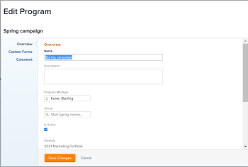

# Modifica programmi

È possibile modificare le informazioni relative ai programmi creati dall&#39;utente o da altri utenti se questi li hanno condivisi con l&#39;utente.

È possibile modificare un programma nella pagina del programma oppure modificare i programmi in un elenco.

## Requisiti di accesso

Per eseguire i passaggi descritti in questo articolo, è necessario disporre dei seguenti diritti di accesso:

<table style="table-layout:auto"> 
 <col> 
 <col> 
 <tbody> 
  <tr> 
   <td role="rowheader">[!DNL Adobe Workfront] piano*</td> 
   <td> 
Qualsiasi
 </td> 
  </tr> 
  <tr> 
   <td role="rowheader">[!DNL Adobe Workfront] licenza*</td> 
   <td> 
[!UICONTROL Plan] 
 </td> 
  </tr> 
  <tr> 
   <td role="rowheader">Livello di accesso*</td> 
   <td> 
Accesso a [!UICONTROL Edit] ai programmi
 
Nota: se non disponi ancora dell'accesso, chiedi all'amministratore [!DNL Workfront] se ha impostato restrizioni aggiuntive nel tuo livello di accesso. Per informazioni sull'accesso ai programmi nel proprio livello di accesso, vedere <a href="../../../administration-and-setup/add-users/configure-and-grant-access/grant-access-programs.md" class="MCXref xref">Concedere l'accesso ai programmi</a>. Per informazioni su come un amministratore di [!DNL Workfront] può modificare il livello di accesso, vedere <a href="../../../administration-and-setup/add-users/configure-and-grant-access/create-modify-access-levels.md" class="MCXref xref">Creare o modificare livelli di accesso personalizzati</a>. 
 </td> 
  </tr> 
  <tr> 
   <td role="rowheader">Autorizzazioni oggetto</td> 
   <td> 
Autorizzazioni [!UICONTROL Manage] per un programma
 
 Per informazioni sulla concessione delle autorizzazioni ai programmi, vedere <a href="../../../workfront-basics/grant-and-request-access-to-objects/share-a-program.md" class="MCXref xref">Condividere un programma </a>. 
 
Per informazioni sulla richiesta di autorizzazioni aggiuntive, vedere <a href="../../../workfront-basics/grant-and-request-access-to-objects/request-access.md" class="MCXref xref">Richiedere l'accesso agli oggetti </a>.
 </td> 
  </tr> 
 </tbody> 
</table>

&#42;Per conoscere il piano, il tipo di licenza o l&#39;accesso di cui si dispone, contattare l&#39;amministratore [!DNL Workfront].

## Modifica programmi

1. Passa al **[!UICONTROL menu principale]**.
1. Fai clic su **[!UICONTROL Programmi]**, quindi fai clic sul nome di un programma per aprirlo.

   >[!TIP]
   >
   >Per accedere a un programma dal portfolio a cui è associato, vai prima al portfolio e poi fai clic su **[!UICONTROL Programmi]** nel pannello a sinistra. Per ulteriori informazioni, vedere [Creare un programma](../../../manage-work/portfolios/create-and-manage-programs/create-program.md).

1. (Facoltativo) Per modificare informazioni limitate sul programma, fai clic su **[!UICONTROL Dettagli programma]** nel pannello a sinistra.

   >[!TIP]
   >
   >Se si desidera modificare tutte le informazioni sul programma, andare al passaggio 4.

   

   >[!NOTE]
   >
   >A seconda del modo in cui l&#39;amministratore di [!DNL Workfront] o il gruppo ha modificato il modello di layout, i campi nell&#39;area [!UICONTROL Dettagli programma] potrebbero essere ridisposti o non essere visualizzati. Per informazioni, vedere [Personalizzare la visualizzazione [!UICONTROL Dettagli] utilizzando un modello di layout](../../../administration-and-setup/customize-workfront/use-layout-templates/customize-details-view-layout-template.md).

   <!--
   
(NOTE: the above note will also come to the Edit Program box)

   -->

   Per modificare le informazioni nella sezione [!UICONTROL Dettagli], eseguire le operazioni seguenti:

   1. (Facoltativo) Fai clic sull&#39;icona **[!UICONTROL Comprimi tutto]** nell&#39;angolo superiore destro per comprimere tutte le aree.
   1. (Facoltativo e condizionale) Quando un&#39;area è compressa, fare clic sulla **freccia rivolta a destra**  accanto a ogni area per espandere l&#39;area che si desidera modificare.
   1. Per informazioni sui campi visibili nella sezione [!UICONTROL Dettagli programma], continuare a modificare il programma nella casella [!UICONTROL Modifica programma] come descritto di seguito.
   1. (Facoltativo) Se al programma non sono allegati moduli personalizzati, inizia a digitare il nome di un modulo nel campo **[!UICONTROL Aggiungi modulo personalizzato]**, selezionalo quando viene visualizzato nell&#39;elenco, quindi fai clic su **[!UICONTROL Salva modifiche]**.
   1. (Facoltativo) Fai clic sull&#39;icona **[!UICONTROL Esporta]**  per esportare le informazioni [!UICONTROL Panoramica] e moduli personalizzati in un file PDF, quindi fai clic su **[!UICONTROL Esporta]**. Selezionare una delle opzioni seguenti:

      * Seleziona tutto (viene visualizzato solo se è allegato almeno un modulo personalizzato)
      * [!UICONTROL Panoramica]
      * Nome di uno o più moduli personalizzati

      Il file PDF viene scaricato nel computer.

      

      Per ulteriori informazioni, vedere [Esportare moduli personalizzati e dettagli oggetto](../../../workfront-basics/work-with-custom-forms/export-custom-forms-details.md).

1. Per modificare tutte le informazioni su uno o più programmi, effettuare una delle seguenti operazioni:

   * Fai clic sul menu **[!UICONTROL Altro]**  accanto al nome del programma, quindi&#x200B;**[!UICONTROL Modifica].**
   * Vai a un elenco di programmi e seleziona uno o più programmi da modificare, quindi fai clic sull&#39;icona **[!UICONTROL Modifica]**  nella parte superiore dell&#39;elenco.

   Viene visualizzata la finestra di dialogo **[!UICONTROL Modifica programma]**.

   

   Tutti i campi del programma sono disponibili nella casella [!UICONTROL Modifica programma] e sono raggruppati per le aree elencate nel pannello sinistro.

1. Prendere in considerazione la possibilità di specificare informazioni in una delle sezioni seguenti:

   * [[!UICONTROL Panoramica]](#overview)
   * [[!UICONTROL Moduli personalizzati]](#Custom%C2%A0F)
   * [[!UICONTROL Commento]](#comment)

### [!UICONTROL Panoramica] {#overview}

1. Inizia a modificare un programma come descritto in precedenza.
1. Fai clic su **[!UICONTROL Panoramica]** e specifica i campi seguenti:

   <!--
   
(NOTE:&nbsp;note below drafted for now)

   -->

   <!--
   <note type="note">
   Depending on how your Workfront administrator or Group administrator sets up our Layout Template, the fields in the Edit Program box might be rearranged or not display. For information, see
   <a href="../../../administration-and-setup/customize-workfront/use-layout-templates/customize-details-view-layout-template.md" class="MCXref xref">Customize the Details view using a layout template</a>.
   </note>
   -->

   <table style="table-layout:auto"> 
    <col> 
    <col> 
    <tbody> 
     <tr> 
      <td role="rowheader">[!UICONTROL Name]</td> 
      <td> 
Aggiorna il nome del programma. 
 
Suggerimento: questa opzione non è disponibile se sono stati selezionati più programmi. 
 </td> 
     </tr> 
     <tr> 
      <td role="rowheader">[!UICONTROL Descrizione]</td> 
      <td> 
Digitare una descrizione per il Portfolio per indicare l'elemento univoco. 
 </td> 
     </tr> 
     <tr> 
      <td role="rowheader">[!UICONTROL Program Manager]</td> 
      <td> 
Inizia a digitare il nome di un utente che desideri indicare come responsabile del programma, quindi selezionalo quando viene visualizzato nell’elenco. Questa è la persona che può supervisionare il lavoro definito nei progetti del programma. 
 
Importante: quando si designa un utente come responsabile del programma, questi ottiene automaticamente le autorizzazioni [!UICONTROL Manage] per il programma e i progetti nel programma. 
 
Suggerimento: puoi aggiornare rapidamente il responsabile del programma nell’intestazione del programma. 
 </td> 
     </tr> 
     <tr> 
      <td role="rowheader">[!UICONTROL Group]</td> 
      <td> 
Aggiungere il nome di un singolo gruppo se il gruppo è associato al programma o se è responsabile del completamento. 
 
Suggerimento  
Quando si accede al campo [!UICONTROL Group] dalla pagina [!UICONTROL Program Details], effettuare le seguenti operazioni: 
 
Per assicurarsi di selezionare il gruppo corretto, posizionare il puntatore del mouse su di esso e fare clic sull'icona [!UICONTROL information]  visualizzata accanto ad esso. In questo modo viene visualizzata una descrizione del gruppo contenente informazioni sul gruppo stesso, ad esempio la gerarchia dei gruppi al di sopra del gruppo e i relativi amministratori.
 
  
 
Questa opzione non è disponibile nella casella [!UICONTROL Modifica programma]. 
 
 </td> 
     </tr> 
     <tr> 
      <td role="rowheader">[!UICONTROL È Attivo]</td> 
      <td> 
 Selezionare questa casella di controllo se si desidera attivare il programma. Altri utenti possono trovare i programmi attivi e allegarli ai progetti o aggiungerli ai portfolio. I programmi inattivi non possono essere allegati a progetti o portafogli. Questa opzione è attivata per impostazione predefinita.
 </td> 
     </tr> 
    </tbody> 
   </table>

1. Fai clic su **[!UICONTROL Salva modifiche]** o continua a modificare le sezioni seguenti.

### [!UICONTROL Moduli personalizzati]

1. Inizia a modificare il programma come descritto in precedenza.
1. Fare clic sul menu a discesa **[!UICONTROL Aggiungi Forms]** per selezionare un modulo personalizzato e aggiungerlo al programma.

   È necessario creare moduli personalizzati del programma prima che siano disponibili per l’aggiunta.

   >[!NOTE]
   >
   >A seconda di come l&#39;amministratore di [!DNL Workfront] ha impostato le autorizzazioni per le sezioni nel modulo personalizzato, non tutti possono visualizzare o modificare gli stessi campi in un determinato modulo personalizzato. Le autorizzazioni per modificare i campi all’interno di una sezione di un modulo personalizzato dipendono dalle autorizzazioni di cui disponi per il programma stesso. Per informazioni sull&#39;impostazione delle autorizzazioni per le sezioni di un modulo personalizzato, vedere [Progettare un modulo con il progettista del modulo](/help/quicksilver/administration-and-setup/customize-workfront/create-manage-custom-forms/form-designer/design-a-form/design-a-form.md).

1. Aggiorna i campi nei moduli personalizzati, quindi fai clic su **[!UICONTROL Salva modifiche]** o continua con la sezione seguente.

### [!UICONTROL Commento] {#comment}

1. Inizia a modificare un programma come descritto in precedenza.
1. Fai clic su **[!UICONTROL Commento]**.

   

1. Aggiungi un commento nel campo **[!UICONTROL Post e aggiorna il programma]**.
1. (Facoltativo) Fai clic sull&#39;icona **[!UICONTROL Persone]** per aggiungere un utente o un team al commento.
1. (Facoltativo) Fai clic sull&#39;icona **[!UICONTROL Blocca]** per bloccare il commento e renderlo privato solo per gli utenti della tua azienda.

   Dopo aver salvato le modifiche, il commento aggiunto viene visualizzato nella scheda [!UICONTROL Aggiornamenti] del programma e invia un&#39;e-mail agli utenti inclusi nel programma.
