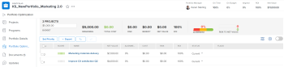

# Individua il [!UICONTROL Ottimizzatore Portfolio]

È possibile trovare le [!UICONTROL Ottimizzatore Portfolio] quando accedi a un portfolio.

## Requisiti di accesso

Per eseguire i passaggi descritti in questo articolo, è necessario disporre dei seguenti diritti di accesso:

<table style="table-layout:auto"> 
 <col> 
 <col> 
 <tbody> 
  <tr> 
   <td role="rowheader">[!DNL Adobe Workfront] piano*</td> 
   <td> 
[!UICONTROL Business] o superiore
 </td> 
  </tr> 
  <tr> 
   <td role="rowheader">[!DNL Adobe Workfront] licenza*</td> 
   <td> 
[!UICONTROL Plan] 
 </td> 
  </tr> 
  <tr> 
   <td role="rowheader">Configurazioni a livello di accesso*</td> 
   <td> 
Accesso a Portfoli e progetti con modifica
 
<b>NOTA</b>

Se non hai ancora accesso, chiedi [!DNL Workfront] amministratore se imposta ulteriori restrizioni nel livello di accesso. Per informazioni su come [!DNL Workfront] l&#39;amministratore può modificare il livello di accesso, vedi <a href="../../../administration-and-setup/add-users/configure-and-grant-access/create-modify-access-levels.md" class="MCXref xref">Creare o modificare livelli di accesso personalizzati</a>.
 </td>
</tr> 
  <tr> 
   <td role="rowheader">Autorizzazioni oggetto</td> 
   <td> 
Autorizzazioni di gestione per il portfolio
 
Per informazioni sulla richiesta di accesso aggiuntivo, vedi <a href="../../../workfront-basics/grant-and-request-access-to-objects/request-access.md" class="MCXref xref">Richiedere l’accesso agli oggetti </a>.
 </td> 
  </tr> 
 </tbody> 
</table>

&#42;Per sapere quale piano, tipo di licenza o accesso hai, contatta il tuo [!DNL Workfront] amministratore.

## Individua il [!UICONTROL Ottimizzatore Portfolio]

1. Da **[!UICONTROL Menu principale]**, fai clic su **[!UICONTROL Portfoli]**.

   Per impostazione predefinita, i portfolio che possiedi sono visualizzati.

1. (Facoltativo) Dal **[!UICONTROL Filtro]** menu a discesa, seleziona per visualizzare un diverso set di portfolio.
1. Fai clic sul nome di un portfolio per accedervi.
1. Fai clic su **[!UICONTROL Ottimizzazione del Portfolio]** nel pannello a sinistra.

   La [!UICONTROL Ottimizzatore Portfolio] viene visualizzato.

   
