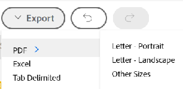

# [!UICONTROL Ottimizzatore Portfolio] panoramica

La [!UICONTROL Ottimizzatore Portfolio] è lo strumento utilizzato per la valutazione e il confronto dei progetti. Il processo di revisione e di confronto [!UICONTROL Business case] i valori per i progetti assegnati a un portfolio sono il modo in cui un gestore di portfolio può assegnare priorità ai progetti e generare il maggior valore per un&#39;organizzazione.

Lo scopo del [!UICONTROL ottimizzatore di portafoglio] è fornire un&#39;interfaccia attraverso la quale un gestore di portafoglio, un comitato direttivo o un ufficio di gestione dei prodotti può visualizzare informazioni sintetiche sul business case di ciascun progetto. I progetti possono quindi essere prioritari in base a valori e obiettivi strategici o in base al loro punteggio complessivo.

La [!UICONTROL Ottimizzatore Portfolio] può aiutarti solo se hai completato i seguenti prerequisiti:

* La [!UICONTROL Casi aziendali] sono stati completati sui progetti. Per informazioni, consulta gli articoli nella sezione [Definire un caso aziendale](../../projects/define-a-business-case/define-business-case.md).
* Un portfolio è definito nell’area Panoramica progetto della sezione Dettagli progetto per i progetti da esaminare
* È stato indicato il budget del progetto e il benefit pianificato per i progetti da esaminare. Costi fissi e ricavi fissi sono facoltativi ma aggiungono valore aggiuntivo. Per informazioni, consulta [Il progetto finanzia campi](../../projects/project-finances/project-finances-overview-1.md).

Per informazioni su come individuare il [!UICONTROL Ottimizzatore Portfolio], vedi [Individua il [!UICONTROL Ottimizzatore Portfolio]](../../../manage-work/portfolios/portfolio-optimizer/locate-portfolio-optimizer.md).

## Finanze in [!UICONTROL Ottimizzatore Portfolio]

* [Le aree finanziarie [!UICONTROL Ottimizzatore Portfolio]](#the-financial-areas-in-the-portfolio-optimizer)
* [I settori finanziari [!UICONTROL Ottimizzatore Portfolio]](#the-financial-fields-in-the-portfolio-optimizer)

Puoi visualizzare lo stato finanziario del tuo portafoglio in qualsiasi momento durante la vita dei tuoi progetti quando utilizzi il [!UICONTROL Ottimizzatore Portfolio].

Quando si lavora con le finanze nel [!UICONTROL Ottimizzatore Portfolio]:

* A ciascun progetto viene assegnato un punteggio quando la relativa [!UICONTROL Casi aziendali] sono completati in base ai criteri corrispondenti nel [!UICONTROL Ottimizzatore Portfolio]. Ad esempio, i progetti a basso costo o ad alto allineamento ricevono un punteggio più alto.

   Per ulteriori informazioni sul calcolo del punteggio dell’ottimizzatore del portfolio di un progetto, consulta l’articolo [Panoramica [!UICONTROL Ottimizzatore Portfolio] Punteggio](../../../manage-work/portfolios/portfolio-optimizer/portfolio-optimizer-score.md).

* I calcoli finanziari per [!UICONTROL Ottimizzatore Portfolio] utilizza [!UICONTROL Costo preventivato] in [!UICONTROL Business case] del progetto.
* Puoi assegnare manualmente le priorità ai tuoi progetti nel [!UICONTROL Ottimizzatore Portfolio], tenendo conto di tutte le informazioni che le riguardano. Ciò include i dati finanziari, l&#39;allineamento alle scorecard, il ROI, ad esempio.

### Le aree finanziarie [!UICONTROL Ottimizzatore Portfolio] {#the-financial-areas-in-the-portfolio-optimizer}

È possibile visualizzare le informazioni finanziarie nelle seguenti aree del [!UICONTROL Ottimizzatore Portfolio]:

* **[!UICONTROL Intestazione Portfolio]**: In quest’area vengono visualizzate le informazioni finanziarie raccolte da tutti i progetti del portafoglio. Viene visualizzato su ogni scheda dell’oggetto Portfolio.
* **[!UICONTROL Finanziamenti Portfoli per i progetti selezionati]**: In questa area vengono visualizzate le informazioni finanziarie raccolte dai progetti selezionati nella [!UICONTROL Ottimizzatore Portfolio]. Puoi aggiungere o rimuovere progetti e capire in che modo ciò influirà sulle finanze del portafoglio visualizzando le informazioni in questo settore.
* **[!UICONTROL Finanze per progetti]**: In questa area vengono visualizzate le informazioni finanziarie di ciascun progetto elencato nella [!UICONTROL Ottimizzatore Portfolio].

### I settori finanziari [!UICONTROL Ottimizzatore Portfolio] {#the-financial-fields-in-the-portfolio-optimizer}

I seguenti campi finanziari vengono visualizzati nel [!UICONTROL Ottimizzatore Portfolio]:

* [Intestazione del Portfolio](#portfolio-header)
* [Finanze del Portfolio per i progetti selezionati](#portfolio-finances-for-selected-projects)

#### Intestazione del Portfolio {#portfolio-header}

[!DNL Adobe Workfront] calcola i campi finanziari nell’intestazione del portfolio utilizzando le informazioni dei progetti con stati che corrispondono solo a [!UICONTROL Approvato] o [!UICONTROL Corrente].

<table style="table-layout:auto"> 
 <col> 
 <col> 
 <thead> 
  <tr> 
   <th><strong>Nome del campo</strong> </th> 
   <th><strong>Descrizione</strong> </th> 
  </tr> 
 </thead> 
 <tbody> 
  <tr> 
   <td>[!UICONTROL puntuale]</td> 
   <td> 
La percentuale di progetti nel portafoglio considerati come [!UICONTROL On Time]. Questo è visibile da qualsiasi scheda all’interno di un Portfolio.
 
Un progetto viene considerato come [!UICONTROL On Time] quando il progetto <strong>[!UICONTROL Condition]</strong> è <strong>[!UICONTROL Su Target]</strong>.  Per ulteriori informazioni sulle condizioni del progetto, consulta l’articolo <a href="../../../manage-work/projects/manage-projects/project-condition-and-condition-type.md" class="MCXref xref">Panoramica del tipo di condizione e condizione del progetto</a>.
 
La <strong>[!UICONTROL puntuale]</strong> percentuale viene calcolata utilizzando la seguente formula:
 
<em>[!UICONTROL On Time Portfolio Percentuali] = Numero di progetti [!UICONTROL On Time]/ Numero totale di progetti in uno stato [!UICONTROL Current] o [!UICONTROL Approved]</em> 
 </td> 
  </tr> 
  <tr> 
   <td>[!UICONTROL Sul Budget]</td> 
   <td> 
La percentuale di progetti nel portafoglio considerati [!UICONTROL On Budget]. Questo è visibile da qualsiasi scheda all’interno di un Portfolio [!UICONTROL].
 
I progetti sono <strong>[!UICONTROL Sul Budget]</strong> quando non hanno superato il loro budget predefinito.  Per ulteriori informazioni sul budget di un progetto, consulta l’articolo <a href="../../../manage-work/projects/project-finances/manage-project-finance-area.md" class="MCXref xref">Gestisci informazioni nell'area di finanziamento del progetto</a>.
 
La percentuale [!UICONTROL On Budget] viene calcolata utilizzando la seguente formula:
 
<em>[!UICONTROL In Percentuale Portfolio Budget] = Numero di progetti [!UICONTROL In Base Al Budget]/ Numero totale di progetti </em><em>in uno stato [!UICONTROL Current] o [!UICONTROL Approved]</em> 
 </td> 
  </tr> 
  <tr> 
   <td>ROI (per portafoglio)</td> 
   <td> 
Il [!UICONTROL Return on Investment] (ROI) del portafoglio viene calcolato tenendo conto del [!UICONTROL Vantaggio] totale del [!UICONTROL Portfolio] e del totale dei [!UICONTROL Budgeted Cost] dei progetti. Questo è visibile da qualsiasi scheda all’interno di un Portfolio.
 
Il valore Portfolio del ROI viene calcolato utilizzando la seguente formula:
 
<em>ROI Portfolio = ([!UICONTROL Vantaggio Totale] - [!UICONTROL Costo Totale A Budget])/ [!UICONTROL Costo Totale] * 100</em> 
 
Per ulteriori informazioni sul calcolo del ROI per un progetto, consulta l’articolo <a href="../../../manage-work/projects/project-finances/calculate-roi.md" class="MCXref xref">Calcola il ritorno sull'investimento (ROI)</a> .
 </td> 
  </tr> 
  <tr> 
   <td>Punteggio di allineamento allineato o allineato </td> 
   <td> 
Una media di tutti i valori [!UICONTROL Project Alignment Score] calcolati dopo il completamento della [!UICONTROL Scorecard] nel [!UICONTROL Business Case] del progetto. Il punteggio di allineamento di ciascun progetto è elencato nella colonna [!UICONTROL Alignment] di Portfoli Optimizer. Questo è visibile da qualsiasi scheda all’interno di un portfolio.
 
Per ulteriori informazioni sulla generazione di un punteggio di allineamento per un progetto, consulta l’articolo <a href="../../../manage-work/projects/define-a-business-case/apply-scorecard-to-project-to-generate-alignment-score.md" class="MCXref xref">Applicare una scorecard a un progetto e generare un punteggio di allineamento</a>.
 </td> 
  </tr> 
  <tr> 
   <td>[!UICONTROL Valore Netto]</td> 
   <td> 
La somma di tutti i [!UICONTROL Net Values] di tutti i progetti nel portafoglio. Questo è visibile da qualsiasi scheda all’interno di un portfolio.
 
Per ulteriori informazioni sul calcolo del [!UICONTROL Net Value] per un progetto, consulta l’articolo <a href="../../../manage-work/projects/project-finances/calculate-net-value.md" class="MCXref xref">Calcola valore netto</a>.
 </td> 
  </tr> 
 </tbody> 
</table>

#### Finanze del Portfolio per i progetti selezionati {#portfolio-finances-for-selected-projects}

<table style="table-layout:auto"> 
 <col> 
 <col> 
 <thead> 
  <tr> 
   <th><strong>Nome del campo</strong> </th> 
   <th> 
<strong>Descrizione</strong> 
 
 
 </th> 
  </tr> 
 </thead> 
 <tbody> 
  <tr> 
   <td>[!UICONTROL Numero di progetti]</td> 
   <td> 
Numero totale di progetti attivi nel portafoglio. I progetti considerati attivi in un portfolio possono trovarsi in uno dei seguenti stati:
 
    <ul> 
     <li>[!UICONTROL Current]</li> 
     <li>[!UICONTROL Planning]</li> 
     <li>[!UICONTROL Approvato]</li> 
    </ul> </td> 
  </tr> 
  <tr> 
   <td>[!UICONTROL Budget]</td> 
   <td>Puoi aggiornare manualmente questo campo per indicare il budget totale per l’intero portfolio. Questo budget viene utilizzato per tutti i progetti all'interno del portafoglio. </td> 
  </tr> 
  <tr> 
   <td>[!UICONTROL rimanente]</td> 
   <td> 
Il bilancio rimanente dopo tutti i [!UICONTROL Budgeted Cost] su tutti i progetti all'interno del portafoglio è stato sottratto dal bilancio del portafoglio.
 
Il [!UICONTROL Budget Portfolio rimanente] viene calcolato utilizzando la seguente formula:
 
<em>[!UICONTROL Budget Portfolio rimanente] = [!UICONTROL Budget Portfolio totale] - [!UICONTROL Costo preventivato budget] totale di tutti i progetti di Portfolio</em> 
 
Il [!UICONTROL Budgeted Cost] complessivo di tutti i progetti nel portafoglio è rappresentato nella barra degli indicatori sotto il campo Budget. 
 
Per ulteriori informazioni sul tracciamento dei costi per un progetto, consulta l’articolo<a href="../../../manage-work/projects/project-finances/track-costs.md" class="MCXref xref">Costi di tracciamento</a>.
 </td> 
  </tr> 
  <tr> 
   <td>[!UICONTROL Costo totale]</td> 
   <td> 
La somma dei costi di tutti i progetti visualizzati in [!UICONTROL Portfoli Optimizer]. Il costo di ciascun progetto è lo stesso del [!UICONTROL Budgeted Cost] del progetto visualizzato nel [!UICONTROL Business Case Summary]. 
 
Per ulteriori informazioni sui campi finanziari dei progetti nel [!UICONTROL Business Case], vedi la sezione "Campi finanziari nel Business Case" nell'articolo <a href="../../../manage-work/projects/define-a-business-case/create-business-case.md" class="MCXref xref">Creare un business case per un progetto </a>.
 </td> 
  </tr> 
  <tr> 
   <td>[!UICONTROL Risk] </td> 
   <td> 
La somma di tutti i [!UICONTROL Potenziale Rischio Costi] di tutti i progetti del portafoglio. Il [!UICONTROL Potenziale Rischio Cost] di ciascun progetto è elencato nella colonna [!UICONTROL Risk] di [!UICONTROL Portfoli Optimizer]. 
 
Per ulteriori informazioni sul calcolo dei rischi per i progetti, consulta l’articolo <a href="../../../manage-work/projects/project-finances/potential-risk-cost.md" class="MCXref xref">Calcolare il costo potenziale del rischio </a>.
 </td> 
  </tr> 
  <tr> 
   <td>[!UICONTROL Vantaggio]</td> 
   <td> 
La somma di tutti i valori [!UICONTROL Planned Vantit] di tutti i progetti nel portafoglio. Il valore dei benefici pianificati di ciascun progetto è elencato nella colonna [!UICONTROL Vantaggio] di [!UICONTROL Portfoli Optimizer]. 
 
Per ulteriori informazioni sul [!UICONTROL Planned Vantit] di un progetto, consulta l’articolo <a href="../../../manage-work/projects/project-finances/project-planned-benefit.md" class="MCXref xref">Panoramica del progetto Vantaggio pianificato</a>.
 </td> 
  </tr> 
  <tr> 
   <td>Indicatore [!UICONTROL Risk to Net Value]</td> 
   <td> 
Misura il valore del [!UICONTROL Potenziale Rischio] tenendo conto del [!UICONTROL Valore Netto] fornito da tutti i progetti del portafoglio. Per ottenere la massima efficienza all'interno del portafoglio, si desidera vedere che l'indicatore [!UICONTROL Risk] è basso e l'indicatore [!UICONTROL Net Value] è alto. 
 
Per ulteriori informazioni sul calcolo del rischio per [!UICONTROL Valore netto], consulta l’articolo <a href="../../../manage-work/portfolios/portfolio-optimizer/calculate-risk-to-net-value-in-portfolio.md" class="MCXref xref">Calcolare il rischio del valore netto in un portafoglio</a>.
 </td> 
  </tr> 
 </tbody> 
</table>

## Personalizzare [!UICONTROL Ottimizzatore Portfolio]

È possibile personalizzare solo l’area dell’elenco dei progetti [!UICONTROL Ottimizzatore Portfolio] utilizzando le impostazioni per modificare le informazioni nell’elenco.

Sono disponibili le icone e le opzioni seguenti per [!UICONTROL Ottimizzatore Portfolio]:

<table style="table-layout:auto"> 
 <col> 
 <col> 
 <col> 
 <tbody> 
  <tr> 
   <td>Icona in Portfoli Optimizer</td> 
   <td>Nome</td> 
   <td>Funzione</td> 
  </tr> 
  <tr> 
   <td>  </td> 
   <td>[!UICONTROL Impostare la priorità del progetto]</td> 
   <td>Utilizza questa icona quando desideri salvare l’ordine del progetto in base alla loro priorità. </td> 
  </tr> 
  <tr> 
   <td>  </td> 
   <td>[!UICONTROL Ottimizza portfolio]</td> 
   <td>Utilizza questa icona per ottimizzare il portfolio in base ai seguenti valori finanziari dei progetti:
    <ul>
     <li>[!UICONTROL Cost]</li>
     <li>[!UICONTROL Alignment]</li>
     <li>[!UICONTROL Value]</li>
     <li>[!UICONTROL Rischio a beneficio]</li>
     <li>[!UICONTROL ROI]</li>
    </ul>
Per ulteriori informazioni sull’ottimizzazione del portfolio, consulta l’articolo <a href="../../../manage-work/portfolios/portfolio-optimizer/optimize-projects-in-portfolio-optimizer.md" class="MCXref xref">Ottimizzare i progetti in Portfoli Optimizer </a>.
</td> 
  </tr> 
  <tr> 
   <td>  </td> 
   <td>Icone [!UICONTROL Annulla]/ [!UICONTROL Ripristina]</td> 
   <td>Usa queste icone per annullare o ripristinare le modifiche apportate a [!UICONTROL Portfoli Optimizer] prima di salvare.</td> 
  </tr> 
  <tr> 
   <td>  </td> 
   <td>[!UICONTROL Show]/ [!UICONTROL Nascondi progetti non selezionati]</td> 
   <td>Usa queste icone per visualizzare o nascondere i progetti nel portfolio che hai deselezionato.</td> 
  </tr> 
  <tr> 
   <td>  </td> 
   <td>[!UICONTROL Export] </td> 
   <td> 
Utilizza questa icona per esportare i dati nell’area [!UICONTROL Project Priority] di Portfoli Optimizer. Puoi esportarlo nei seguenti formati:
 
    <ul> 
     <li>PDF</li> 
     <li>[!DNL Excel]</li> 
     <li>Delimitato da [!UICONTROL Tab]</li> 
    </ul> </td> 
  </tr> 
  <tr> 
   <td>  </td> 
   <td>[!UICONTROL Preferences]</td> 
   <td> 
Utilizza questa icona per modificare i campi del progetto visualizzati nelle colonne di [!UICONTROL Portfoli Optimizer] o per modificare i progetti visualizzati in [!UICONTROL Optimizer] in base ai relativi stati. 
 
Suggerimento:  
     <ul> 
      <li> 
Non tutti [!DNL Workfront] sono disponibili campi standard da aggiungere nelle colonne. 
 </li> 
     </ul> 
     <ul> 
      <li> 
Puoi aggiungere solo i campi personalizzati con un valore diverso da zero in uno qualsiasi dei progetti del portfolio.
 </li> 
     </ul> 
 </td> 
  </tr> 
 </tbody> 
</table>
