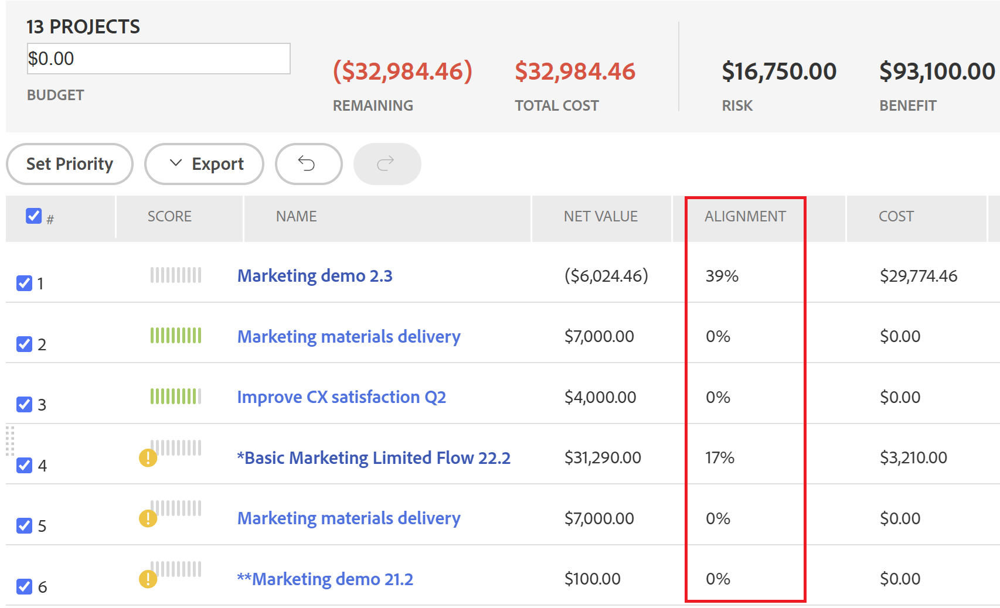

# Panoramica del punteggio [!UICONTROL Portfolio Optimizer]

<!--Audited: 01/2025-->

Puoi trovare il punteggio [!UICONTROL Portfolio Optimizer] in [!UICONTROL Portfolio Optimizer]. Viene visualizzato nella colonna **[!UICONTROL Punteggio]** per ogni progetto. Questo rappresenta un punteggio per ogni progetto del portfolio.

Per informazioni sull&#39;individuazione di [!UICONTROL Portfolio Optimizer], vedere l&#39;articolo [[!UICONTROL Panoramica di Portfolio Optimizer]](../../../manage-work/portfolios/portfolio-optimizer/portfolio-optimizer-overview.md).

Per informazioni su come [!DNL Adobe Workfront] utilizza il punteggio del progetto e altre informazioni sul progetto per ottimizzare i progetti in [!UICONTROL Portfolio Optimizer], vedere [Ottimizzare i progetti in Portfolio Optimizer](../../../manage-work/portfolios/portfolio-optimizer/optimize-projects-in-portfolio-optimizer.md).

## Differenza tra il [!UICONTROL Punteggio di allineamento] e il [!UICONTROL Punteggio di Portfolio Optimizer]

Esiste una differenza tra il punteggio di allineamento e il punteggio dell’ottimizzatore del portfolio di un progetto.

Il punteggio di allineamento di un progetto viene calcolato in base ai punti ottenuti dopo il completamento della scorecard. Questo punteggio viene quindi utilizzato per determinare il punteggio di allineamento del portfolio. Il punteggio di allineamento viene visualizzato come percentuale.

Il punteggio di allineamento di un progetto viene visualizzato nella colonna **[!UICONTROL Allineamento]** di [!UICONTROL Portfolio Optimizer] o nel campo [!UICONTROL Allineamento] del [!UICONTROL Riepilogo caso di business].




Per ulteriori informazioni sulla generazione del punteggio di allineamento di un progetto, vedere l&#39;articolo [Applicare una scorecard a un progetto e generare un punteggio di allineamento](../../../manage-work/projects/define-a-business-case/apply-scorecard-to-project-to-generate-alignment-score.md).

Il punteggio [!UICONTROL ottimizzatore portfolio] è una classificazione calcolata automaticamente in [!UICONTROL Ottimizzatore Portfolio] in base alla quale è possibile assegnare la priorità ai progetti. Il punteggio dell&#39;ottimizzatore portfolio viene visualizzato come icona di indicatore accompagnata da un numero e viene visualizzato nella colonna **[!UICONTROL Punteggio]** di [!UICONTROL Portfolio Optimizer].

>[!NOTE]
>
>È possibile assegnare un punteggio a un progetto in [!UICONTROL Portfolio Optimizer] solo se il relativo caso aziendale è stato completato. Per ulteriori informazioni sul completamento di un caso aziendale, vedere l&#39;articolo [[!UICONTROL Creare un caso aziendale] per un progetto](../../../manage-work/projects/define-a-business-case/create-business-case.md).


Il punteggio di ciascun progetto viene calcolato in base all’importanza delle seguenti categorie:

* [!UICONTROL Costo]
* [!UICONTROL Allineamento]
* [!UICONTROL Valore Netto]
* [!UICONTROL Rischio per il beneficio]
* [!UICONTROL ROI]

## Calcola il punteggio di [!UICONTROL Portfolio Optimizer]

<!--
<p data-mc-conditions="QuicksilverOrClassic.Draft mode">(NOTE: This was edited based on this issue, per Anna: https://hub.workfront.com/issue/603d0c58000095ea0bc00ce5e2110693/overview)</p>
-->

[!DNL Workfront] genera un punteggio utilizzando [!UICONTROL Portfolio Optimizer] che è una classificazione per assistere nella definizione delle priorità dei progetti. I valori nel portfolio si basano sui valori inseriti nei casi aziendali dei progetti e vengono utilizzati per calcolare un punteggio per il progetto. I progetti con un punteggio più elevato potrebbero essere considerati di maggiore importanza e si potrebbe dare loro la priorità di completarli per primi.

Per conoscere la classificazione di un progetto, effettuare le seguenti operazioni:

1. Passare a [!UICONTROL Portfolio Optimizer].
1. Passa il cursore del mouse sull’icona di classificazione per visualizzare il punteggio dell’ottimizzatore del portfolio per un progetto.


L’algoritmo per il calcolo dei punteggi prende in considerazione i valori delineati nei Business Case dei progetti e il peso che comportano. Attribuisce un punteggio a ogni progetto nell’ottimizzatore e normalizza tale punteggio in modo che ci sia sempre un progetto con un punteggio di 100. Questo dà un punteggio alto al progetto migliore.

>[!BEGINSHADEBOX]

**ESEMPIO**

Ad esempio, se l&#39;allineamento [!UICONTROL più alto] è l&#39;unico fattore da considerare, il progetto con l&#39;allineamento più alto ottiene il punteggio di 100.

>[!ENDSHADEBOX]

Di seguito sono riportati i criteri in base ai quali è possibile assegnare un punteggio a un progetto:

* [!UICONTROL Costo]
* [!UICONTROL Allineamento]
* [!UICONTROL Valore]
* [!UICONTROL Rischio per il beneficio]
* [!UICONTROL ROI]


Per informazioni su come ottimizzare i progetti nel portfolio, vedere [Ottimizzare i progetti in [!UICONTROL Portfolio Optimizer]](../../../manage-work/portfolios/portfolio-optimizer/optimize-projects-in-portfolio-optimizer.md).

A ogni criterio nel pannello di configurazione ([!UICONTROL Costo], [!UICONTROL Allineamento], [!UICONTROL ROI], [!UICONTROL Valore netto], [!UICONTROL Rischio per benefici]) viene assegnato un peso compreso tra 0 e 100 in base alla selezione effettuata.

Per ogni progetto con un business case completo viene generato un punteggio per criterio utilizzando la seguente formula:

```
Score Per Criteria = (Project Value For The Criteria - AVG(all the project values for this criteria)) / Standard Deviation of that value for that project
```

**Esempio:** Per il [!UICONTROL Punteggio di allineamento] per il progetto A, si avrà quanto segue:

```
Alignment Score = (Project A Alignment Score - AVG (of all the project Alignments)) / Standard Deviation of alignment score for that project
```

Dopo aver calcolato tutti i [!UICONTROL punteggi per criterio], puoi aggiungerli tenendo conto del loro peso per ottenere il punteggio completo per progetto. Il punteggio del progetto viene calcolato con la seguente formula:

```
Score = Cost Score * Cost Weight + Alignment Score * Alignment Weight + ROI Score * ROI Weight + Net Value Score * Net Value Weight + Risk Score * Risk Weight
```

Per il costo del progetto e il [!UICONTROL rischio] la logica funziona in modo inverso rispetto agli altri criteri: se desideri che il [!UICONTROL basso costo] sia importante per te, non aumenterà ma diminuirà il punteggio complessivo del progetto di `Cost Score * Cost Weight`.

Dopo aver calcolato i punteggi per ciascun progetto, il [!UICONTROL Punteggio di ottimizzazione] viene definito per i progetti nel modo seguente:

1. Sono definiti [!UICONTROL punteggi minimi] e [!UICONTROL massimi].
1. Viene calcolato l’intervallo tra questi valori.
1. Per ogni progetto il [!UICONTROL punteggio di ottimizzazione] viene calcolato con la seguente formula:

   ```
   Optimization Score = Rounded ((Score - Minimum / Range)*100)
   ```
