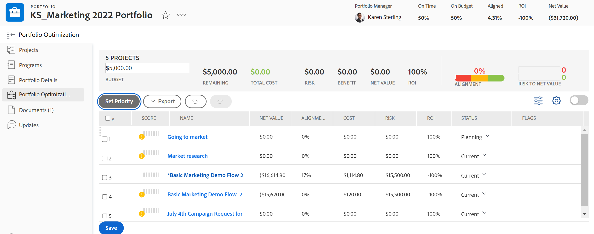

# Spostarsi all’interno di un portfolio

<!--

(NOTE: This article will need to be further revised and maybe merged into Understanding Portfolios?! (other?!).)

-->

In [!DNL Adobe Workfront], un portfolio rappresenta una raccolta di progetti che competono per le stesse risorse, budget, pianificazione e priorità. Lo scopo principale del portfolio è quello di aiutare i dirigenti e i project manager a scegliere di lavorare su progetti che offrono i maggiori vantaggi a un&#39;organizzazione.

Per ulteriori informazioni sui portfolio, vedere [Panoramica sui Portfoli in [!DNL Adobe Workfront]](../../../manage-work/portfolios/portfolios-overview/portfolio-overview.md).

## Requisiti di accesso

Per eseguire i passaggi descritti in questo articolo, è necessario disporre dei seguenti diritti di accesso:

<table style="table-layout:auto"> 
 <col> 
 <col> 
 <tbody> 
  <tr> 
   <td role="rowheader">[!DNL Adobe Workfront] piano*</td> 
   <td> 
Qualsiasi 
 </td> 
  </tr> 
  <tr> 
   <td role="rowheader">[!DNL Adobe Workfront] licenza*</td> 
   <td> 
[!UICONTROL Plan] 
 </td> 
  </tr> 
  <tr> 
   <td role="rowheader">Configurazioni del livello di accesso*</td> 
   <td> 
Accesso a progetti e Portfoli tramite [!UICONTROL Edit]
 
Nota: se non disponi ancora dell'accesso, chiedi all'amministratore [!DNL Workfront] se ha impostato restrizioni aggiuntive nel tuo livello di accesso. Per informazioni su come un amministratore di [!DNL Workfront] può modificare il tuo livello di accesso, vedi <a href="../../../administration-and-setup/add-users/configure-and-grant-access/create-modify-access-levels.md" class="MCXref xref">Creare o modificare livelli di accesso personalizzati</a>.
 </td> 
  </tr> 
  <tr> 
   <td role="rowheader">Autorizzazioni oggetto</td> 
   <td> 
Autorizzazioni di [!UICONTROL Manage] per il portfolio
 
Visualizza o autorizzazioni superiori per i progetti
 
Per informazioni sulla richiesta di accesso aggiuntivo, vedere <a href="../../../workfront-basics/grant-and-request-access-to-objects/request-access.md" class="MCXref xref">Richiedere l'accesso agli oggetti </a>.
 </td> 
  </tr> 
 </tbody> 
</table>

&#42;Per conoscere il piano, il tipo di licenza o l&#39;accesso di cui si dispone, contattare l&#39;amministratore [!DNL Workfront].

## Spostarsi all’interno di un portfolio

1. Fai clic sull&#39;icona  del **[!UICONTROL menu principale]** nell&#39;angolo superiore destro di [!DNL Adobe Workfront].

1. Fai clic su [!UICONTROL Portfoli].
1. Dal menu a discesa **[!UICONTROL Filtro]**, seleziona quanto segue:

   * **[!UICONTROL Portfoli di mia proprietà]**: include un elenco di portfolio per i quali sei designato come [!UICONTROL Responsabile Portfolio].
   * **[!UICONTROL Tutti]**: include tutti i portfolio per i quali si dispone almeno dell&#39;accesso alla visualizzazione.\

     Per ulteriori informazioni sull&#39;accesso ai Portfoli, vedere [Panoramica dei livelli di accesso](../../../administration-and-setup/add-users/access-levels-and-object-permissions/access-levels-overview.md).\
      Per ulteriori informazioni sulle autorizzazioni per i Portfoli, vedere [Condividere un portfolio](../../../workfront-basics/grant-and-request-access-to-objects/share-a-portfolio.md).

     Per aggiungere nuovi portfolio, vedere [Creare un portfolio](../../../manage-work/portfolios/create-and-manage-portfolios/create-portfolios.md).

1. Fai clic sul nome di un portfolio per accedervi.\
   Nell&#39;area [!UICONTROL Dettagli Portfolio] all&#39;interno di un portfolio vengono visualizzate le metriche delle prestazioni del portfolio seguenti:

   * Indica se il portfolio è [!UICONTROL puntuale]
   * Indica se il portfolio è [!UICONTROL nel budget]
   * Il [!UICONTROL ritorno sull&#39;investimento] (ROI)
   * Il portfolio [!UICONTROL Alignment]
   * Il portfolio [!UICONTROL Valore netto]

1. (Facoltativo)   Fai clic su **[!UICONTROL Progetti]** nel pannello a sinistra per visualizzare i progetti associati al portfolio selezionato, quindi seleziona uno dei seguenti filtri dal menu a discesa **[!UICONTROL Filtro]**:

   * **[!UICONTROL Attivo]**: include tutti i progetti associati al portfolio selezionato con i seguenti stati:

      * [!UICONTROL Pianificazione]
      * [!UICONTROL Approvato]
      * [!UICONTROL Corrente]
   * **[!UICONTROL Richiesto]**: include progetti associati al portfolio selezionato con stato **[!UICONTROL Richiesto]**.

     Per informazioni sulla revisione dei progetti richiesti, vedere [Verifica progetti richiesti](../../../manage-work/portfolios/create-and-manage-portfolios/review-requested-projects.md).

   * **[!UICONTROL Tutti]**: include tutti i progetti associati al portfolio selezionato.

     >[!NOTE]
     >
     >Per visualizzare solo progetti specifici, puoi creare un filtro di progetto nel menu a discesa **[!UICONTROL Filtro]** nella parte superiore dell&#39;elenco dei progetti per ridurre il numero di progetti visualizzati.

     Per ulteriori informazioni sulla creazione di filtri, vedere [Panoramica sui filtri](../../../reports-and-dashboards/reports/reporting-elements/filters-overview.md).

1. Fai clic su **[!UICONTROL Programmi]** nel pannello a sinistra per creare programmi all&#39;interno del portfolio o gestire quelli esistenti.\
   Per informazioni sui programmi, vedere la sezione [Creare e gestire i programmi](../../../manage-work/portfolios/create-and-manage-programs/create-and-manage-programs.md).

1. (Facoltativo) Espandi l&#39;area **[!UICONTROL Dettagli Portfolio]** nel pannello a sinistra, quindi fai clic su **[!UICONTROL Panoramica]** o **[!UICONTROL Forms personalizzato]** per modificare le informazioni sul portfolio.

1. (Facoltativo) Fai clic su **[!UICONTROL Ottimizzazione Portfolio]** nel pannello a sinistra per ottimizzare le prestazioni del portfolio.

   

   >[!IMPORTANT]
   >
   >La società deve disporre di un piano [!UICONTROL Business] o superiore [!DNL Workfront] per avere accesso a [!UICONTROL Ottimizzatore Portfolio].

   Per informazioni sull&#39;utilizzo di Ottimizzatore Portfolio, vedere la sezione [Gestione progetti in Ottimizzatore Portfolio](../../../manage-work/portfolios/portfolio-optimizer/manage-projects-in-portfolio-optimizer.md).

1. (Facoltativo) Fai clic su **Documenti** nel pannello a sinistra per allegare documenti al portfolio.
1. (Facoltativo) Fai clic su **[!UICONTROL Aggiornamenti]** nel pannello a sinistra per aggiungere commenti al flusso di aggiornamento del portfolio. Per informazioni, vedere [Aggiorna lavoro](../../../workfront-basics/updating-work-items-and-viewing-updates/update-work.md).
1. (Facoltativo) Fai clic sul menu **[!UICONTROL Altro]**  per effettuare una delle seguenti operazioni:

   * Disattiva il portfolio. Quando un portfolio viene disattivato, non è più possibile associarlo ai progetti a livello di progetto.
   * Elimina il portfolio.

     >[!IMPORTANT]
     >
     >I progetti associati al portfolio non vengono eliminati. Questo rimuove il nome del portfolio dai progetti attualmente associati ad esso.

   * Condividi il portfolio con altri utenti.

1. (Facoltativo) Fai clic sull&#39;icona **Stella**  a destra del nome del portfolio per aggiungerlo all&#39;elenco dei preferiti.
