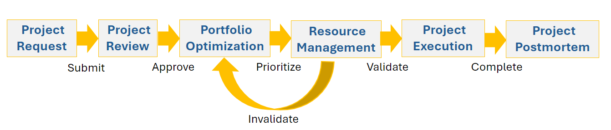

# Panoramica della gestione del portfolio

<!--Audited: 09/2024-->

## Panoramica di Project Portfolio Management (PPM)

Portfolio o Project Portfolio Management (PPM) è il processo di definizione delle priorità e gestione di un elenco di progetti per raggiungere obiettivi di business specifici.

Questo articolo descrive i concetti generali della gestione di portafoglio. Per informazioni generali sulla gestione dei portfolio in Adobe Workfront, consulta [Comprendere la metodologia del portfolio](/help/quicksilver/manage-work/portfolios/portfolios-overview/portfolio-overview.md).

Un portfolio è una raccolta di progetti con obiettivi di business comuni. Il risultato di una metodologia PPM efficace consente ai dirigenti di:

* Identifica tutti i progetti in un portfolio.
* Comprendi l’impatto di ciascun progetto su risorse, costi e ricavi.
* Decidere in modo intelligente e strategico in base alle priorità, alla selezione o alla rimozione dei progetti di un portfolio.

In genere, i professionisti PPM utilizzano i seguenti passaggi per eseguire PPM:

1. Creare criteri di valutazione per la selezione dei progetti e la definizione delle priorità.
1. Raccogliere le richieste di progetto.
1. Seleziona diversi progetti richiesti come progetto di portfolio in base ai criteri creati.
1. Dai priorità ai progetti selezionati utilizzando gli stessi criteri.
1. Valutare la disponibilità delle risorse per l&#39;esecuzione dei progetti selezionati.
1. Rivedere e valutare lo stato di avanzamento dei progetti all&#39;interno del portfolio e, se necessario, apportare modifiche.

## Panoramica del processo [!DNL Adobe Workfront] PPM

È possibile assegnare la priorità ai progetti e assicurarsi che siano allineati agli obiettivi e ai requisiti aziendali utilizzando gli strumenti di gestione di Portfolio in [!DNL Workfront].

Il diagramma seguente illustra la panoramica di alto livello del processo PPM in [!DNL Workfront]:

* [Richiesta Progetto](#project-request)
* [Revisione del progetto](#project-review)
* [Ottimizzazione Portfolio](#portfolio-optimization)
* [Gestione risorse](#resource-management)
* [Esecuzione del progetto](#project-execution)
* [Post-mortem progetto](#project-postmortem)

### Richiesta Progetto {#project-request}

Project Portfolio Management inizia con una richiesta di progetto. In questa fase, il proprietario di un progetto crea una richiesta di progetto e la invia per la revisione a un comitato esecutivo o a Portfolio Manager. A questo punto il team completa il Business Case del progetto e lo invia per l&#39;approvazione.

Per ulteriori informazioni sulla creazione di un caso di business e di una richiesta di progetto, vedere [Creare un caso di business per un progetto](../../../manage-work/projects/define-a-business-case/create-business-case.md).

### Revisione del progetto {#project-review}

Dopo aver inviato la richiesta di progetto, il Portfolio Manager o un team esecutivo la esamina e decide se approvare il progetto. Se il progetto viene approvato, il progetto viene selezionato come progetto Portfolio aziendale.

Per ulteriori informazioni sui portfolio, consulta [Informazioni sulla metodologia dei portfolio](../../../manage-work/portfolios/portfolios-overview/portfolio-overview.md). Per ulteriori informazioni sull&#39;approvazione di un Business Case, vedere [Approvare un Business Case](../../../manage-work/projects/define-a-business-case/approve-business-case.md).

### Ottimizzazione Portfolio {#portfolio-optimization}

Dopo aver aggiunto tutti i progetti al portfolio, Portfolio Manager li ottimizza e assegna loro un ordine di priorità in base al valore, all’allineamento e ai vantaggi per l’organizzazione.

Per ulteriori informazioni sull&#39;ottimizzazione del portfolio, vedere [Ottimizzare i progetti in Portfolio Optimizer](../../../manage-work/portfolios/portfolio-optimizer/optimize-projects-in-portfolio-optimizer.md).

### Gestione risorse {#resource-management}

Oltre a ottimizzare le prestazioni del portfolio e assegnare la priorità ai progetti, Resource Manager assicura che siano allocate risorse appropriate ai progetti. Valutano la disponibilità e l&#39;allocazione delle risorse utilizzando gli strumenti di gestione delle risorse disponibili in [!DNL Workfront].

A seconda della disponibilità delle risorse, Portfolio Manager potrebbe dover ridefinire le priorità dei progetti.

Per ulteriori informazioni sulla gestione delle risorse, vedere la sezione [Gestione risorse](../../../resource-mgmt/manage-resources.md).

### Esecuzione del progetto {#project-execution}

Dopo aver ricevuto l&#39;approvazione del progetto da Portfolio Manager e la convalida delle risorse da Resource Manager, in qualità di proprietario del progetto, puoi impostare il progetto sullo stato [!UICONTROL Corrente] e consentire agli utenti di avviare il lavoro per completare il progetto. È consigliabile acquisire una linea di base del progetto in questa fase, per avere un punto di riferimento per il progetto, nel suo stato originale.

Per ulteriori informazioni sulla gestione dei progetti in [!DNL Workfront], vedere [Gestione progetti: indice articolo](../../../manage-work/projects/manage-projects/manage-projects-overview.md).

Per ulteriori informazioni sulla creazione di previsioni per i progetti, vedere [Creare previsioni per i progetti](../../../manage-work/projects/create-projects/create-baselines.md).

### Post-mortem progetto {#project-postmortem}

Dopo il completamento dei progetti inclusi nel portfolio, è possibile esaminare il successo di ogni progetto creando una previsione e confrontandola con la previsione originale.

Per ulteriori informazioni sulla creazione di previsioni per i progetti, vedere [Creare previsioni per i progetti](../../../manage-work/projects/create-projects/create-baselines.md).
